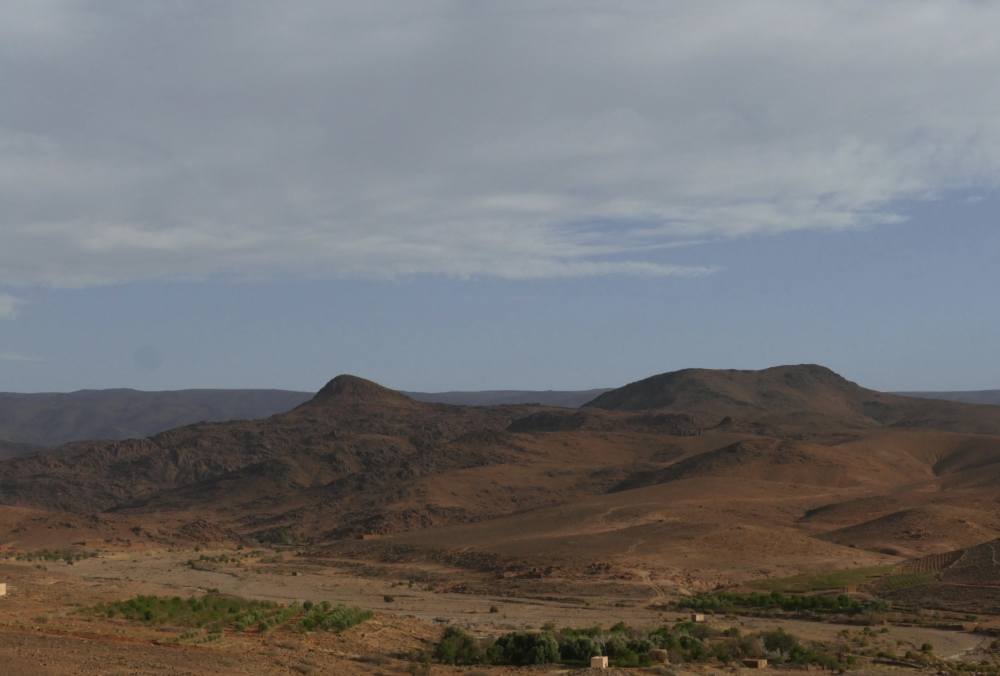
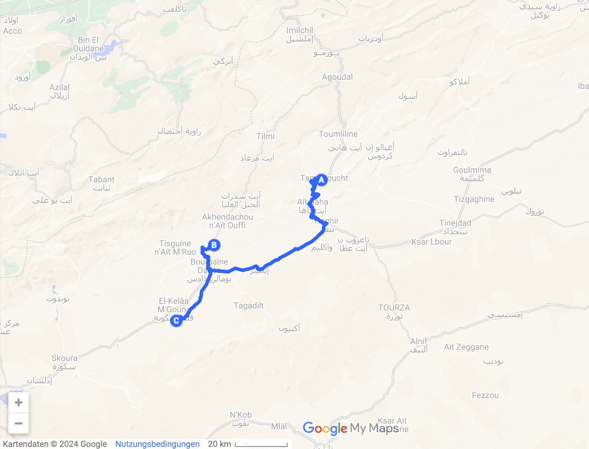
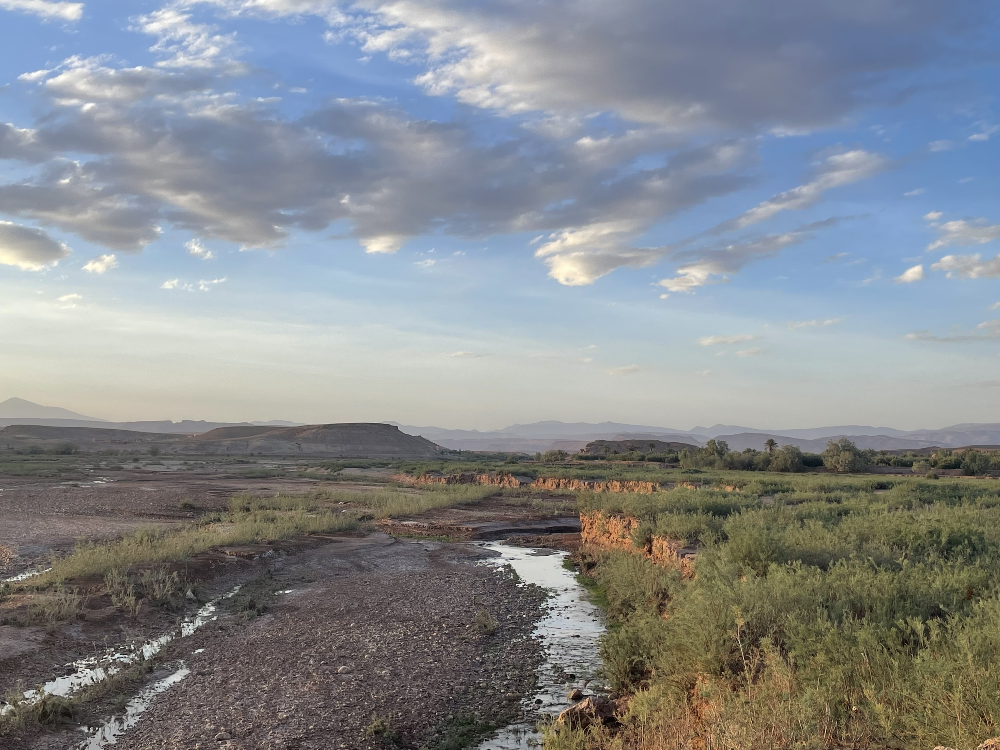
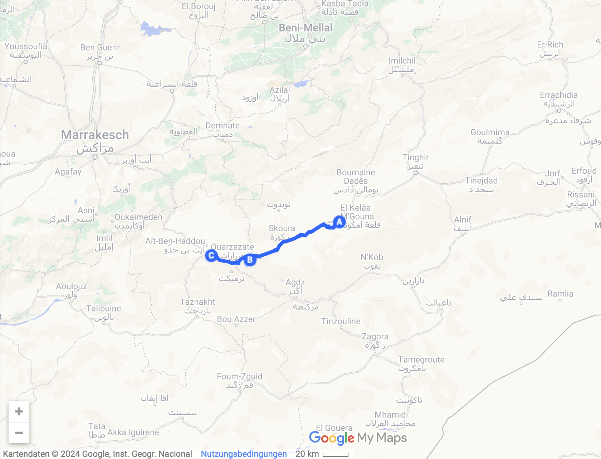

Unser Weg führt uns von der Schlucht direkt ins nächste Tal und dann an einen der wenigen Seen Marokkos.

<!--more-->

🗓️ 18. März: Statt eines Frühstücks nehmen wir lieber noch eins der leckeren Brote für unterwegs mit und machen uns direkt auf den Weg. Wir nehmen denselben, den wir gekommen sind. Im Norden gibt es zwar eine Verbindung zwischen Todraschlucht und dem Dadestal, das unser nächstes Ziel ist. Allerdings haben wir von den Franzosen in der Wüste gehört und danach auch gelesen, dass der Weg im Dadestal oberhalb des Dorfes Msemrir eine schwierig zu befahrene Piste ist, die eigentlich nur mit 4x4 zu bewältigen ist. Das wollen wir unserem Bulli dann auch wieder nicht zumuten und fahren deshalb wieder Richtung Süden zurück. Das lohnt sich aber auch, denn in diese Richtung hat man sogar noch schönere Blicke auf die Todraschlucht als gestern, auch wenn schon wieder viel los ist. Am Ausgang der Schlucht versorgen wir uns bei unserer Fahrt durch Tinghir noch fix mit Bargeld, weil 98% der Geschäfte hier noch in bar abgewickelt werden. Die Suche nach einem geöffneten Laden ist danach allerdings irgendwie schwieriger als sonst. Auf der Hauptstraße durch den Ort werden wir nicht fündig, aber abseits davon in den kleineren Gassen finden wir dann doch noch einen, in dem wir das Nötigste einkaufen können. Die weitere Fahrt ist entspannt und nach einer Weile erreichen wir Boumalne Dades. Der Ort bildet das Eingangstor zum Dadestal. Die Aussicht ist direkt wieder super, erstmal auf die rötlichen Felsen und Dörfer des Tals sowie die Felsformation der sogenannten Monkey Fingers. Dann schlängelt sich die Straße langsam höher und das Tal gefällt uns nochmal besser als die Todraschlucht. Hier ist deutlich weniger los und das haben wir auch den Serpentinen zu verdanken, die wir uns langsam hochschlängeln und die Reisebusse einfach nicht schaffen würden. Wir genießen die Aussicht, auch wenn es heute bewölkter ist als sonst, und steigen zu Fuß eine kleine Anhöhe hinauf, um einen noch besseren Blick über das Tal zu haben. Anschließend geht es logischerweise wieder runter und wie oben schon beschrieben, sind wir gezwungen auch dieses Tal wieder in Richtung Süden zu verlassen. Wir fahren noch ungefähr eine Dreiviertelstunde weiter und landen dann auf einem kleinen Campingplatz, der auf einer Anhöhe liegt und so perfekte Rundumsicht auf die Berge bietet. Weil der Sohn gerade unterwegs ist, werden wir von seinem Vater begrüßt, der kein Englisch spricht. Trotzdem ist der Empfang sehr herzlich. Er zeigt uns alles und wir sitzen erstmal wieder bei einem Tee mit frischer Minze in dem kleinen Café. Er schaut eine Liveübertragung aus Mekka und wir kommen so ganz in Ruhe an. Direkt vom Platz aus können wir bei schönem Licht der schon niedrig stehenden Sonne noch eine Wanderung durch die umliegenden Berge machen und kochen danach etwas. Bevor unser Essen fertig ist, bekommen wir dann plötzlich mit perfektem Timing unaufgefordert vom Sohn eine Berber-Suppe an den Bulli gebracht. Wir erfahren, dass die Suppe im Ramadan typisch ist. Und es ist die leckerste, die wir bisher gegessen haben.

🗓️ 19. März: Wir wiederholen die Wanderung von gestern nach dem Aufstehen einfach direkt wieder und sie ist genauso gut. Dann geht es mit dem Ziel Aït-Ben-Haddou wieder los. Da kommen wir heute aber gar nicht an. Unterwegs kommen wir nämlich an einem der wenigen Seen Marokkos in der Nähe von Ouarzazate vorbei. So viel Wasser haben wir schon eine Weile nicht mehr gesehen und die ruhige Umgebung gefällt uns sehr. Deshalb entscheiden wir uns dazu in Ouarzazate für ein ausgiebiges Picknick einzukaufen. Dort gibt es nämlich seit langer Zeit mal wieder einen größeren Supermarkt, wie wir ihn eigentlich kennen. Mit guten Snacks im Gepäck fahren wir deshalb kurzerhand zurück an den See und suchen uns einen Weg über die Pisten direkt runter ans Wasser. Wir machen dort eine richtig ausgiebige und sehr entspannte Mittagspause, aber irgendwann wird es dann einfach zu warm. Schatten gibt es in der Umgebung bei hochstehender Sonne eigentlich gar nicht und heute hat die Sonne besonders viel Kraft. Nach einer letzten Spazierrunde am See mit Henry und dem dort lebenden Hund fahren wir deshalb weiter zu einem Campingplatz etwas vor Aït-Ben-Haddou, damit wir den kleinen Ort morgen früh direkt anschauen können. Auf dem Campingplatz ist leider wieder mehr los und er ist etwas eng, aber außerhalb finden wir zum Sonnenuntergang noch einen schönen Weg entlang eines kleinen Flusslaufs. Unser Highlight ist neben dem Pool zur Abkühlung außerdem eine gut sortierte Eistruhe, über die wir uns nach dem Abendessen sehr freuen. Hat also wie immer alles seine Vor- und Nachteile!

