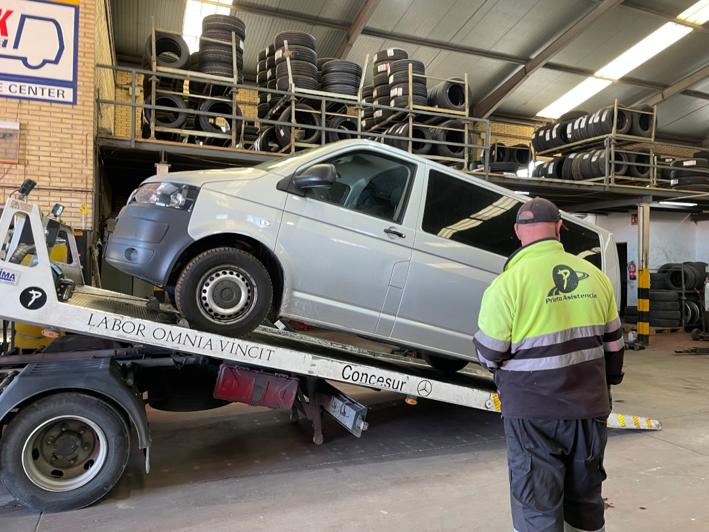
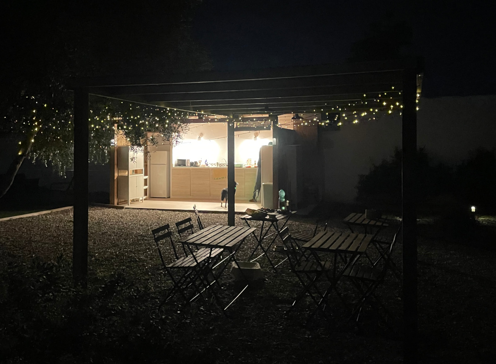
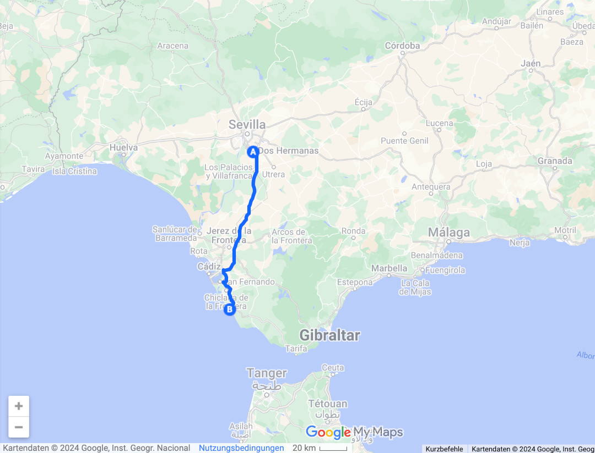
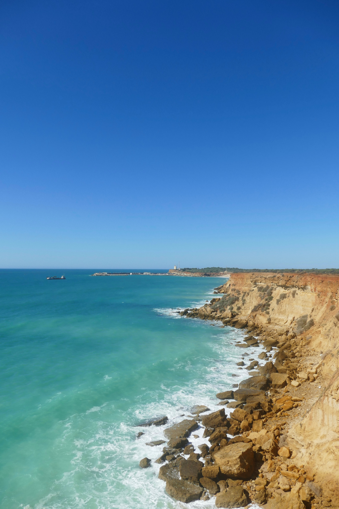
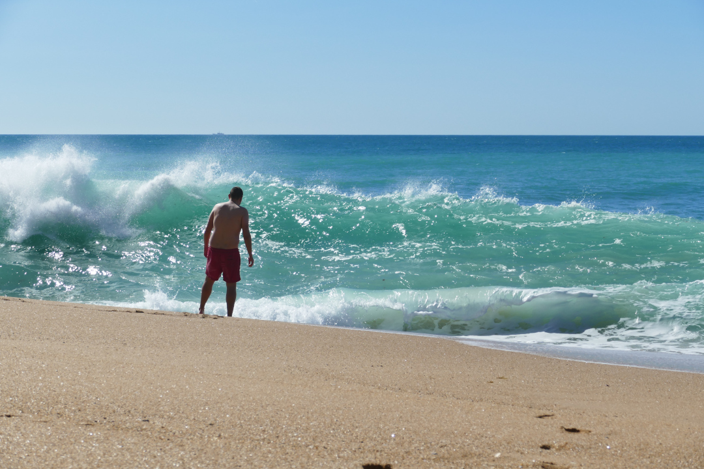

Als Kontrast zu den Tagen in Andalusiens Hauptstadt zieht es uns zurück ans Meer. In der Nähe von Conil de la Frontera genießen wir die Ruhe und die Sonne.

<!--more-->

🗓️ 19. Februar: Heute wollen wir mal wieder ans Meer fahren und packen deshalb alles wieder in den Bulli, als ich von hinten nur ein „Scheiße“ höre. Den Grund sieht man direkt, wenn man hinten um den Bulli läuft. Wir haben nämlich einen richtig schönen Platten. Das Absurde daran ist, dass wir uns ja für den heutigen Tag eh vorgenommen hatten, in eine Werkstatt zu fahren. Weil wir es etwas aufgeschoben hatten, kommen wir da jetzt nur nicht mehr ohne Hilfe hin. Nach ungefähr 90 Minuten Wartezeit und einer Partie Schach kommt zum Glück der Mann vom Pannenservice. Von Anfang an spricht er kein Wort, sondern regelt alles direkt über Zeichensprache, aber ist dabei total freundlich. Auch als der Bulli auf dem Abschleppwagen aufgeladen ist und er seine Kühlbox auf dem Mittelsitz abschnallt, damit wir vorne zu dritt mit klassischer spanischer Musik und der Unterstützung von zwei Jesus-Bildern zur nächsten Werkstatt fahren können, fühlen wir uns bei ihm sehr gut aufgehoben. Dort angekommen zeigen wir allen, dass der Reifen neu ist und es wahrscheinlich am Ventil liegt, und genau so ist es dann auch. Was für ein Glück, denn so kostet uns der Spaß nur 18€ und die waren allein schon die Erfahrung wert. Alles geht so schnell, dass wir beim Verlassen der Werkstatt, auf dem Weg zu der guten Bäckerei von gestern, direkt an der nächsten Ampel wieder neben unserem Pannenhelfer stehen. So können wir ihm und seiner jetzt wahrscheinlich leeren Kühlbox nochmal zum Abschied winken und er scheint sich auch zu freuen. Gegen Mittag sind wir dann so unterwegs, als wäre nie etwas gewesen und fahren Richtung Meer. Wir übernachten auf einem privaten Grundstück, auf dem im Sommer luxuriöse Zelte stehen. Im „Winter“ ist bei 23 Grad und Sonne Platz fürs echte Camping. Unser Glück, denn wir sind die einzigen Gäste und so fühlt es sich an, als wären wir in einem großen Garten mit schöner Outdoor-Küche und Sitzgelegenheiten. Und das Beste: Die Klippen sind nur ein paar Minuten zu Fuß entfernt. Bei Sonnenuntergang laufen wir am nächsten Strand entlang in den nächsten Ort, Conil de la Frontera, um einzukaufen und kochen dann in Ruhe. So lässt es sich leben!

🗓️ 20. Februar: Wir schlafen uns aus und lassen es entspannt angehen. Das kann man hier nämlich ziemlich gut und wir entscheiden deshalb auch noch eine zweite Nacht zu bleiben. Dann packen wir unseren Rucksack und wandern immer an den Klippen entlang nach Norden. Dabei kommen wir an einigen Buchten und kleinen Stränden vorbei und auch am kleinen Hafen von Conil. Am Calas de Roche machen wir’s uns dann im Sand bequem und wollen das erste Mal in diesem Jahr im Atlantik schwimmen. Das Wasser ist zwar kalt, aber gut auszuhalten. Allerdings sind die Wellen hier doch so stark, dass eine uns beide schon beim Reingehen unfreiwillig von den Füßen holt und in den Sand wirft. Deshalb kann von Schwimmen nicht ganz die Rede sein. Spaß macht es trotzdem gegen die Wellen anzukämpfen. Nachdem wir von der Sonne aufgewärmt und getrocknet sind, machen wir uns dann auf den Rückweg und suchen uns noch eine Bucht mit weniger starken Wellen. Irgendwie müssen wir den ganzen Sand ja auch wieder loswerden. Mit dem Cala Puntalejo, den wir auf dem Hinweg gar nicht bemerkt hatten, werden wir fündig und haben den kleinen Strand sogar ganz für uns allein. Wir schwimmen also noch eine Runde (dieses Mal richtig), bevor wir wieder hochklettern und zurück zum Bulli laufen. Abends nutzen wir die Outdoor-Küche nochmal aus und hören das alltägliche Grillenkonzert.

