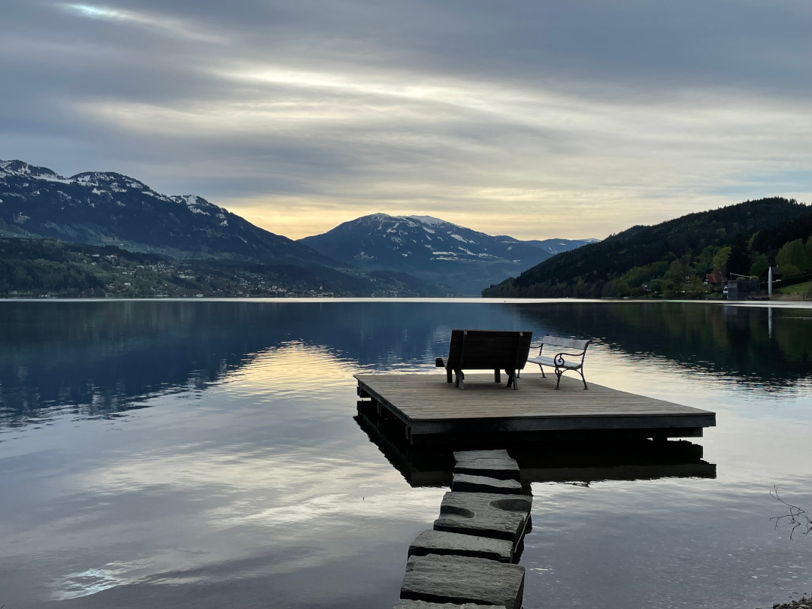
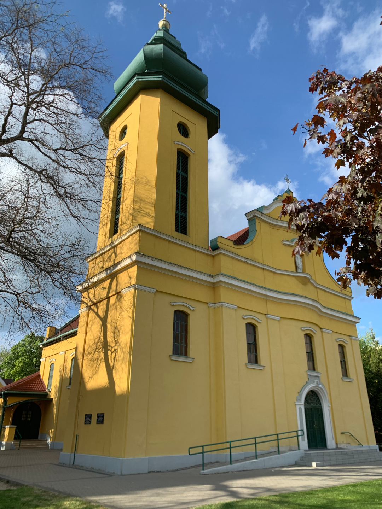
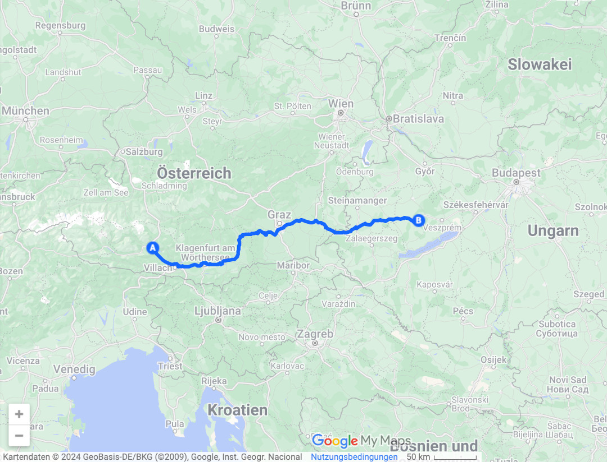
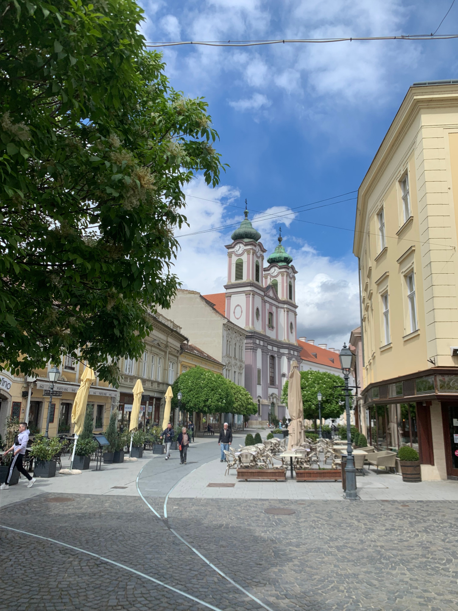
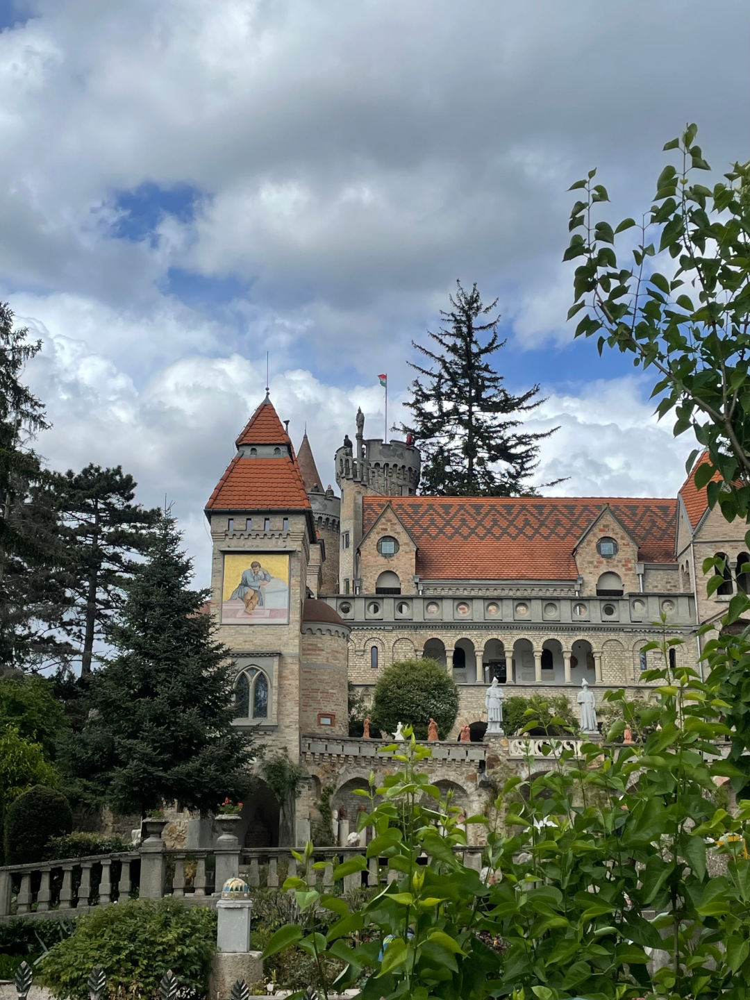
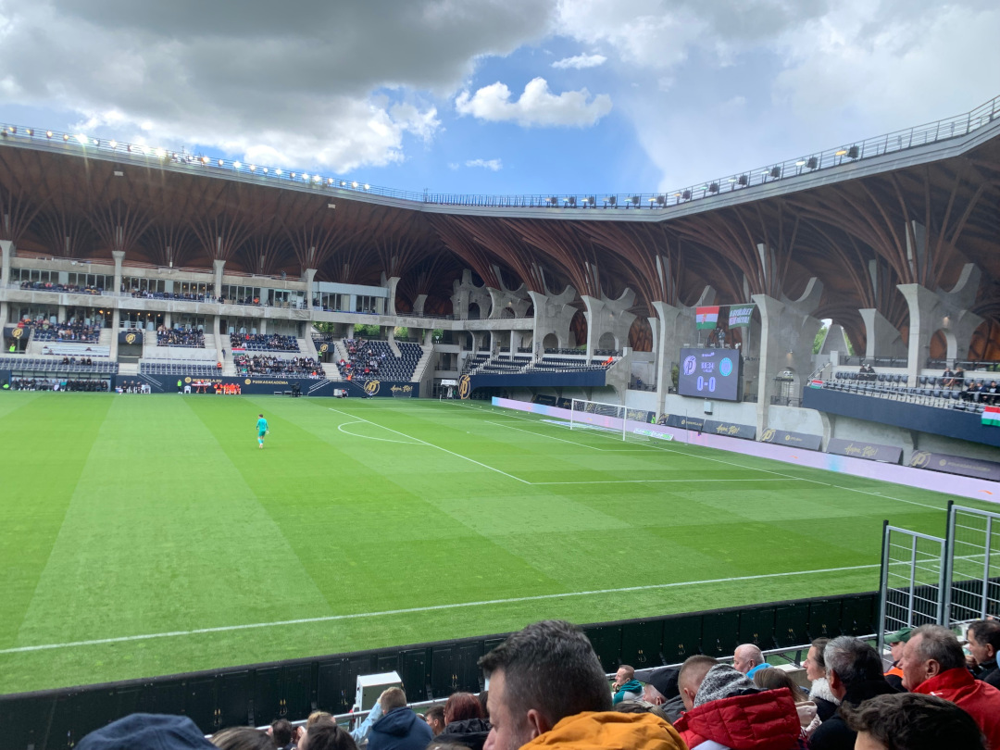
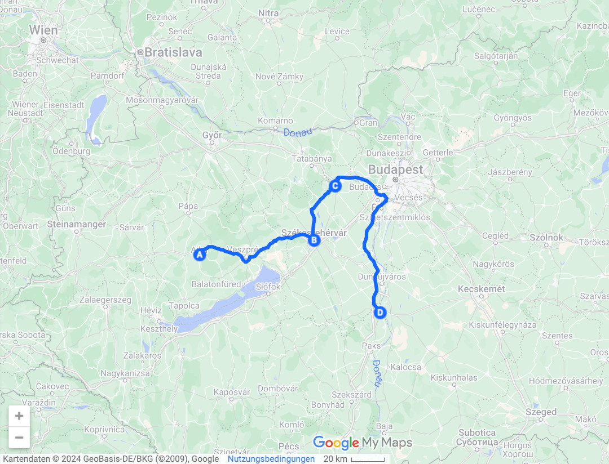

Nach dem kurzen Urlaub vom Urlaub in Österreich fahren wir für ein paar Tage ungern nach Ungarn.

<!--more-->

🗓️ 19. April: Der letzte Morgen in Österreich und im Hotel verläuft entspannt, Henry bekommt seine letzte Runde um den See, der bei Sonnenaufgang super aussieht, und wir sind gegen 10:30 Uhr schon wieder auf dem Weg weiter Richtung Osten. An der Rezeption gibt es vorher noch ein kleines Pläuschchen, als wir von unserer Weiterfahrt berichten und woher wir schon überall gekommen sind. Wir bekommen noch etwas Verpflegung mit auf den Weg und fahren los. Nach all den mautfreien Strecken wollen wir zumindest den Rest in Österreich über Autobahn nach Ungarn fahren. So kommen wir schnell und immer noch vergleichsweise günstig an die ungarische Grenze. Kurz vorher kaufen wir ein letztes Mal fast heimische Produkte ein. Das Wichtigste sind Kräuterbutter und Spezi. Wir erreichen Ungarn und fahren weiter nach Ajka, unserem Stopp für heute Nacht. Am Ortseingangsschild sehen wir, dass Ajka die Partnerstadt von Unna ist. Dennoch bleiben wir. Wir steuern einen „Campingplatz“ neben dem öffentlichen Freibad an. Die Rezeption ist mit zwei netten älteren Damen besetzt. Auf einem Mix aus ungarisch, deutsch und englisch bekommen wir alles erklärt. Bezahlen können wir aber erst morgen. Wieso wissen wir nicht ganz, ist uns aber recht, weil wir noch kein ungarisches Bargeld besitzen. Wir sind die Einzigen auf dem Platz und die Toiletten werden extra für uns aufgeschlossen. Top Service und eine eigene Toilette – ist ja fast wie im Hotel. Nachdem wir den Bulli für die Nacht fit gemacht haben, gehen wir mit Henry noch etwas durch die Stadt. Wir brauchen ja noch Bargeld, was sehr nervig ist, weil wir ja nur zwei Tage im Land sind und das schwer zu kalkulieren ist. Vor allem mit den für uns sehr unrealistischen Zahlen. Mit 50.000 Forint sollen wir wohl zwei Tage überstehen. Ajka hat knapp 30.000 Einwohner und nicht ganz so viel Sehenswertes, außer der gelben Kirche. Wir laufen noch etwas durch einen Park und gehen dann zurück zum Bulli. Mit unseren Österreich-Vorräten kochen wir seit langem mal wieder. Auf einmal bekommen wir Besuch von einem älteren Mann, der uns schon auf englisch begrüßt. An seinem akzentfreien Englisch merken wir schnell, dass er wohl kein Ungar ist. Er kommt gebürtig aus Portugal, lebt aber seit 30 Jahren in Ungarn. Er wohnt quasi auf dem Campingplatz und erzählt uns eine Menge über Ungarn und die Stadt. Kurz zusammengefasst: Hier gibt’s nichts zu sehen, fahrt nach Budapest. Dort hatte er vorher auch lange gewohnt. In Budapest waren wir aber vor zwei Jahren schon und wollen nicht nochmal hin. Wir verabschieden ihn und verlagern uns in den Bulli, weil es schon sehr kalt geworden ist.

🗓️ 20. April: Die Nacht wird noch deutlich kälter als der Abend. Wir schaffen es aber mit zusätzlichen Wolldecken auf die Heizung zu verzichten. Morgens wird es auch schon schnell wärmer. Wir gehen mit Henry durch den anliegenden Park und begrüßen unseren neuen Freund den Ungarn-Portugiesen. Danach wollen wir endlich für die Nacht bezahlen und weiterfahren. Leider finden wir die beiden älteren Damen von gestern nicht mehr wieder. Auch ans Telefon geht niemand. Zum Glück haben wir schon Kontakte geknüpft. Wir gehen zurück zum Ungarn-Portugiesen und bitten ihn um Hilfe. Er hat ebenfalls die Telefonnummer von den Damen und hat mehr Glück als wir. Es kommt zwar eine andere Dame, aber wir können bezahlen. Sie spricht sogar sehr gutes Deutsch. In Ungarn sprechen viele ältere Menschen noch deutsch, teilweise sind sogar Werbung und Straßenschilder zweisprachig. Leider kann sie den Betrag nicht wechseln und wir müssen mit Karte bezahlen. Dann hätten wir uns den Stress ums Bargeld abholen gestern auch sparen können. Die Übernachtung ist mit 15€ aber sehr fair. Unsere Fahrt geht weiter nach Szekesfehervar, unaussprechlich aber sehr schön. Sie hat knapp 100.000 Einwohner und ist damit sogar schon die siebtgrößte Stadt Ungarns. Sie wird auch Stadt der Könige genannt, weil hier im Mittelalter die ungarischen Könige gekrönt wurden. So sieht es in der Innenstadt auch aus. Sehr große und pompöse Gebäude. Typisch Osteuropa halt. Die Innenstadt ist sehr sauber und nicht überfüllt, trotz Samstag. Danach geht es weiter zur Burg Var ebenfalls in Szekesfehervar. Die gucken wir uns allerdings nur von außen an, weil wir es etwas eilig haben. Von außen lohnt sich der Blick auf jeden Fall, auch wenn man sie nicht fotografieren hätte dürfen, wenn man kein Eintritt bezahlt. Deshalb fotografieren wir nur die Bäume davor mit der Burg im Hintergrund. Wir wollen aber noch zum Fußballspiel Puskas Akademia FC gegen Paksi FC, dem Topspiel der ungarischen ersten Liga (Vierter gegen Zweiten). Die Puskas Akademia ist ein Verein aus Felscut, einem sehr kleinen Dorf westlich von Budapest. Seit 2005 wird dort groß in den Club investiert bzw. vielmehr wurde er gegründet und mit einem neuen Stadion und Trainingsgelände ausgestattet. Selbst Sepp Blatter kam 2007 zur Eröffnung des Komplexes. Zufälligerweise passiert das Ganze in dem Heimatdorf von Viktor Orban, der sein Geburtshaus und jetziges Wochenendhaus ebenfalls zufälligerweise direkt neben dem neuen Stadion hat. Das Haus sieht übrigens sehr unscheinbar aus, ohne große Zäune und mit wehender Ungarn-Fahne. Wir meinen ihn sogar im Stadion gesehen zu haben, sind uns aber nicht ganz sicher. Das Spiel gewinnt Puskas übrigens mit 5:0. Im Stadion waren knapp 1.500 Personen. Stimmung kommt, wenn überhaupt, nur von den 200 Gästefans. Ansonsten ist es eine eher trostlose Angelegenheit. Das Highlight sind wenigstens noch zwei andere BVB Fans, die sich ebenfalls diesen Kick antun. Nach dem Spiel geht es nach Dunaföldvar, 80 km südlich von Budapest, direkt an der Donau. Wir sind leider so spät am Campingplatz, dass niemand mehr an der Rezeption ist, obwohl es erst 18:30 Uhr ist. Wir sehen aber seit langem mal wieder deutsche Camper und einen holländischen. Wir stellen uns einfach dazu und wollen morgen bezahlen, so hat es ja heute Morgen auch gut funktioniert. Wir kommen mit einem anderen Deutschen ins Gespräch, der seit 30 Jahren nach Ungarn an die Donau fährt und ab jetzt drei Monate hierbleiben wird. Neben Susi, die morgen früh ab 8 Uhr wieder an der Rezeption sein soll, empfiehlt er uns noch ein Restaurant, das wir wegen des Sonntags gerne annehmen. Wir freuen uns schon auf ungarisches Gulasch, landen aber leider in einem Fisch Restaurant. Direkt an der Donau nicht ungewöhnlich und ebenfalls lecker. Fisch hatten wir sowieso lange nicht mehr gegessen. Nach dem Essen gehen wir noch eine Runde mit Henry an der Donau, bevor es uns wegen der Kälte wieder in den Bulli zieht.

