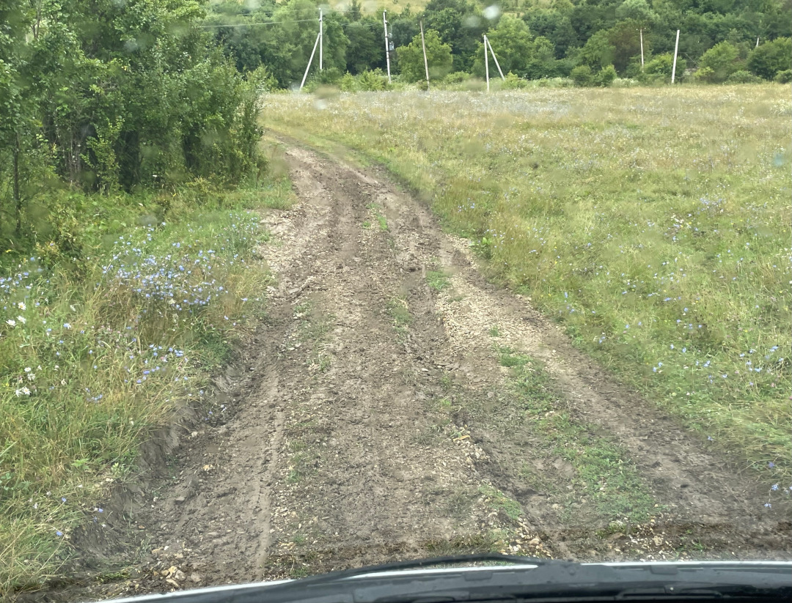
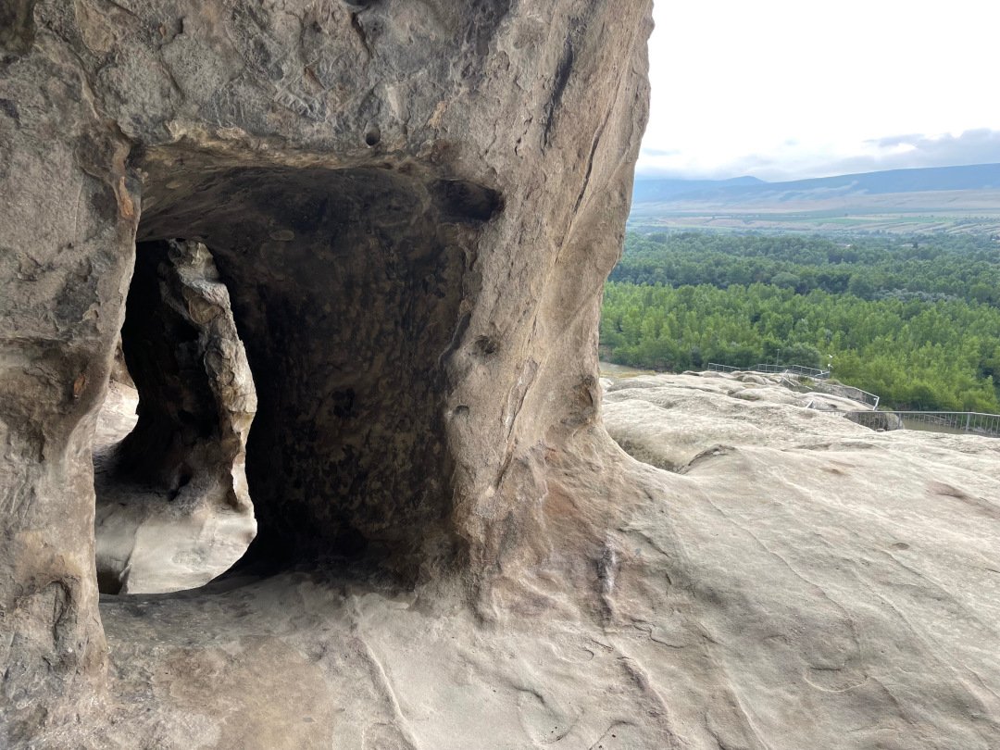
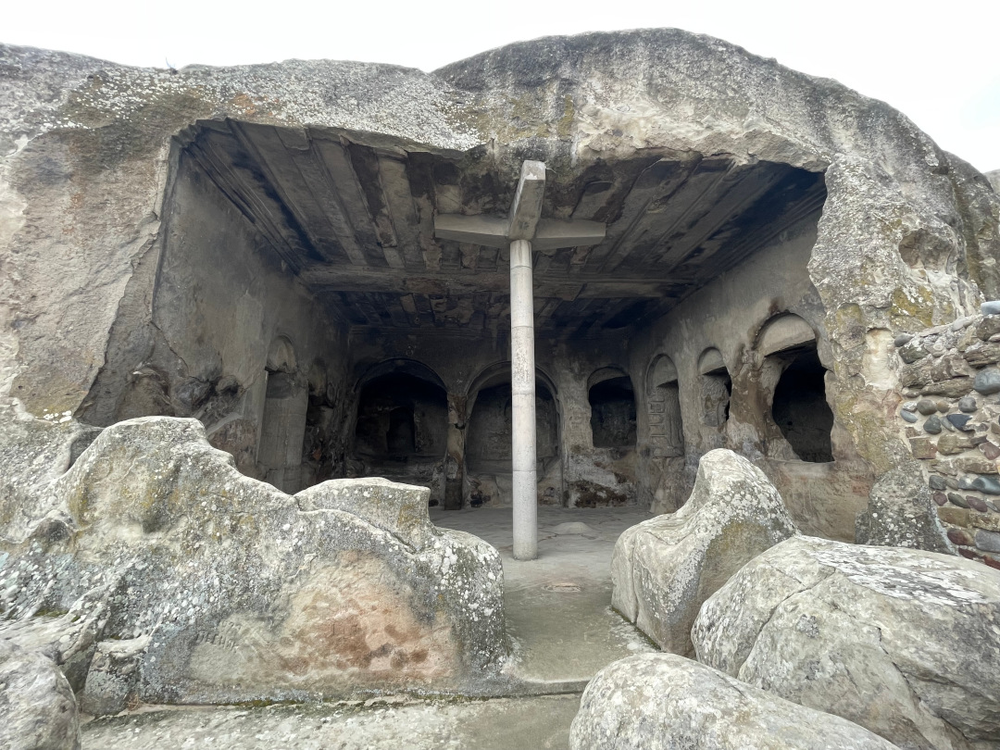
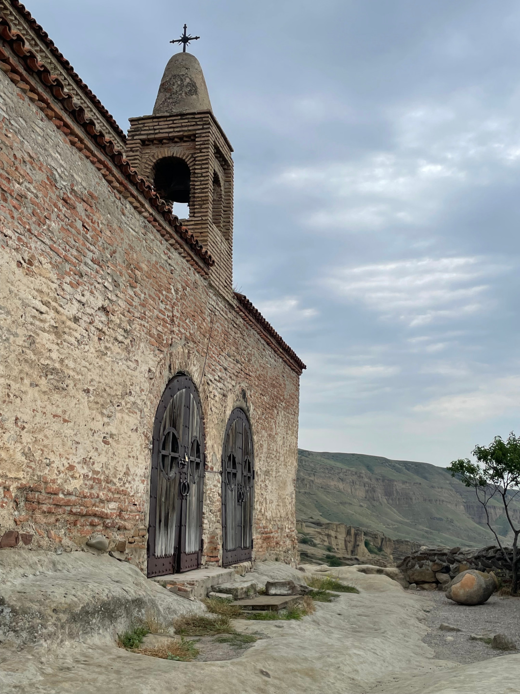
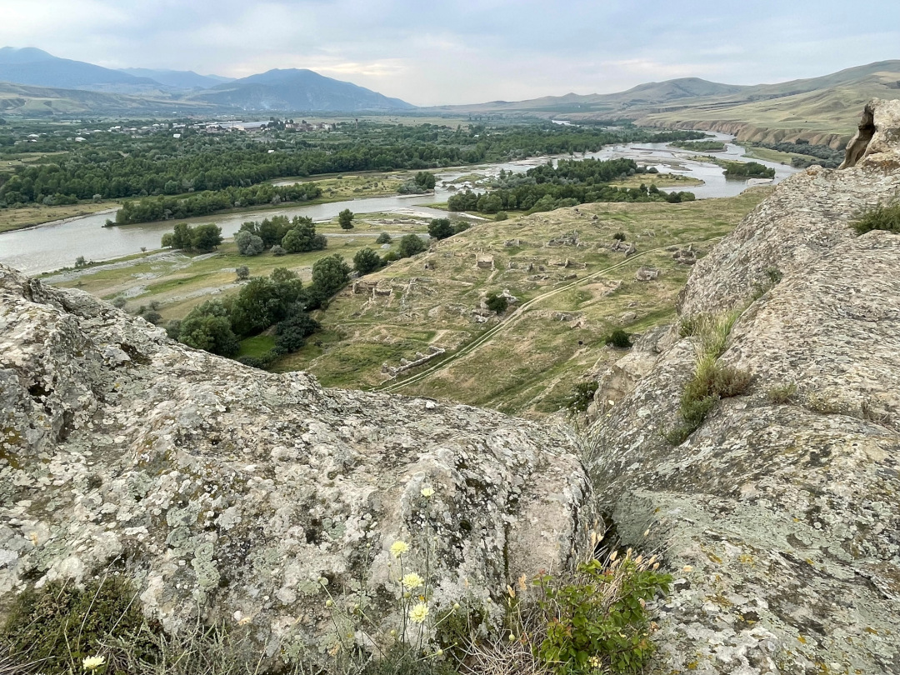
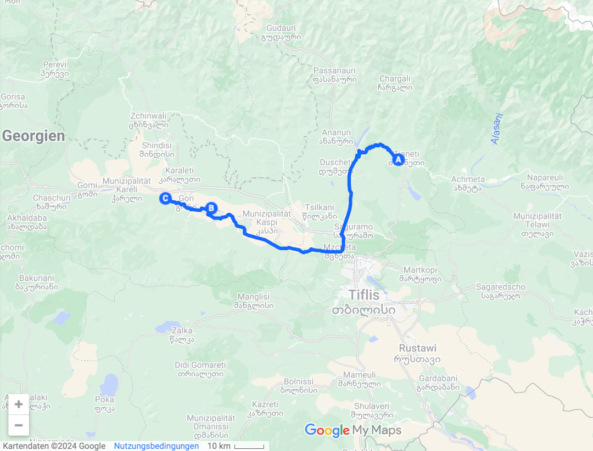
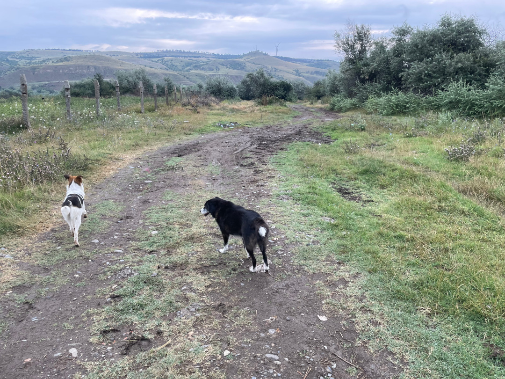
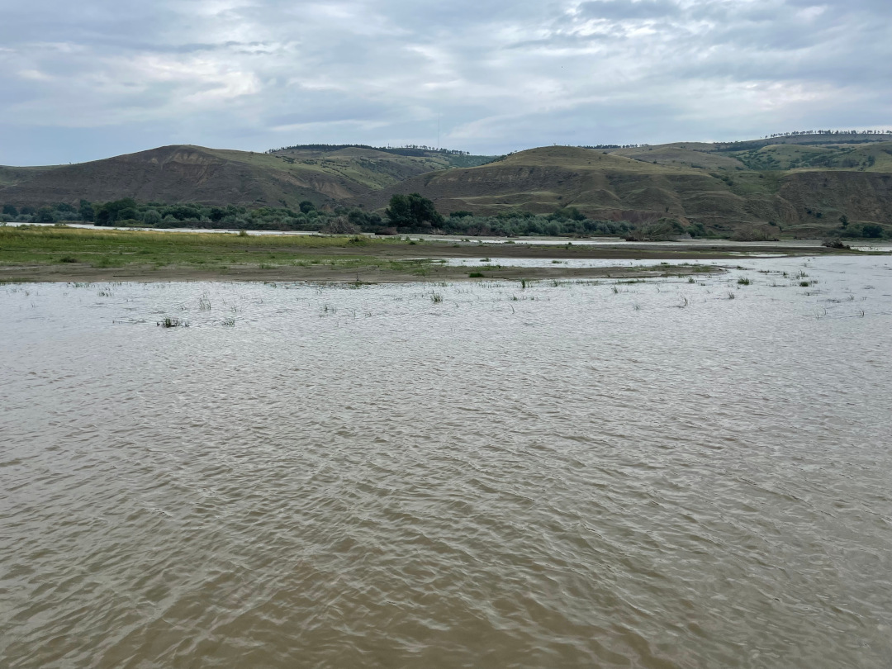
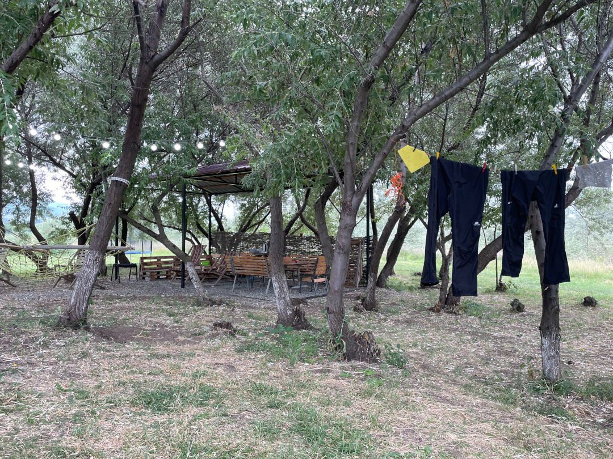

Wegen des Wetters sind wir für noch einen Tag in Tianeti gefangen, befreien uns dann aber mit einer Bulli-Rutschpartie aus dem Matsch und kommen in der Nähe von Gori an.

<!--more-->

🗓️ 19. Juli: Als wir aufwachen, regnet es schon wieder, obwohl wir auf Trockenheit am Morgen gehofft hatten. Aber wir wollen trotzdem hier weg, auch wenn wir wissen, dass das nicht leicht wird, so matschig wie es hier überall ist. Wir drehen eine letzte Henry-Runde durch die Blumenwiesen in Regensachen. Der kleine Sohn der Besitzer fragt mich schon ungläubig, ob wir wirklich fahren wollen („but its muddy now“) und fragt, ob das Auto denn unser eigenes ist oder gemietet. Aber wir bleiben dabei, noch länger wollen wir hier nicht bleiben. Vom Besitzer selbst kriegen wir noch ein paar Tipps für unsere Bulli-Rutschpartie nach unten. Wir sollen es vor allem langsam angehen lassen und wenn wir quer stehen oder feststecken sollen wir ihn anrufen, damit er uns rausziehen kann. Wir bezahlen, verabschieden uns und ab dem Moment brauchen wir unseren Allradantrieb wirklich. Wir brauchen bestimmt eine Dreiviertelstunde über die matschigen Feldwege bis zur Straße. Beim Lenken weiß ich schon oft gar nicht mehr, wie die Räder geradestehen, weil der Bulli sich eh nur dahin bewegt, wo der Matsch es will. Obwohl wir teilweise seitlich schliddern, stellen wir uns aber zum Glück nicht richtig quer und bleiben nicht stecken. Hilfe rufen brauchen wir also nicht. Als wir endlich wieder Teer unter den Rädern haben, müssen wir erstmal mit Stöcken den ganzen Matsch aus unseren Radkästen holen. Dann fahren wir wieder in Richtung Hauptstadt. Weil es Samstag auch nochmal viel regnen soll, haben wir unsere Pläne nämlich geändert und wollen erstmal nicht weiter in die Berge. Stattdessen wollen wir in die Nähe von Gori auf einen kleinen Campingplatz und erst bei besserem Wetter wieder weiterfahren. In der Tbilissi Mall kaufen wir ein. Außerdem halten wir unterwegs noch, um uns Uplisziche anzuschauen. Die uralte Höhlenstadt war ein wichtiges Handelszentrum an der Seidenstraße. Auch heute ist es noch ziemlich interessant, dass und vor allem wie hier gelebt wurde. Das Gelände ist relativ weitläufig und bietet immer wieder schöne Blicke auf die Umgebung. Als wir wieder unten sind, fahren wir nur noch ungefähr zwanzig Minuten bis wir auf dem Campingplatz ankommen und sind froh, denn er ist gut gepflegt und trotz der Nähe zu Gori schön ruhig gelegen. Auch Henry kann hier viel flitzen. Als Erstes müssen wir unbedingt den Bulli, unsere Regenklamotten und Schuhe vom Matsch befreien. Wir kriegen noch frisch geerntete Gurken, Äpfel und Mandeln geschenkt und alles ist sehr lecker. Abends kochen wir noch und staunen, wie viel mehr Raum man bei trockenem Wetter und ohne Matsch hat.

🗓️ 20. Juli: Heute ist noch ein (hoffentlich) erstmal letzter Regentag angekündigt. Hier sind wir dabei aber deutlich besser aufgehoben als in den Bergen im Matsch. Hier gibt es nämlich überdachte Sitzgelegenheiten und die Wege sind geschottert. Außerdem gibt es immer wieder trockene Phasen. Direkt vom Campingplatz aus kommt man zu einem Fluss und durch die angrenzenden Wiesen machen wir schöne Spaziergänge, immer begleitet von Henry und dem Hund vom Campingplatz. Ansonsten passen wir uns dem Wetter an und lassen es ruhig angehen, spielen etwas und lesen viel. Abends haben wir keine Lust zu kochen und machen uns stattdessen ein klassisches Abendbrot. Heute wird es viel voller auf dem Platz. Neben weiteren Wohnmobilen sind auch noch ein paar Zelte gekommen und der Besitzer feiert abends mit seinen Freunden etwas. Ein anderes deutsches Paar steht auf einmal noch bei uns am Bulli, zum „Abendbesuch“, wie sie es nennen. Ein bisschen plaudern wir noch mit ihnen und er gibt Tipps für unseren Rückweg durch die Türkei. Trotz der viele Leute können wir dann aber gut schlafen.

