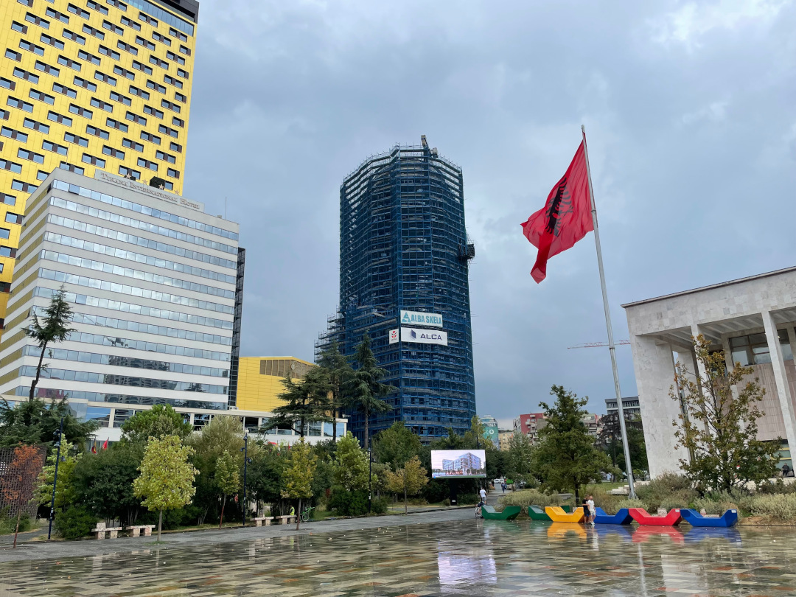
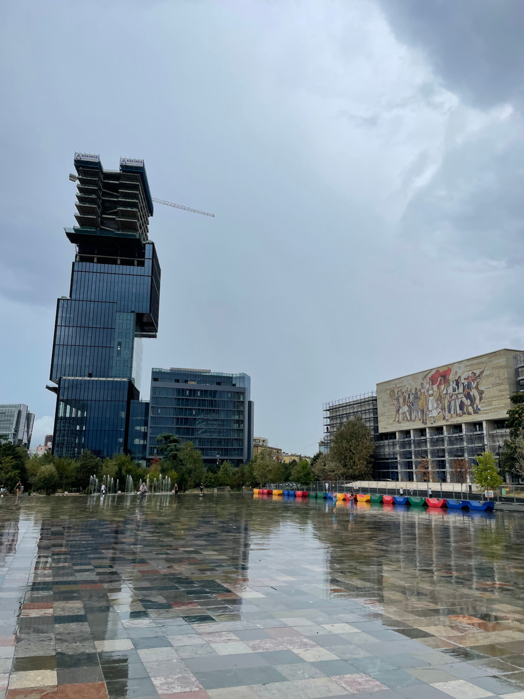
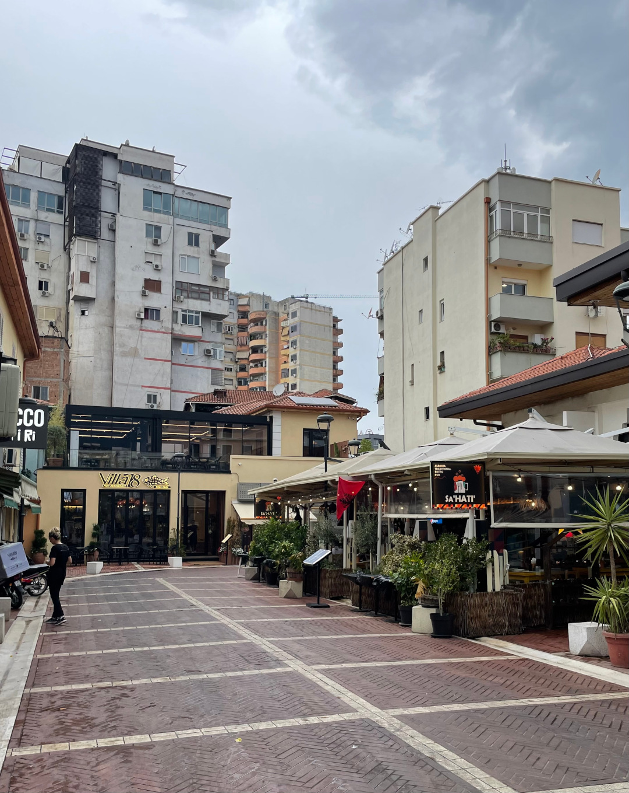
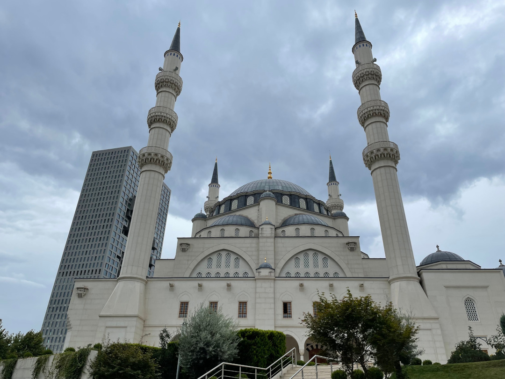
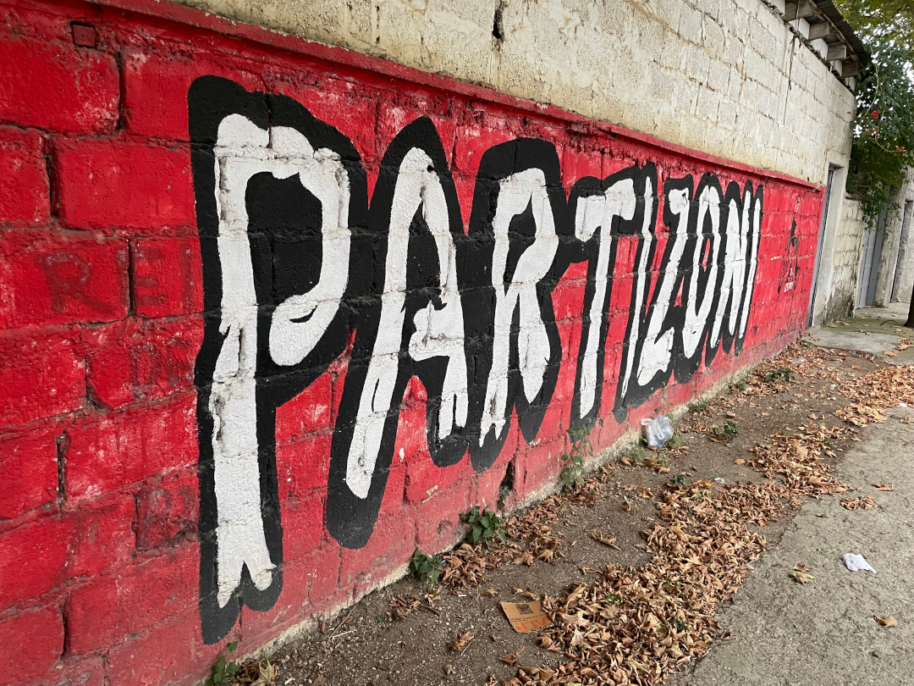
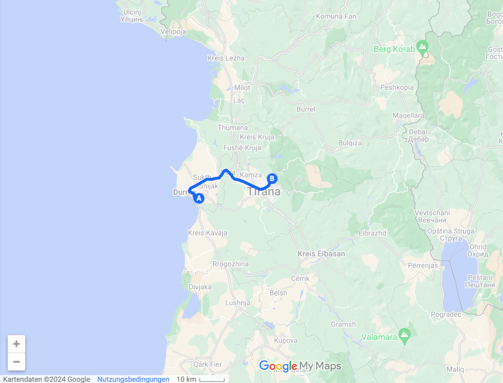
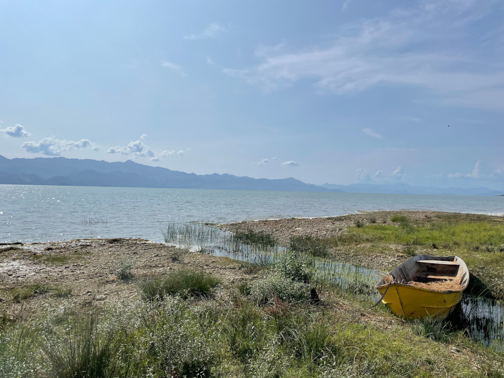
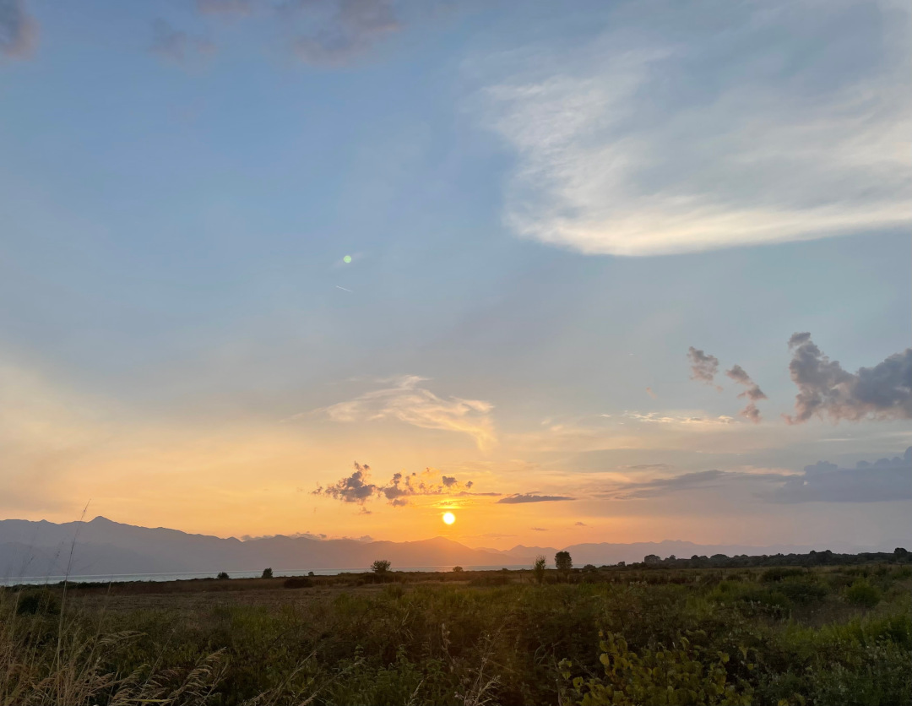
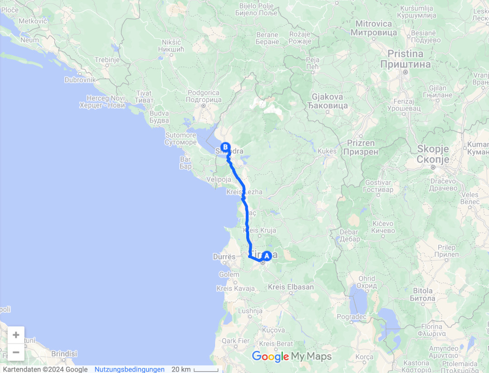

Von der Küste fahren wir in die Hauptstadt und weiter nach Shkodra.

<!--more-->

🗓️ 19. August: Der Regen lässt wirklich lange auf sich warten. Abkühlung und weniger Luftfeuchtigkeit gibt es vorerst nicht. Wir gehen mit Henry die Runde um den See und müssen danach dringend duschen. Wir packen alles zusammen, bezahlen und wollen nach Tirana fahren. Vorher nutzen wir aber die Autowäsche, die die Campingplatzbesitzer auch noch anbieten. Mit dem glänzendem Bulli geht es in die Hauptstadt. Der erste Stopp ist das Einkaufscenter kurz vor der Innenstadt. Bis hierhin läuft der Verkehr einigermaßen in Ordnung. Im Einkaufscenter besorgen wir Frühstück bzw. Mittagessen und wollen eigentlich beide noch zum Friseur. Wir suchen Friseure in der Nähe. Hanna etwas mehr seriöse als ich. Ein Problem haben wir aber beide. Die Friseure bei Google Maps gibt es nicht oder haben geschlossen, egal ob seriös oder nicht. Ich suche einen vierten und letzten Friseur raus und tatsächlich gibt es ihn und er schneidet mir die Haare. Der Typ ist deutlich jünger als ich, spricht gut Englisch und ist erstaunt, wieso ich da bin. Hauptthema wie immer ist eigentlich Fußball, als er hört, dass ich aus Dortmund komme. So vergeht die Zeit schnell und für fünf Euro habe ich wieder kurze Haare. Hanna hat leider weniger Glück und findet gar keinen Friseur. Vom Einkaufscenter geht es dann die letzten Kilometer bis zum Campingplatz etwas außerhalb der Stadt. Wie so häufig in den Ländern mit schlechter Straßeninfrastruktur gibt es um die großen Städte keine Umfahrungen. Der gesamte Verkehr muss über die Hauptstraße der großen Stadt. So staut es sich leider extrem. Nach einer halben Stunde erreichen wir unseren Campingplatz für die Nacht am äußersten Stadtrand auf einem Hügel. Es ist wieder mehr ein (Bauern)Hof mit vielen Hühnern. Wir sind quasi alleine und finden einen guten Platz. Mittlerweile sieht es schon sehr nach Regen aus. Deshalb beeilen wir uns und laufen zur Bushaltestelle unten am Hügel. Einen festen Fahrplan gibt es nicht, aber der Bus kommt laut Hofbesitzer mindestens alle 10-15 Minuten. Das Ticket kauft man wie in Moldau und Bulgarien bei den Ticketverkäufern im Bus. Ich frage mich immer noch, wie wenig die verdienen müssen, damit es sich lohnt neben dem Busfahrer noch einen extra Ticketverkäufer in jedem Bus der Stadt mitfahren zu lassen. Und das bei einem Fahrpreis von 40 Cent. Wir fahren circa 20 Minuten in die Innenstadt und gerade als wir aussteigen, folgt der lang angekündigte Regen. Wir haben seit Ewigkeiten keinen Regen mehr gesehen und finden es gar nicht so schlimm. Tirana ist mit oder ohne Regen wirklich keine Perle und man kann auch gut leben, wenn man die Stadt nicht gesehen hat. Es gibt einen großen Platz in der Stadt, der das Zentrum ist. Ansonsten ist es wie so oft. In der Stadt sieht man neue Hochhäuser und moderne Architektur direkt neben heruntergekommenen Wohnhäusern. Wegen des Regens fällt unser Sightseeing etwas kürzer aus als geplant und wir fahren mit dem Bus zurück zum Campingplatz. Der Weg den Hügel hinauf ist jedes Mal gutes Wadentraining. Nach einer kurzen Pause geht es aber auch schnell den Hügel wieder hinunter. Gute und günstige Pizza gibt es auch in Tirana. Wir gehen essen und trinken für zusammen knapp zehn Euro. Danach geht es für mich zum zweiten albanischen Fußballspiel dieser Reise. Partizani Tirana spielt gegen Vllaznia Shkodra. Partizani ist einer der größten Vereine in Albanien und im Gegensatz zu gestern ist heute viel los. Fast 2.000 Menschen inklusive Heimblock, Gästeblock und Pyrotechnik sind im Stadion. Leider verliert Partizani das Spiel 0:1, worunter die Stimmung etwas leidet. Der Länderpunkt 34 bzw. 17 fiel aber ja gestern Abend schon. Weil der Bus so unzuverlässig kommt, geht es zu Fuß im Dunkeln durch Tirana zurück. Bis auf ein paar Straßenhunde ist es aber ruhig und sicher.

🗓️ 20. August: In der Nacht regnet es noch etwas. Dadurch kühlt sich endlich ab und wir können gut schlafen. Die Henryrunde führt uns erneut den Hügel hinunter und wieder herauf. Nach dem Sportprogramm machen wir uns abfahrbereit, bezahlen und wollen gerade losfahren, als die anderen Gäste des Platzes das Auto nicht mehr starten können. Sie haben nachts das Licht im Auto angelassen und es im Zelt nicht gesehen. Wir versuchen es über unsere Bullibatterie fremd zu starten, was aber nicht funktioniert. Wir versuchen es einige Male, aber es ist wohl mehr kaputt als nur die leere Batterie. Immerhin kommen sie aus der Nähe von Tirana und rufen den Bruder an, der vorbeikommt. Wir machen uns dann auf den Weg nach Shkodra bzw. zum Shkodra See. Dieser See ist der größte See Südeuropas. Also fahren wir ein letztes Mal durch den Stau in Tirana und sind froh ihn hinter uns zu lassen. 90 % des Staus in Albanien sind mehr als vermeidbar, weil hier jeder Autofahrer anhält, wo er anhalten möchte. Die Legitimation dafür ist der Warnblinker. Wenn man zur Bank möchte, wenn man einkaufen möchte, wenn man Freunde auf dem Bürgersteig trifft (wenn es einen gibt), hält man auf der Straße an und macht den Warnblinker an. Kritisch wird es, wenn es auf beiden Spuren zwei Autos gleichzeitig machen. Aber alle haben dafür Verständnis und niemand hupt oder ärgert sich. Wir finden es auch eher lustig und stellen uns vor, was in Deutschland passieren würde. Nach zweieinhalb Stunden erreichen wir Shkodra und den Campingplatz. Wohl der größte in Albanien, was wir vorher nicht wussten. Es ist sehr voll und passt nicht so ganz zur ruhigen Bauernhofnacht vorher. Für eine Nacht können wir aber damit leben. Dafür gibt es den See direkt vor der Bullitür. Wir springen rein und laufen noch etwas mit Henry durch die Landschaft. Bei Sonnenuntergang sieht es sehr cool aus. Abends gibt es wie immer für ein paar Euro Pizza. Nach einer Runde Schach geht es in den Bulli, wo die Nacht leider wieder wärmer ist als gestern.

