Unsere Weiterreise führt uns in zwei traditionelle und bekannte Altstädte im Westen des Landes.

<!--more-->

🗓️ 20. März: Der Bulli neben uns ist schon früh abfahrbereit, also sind wir zwangsläufig auch früh wach. Wir nutzen die Zeit und gehen mit Henry eine große Runde in dem Flusstal direkt gegenüber spazieren. Danach machen wir uns ebenfalls abfahrbereit, weil auch heute wieder viel auf dem Plan steht. Die erste Fahrt führt uns nach Aït Ben Haddou, also in die Stadt, in die es wir gestern nicht mehr geschafft haben. Die Fahrt ist relativ kurz. Die Altstadt mit den Lehmhäusern ist seit 1987 Weltkulturerbe und dient für viele Filme als Filmkulisse. Dementsprechend voll ist es auch hier. Weil wir so früh sind, verläuft es sich aber ganz gut. Wir laufen durch die Altstadt bis nach ganz oben auf die ehemalige Burg. Das Erdbeben im letzten Jahr hat aber vieles der ehemaligen Burg zerstört. Henry ist das erste Mal auch mit in einer marokkanischen Altstadt dabei, weil es hier sehr gesittet zugeht. Dadurch wollen uns glücklicherweise auch nicht so viele Händler in ihre Läden locken. So haben wir auch relativ schnell alles gesehen, so riesig ist der Ort nämlich auch nicht. Der Vorteil der touristischen Umgebung ist, dass wir trotz Ramadan Brot einkaufen können. Danach machen wir uns auf den Weg nach Marakech. Im Vorfeld haben uns schon mehrere andere Reisende gesagt, dass wir ruhig darauf verzichten können. Marakech wäre zu touristisch und noch schlimmer als Agadir. Dennoch nehmen wir die knapp drei Stunden Fahrt auf uns. Auf dem Weg fahren wir durch Ausläufer des Atlas Gebirge. Quasi der ganze Osten Marokkos ist das Atlas Gebirge, aber hier finden wir es besonders schön. Wir nutzen die Chance und gehen mit Henry auf eine kleine Wandertour. Der Abstecher lohnt sich auf jeden Fall. Gegen halb vier sind wir dann auf unserem Campingplatz für die Nacht in Marakech angekommen. Hier merken wir schon, was uns in den nächsten beiden Tagen blüht: Ein riesiger Campingplatz mit unglaublich vielen Gästen, Pool, Animation, Restaurant usw. Schon jetzt ist klar, dass wir hier keine zweite Nacht bleiben. Weil es noch so früh ist, gehen wir noch einmal mit Henry und machen uns dann mit dem Taxi auf den Weg in die Altstadt Marakechs. Es ist entsprechend viel los, aber wir haben es uns schlimmer vorgestellt. Neben den Touristen sind auch viele Einheimische unterwegs. Teilweise ist es wirklich schön und die Altstadt mit den typischen engen Gassen (Souks) und den Verkaufsständen ist landestypisch, wenn auch deutlich überfüllter als bspw. in Casablanca. Und auch hier gilt der Grundsatz: Je mehr Touristen desto mehr Scheiß wird angeboten. Affen werden an Ketten gehalten, um für Fotos bereit zu stehen und Schlangen führen irgendwelche Kunststücke vor. Wir konzentrieren uns aber eher auf die Stadt an sich und spazieren durch die Altstadt und die kann sich wie gesagt sehen lassen. Zum Abend essen wir noch in einem kleinen Restaurant natürlich wie so oft mit marokkanischem Tee. Danach geht es mit dem Taxi zurück zum Campingplatz, wo unser voller Tag noch mit einer Runde mit Henry endet.

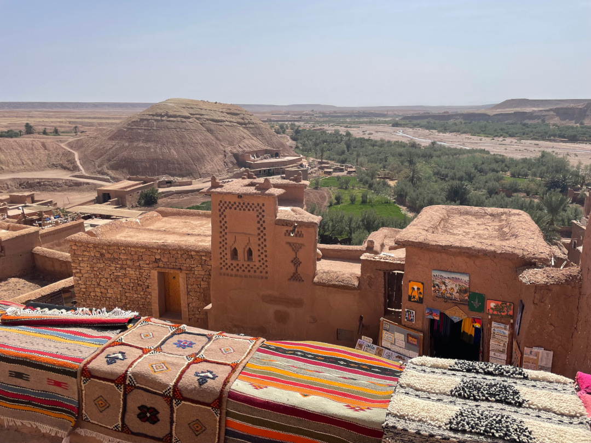

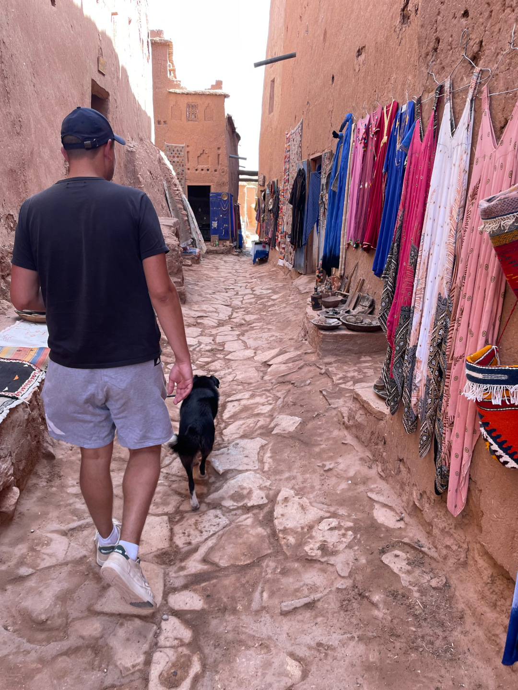

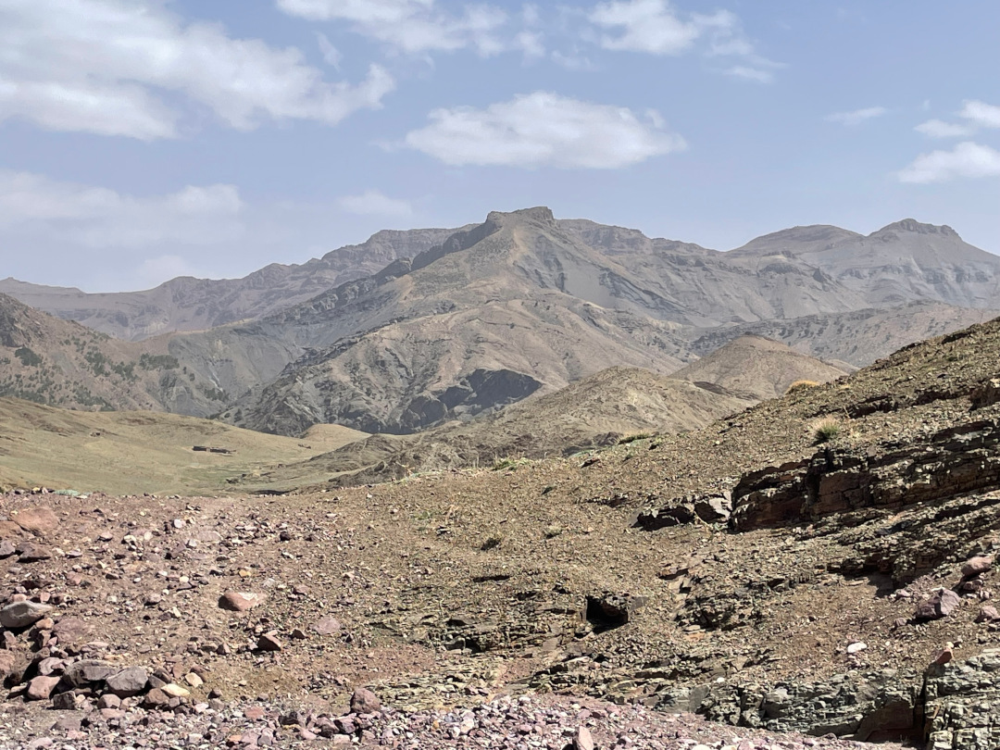

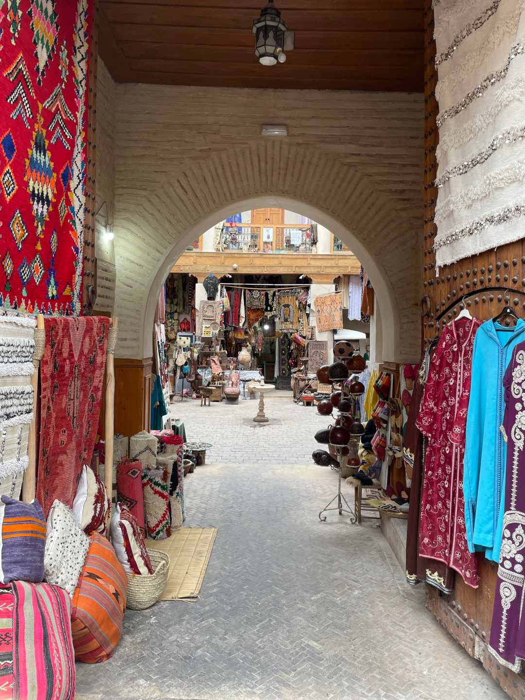

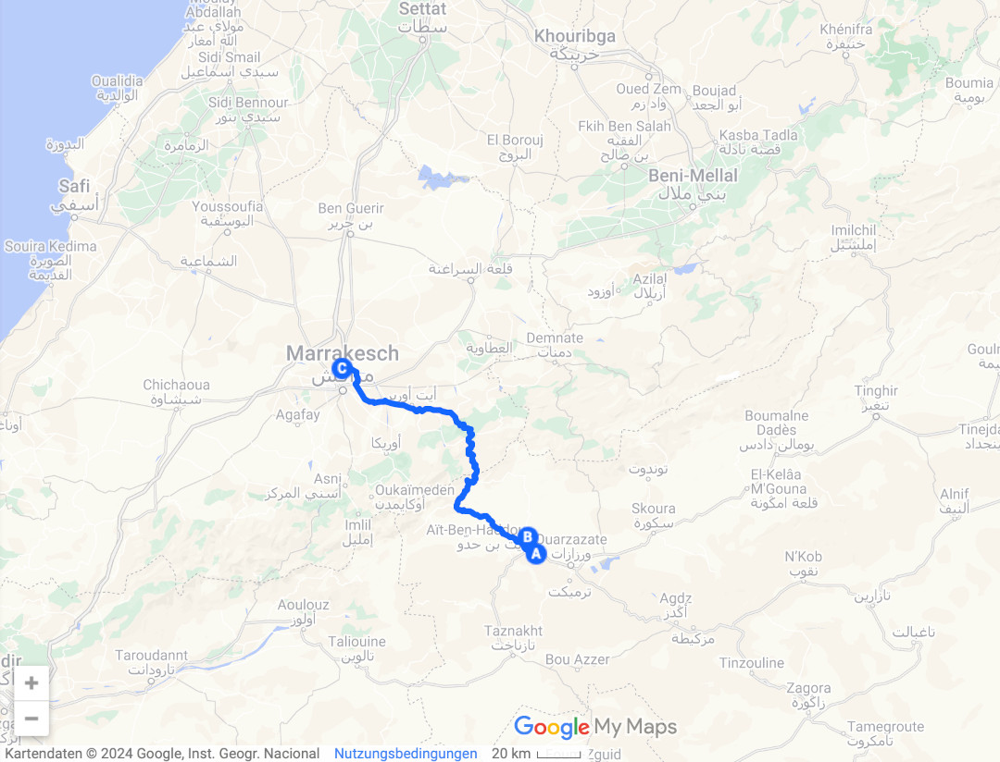

🗓️ 21. März: Obwohl der Campingplatz so voll ist, gehen wir entspannt in den Tag. Wir suchen uns einen Alternativplatz für die heutige Nacht raus und gehen die morgendliche Runde mit Henry am Stadion in Marrakech vorbei. Unsere weiteren Planungen ergeben, dass wir etwas südwestlich von Marrakech schlafen wollen. Dafür müssen wir aber einmal komplett durch die Stadt fahren. Daher bietet es sich an, ihr einen zweiten Besuch abzustatten und die Sehenswürdigkeiten anzuschauen, die wir gestern nicht mehr sehen konnten. Wie auch schon in anderen Städten suchen wir uns eine Tiefgarage, um den Bulli und Henry sicher und kühl zu parken. Wir werden in einem Einkaufszentrum nahe dem Bahnhof fündig. Zum Glück sind wir mittlerweile auf Marokkos Straßen halbwegs sicher unterwegs, sonst wäre das in einer fast Millionenstadt in Marokko auch wirklich abenteuerlich. Jedes zweite Auto ist quasi ein Taxi, weil Taxifahren so günstig ist. Teilweise sieht das schon echt lustig aus. Taxifahrer halten sich aber noch weniger an Verkehrsregeln als andere Autofahrer. Das kennen wir von unseren Taxifahrten. Rote Ampeln sind nur Empfehlungen, genau wie die eingezeichneten Spuren. Nach dem Parken laufen wir als erstes zum Jardin Majorelle, einem 4000 qm großen Garten. Er gilt als einer der schönsten Gärten der Welt und ist die meistbesuchte Sehenswürdigkeit Marokkos. Leider ist es auch hier sehr voll und der Eintritt wäre sogar für Deutschland sehr teuer. Daher gucken wir nur einmal von außen in den Garten. Danach geht es erneut in die Altstadt zur alten Koranschule Ben Youssef. Hier ist es deutlich entspannter und erschwinglicher. Der Besuch lohnt sich wirklich, allein schon für die Architektur und die verzierte Fassade. Danach geht es zum Fotografiemuseum. Hauptsächlich steuern wir das an, um auf der Terrasse des 3. Stocks den Blick über Marrakech zu erhalten, aber auch die Fotos lohnen sich. Teilweise könnte man auch meinen, dass es zwischen 1924 und 2024 auf den ersten Blick kaum Unterschiede gibt. Immer noch ist der Esel Transport- und Fortbewegungsmittel. Auf der Terrasse trinken wir noch einen Tee und merken, dass die Aussicht doch nicht so übertrieben berauschend ist. Die letzten zwei Sehenswürdigkeiten sind der Bahia und der El Badii Palast. Wir beschränken uns auf die Ansicht von außen, weil auch hier der Eintritt sehr hoch ist. Der Weg zurück zum Bulli führt uns wieder durch die Altstadt und an der Koutoubia Moschee vorbei. Wir kaufen noch etwas Baguette und leckeren Kuchen für 70 Cent. Die Verständigung funktioniert in Bäckereien eigentlich immer ganz gut, auch wenn die Gegenseite kein Englisch spricht. Man kann einfach drauf zeigen und dann anzeigen wie viele man möchte. Dann sagt der Verkäufer auf arabisch den Preis, ich gebe ihm ein viel zu großen Schein und stehe aber selbstsicher da, als ob ich genau wüsste wie viel Wechselgeld ich zurückbekomme. Man sollte immer etwas länger stehen bleiben, als einem das erste Wechselgeld gegeben wurde. Dann wirkt es noch selbstsicherer und man bekommt wirklich das komplette Wechselgeld wieder. Bevor wir zurück zum Bulli gehen, essen wir noch etwas. Es gibt Tajine und gegrilltes Fleisch. Wahrscheinlich werden wir in Europa das gute und günstige Essengehen vermissen. Wir kaufen noch im großen Carrefour für den Abend und den nächsten Tag ein und fahren dann zu unserem Stellplatz. Wie touristisch Marrakech ist, merkt man auch daran, dass es im Carrefour Schweinefleisch zu kaufen gibt. Unser Stellplatz ist ein Bauernhof von zwei Franzosen. Es gibt viel Platz, Ziegen, Esel, Katzen, Oliven-, Orangen- und Zitronenbäume. Neben uns sind nur noch ein Holländer und eine Litauerin da. Dieser Platz passt eindeutig besser zu uns. Wir bekommen abends sogar noch etwas Brot an den Bulli gebracht. Obwohl wir ja extra bei der Bäckerei waren, nehmen wir es gerne an. Wir erkunden noch etwas mit Henry die Umgebung und entspannen etwas.

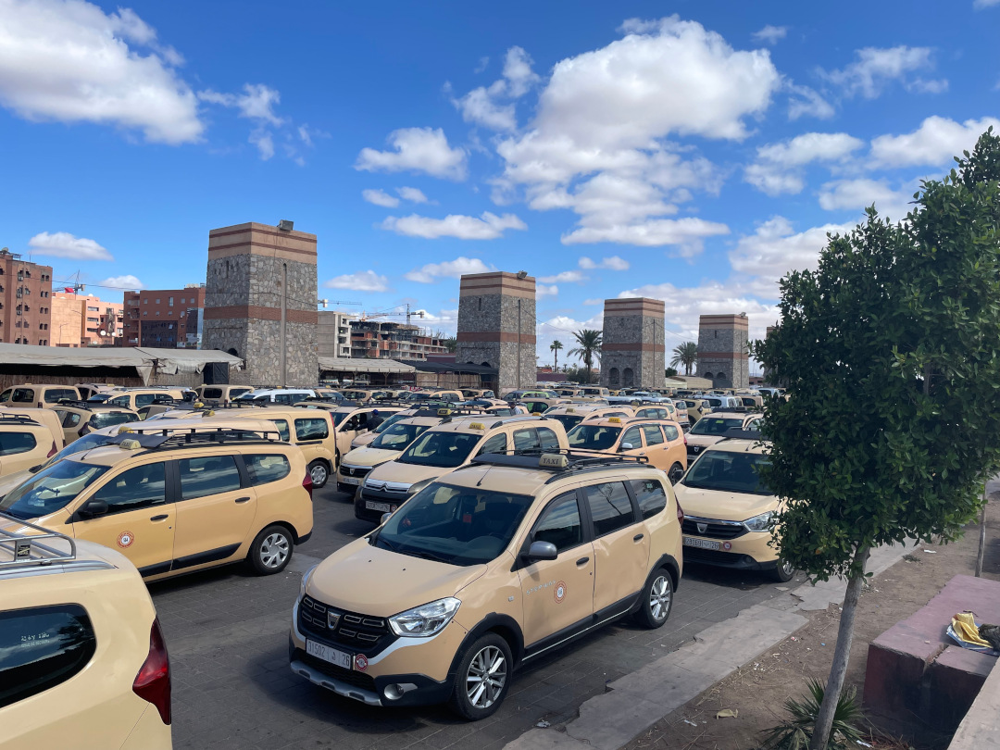

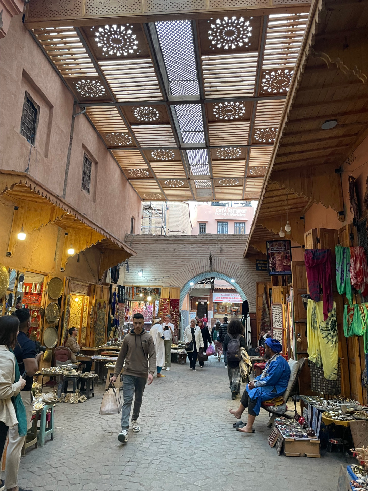

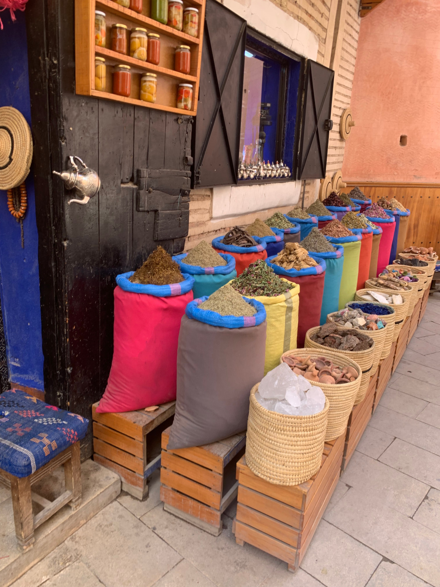

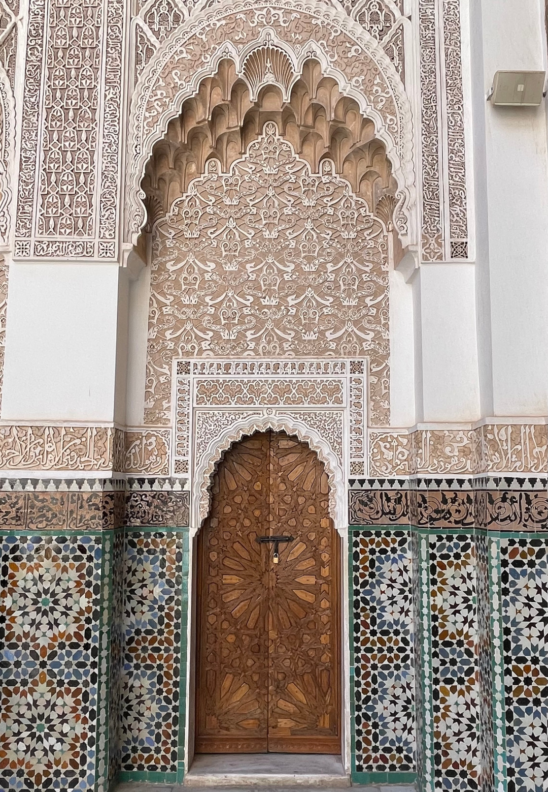

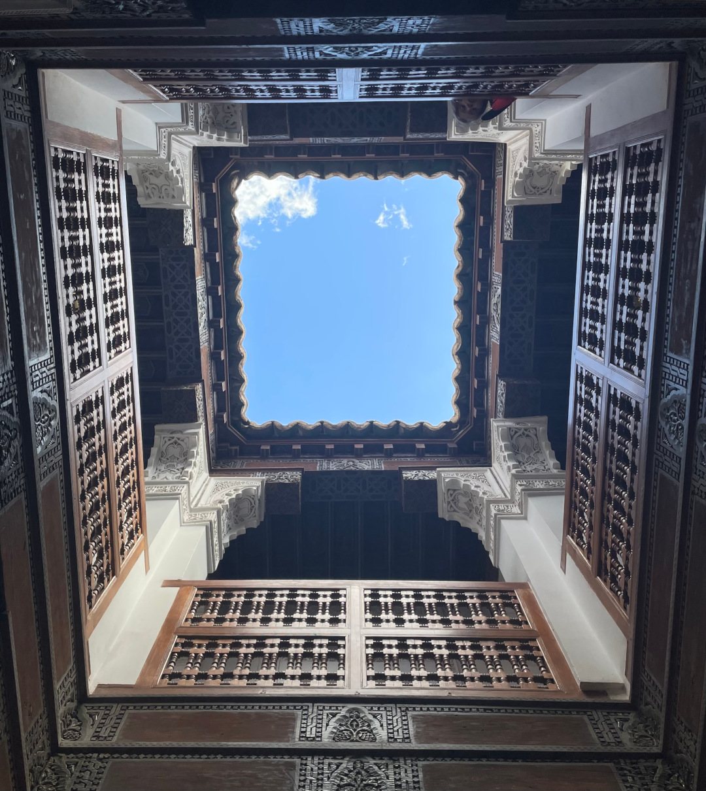

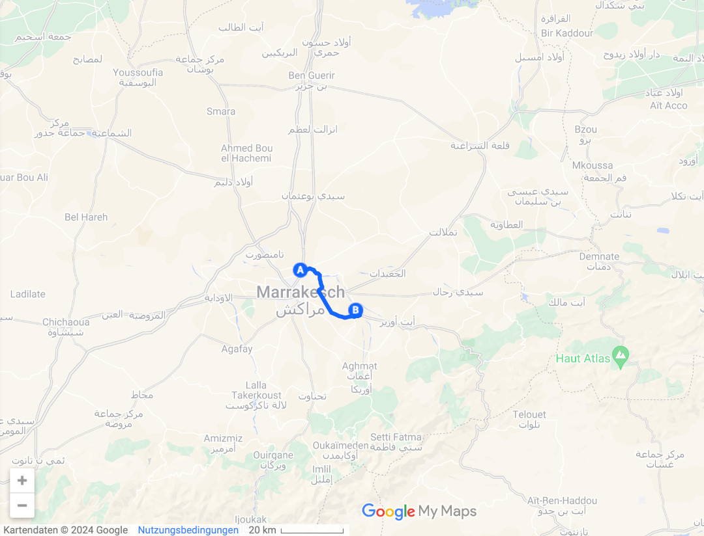