Wir lassen die Heißluftballons hinter uns und fahren weiter Richtung Osten und in die Berge, unter anderem zum Götterberg.

<!--more-->

🗓️ 20. Juni: Für das Ballonspektakel stehen wir sogar noch ein drittes Mal nacheinander schon zum Sonnenaufgang auf und jedes Mal lohnt es sich. Diesmal nutzen wir die Zeit für eine Henry-Runde mit den vielen Ballons um uns herum. Danach legen wir uns auch nicht wieder hin, sondern nutzen aus, dass der Tag durch das frühe Aufstehen so lang ist und fahren heute über 600 Kilometer weiter nach Osten bis in die Berge. Mit der Zeit wird die Landschaft immer karger und alles weniger bebaut, bis auf die großen Städte. Deshalb können wir noch eine gute Pause mit Spaziergang machen. In Malatya halten wir in einer Mall, um einzukaufen. Wie überall in der Türkei sind die Sicherheitsmaßnahmen für uns etwas ungewohnt. Den Typen, der mit einem Spiegel sichergehen will, dass wir keinen Sprengstoff unter dem Auto haben, übersehen wir. Im Rückspiegel sehen wir ihn zwar noch winken, aber er lässt uns dann doch einfach in die Tiefgarage ziehen. Dann müssen alle durch den Scanner wie am Flughafen und die Taschen werden durchleuchtet. Belohnt werden wir aber mit einem 5M Migros, also einem sehr großen Supermarkt. Die letzten zwei Stunden Fahrt führen uns dann ziemlich in Schlangenlinien durch die Berge. Der Zustand der Straßen bleibt aber selbst hier sehr gut. Hier im Osten der Türkei treffen wir aber generell wieder mehr Tiere auf den Straßen wie Ziegen oder Esel. Das erinnert (im Gegensatz zum Westen der Türkei) ein bisschen an Marokko. Als wir am Campingplatz ankommen, sitzen überall Gruppen von Männern und baden im Pool. Frauen sind keine zu sehen. Andere Campinggäste sehen wir erstmal auch nicht. Wir werden aber freundlich empfangen, kriegen erstmal einen Tee und dann parkt noch jemand sein Auto um, damit wir besser stehen können. Nach und nach gehen die einheimischen Tagesgäste und es wird deutlich ruhiger. Wir dürfen unsere Wäsche waschen, hängen sie auf und bekommen dann in Windeseile ein sehr leckeres Essen auf den Tisch gezaubert inklusive selbstgemachtem Ayran. Wie sie das immer so schnell machen, bleibt uns echt ein Rätsel. Unten im Garten entdecken wir dann doch noch einen Camper und merken, dass es der britische Jeep ist, neben dem wir an der Küste schon standen. Die Leute scheinen aber schon schlafen gegangen zu sein. Das Gute an der Hitze ist, dass die Wäsche nach dem Essen auch schon wieder trocken ist. Wir räumen also noch alles auf und fallen ins Bett.

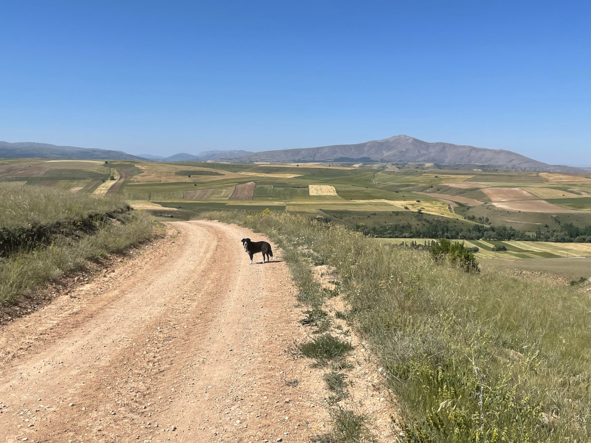

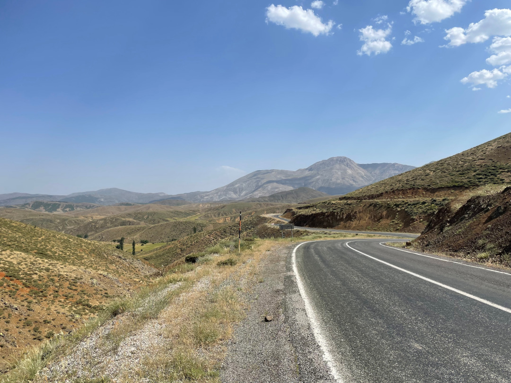

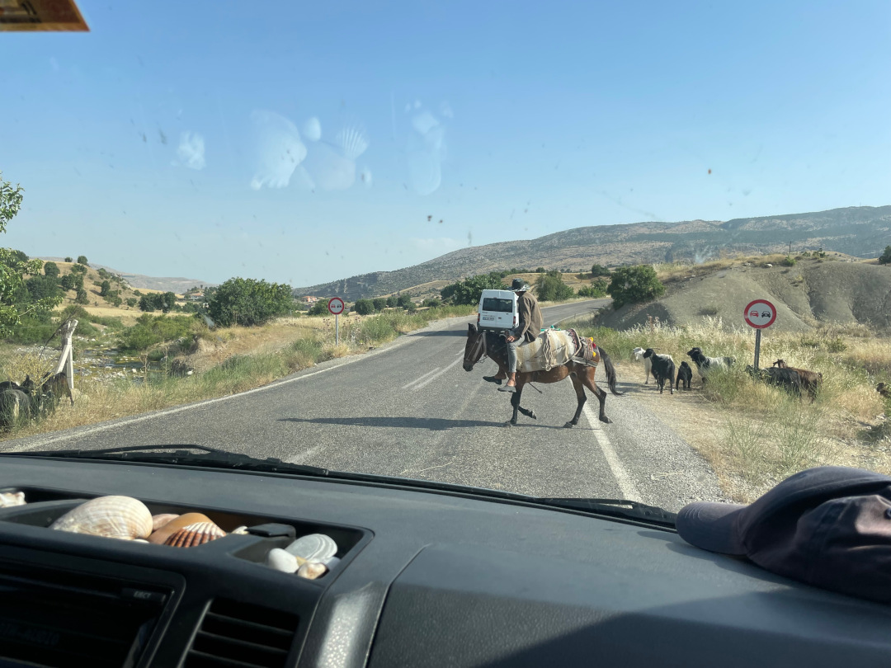

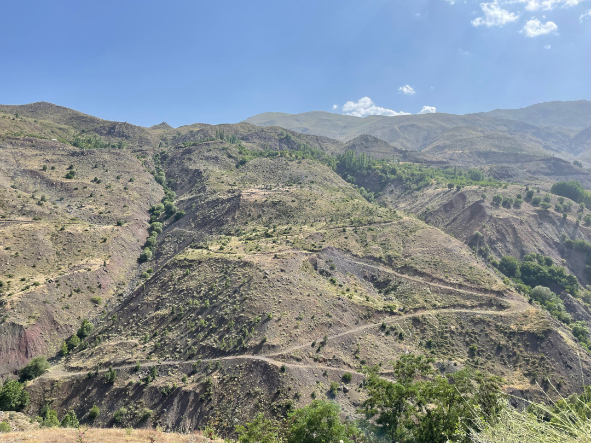

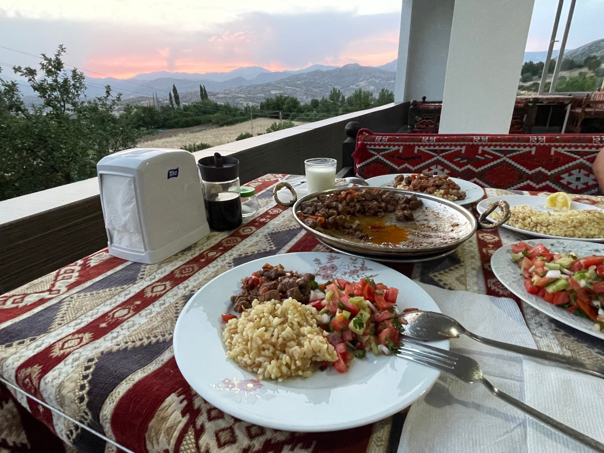

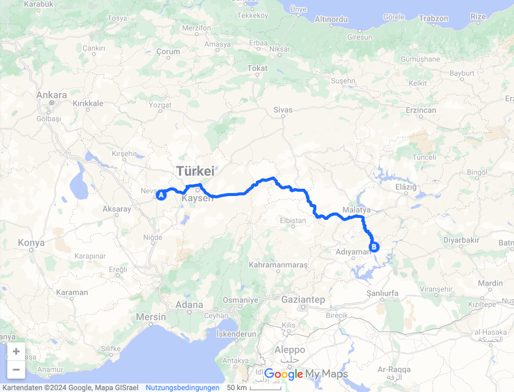

🗓️ 21. Juni: Puh, das war wahrscheinlich unsere wärmste Nacht im Bulli bisher. So hat es sich jedenfalls angefühlt. Morgens springen wir deshalb wieder in den Pool, der hier wiederum der kälteste der Reise und auch kälter als die Meere ist. Für uns ist das jetzt aber genau das richtige. Wir bekommen warme Teigfladen gebracht, bedanken uns für alles und verabschieden uns vom Besitzer. Nach 2 Kilometern biegen wir rechts von der Straße in Richtung Nemrut Dagi ab, dem Götterberg. Den kann man übrigens leicht verwechseln mit dem 300 Kilometer entfernten Nemrut Dagi Vulkankrater, zu dem wir morgen auch noch fahren. Wir haben uns so zum Beispiel den falschen Wetterbericht angeguckt und mit der erneuten Hitze deshalb gar nicht so gerechnet. Auf einer Pflasterstraße geht es ziemlich steil nach oben, so dass wir oft im zweiten Gang unterwegs sind. Auf halber Strecke nehmen wir einen Mann mit, der nur türkisch spricht, aber sehr nett aussieht. Mit Händen verständigen wir uns, aber so richtig verstehen wir trotzdem nicht, was sein Ziel ist. Nach nur 1-2 Kilometern sollen wir ihn (für uns gefühlt im nirgendwo) schon wieder rauslassen und es dauert etwas, bis wir das überhaupt verstehen, aber er scheint sehr zufrieden zu sein und hat sich ein paar Höhenmeter gespart. Wir düsen weiter den Berg hoch, bis wir an die Stelle kommen, an der wir Tickets kaufen müssen. Alle freuen sich richtig uns zu sehen und sind sehr hilfsbereit. In dem Moment fährt auch wieder der britische Jeep an uns vorbei. Allerdings sind die beiden wohl früher aufgestanden und schon wieder auf dem Weg nach unten. So bleibt es bei überschwänglichem Winken. Sie scheinen uns auch wiedererkannt zu haben. Danach können wir nochmal 2 Kilometer mit dem Bulli weiter, bevor es nur noch zu Fuß geht. Von dort aus sind es zwar nur noch ein paar hundert Meter, aber anstrengend ist es trotzdem, weil es so steil ist und die Luft gefühlt schon etwas dünn. Zum Glück ist es hier oben aber deutlich kühler als unten. Erst biegen wir links ab zur Westterrasse. Dann laufen wir quer rüber zur Ostterrasse und als letztes noch zur Nordterrasse, von der aber nicht viel erhalten ist. Die Terrassen bilden eine Mischung aus Heiligtum und Grabstätte, die von König Antiochos I. Theos (69–36 v. Chr.) errichtet wurden. Am beeindruckendsten sind die 8-10 Meter hohen Götterstatuen, die inzwischen natürlich nicht mehr hundertprozentig in Schuss sind. Alle Köpfe finden sich zum Beispiel am Boden vor den eigentlichen Statuen. Wenn man ihr Alter bedenkt und die Höhe des Berges, kommt man trotzdem ins Staunen. Die Aussicht ist außerdem in alle Richtungen überragend und allein dafür lohnt es sich schon hierher zu kommen. Bei Sonnenaufgang sollen die Statuen auch wunderschön angeleuchtet werden, aber wir haben genug vom ganz frühen Aufstehen gehabt und wollten auch nicht hierherkommen, wenn es so voll ist. Der Plan geht auf, denn um 10 Uhr treffen wir unterwegs nur sehr wenige andere Besucher. Mit dabei sind sehr freundliche Polen, die unsere Vorfreude auf den Ararat, zu dem wir bald auch fahren, schon mal steigern, weil sie so davon schwärmen. Dann düsen wir wieder runter, sehen unterwegs noch eine Steinbock-Mama und ihre beiden Jungen, die wirklich einfach senkrecht die Felsen hochklettern, und biegen am Ende der Straße rechts ab. Wir fahren heute ein Stück zurück bis nach Malatya, also wieder Schlangenlinien durch die Berge wie gestern. Am Beginn der Straße wissen wir, dass wir bald tanken müssen, haben aber noch keine Lust dazu und denken: ach, wird schon bis drüben reichen. Als die Tanklampe dann schon längst leuchtet und die angezeigte Reichweite viel zu schnell fällt, bereuen wir unsere Faulheit schnell etwas. Zwischendurch zweifeln wir ernsthaft, ob wir es noch bis zur nächsten Tankstelle kurz vor Malatya schaffen. Internet oder Telefonempfang haben wir hier oben auch nicht. Wir sehen uns schon zur nächsten Tankstelle trampen, aber bemühen uns uns, wo immer möglich, den Bulli nur rollen zu lassen und schalten Licht, Klimaanlage, Kühlbox und Handy-Ladekabel aus. Und unsere Bemühungen lohnen sich, weil die Reichweite nicht mehr so schnell fällt und es wieder realistischer wird. So froh waren wir glaube ich noch nie endlich an einer Zapfsäule zu stehen. Anschließend gehen wir nochmal in die Mall von gestern, um zu Mittag zu essen, Bargeld zu holen und Wasser zu kaufen. Dann geht’s weiter Richtung Osten. Unser nächstes Ziel ist der Fluss Murat, an dem wir auf einem kleinen Campingplatz übernachten wollen. Wir kommen gut durch und machen nur noch eine Pause am See. Überall sehen wir Storchennester aus denen die Kleinen oben rausluken. Am Platz angekommen sind wir mal wieder die einzigen und verständigen uns eher mit Händen als mit Sprache, aber das klappt gut und man hat eine sehr schöne Aussicht auf den Fluss. Weil wir mittags schon gegessen haben, machen wir uns nur noch ein kleines Abendbrot. Obwohl es auch hier noch relativ warm ist, geht zum Glück ein guter Wind und so lässt es sich gut aushalten.

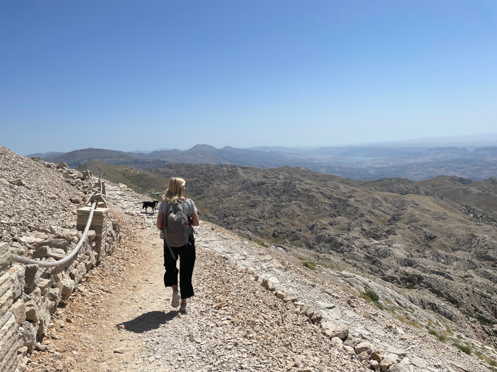

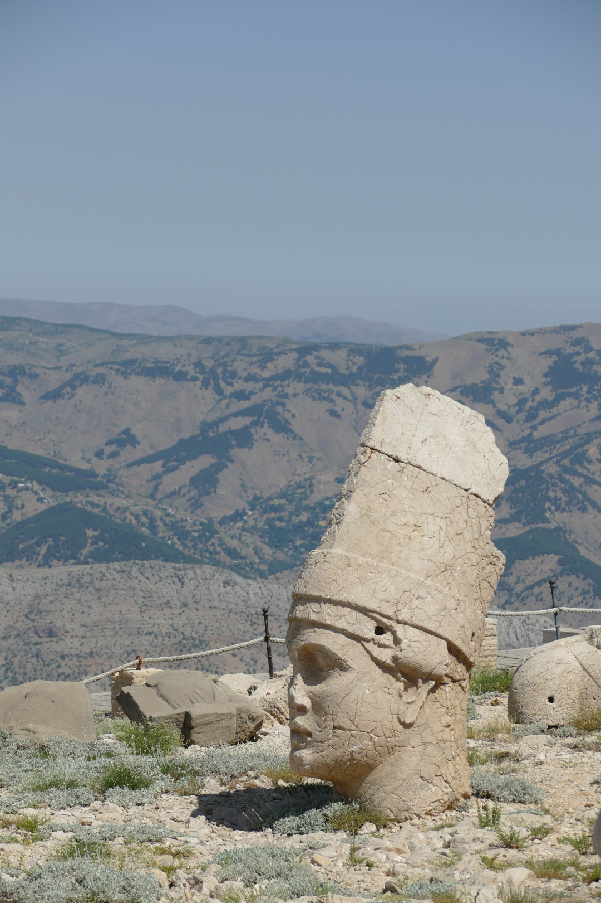

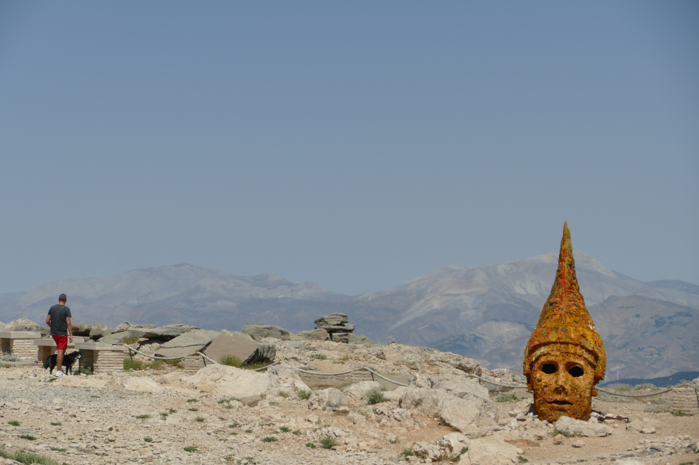

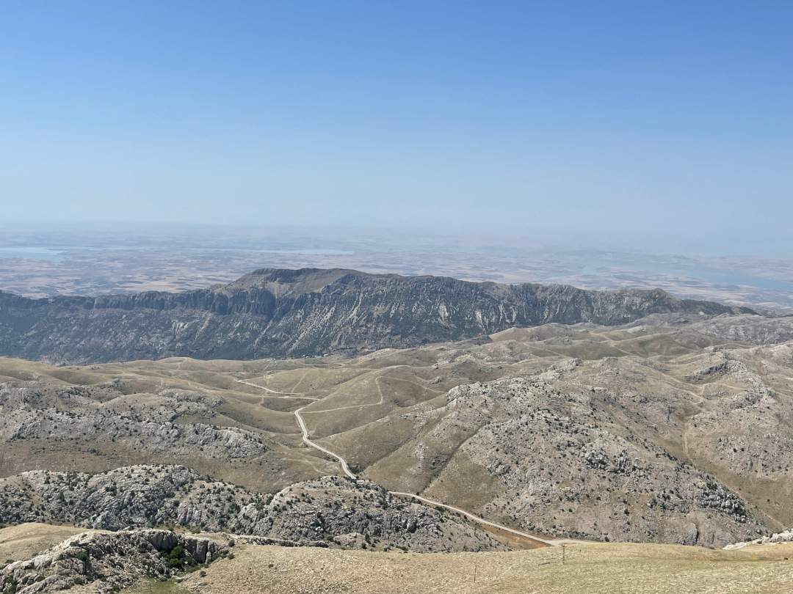

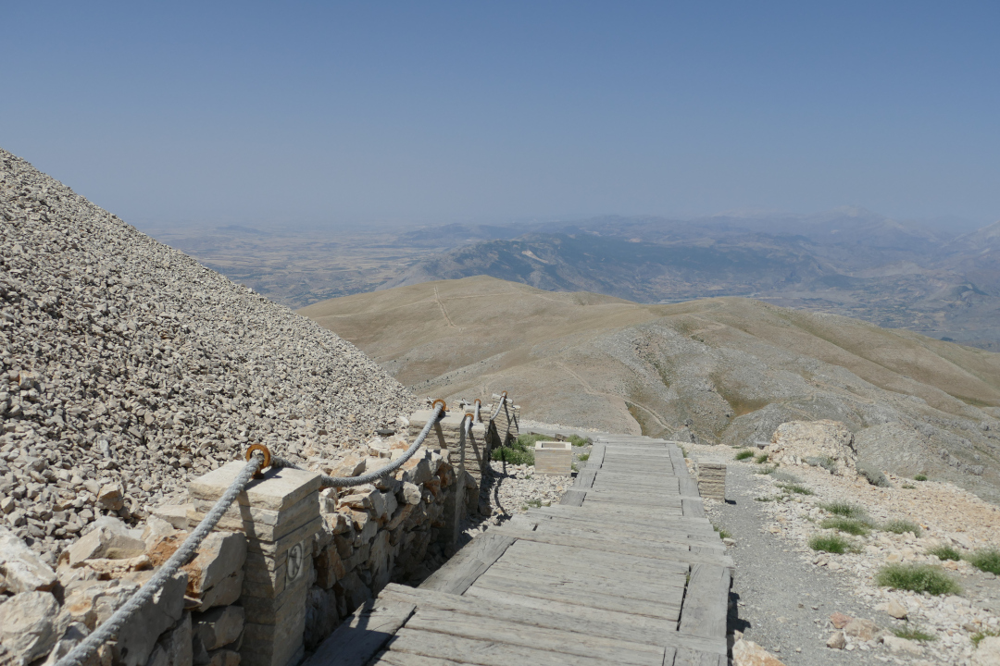

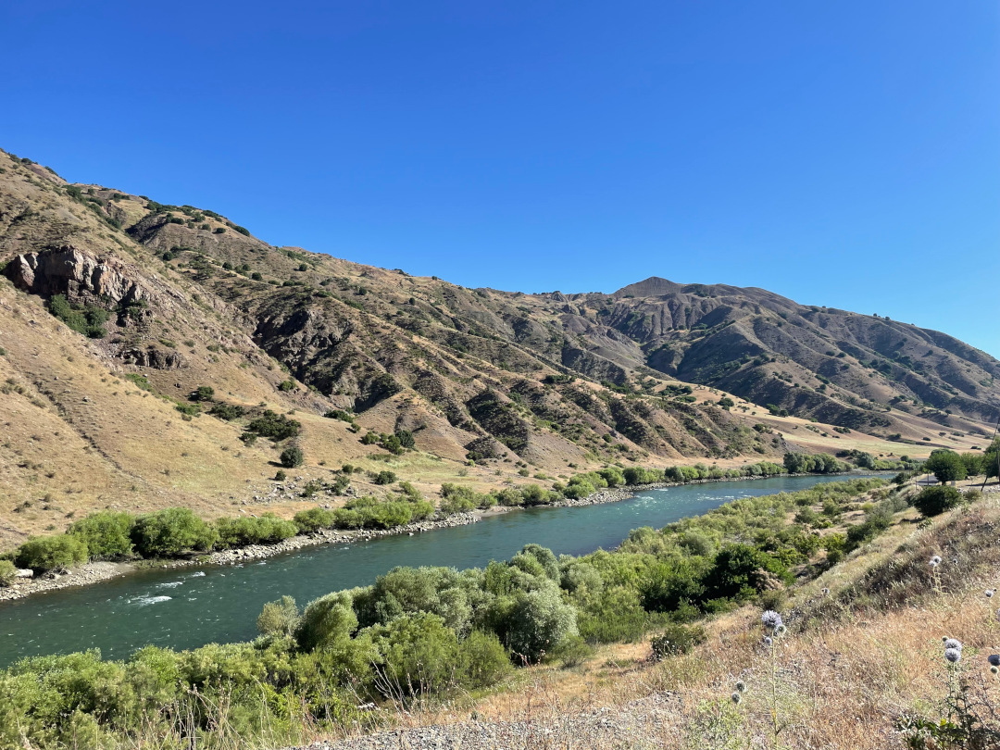

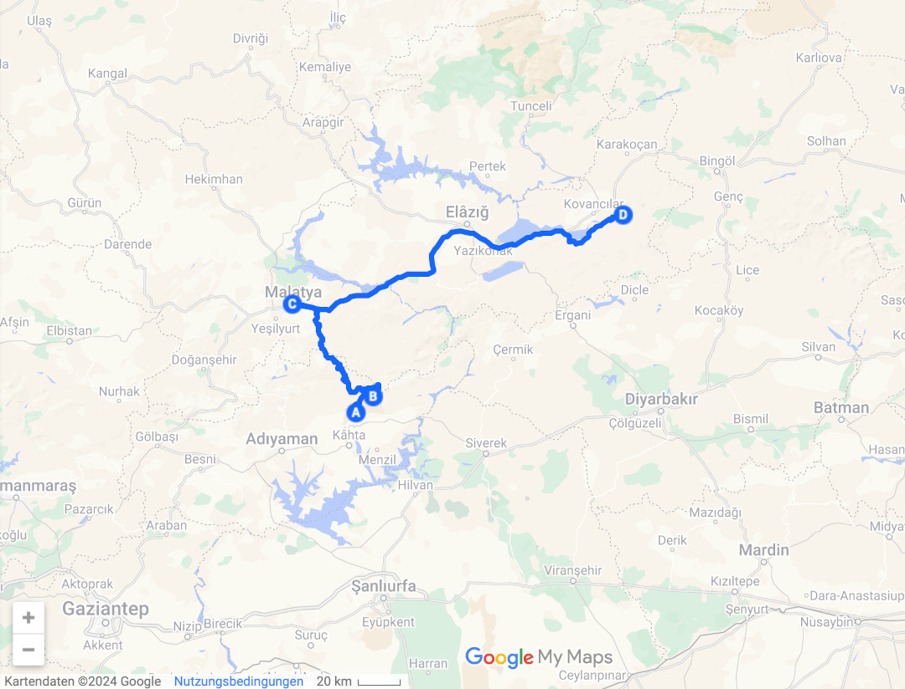

