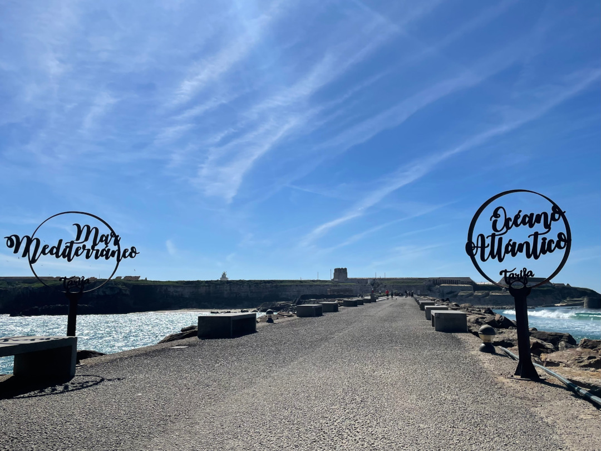
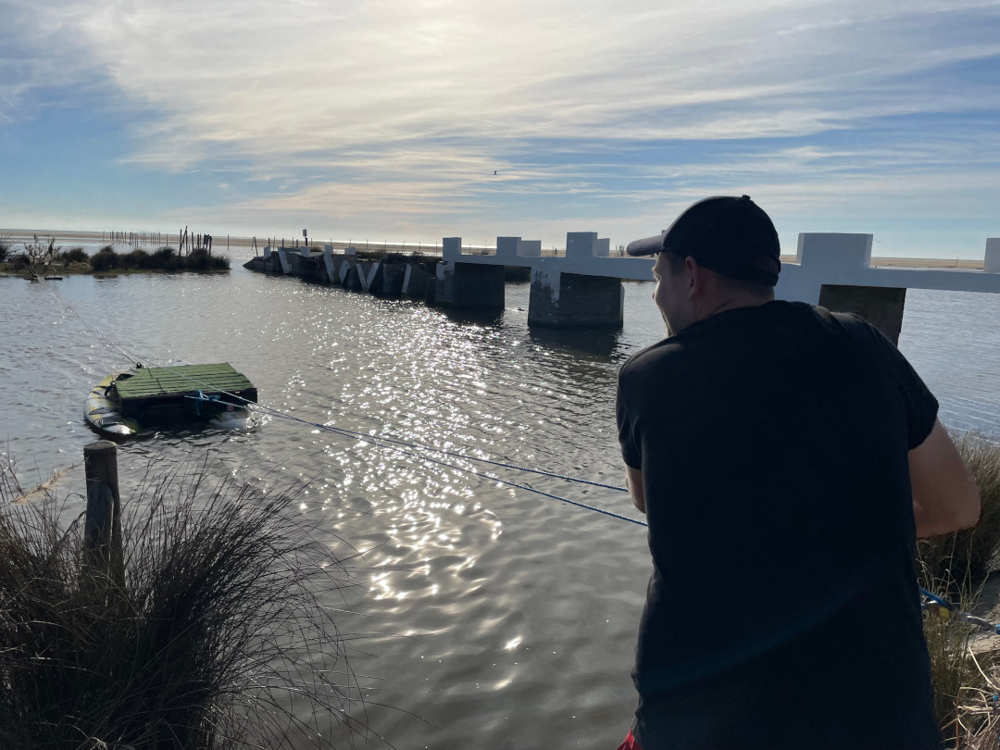
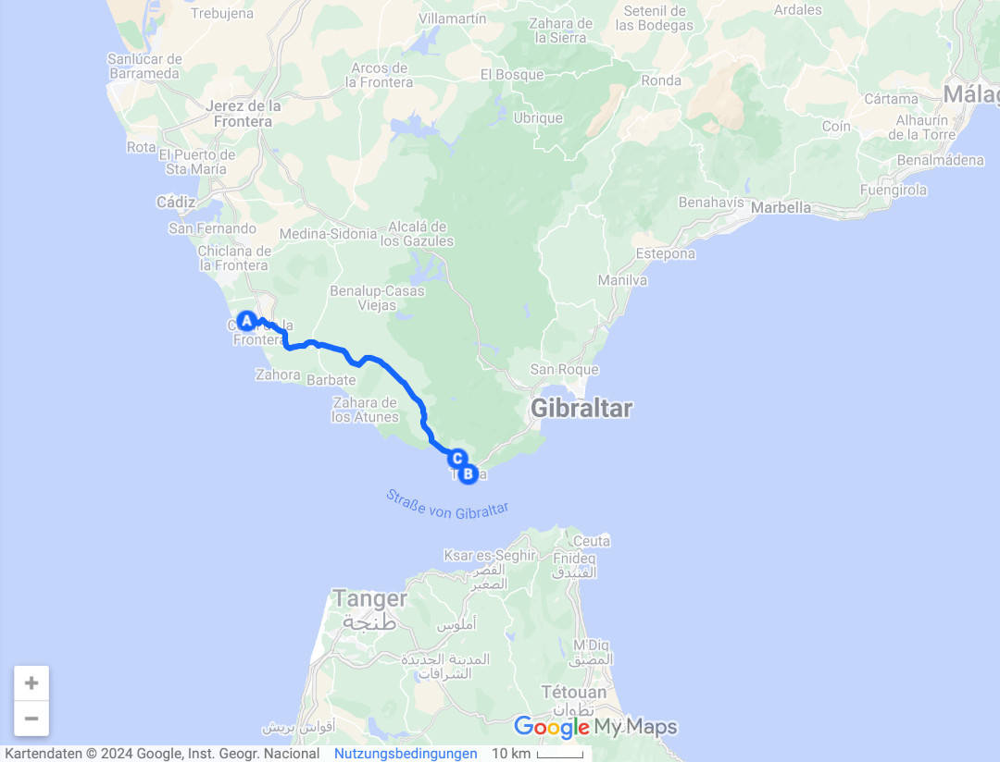
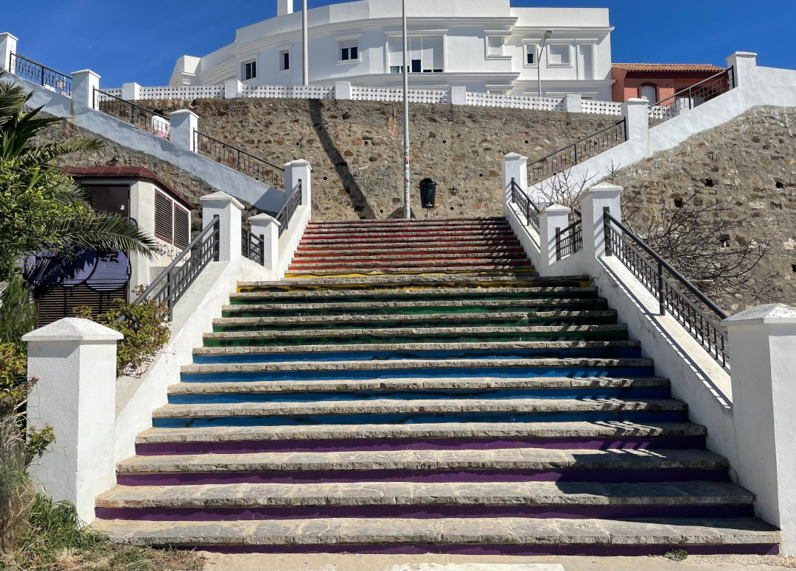
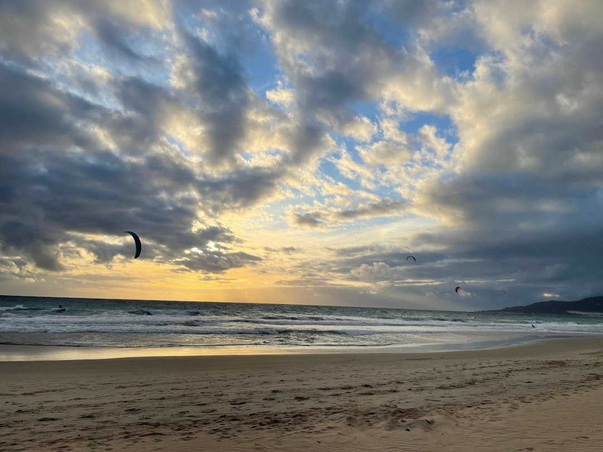

Wir fahren weiter die Küste entlang, bis wir am südlichsten Punkt Europas ankommen und am Horizont Afrika sehen. Laut dem etwas optimistischen Schild des Campingplatzes sind es bis Marokko nur noch 15 Kilometer.

<!--more-->

🗓️ 21. Februar: Ein letztes Mal wachen wir in unserem Garten auf. Wir dürfen heute noch so lange hierbleiben, wie wir wollen und nutzen das Alleinsein für einen richtigen Rundumputz und bringen den Bulli wieder auf Vordermann. Dann machen wir uns auf den Weg nach Tarifa. Hier treffen nicht nur der Atlantik und das Mittelmeer aufeinander. Wir sind hier auch am südlichsten Punkt Europas angekommen, und zwar 8 Jahre nachdem wir mit dem Zelt am nördlichsten Punkt Europas waren. Das hätte man sogar zu Fuß sehr viel schneller geschafft, aber immerhin sind wir überhaupt da. Wie an allen Extrempunkten ist es auch hier sehr windig und die vielen Kitesurfer am langen und breiten Strand von Tarifa haben beste Bedingungen. Nach einem Spaziergang machen wir uns dann auf die Suche nach einem Campingplatz. Der erste hat nur noch ein unschönes Plätzchen für uns im Angebot, so dass wir nochmal weiterziehen. Als wir dann einen guten Platz haben, wollen wir nochmal an den Strand, müssen dafür allerdings noch einen kleinen Fluss überqueren. Als wir uns nähern, sehen wir, dass die Brücke ihre besten Zeiten hinter sich hat und die Hälfte schon im Wasser liegt. Nebenan gibt es aber zum Glück ein sehr provisorisches Floß mit zwei Surfbrettern als Basis. An einer Leine können wir uns so etwas wacklig rüber ziehen und müssen nur noch ein kleines Stück durch flacheres Wasser waten. Als das geschafft ist geht Tobi nochmal schwimmen und wir genießen den Sonnenuntergang.

🗓️ 22. Februar: Auch hier bleiben wir noch für eine zweite Nacht. Deshalb gibt es nach dem Aufstehen direkt eine große Henry-Runde durch den angrenzenden Wald. Nach einer Weile kommt man auf diesem Weg auch ein Stückchen nördlicher an den Strand (ganz ohne Floß und mit trockenen Füßen). Es ist kaum was los und so laufen wir noch eine ganze Weile einfach am Strand entlang. Am meisten genießt die Weite wahrscheinlich Henry, der durch die Gegend pest oder seine Nase in den Sand steckt. Wenn wir Pause machen, buddelt er sich erstmal ne gemütliche Kuhle, egal ob der Sand auf uns oder woanders landet. Anschließend geht es für uns nochmal zu Fuß nach Tarifa. Wir schlendern, wie inzwischen schon üblich, durch die Gassen, lassen uns treiben und gucken uns den kleinen Ort an. Hier und da sehen wir auch schon Aufbauarbeiten, denn an diesem Wochenende wird in Tarifa Karneval gefeiert. Abends sind wir dann wieder am Strand und schauen den vielen Kitesurfern zu, wie sie vor der untergehenden Sonne mit ordentlich Geschwindigkeit über das Wasser gleiten und die Geübteren Sprünge machen.

