Endlich wieder in einem Land angekommen, in dem wir vorher noch nie waren, gibt es für uns ab jetzt viel Neues zu entdecken. Als erstes geht es in drei geschichtsträchtige Städte.

<!--more-->

🗓️ 21. April: Tatsächlich ist Susi wie versprochen morgens direkt da und wirklich total freundlich. Unsere morgendliche Henry-Runde führt uns dieses Mal an der Donau entlang (streng genommen also keine Runde, aber so streng sind wir hier nicht). Nach einer Weile laufen uns zwei Rehe direkt über den Weg, die wir wohl aufgescheucht haben. Für ein Foto wollen sie nicht bleiben. Zurück am Campingplatz machen wir alles fertig und fahren los in Richtung ungarisch-rumänische Grenze. In Ungarn umgehen wir nach wie vor die Maut und fahren deshalb über Landstraßen und durch kleine Orte. Überall sind viele Störche unterwegs. Bei Aldi freuen wir uns über ein richtiges Körnerbrot und verballern unsere Forint-Bestände noch an einer Tankstelle. Damit haben wir in Marokko schon gute Erfahrungen gemacht und viel tanken wollen wir eh nicht, weil der Diesel in Rumänien wieder billiger sein wird. Mittags machen wir einen Stopp für einen Spaziergang durch die vielen platten ungarischen Äcker und Felder. Könnte auch das Münsterland sein. Dann kommen wir an einem kleinen Grenzübergang zu Rumänien an. Leider ist Rumänien dem Schengenraum bisher nur teilweise, also für Luft- und Seeverkehr, beigetreten, so dass es hier noch Grenzkontrollen gibt. Es ist aber nicht viel los und ein Beamter wartet schon auf uns. Wir geben ihm unsere Ausweise und KFZ-Papiere, er wünscht uns gute Fahrt, gibt alles wieder zurück und wir düsen los, als wir von hinten laute Rufe hören. Irgendwann verstehen wir, dass die junge Beamtin uns meint und legen lieber nochmal den Rückwärtsgang ein. Scheinbar hätten wir am zweiten Häuschen (in dem zu dem Zeitpunkt nicht mal jemand saß) auch halten müssen. Schwierig zu wissen, so ganz ohne Stopp-Schild oder Ampel. Naja, nachdem sie mit bösem Blick nochmal mit den gleichen Dokumenten verschwunden ist, dürfen wir weiterfahren, ohne dass sie uns weiter ärgert. Glück gehabt. Erneut stellen wir unsere Uhren um, denn ab jetzt ist es bei uns eine Stunde später als in Deutschland. Unser erstes Ziel ist die Stadt Arad, um ein erstes Gefühl für das neue Land zu kriegen und standesgemäß bei der Banca Transilvania schon die nächste Währung abzuholen. Direkt neben unserem Parkplatz begrüßt uns erstmal ein verlassenes Schwimmbad mit einem mehr oder weniger freundlichen Clown. Die Währungsumrechnung wird mit dem rumänischen Lei jetzt aber wieder leichter, weil man nur durch 5 und nicht mehr durch 400 wie in Ungarn teilen muss. Als wir an einer Eisdiele vorbeikommen, nutzen wir direkt die Chance. Rumänisch ist italienisch sehr ähnlich, weil beide romanische Sprachen sind. Das ist ganz praktisch, denn von Buona sera zu Buna seara ist es nicht sehr weit und so kommen wir besser zurecht als in Ungarn. Für die Nacht haben wir ein Restaurant auf einer Halbinsel in einem kleinen See rausgesucht. Wir essen dort und dürfen dafür umsonst übernachten. Auf eine Dusche müssen wir verzichten, aber Toiletten und Wasser sind da. Nach einem schönen Sonnenuntergang fahren gegen 22:30 Uhr nach den letzten Gästen schließlich auch die Betreiber nach Hause. Weil wir die einzigen Übernachtungsgäste sind, fühlt sich unsere erste rumänische Nacht also eher nach Freistehen an. Nachts ist es total ruhig und nur der Mond, der schon wieder auf dem Weg zum Vollmond ist, erhellt die Nacht.

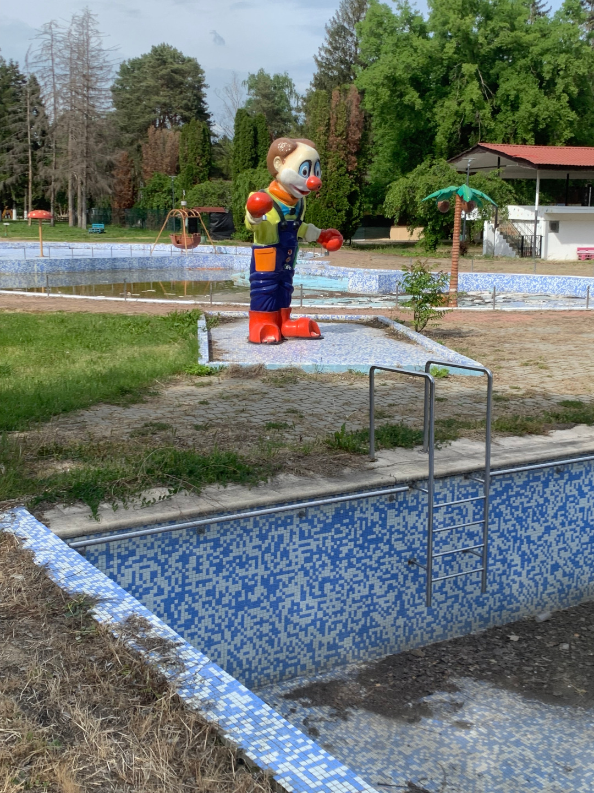

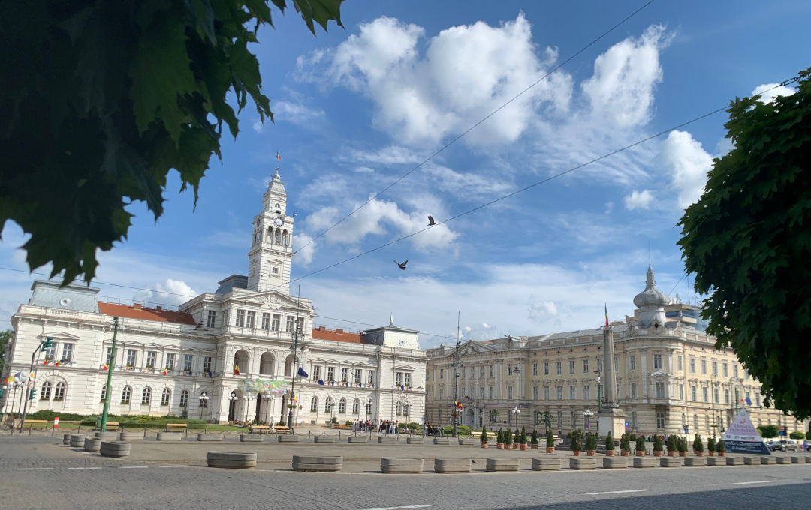

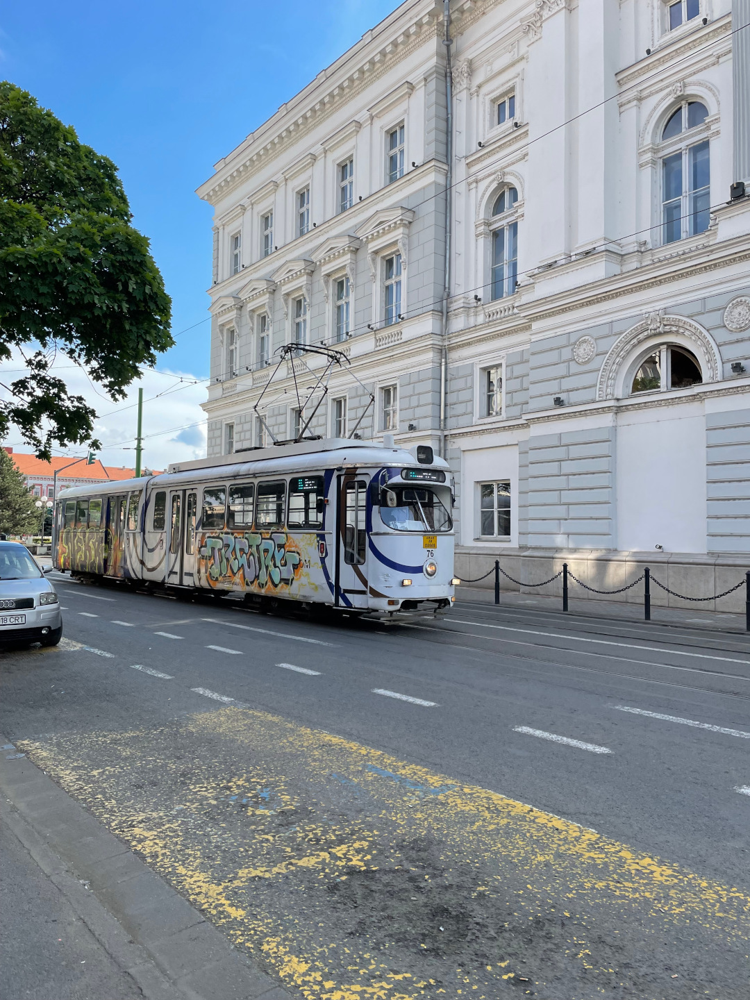

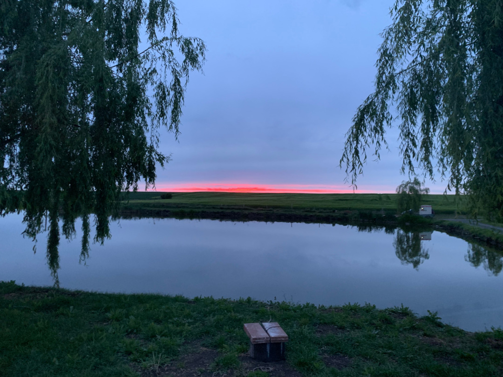

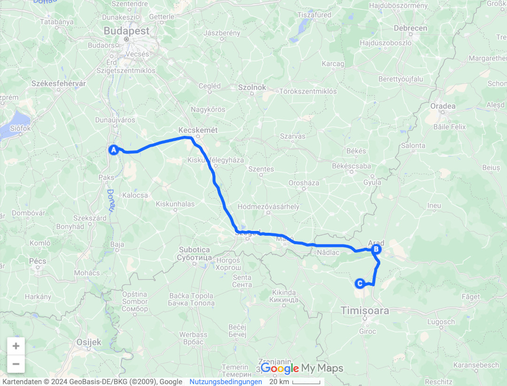

🗓️ 22. April: Der Kontrast am nächsten Morgen könnte nicht größer sein. Wir wachen von Stimmen um unseren Bulli auf. Als ich den Vorhang zur Seite schiebe, sehe ich eine ganze Schulklasse mit Angelsachen direkt um unseren Bulli herumwuseln und die besten Plätze suchen. Puh, also aufstehen mit Publikum heute. Wir fahren als erstes ein Stück aus der Meute raus, die übrigens kaum Notiz von uns nimmt. Alle benehmen sich, als wäre es das Normalste der Welt, dass sie dort angeln, während wir uns nur ein paar Meter weiter draußen die Zähne putzen. Eigentlich wollten wir schon von der Insel runter auf den gegenüberliegenden Parkplatz, aber zwei Autos stehen auf der kleinen Brücke und versperren uns den Weg. Zum Glück interessieren sich alle so wenig für uns und wir können trotzdem in Ruhe den Bulli für die Abfahrt vorbereiten und eine Runde mit Henry um den kleinen See gehen. Dabei treffen wir auch unseren ersten rumänischen Straßenhund, der aber sehr ängstlich und deshalb schnell wieder weg ist. Nachdem die Besitzer die Autos für uns weggefahren haben, brauchen wir ungefähr eine halbe Stunde bis Timisoara. Die super rumänische Parkplatz-App funktioniert für uns leider mal so gar nicht und der einzige Platz ohne App ist ziemlich voll. So warten wir am Ende vor der Schranke und feiern etwas zu sehr, als der Knopf endlich grün leuchtet und ein Ticket kommt, weil jemand rausgefahren ist. Endlich können wir uns die europäische Kulturhauptstadt von 2021 angucken, die vor allem mit schönen Plätzen und Häusern (wobei manche auch renovierungsbedürftig sind) aufwartet. Der schönste ist für uns der Puta Unirii. Außerdem geht es für uns noch zur Kathedrale Trei Lerarhi. Beim Bäcker besorgen wir uns Covrigi Spezial und werden direkt Fans von den sehr leckeren lauwarmen rumänischen Kringeln, in unserem Fall mit Käse überbacken, die etwas nach Stockbrot schmecken. Nach unserem Stadtbesuch fahren wir noch ungefähr zweieinhalb Stunden weiter. Bisher sind die Straßen alle top und bis auf ein paar etwas riskantere Überholmanöver läuft der Verkehr super easy, anders als wir vorher gelesen hatten. Unterwegs kaufen wir noch bei Kaufland ein. Generell sind viele deutsche Ketten in Rumänien vertreten. Im Dorf Saliste angekommen, ist das Tor des kleinen Campingplatzes leider geschlossen, aber unsere Ankunft ist nicht lange unbemerkt geblieben und schnell kommt die nette Gasgeberin. Eigentlich stehen wir im Garten der Familie, aber dafür ist der Platz sehr gut ausgestattet. Selbst eine Partie Tischtennis ist noch drin, die diesmal übrigens an mich geht. Als wir noch eine Runde mit Henry an dem kleinen Fluss um die Ecke gehen, merken wir schon, wie grün Rumänien ist, und zwar richtig leuchtend grün zu dieser Jahreszeit. Passenderweise setzt sich gegen Abend auch die Sonne gegen die Wolken durch. Dann gibt’s wie so oft Wraps zum Abendessen, bevor wir bei der Gastgeberfamilie wie besprochen nochmal klopfen, um zu bezahlen. Und zack, sitzen wir mitten in ihrem Haus am Tisch. Der Besitzer gibt uns noch ein paar gute Tipps für unsere Weiterreise und wir lernen, wie weit das christliche und das orthodoxe Osterfest in diesem Jahr auseinanderliegen. Wir hatten uns naiverweise schon über die vielen Ostersachen im Supermarkt und die Osterdeko in den Städten gewundert. Jetzt wissen wir, dass das die Vorbereitungen für die traditionellen Ostermärkte sind. Dieses Jahr können wir also ein zweites Mal Ostern erleben: Karfreitag ist am 3. und Ostern dann am 5. und 6. Mai. Der große Unterschied kommt durch die Differenz von 13 Tagen zwischen unserem gregorianischen und dem julianischen Kalender und die Abhängigkeit des Osterfestes vom Frühlingsvollmond zustande. So gehen wir mit einer Bildungslücke weniger ins Bett.

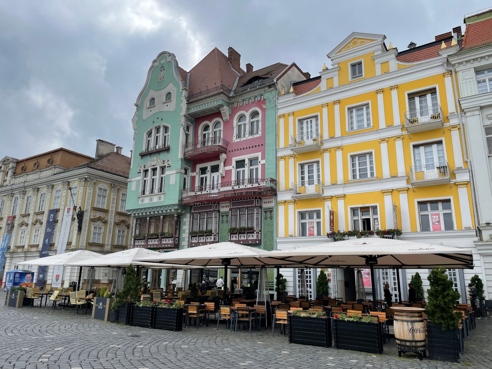

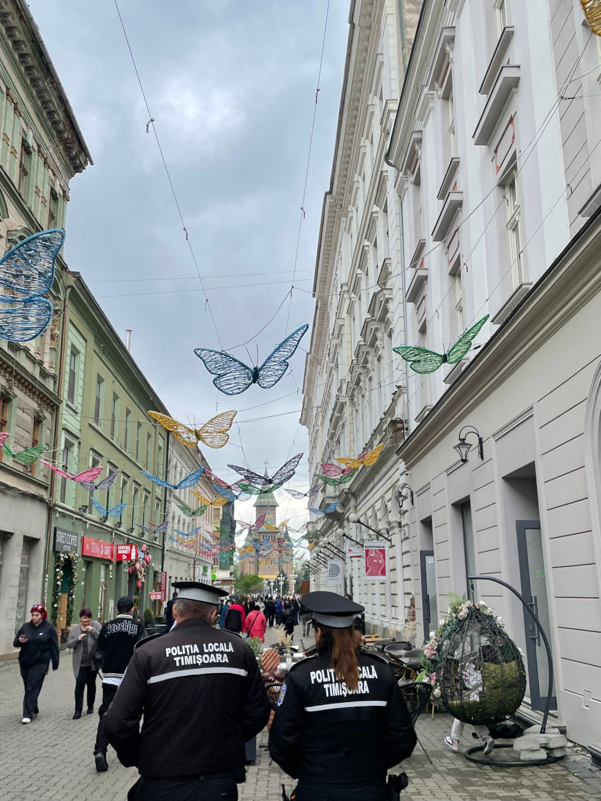

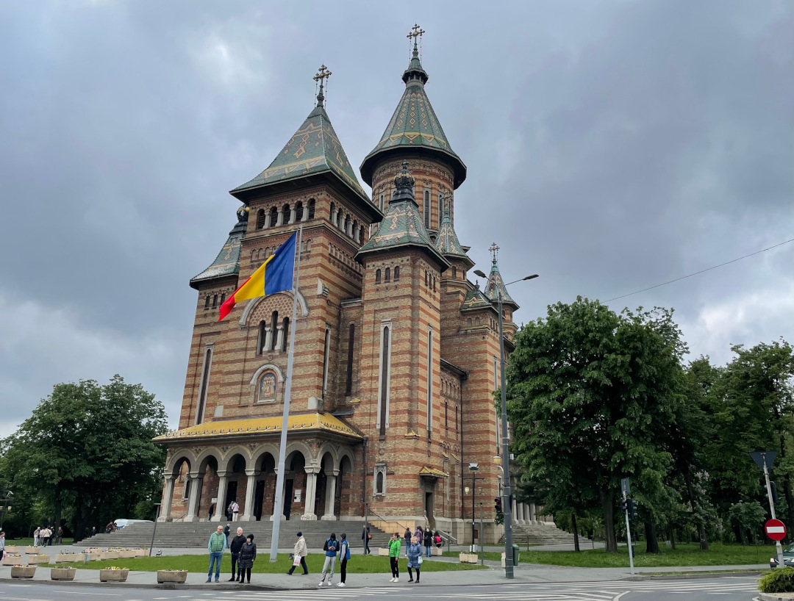

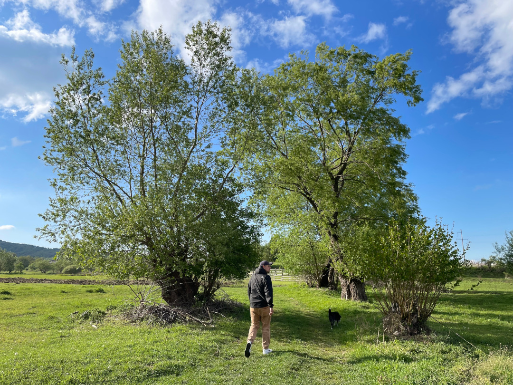

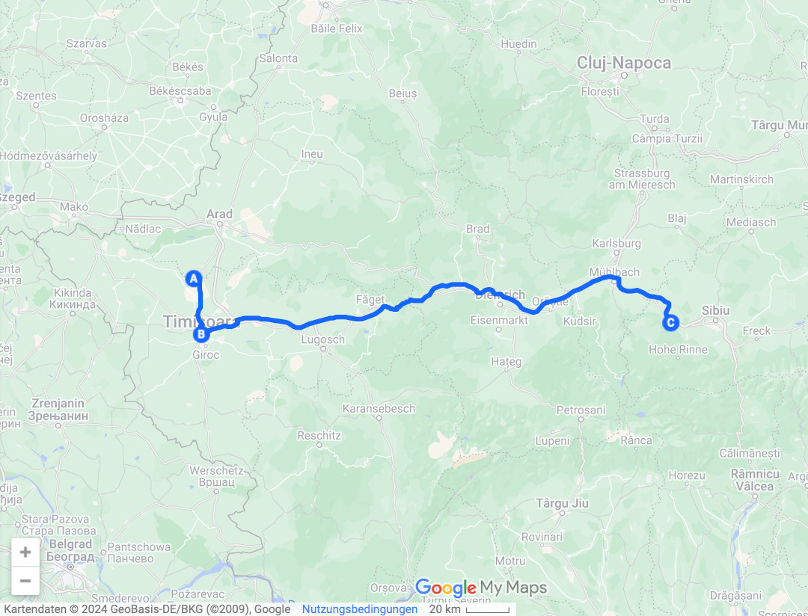

🗓️ 23. April: Wir haben sehr gut geschlafen und wollen voller Tatendrang unseren Spaziergang am Fluss nochmal wiederholen. Sehr weit kommen wir dabei aber nicht. Weil wir abgelenkt im Gespräch sind, bemerken wir etwas zu spät die große Schafherde, die auf einer angrenzenden Wiese unterwegs ist. Zwar sind wir immer noch bestimmt 500 Meter von der Herde weg, aber den Hütehunden ist das eindeutig schon viel zu nah und mit entsprechendem Tempo kommt die ungefähr 8 Hund große Mannschaft auf uns zu. Obwohl wir direkt umdrehen, als wir sie bemerken, bilden sie einen Halbkreis um uns, bellen laut und kommen immer wieder ziemlich nah. Natürlich stören sie sich wie immer vor allem an Henry, aber wir stellen uns schützend dazwischen und Tobi hat schon einen Stock in der Hand. Als sie merken, dass wir uns zumindest äußerlich ruhig immer weiter von der Herde entfernen, bleiben sie schließlich stehen. Wir beide haben jetzt auf jeden Fall erhöhten Puls und Henry glaube ich auch. Von den aggressiv erzogenen Herdenschutzhunden in Rumänien, die auch einen schweren Job haben mit dem Verteidigen der Herde vor Bären und Wölfen, hatten wir vorher schon gelesen. Für ein Foto war im Schreck keine Zeit, aber bei Bedarf einfach Ciobănesc Românesc Carpatin googeln und sich das ganze mal 8 und wütend vorstellen. Jetzt haben wir also aus Versehen gleich zu Beginn unsere eigene Erfahrung mit ihnen gemacht, aus der wir viel lernen können. Vor allem immer aufmerksam spazieren zu gehen und auf Tiere schon in der Ferne zu achten. Als wir weiter zurückgehen wollen, dann schon der nächste Schreck am Morgen. Ein freier Hengst steht mitten auf dem einzigen Weg zurück und mustert uns auch schon. Der ist noch viel muskulöser als die Hunde und mit dem wollen wir uns auch nicht anlegen. Wir drehen also wieder um und warten erstmal ab. Nach einer Weile verliert er zum Glück das Interesse und geht ein Stück weiter. Die Chance nutzen wir sofort und bringen uns beim Campingplatz erstmal wieder in Sicherheit. Nachdem wir uns alle wieder beruhigt haben, fahren wir dann los nach Sibiu. Die Stadt ist sogar noch schöner als gestern und ist auf jeden Fall ein Tipp für einen Städtetrip. Definitiv weniger überfüllt als andere Kurztrip-Hotspots und Direktflüge von Dortmund gibt es auch noch. Wegen der deutschen Minderheit der Siebenbürger Sachsen kommt man mit deutsch auch oft weiter. Die beste Aussicht auf die Stadt (noch besser als vom bekannten Rathausturm) mit ihren schön verzierten alten Häusern ist für uns die vom Turm der Stadtpfarrkirche mit ihren musterbildenden Dachpfannen. Durch die Pasajul Scărilor geht es von hier aus auch in die Unterstadt und zur Lügenbrücke, die der Sage nach einstürzt, wenn man auf ihr eine Lüge erzählt. Zur Stärkung besorgen wir uns wieder sehr gute Covrigi, diesmal bei Scufița Roșie. Überall stehen schöne Häuser und das Bröckeln an der ein oder anderen Stelle verleiht ihnen nur noch mehr Charme. Manche haben Dachfenster, die wie zu Schlitzen geformte Augen aussehen, und werden deshalb auch zwinkernde Häuser genannt. Danach laufen wir zurück zu dem Shoppingcenter, in dem wir mit perfekter Höhe von 2,10m kostenlos den Bulli parken konnten. Wir fahren noch eine Dreiviertelstunde bis zu einem holländisch geführten Campingplatz, der am Beginn der berühmten Transfăgărășan Hochstraße liegt und so für uns der perfekte Ausgangspunkt für morgen ist. Die Besitzerin sagt uns auch noch, dass die Straße bis zu dem Punkt, ab dem sie eh immer zwischen November und Juni gesperrt ist, normalerweise geräumt wird. Etwas Sorge hatten wir noch, ob wir den Teil im April mit unserem Bulli fahren können. Wenn man sich die Webcams anguckt, sah man in den letzten Tagen nämlich 85cm Schnee und große Eiszapfen. Auf dem Campingplatz ist neben uns nur ein anderer Bulli und so stehen wir mit viel Platz im Grünen. Nur die wolligen Nachbarn sind etwas zu neugierig und können ihre Blicke gar nicht mehr von uns lösen. Abends machen wir noch einen Spaziergang durch das Dorf, das sich auch sehen lassen kann und in dem die Mănăstirea Cisterciană, die Ruine einer alten Klosterkirche, steht. Über die Hängebrücke La Pasarela geht es auch einmal über den Fluss. Die Brücke ist eine wackelige Angelegenheit, verbindet für Fußgänger die Orte Cârța und Nou Român und wurde schon mehrmals kreativ geflickt. Dann kommt die Kälte langsam wieder raus und auch ein paar Regentropfen, so dass wir uns im Bulli verkriechen.

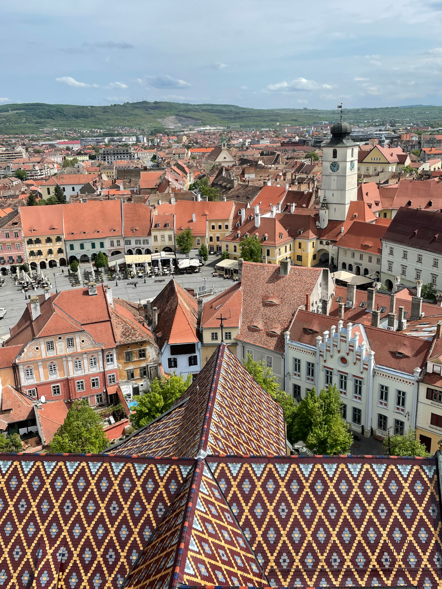

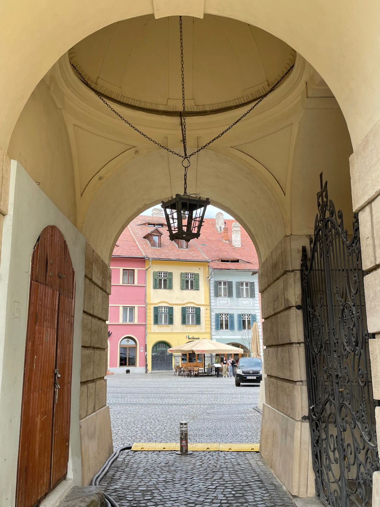

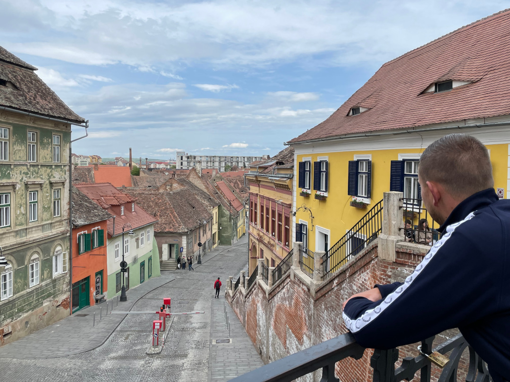

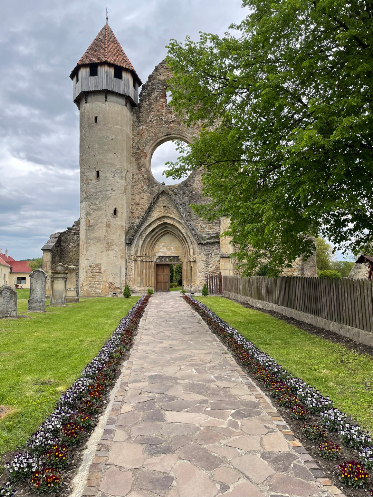

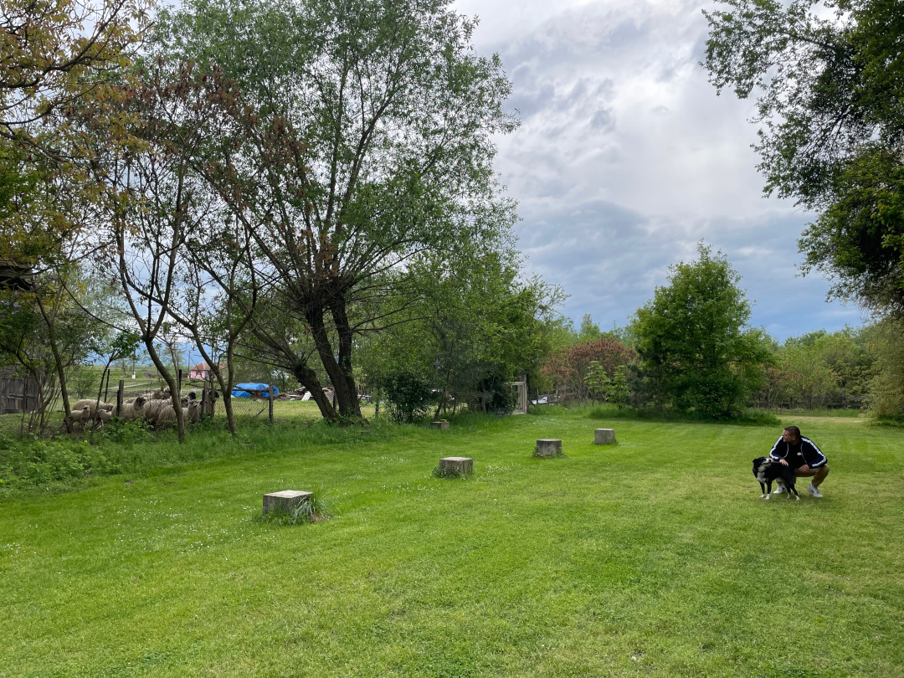

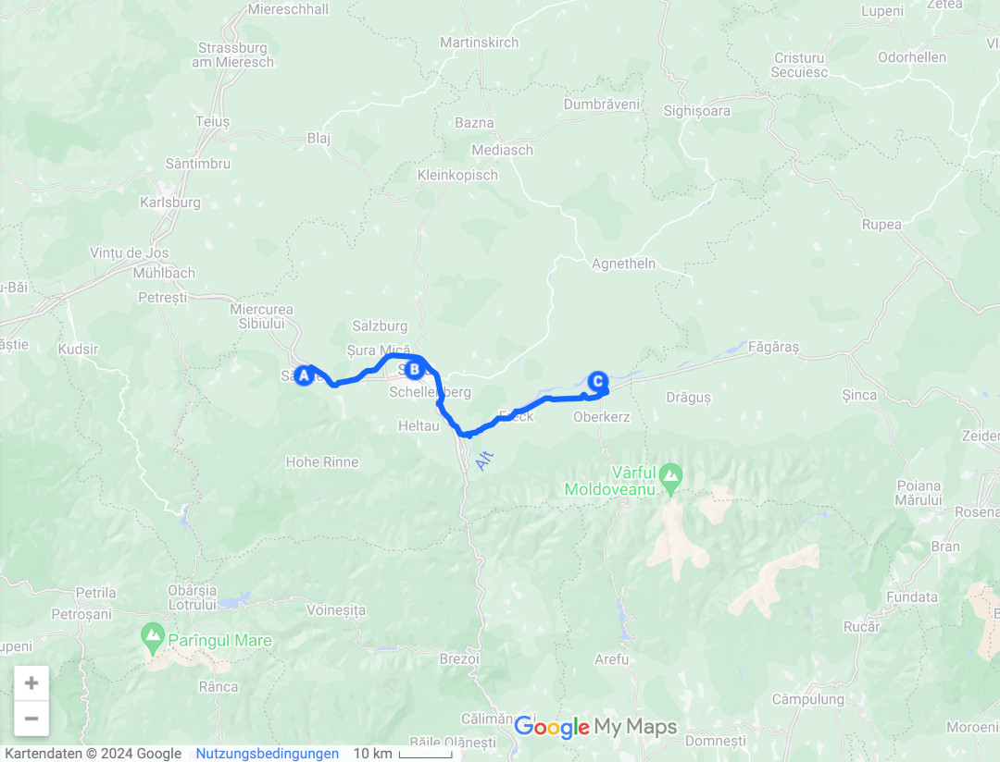