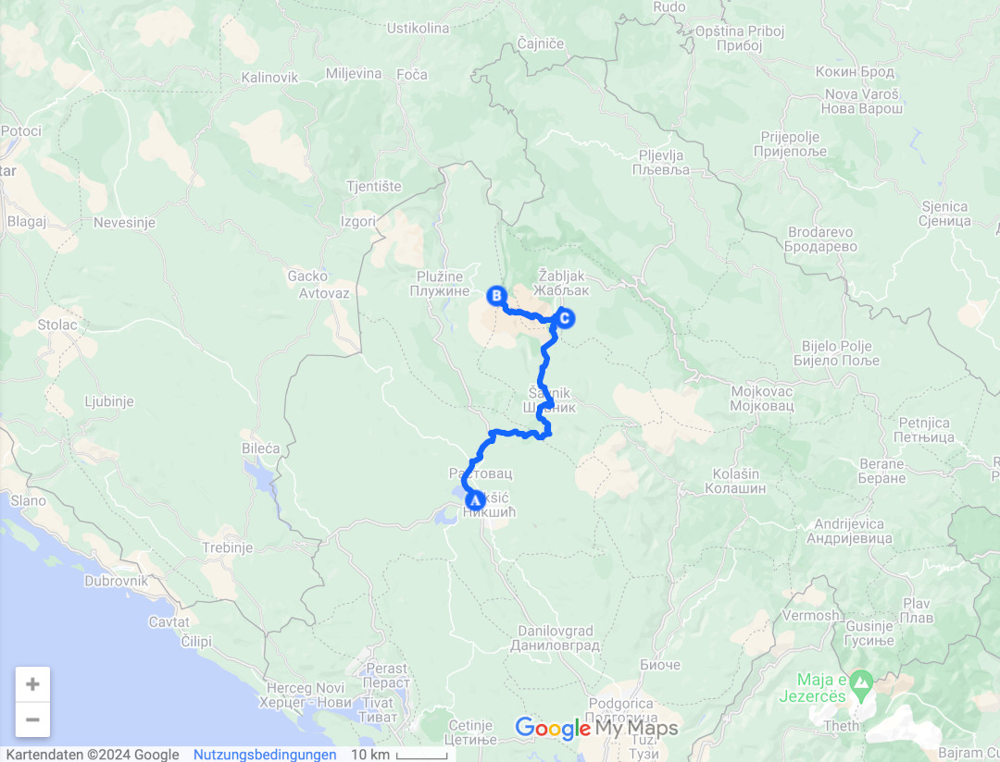

Der Weg nach Hause führt uns von Albanien für zwei Tage durch Montenegro.

<!--more-->

🗓️ 21. August: Wir werden früh wach, weil schon viele andere Bullis neben uns abreisen. Wir gehen noch eine letzte albanische Runde mit Henry durch die Felder und machen uns dann abfahrbereit. Zum Glück können wir den großen Campingplatz hinter uns lassen. Mit leuchtender Tanklampe geht es die letzten zwanzig Kilometer bis zur montenegrinischen Grenze. Es wäre unklug noch in Albanien zu tanken, deshalb gehen wir das Risiko ein. An der Grenze dauert es schon sehr lange und wir bereuen es mal wieder nicht getankt zu haben. Endlich werden wir durchgewunken und können laut Anzeige noch 30 Kilometer fahren, müssen aber noch bis zu ersten Tankstelle hinter der Grenze fahren, die erst nach 15 Kilometern kommt. Wir schaffen es aber glücklicherweise und werden vom Tankwart schon freudig begrüßt. Er hat unser Nummernschild erkannt, weil sein Bruder und seine Schwester in der Dortmunder Nordstadt wohnen. Der Tankwart kann sogar etwas Deutsch und gibt uns noch eine Pizzeriaempfehlung in der Nordstadt. Im Nachgang möchte er uns noch auf Getränke einladen. Darauf verzichten wir aber und bezahlen selber. Der Tankstopp hat sich also doppelt gelohnt. Der Liter ist 40 Cent günstiger als in Albanien und der Tankwart ist ebenfalls sehr nett. Danach geht es weiter nach Nikšić, in die zweitgrößte Stadt Montenegros. Kurz hinter der Stadt gibt es einen kleinen Biohof, wo wir campen können. Der Besitzer ist sehr nett und wir können quasi alles an Gemüse und Obst mitnehmen, was wir aber etwas vergessen. Vom Hof laufen wir noch ein paar Kilometer bis zu einem See. Wir nehmen Henry mit und werden von vielen Wachhunden kritisch angebellt. Wahrscheinlich ist es aber eine der letzten unentspannten Henryrunden. Wir springen noch in den See und laufen zurück zum Hof. Mit einem Taxi fahren wir in die Innenstadt. Nikšic hat circa 50.000 Einwohner und ist eine klassische Osteuropa-Stadt. Wir laufen einmal durch die Stadt und über den großen Platz mit den Statuen. Danach suchen wir uns etwas zu essen. Auch hier ist es wieder mehr als bezahlbar. Der Liter Bier kommt standesgemäß im Eulenkrug. Danach geht’s zum Stadion, wo wir den Länderpunkt Montenegro machen wollen. Nikšic spielt heute gegen Trivat. Außer in der Hauptstadt Podgorica ist wohl nirgendwo in Montenegro so viel los wie hier beim Fußball. Der Eintritt ist frei, was aber zur Folge hat, dass es leider keine Eintrittskarte gibt. Was aber verkraftbar ist. Nicht verkraftbar ist aber, dass es im Stadion nichts zu trinken gibt. In der Halbzeit laufen dann alle Zuschauer raus und stürmen den Kiosk nebenan, der das Geschäft seines Lebens macht. Wieso der Verein das Geschäft nicht machen will, weiß wohl niemand. Und es sind immerhin knapp 1.000 Leute vor Ort, wovon sogar 60-70 Leute in der Kurve durchgehend oberkörperfrei Stimmung machen. Und dass obwohl Nikšić als Favorit 1:2 verliert. Respekt also an jeden jungen Fußballfan, der hier den lokalen Verein unterstützt und kein Fan von Manchester, Bayern oder Madrid wird. Nach dem Spiel suchen wir wie so oft ein Taxi, sind aber Profis genug, um fix eins zu finden. Pünktlich um halb elf sind wir wieder am Bulli und beenden den Tag.

🗓️ 22. August: Wir wachen auf und entscheiden noch einen Tag in Montenegro zu bleiben. Nicht hier auf dem Hof, aber quasi in der Nähe. Als wir vor drei Jahren hier waren hat es uns schon gut gefallen und im Gegensatz zu Albanien ist es hier auch viel ruhiger und gesitteter. Wir wollen noch ein zweites Mal in den Dumitor Nationalpark. Wir suchen uns eine Wanderung raus, besorgen uns auf dem Weg dorthin Frühstück und fahren noch eine Stunde bis zum Wanderstartpunkt. Unsere Runde geht einmal über das Hochplateau im Dumitor Gebirge vorbei an zwei Bergseen, die aber leider kaum noch Wasser führen. Dennoch lohnt sich die Wanderung auf jeden Fall. Der einmalige Blick auf die Berge und auf die Weite mit diesem speziellen Grünton hat man fast nur hier. Nach circa zehn Kilometern sind wir wieder am Bulli. Wir wollen noch ein Stück die Straße durch den Nationalpark fahren. Das haben wir damals auch gemacht und sind bis über die bosnische Grenze gefahren. So weit fahren wir heute nicht, aber wir halten wieder an den besten Fotostopps. Unter anderem auch an dem Holzrahmen, wo wir vor drei Jahren das Foto gemacht haben. Es ist zwar deutlich voller als damals, aber da gucken wir drüber hinweg. Danach geht es in den Ort Zabljak, um einzukaufen. Für heute Nacht haben wir einen Stellplatz auf einer Teeplantage rausgesucht, die auch Camping anbietet. Zur Begrüßung gibt es natürlich einen Tee, für den die Familie schon einen Award gewonnen hat. Für mich schmeckt er aber wie normaler Pfefferminztee. Wir entspannen noch etwas und kochen. Auch beim zweiten Mal kann Montenegro überzeugen.

