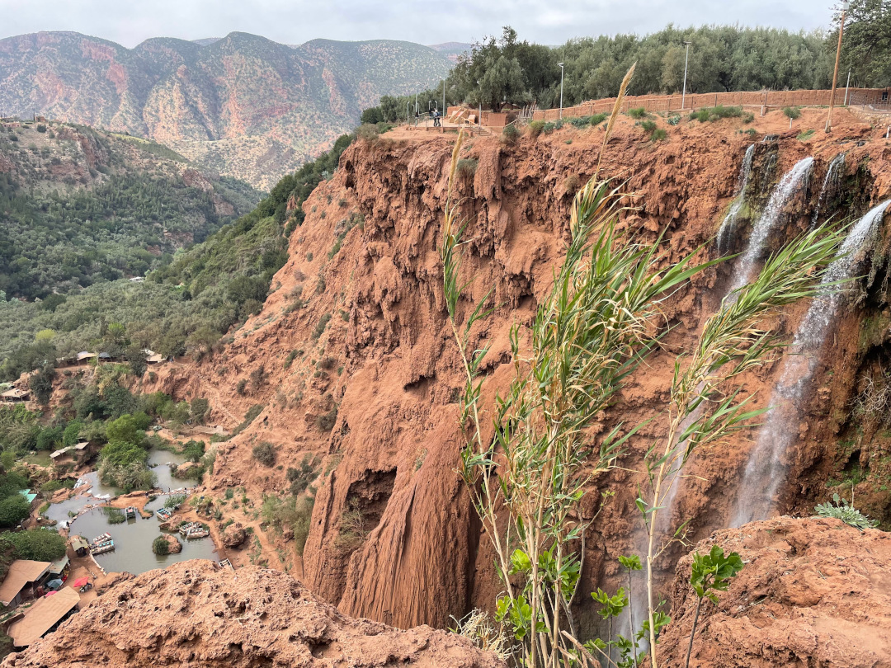
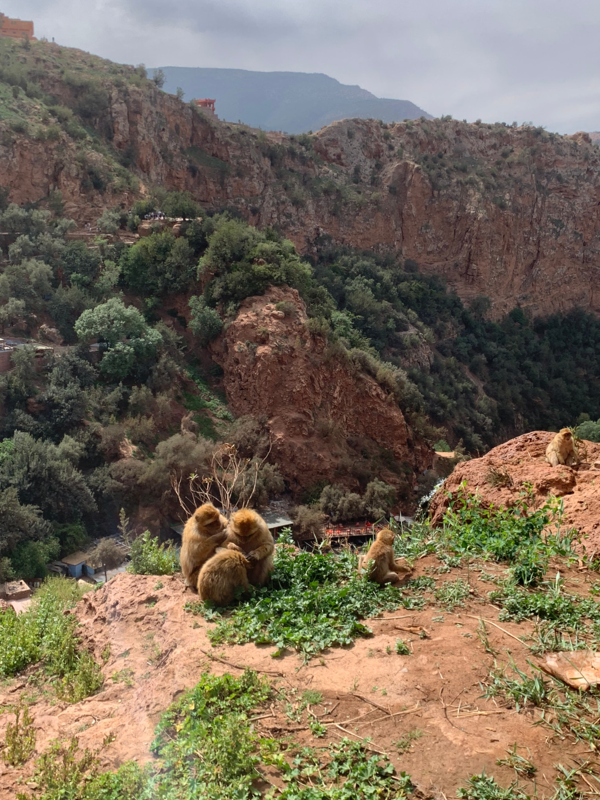
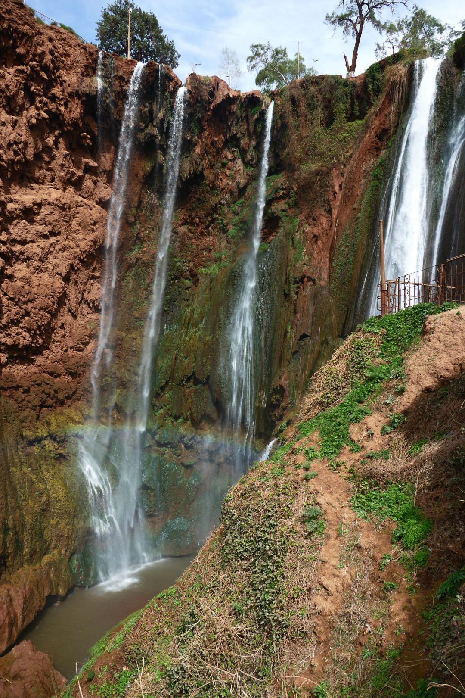
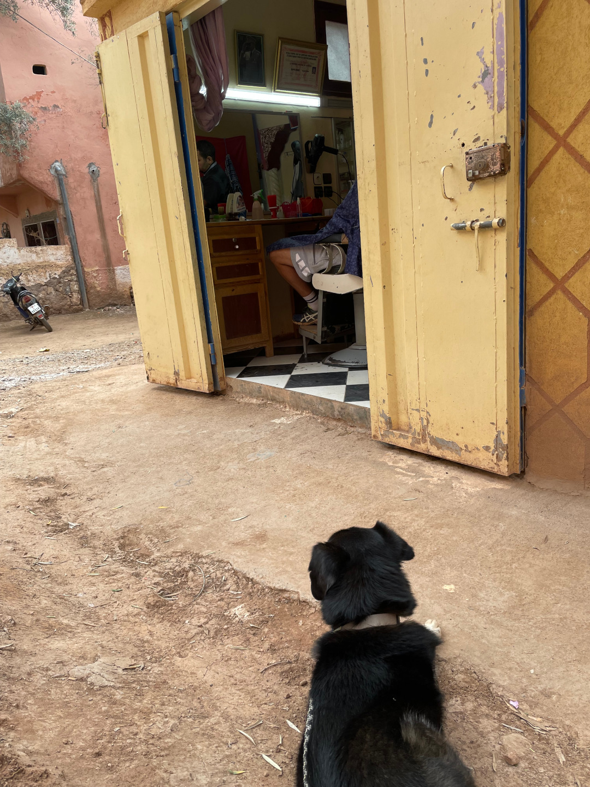
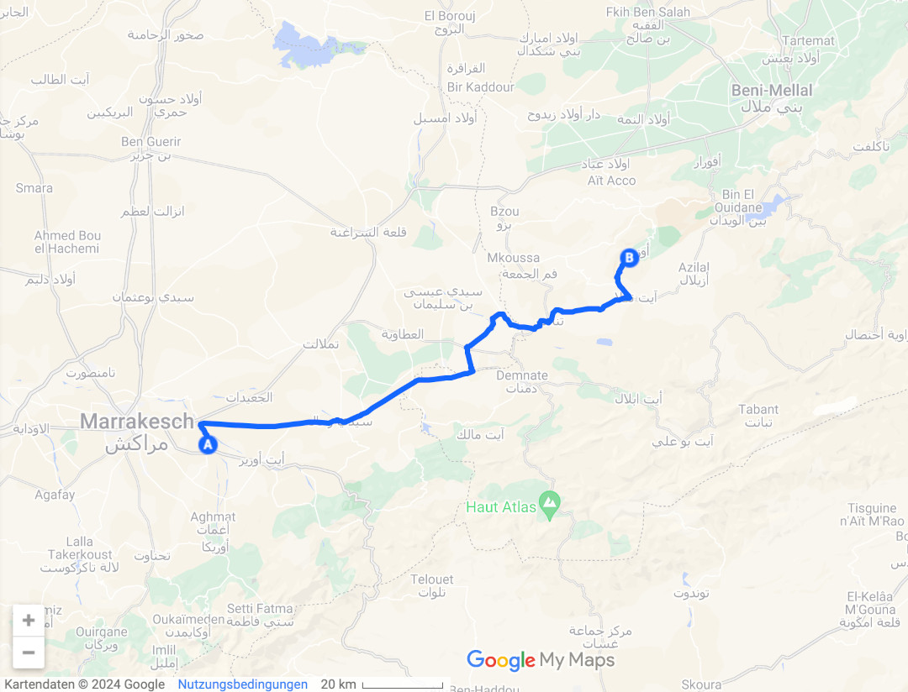
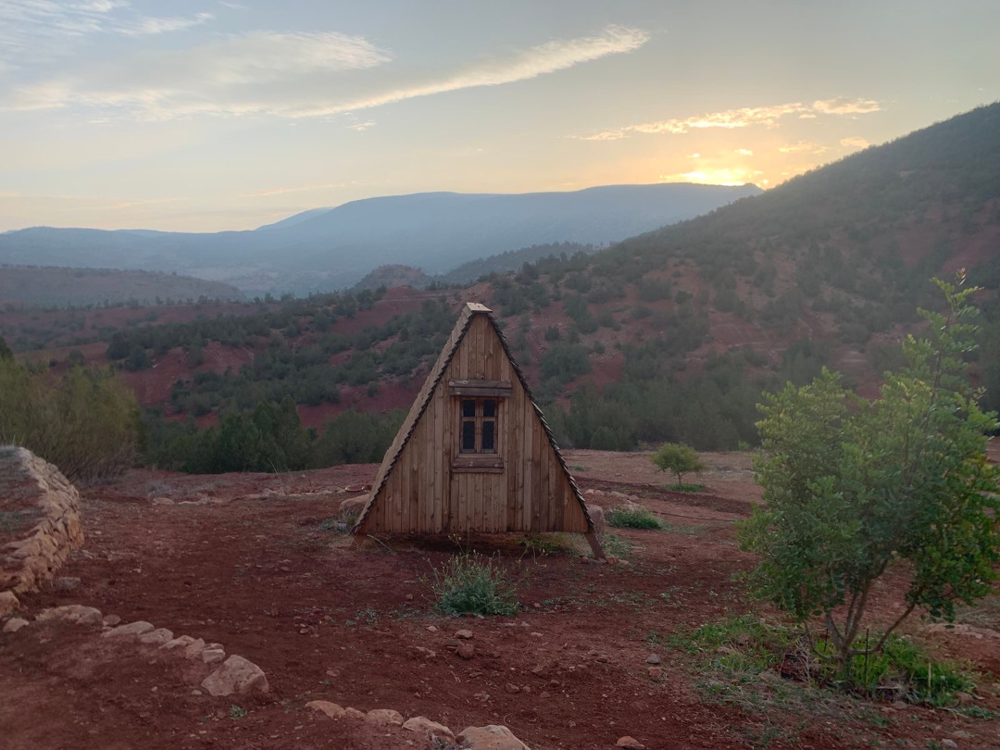
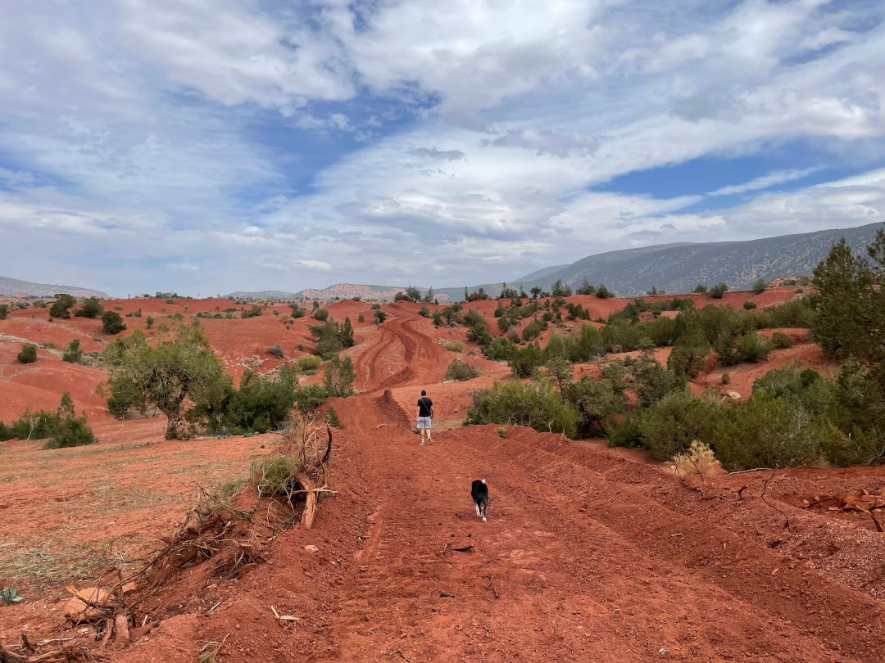
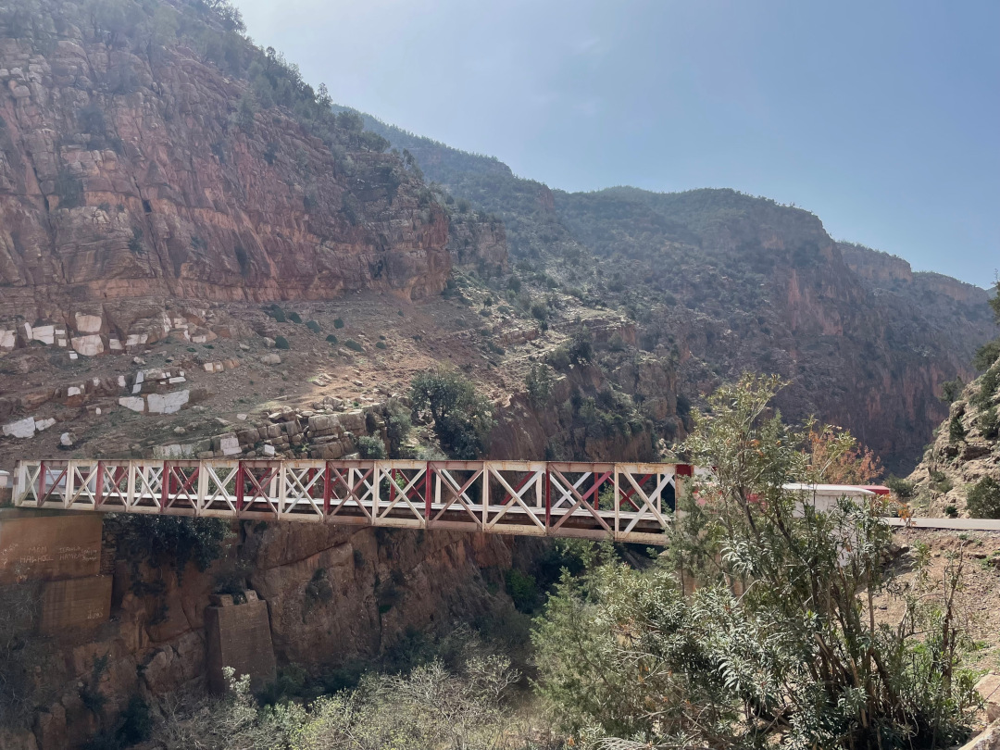
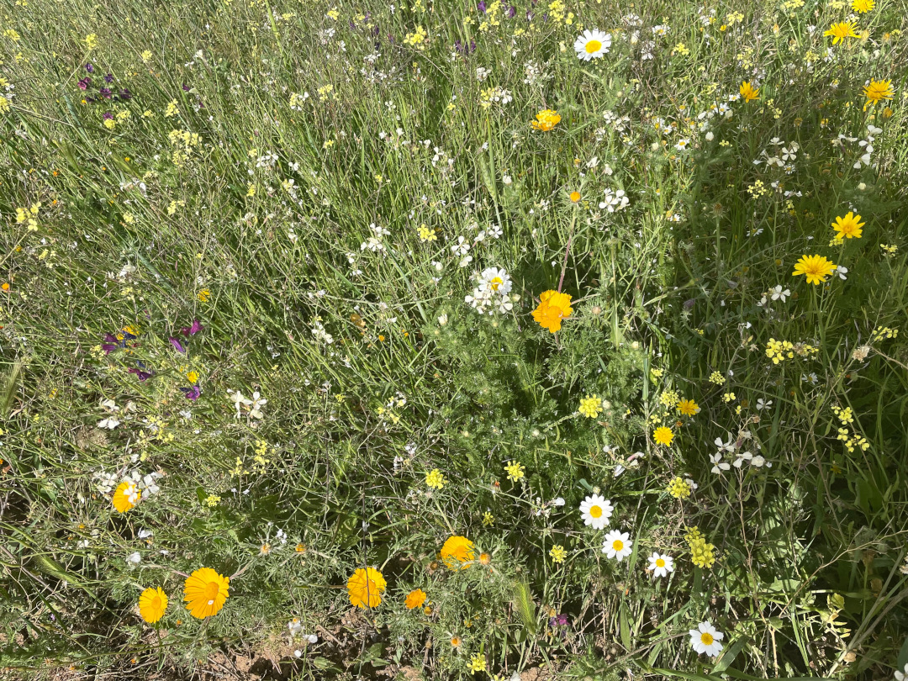
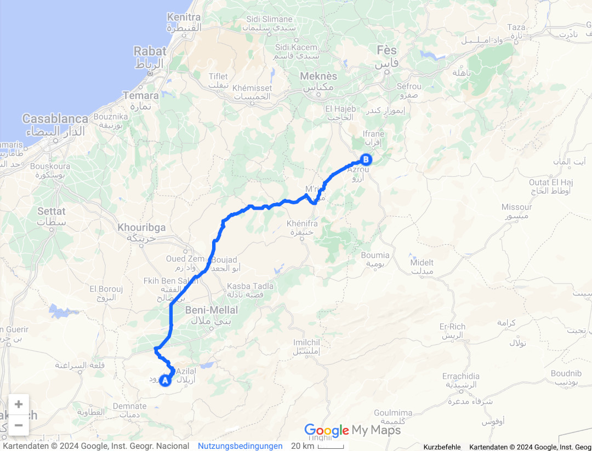

Wir lassen die große Stadt wieder hinter uns und verbringen etwas Zeit in der Natur.

<!--more-->

🗓️ 22. März: Unser zweiter Morgen bei Marrakech ist mehr nach unserem Geschmack, weil wir direkt auf dem Hof schon durch die Obstbäume spazieren können und es sehr ruhig ist. Zum Bezahlen müssen wir die Besitzerin erstmal ganz schön lange suchen, so weitläufig ist es hier. Dann öffnet sie uns das Tor, an dem uns gestern Abend Nachbarskinder die Klingel gezeigt haben, die so hoch hing, dass sie gar nicht dran kamen, und wir fahren über die kleinen Pisten und durch ein paar kleine Dörfer wieder zur nächsten großen Straße. Unterwegs möchten wir wie immer noch ein Brot kaufen, aber das gestaltet sich heute schwierig. An mehreren kleinen Ständen halten wir, Tobi führt Gespräche, aber am Ende gibt es kein Brot. Selbst auf einem größeren Markt scheinen die Brotverkäufer heute zuhause geblieben zu sein. Vielleicht aufgrund von Ramadan, aber wir wissen ja nicht, wie es hier ohne gewesen wäre. Nach etwas mehr als zwei Stunden Fahrt kommen wir dann schon gegen Mittag am nächsten Standplatz an, der in den Hügeln nahe des Örtchens Ouzoud liegt. Wir haben den Platz extra so ausgewählt, dass wir von hier aus eine Wanderung zu den bekanntesten Wasserfällen Marokkos machen können. Nachdem die deutsche Besitzerin uns eingewiesen hat und wir direkt bezahlt haben, damit wir morgen früh nicht wieder auf Suchtour gehen müssen, machen wir uns auch direkt auf den Weg. Der Weg durch die rote Landschaft ist richtig schön und führt uns größtenteils zwischen alten Olivenbäumen am Fluss entlang. Dann stehen wir irgendwann oberhalb der Wasserfälle und haben einen schönen Blick in die Tiefe. Einziges Manko: Wir entdecken eine Affenfamilie und nach unseren Erfahrungen mit Henry und Affen in Gibraltar löst das keine Jubelstürme bei uns aus. Auf noch einen Kampf können wir gut verzichten. Deshalb macht sich Tobi allein auf den weiteren Weg nach unten und überwindet so einige Höhenmeter. Wieder oben angekommen essen wir noch ein Eis und treten dann den Rückweg an. Auf dem Hinweg hatten wir schon eine Mini-Bäckerei mit sehr gut aussehenden süßen Teilchen entdeckt und einen Friseursalon, so dass wir die beiden Stopps noch mitnehmen. Lustigerweise treffen wir hier ein Paar aus der Schweiz wieder. Die beiden waren bei unserer allerersten Übernachtung in Marokko unsere Nachbarn. Seitdem haben wir uns nicht mehr gesehen, aber sind jetzt alle langsam wieder auf dem Rückweg in den Norden. Auch die beiden haben heute einen Wandertag zu den Wasserfällen eingelegt. Auf der Hälfte unseres Weges beschließen wir auch noch einen Abstecher zur Quelle des Flusses zu machen. Auch hier ist es sehr grün und schön ruhig, bis auf ein paar nicht sehr gastfreundliche freilebende Hunde, aber mit denen kommen wir zurecht. Als wir zurück sind, haben wir schlappe Beine, kochen noch fix etwas und genießen dann nur noch die Ruhe auf dem
Hügel.

🗓️ 23. März: Als ich an meinem Geburtstag wach werde und den Vorhang zur Seite schiebe, schiebt die Sonne sich gerade so über die Hügel. Entspannter könnte der Morgen nicht starten und bei der Aussicht geht man automatisch alles etwas langsamer an. Als wir uns auf die erste Henry-Runde des Tages durch die rote Umgebung machen, sind wir mal wieder in Begleitung. Eigentlich gab es ein Schild, dass man den Hofhund nicht mitnehmen soll, aber bevor wir durch das kleine Tor treten und es vor ihm verschließen können, quetscht er sich schon unter dem Zaun durch. Da können wir nun wirklich nichts für und so drehen wir die Runde eben mit ihm. Anschließend bringen wir den Bulli auf Vordermann und den ganzen roten Sand wieder raus und fahren los. Wir möchten heute einige Kilometer machen, damit wir näher an Fes schlafen. Dort wollen wir morgen nämlich unseren ersten Besuch vom Flughafen abholen. Unterwegs besorgen wir im Marjane Geburtstagskuchen und gute Snacks, um die Fahrt zu versüßen. Die Geburtstagsblumen gibt’s während einer Pause am Wegesrand, als wir mal wieder einen Spaziergang machen. Später nehmen wir dann das erste Mal auf unserer Reise einen Tramper mit. Erst fahren wir an ihm vorbei, weil wir im ersten Moment denken, nicht genug Platz zu haben, aber nach ein paar hundert Metern wenden wir, weil wir merken was für ein Quatsch das ist. Und darüber freut er sich sehr, denn obwohl das Trampen in Marokko eigentlich super klappt, ist heute sein schlechtester Tag, erzählt er uns, als er zwischen uns vorne auf der Dreiersitzbank sitzt. Er kommt aus Frankreich, ist ungefähr in unserem Alter und hat viel zur erzählen, so dass sich unsere Fahrt gefühlt verkürzt. Eigentlich fragt mich unterwegs nie jemand wie alt ich bin, aber ausgerechnet heute schon, so dass ich ihm das erste Mal mit 30 antworten muss. An unserem Campingplatz steigt er aus und versucht noch etwas weiterzukommen. Eigentlich wollte er heute nämlich schon in Fes ankommen. Wir verabreden, dass wir ihn sonst morgen weiter mitnehmen können, wenn er nicht weiterkommt, und verabschieden uns dann von ihm. Zum Glück gibt es heute passenderweise ganz gutes WLAN, so dass wir den Rest des Abends mit Anrufen in der Heimat verbringen können.

