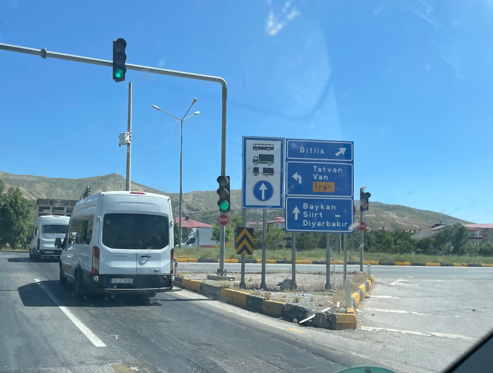
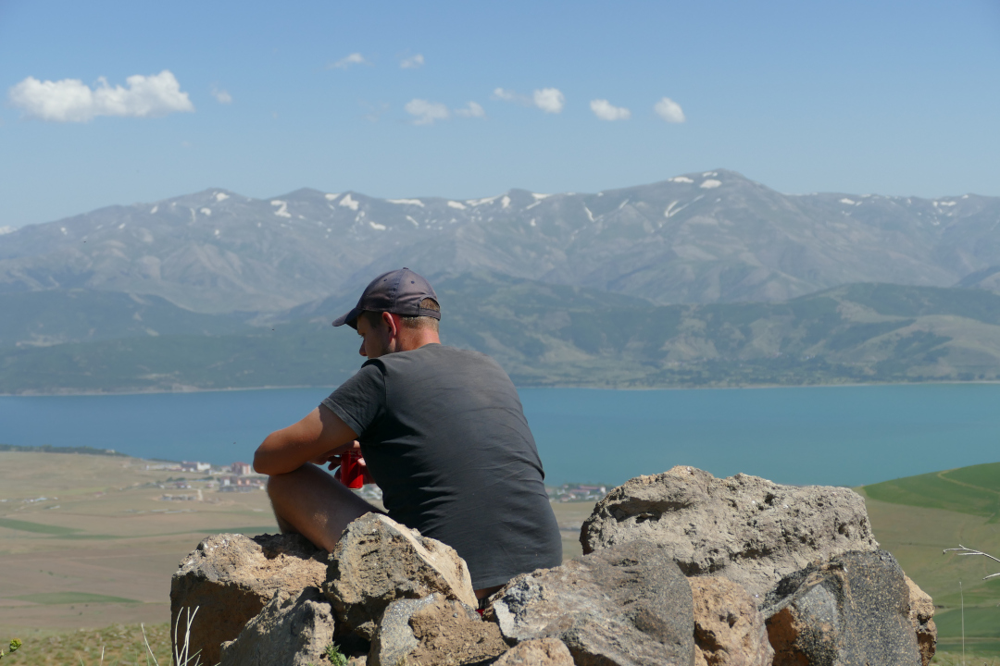
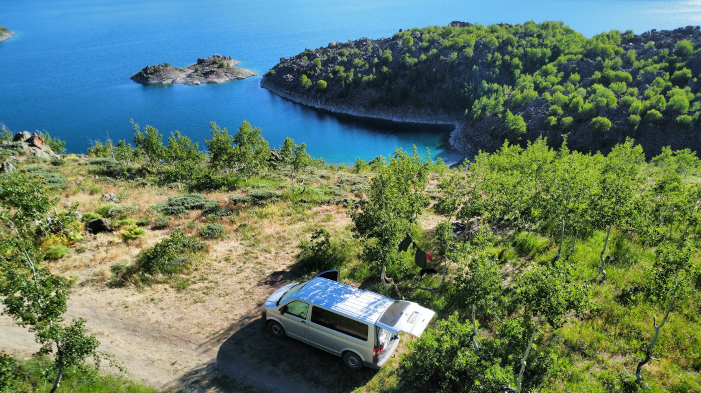
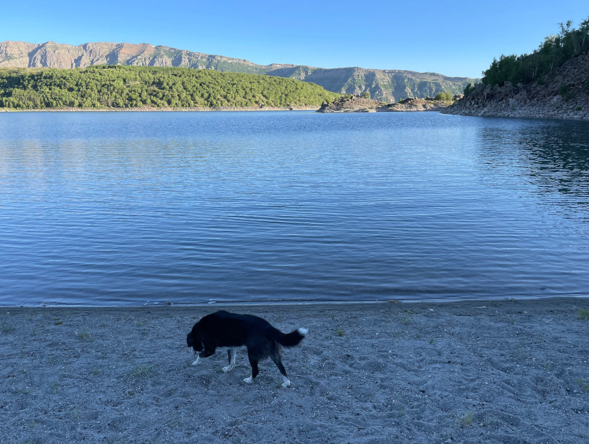
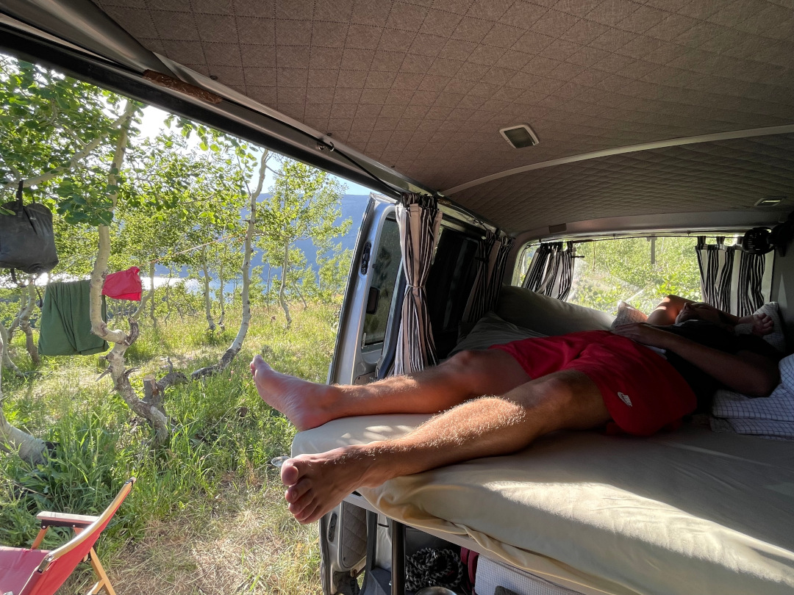
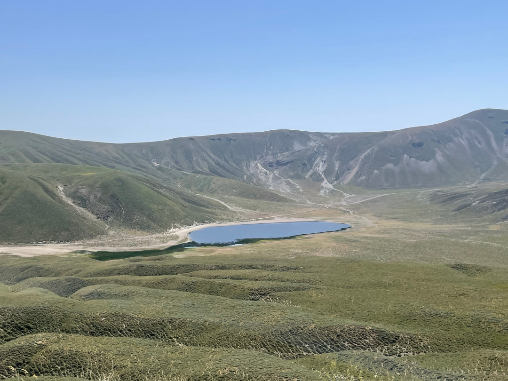
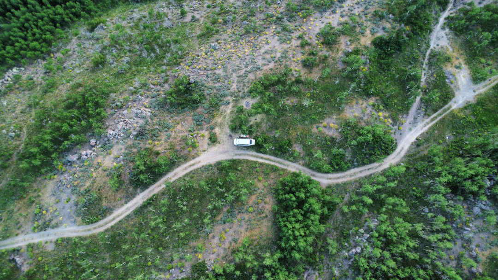
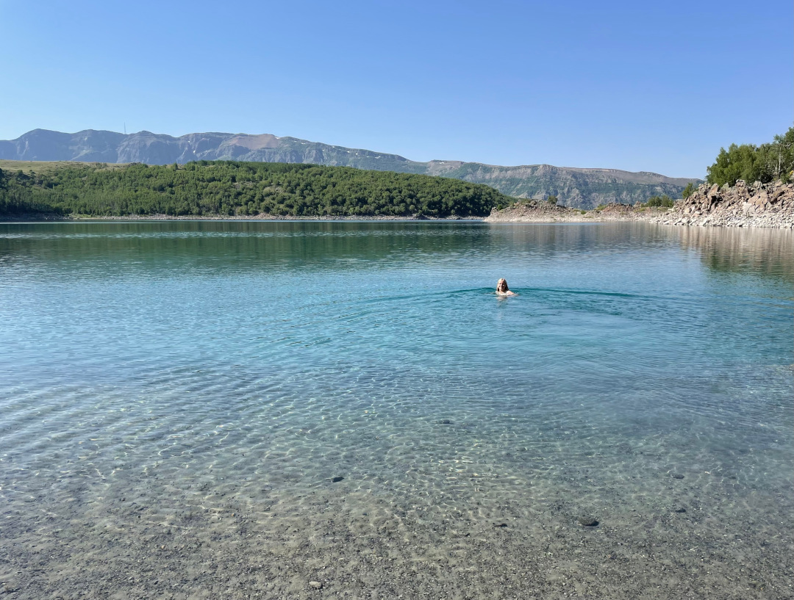

Wir bleiben dem Nemrut Dagi treu, zumindest vom Namen her. Vom Götterberg fahren wir zum gleichnamigen Vulkankrater.

<!--more-->

🗓️ 22. Juni: Gestern Abend haben wir es nicht mehr geschafft im Fluss Murat zu schwimmen, wollen das heute Morgen aber auf jeden Fall nachholen. Das macht auch mehr Sinn als gestern Abend, weil die Staumauer so früh noch nicht geöffnet ist und die Strömung im Fluss ruhig ist. Weil es so kalt ist, hält sich das Schwimmen aber in Grenzen. Als wir startklar sind zur Weiterfahrt ist Murats Pegel auch deutlich höher, jetzt wäre schwimmen nicht mehr so gut möglich. Wir fahren zum Nemrut Dagi Vulkankrater in der Nähe des Vansees, dem größten See in der Türkei. Auf dem Weg finden wir wie gestern zum Glück auch wieder eine Shopping Mall. Das ist immer der beste Ort für eine Mittagspause. Es gibt meistens einen großen Supermarkt, Toiletten, warmes Essen und eine Tiefgarage für den Bulli. Also eine gute Möglichkeit die Wasservorräte aufzufüllen und als Mittagessen Dürüm zu besorgen. Danach geht es noch zwei Stunden immer die D300 entlang in Richtung Osten. Wir bewegen uns immer mehr im Grenzgebiet Türkei, Irak und Iran. Ein komisches Gefühl, die Länder auf den Straßenschildern zu entdecken. Ab jetzt nehmen die Polizeikontrollen auch immer mehr zu, was zum einen am Grenzgebiet liegt, zum anderen aber auch an daran, dass wir uns jetzt im kurdischen Teil der Türkei befinden. Innerhalb der zwei Stunden Fahrt, werden wir drei Mal von der Polizei kontrolliert. Jedes Mal wollen sie andere Dokumente sehen. Am Anfang nur den Führerschein, dann nur die Pässe, dann nur den Fahrzeugschein. Leider sprechen die Polizisten nur selten Englisch. Die Verständigung funktioniert aber trotzdem. Ein Polizist glaubt mir nicht, dass ich aus Deutschland komme, weil ich sehr türkisch aussehe, lässt uns aber trotzdem weiterfahren. Nur Hanna sieht laut ihm deutsch aus. Den Vulkankrater erreichen wir gegen halb drei. Eigentlich hatten wir den Krater nicht auf unserer Liste und erst durch den Götterberg haben wir gelesen, dass es den Krater gibt. Bei Park4Night gab es dann hier super Parkplätze, wo man direkt am Kratersee freistehen kann. Die Fahrt ist abenteuerlich, aber dank Allrad gut machbar. Wir finden einen guten Platz oberhalb einer Bucht am Kratersee. Der Kratersee liegt auf über 2.200 m Höhe, dadurch ist es zum Glück wieder etwas kälter. Der Vulkan an sich ist aktuell aber ruhend. Wir bereiten alles für die Nacht vor und gehen mit Henry runter zur Bucht. Es kommen uns noch ein paar einheimische junge Männer entgegen, die auch gerade schwimmen waren. Sie geben uns noch den Tipp aufzupassen, wenn wir über Nacht bleiben wollen, weil es hier viele Bären gibt. Hier wurde ein Bären-Reservat mit ungefähr 80 Braunbären errichtet. Das hatten wir auch schon gelesen. Vor allem nachts kommen die öfter mal zu den freistehenden Bullis und gucken nach Essensresten. Als die Gruppe der Einheimischen weitergefahren ist, sind wir wirklich komplett alleine. Wir machen uns etwas Musik an, damit die Bären uns hören und wandern zur Bucht. Wir haben den gesamten Platz für uns und gehen eine Runde schwimmen. Zurück am Bulli verlagern wir die Aktivität mit Dämmerung auch schnell in den Bulli. Hier ist es auch nicht mehr so warm, also können wir das auch entspannt machen. Wir gehen früh ins Bett und haben bisher keinen Bären getroffen.

🗓️ 23. Juni: Die Sonne weckt uns und wir sind ganz alleine am Kratersee. Es ist super ruhig und die Aussicht ist traumhaft. Die morgendliche Henryrunde führt uns wieder runter zur Bucht, um eine Runde zu schwimmen. Wir entscheiden noch eine Nacht hierzubleiben. Es gibt zwar weder Telefon- noch Internetempfang, aber das braucht man auch nicht. Es ist sehr ruhig und man kann ganz ungestört die Aussicht genießen. Unsere Vorräte reichen auch noch für einen weiteren Tag. Wir lassen den Tag entspannt starten, kochen Tee und essen Mittag. Wir lesen viel und sitzen in der Sonne. Auf einmal hören wir nur ein Hallo hinter dem Bulli. Mit Menschen hätten wir nicht gerechnet, erst recht nicht mit welchen, die Deutsch sprechen. Es ist ein Österreicher, der auch noch einen guten Platz am Kratersee sucht und findet ihn ca. 100 Meter von uns entfernt. Heute Nacht bleiben wir also nicht alleine. Er erzählt uns noch, dass er in drei Tagen sein Visum für den Iran erhält und von da aus über Turkmenistan nach Usbekistan reist. Es muss also nicht wie bei uns in Georgien und Armenien enden, wenn man nur mutig genug ist. Ansonsten genießen wir die Ruhe und entspannen im und um den Bulli. Tagsüber muss man sich sowieso weniger Sorgen um die Bären machen. Wir machen eine kleine Wanderung zu einem anderen kleineren Kratersee und gehen danach nochmal runter zur Bucht zum Schwimmen. Mittlerweile kamen noch zwei andere deutsche Wohnmobile, es ist hier aber so weitläufig, dass man sich nicht unbedingt sieht. Wir kommen kurz ins Gespräch und erfahren, dass das eine Paar schon seit zwei Jahren unterwegs ist und noch auf die arabische Halbinsel möchte. Man lernt wirklich sehr viele unterschiedliche Leute kennen. Danach kochen wir wieder relativ früh, um rechtzeitig vor der Dämmerung fertig zu sein. Wir können aus unseren Vorräten Nudeln mit Pesto, Thunfisch und Tomaten kredenzen. Pünktlich mit Sonnenuntergang sitzen wir dann im Bulli, aber auch heute lassen sich keine Bären blicken.

