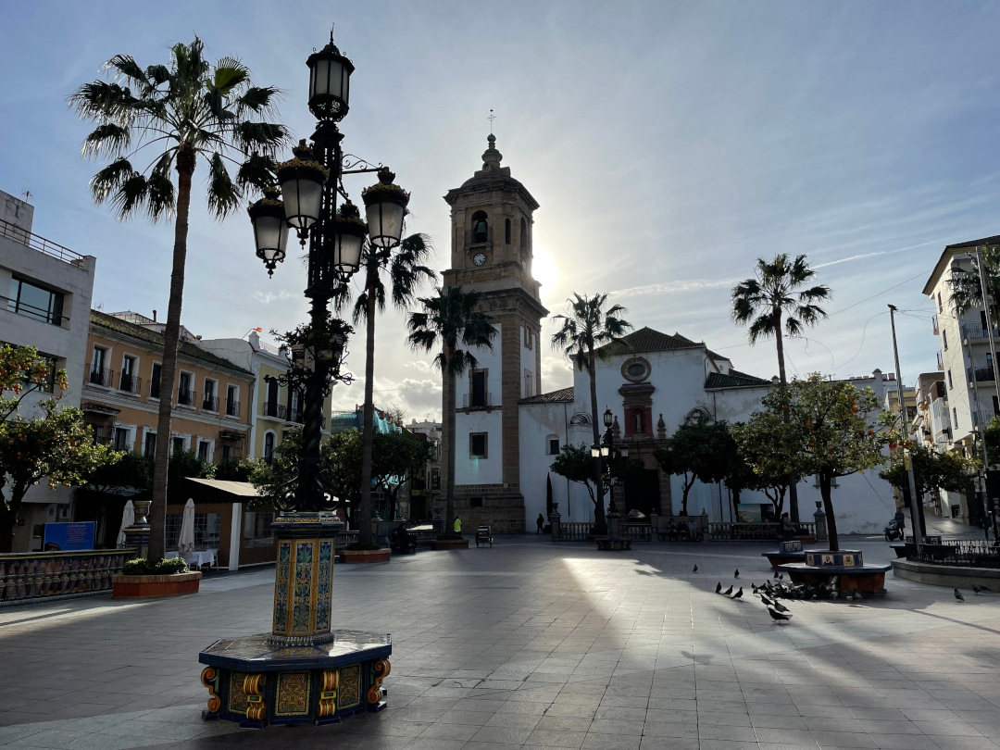
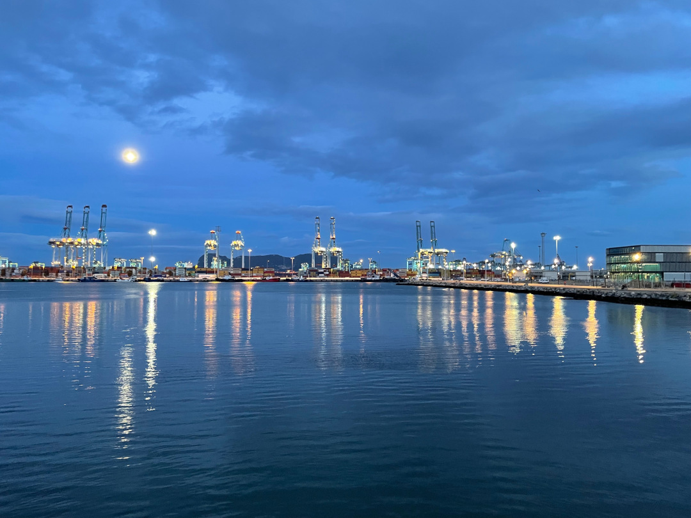
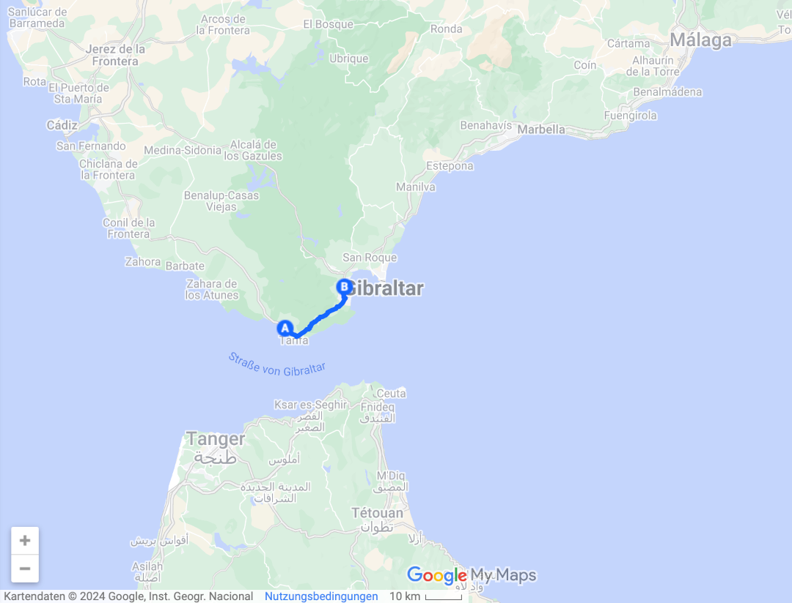
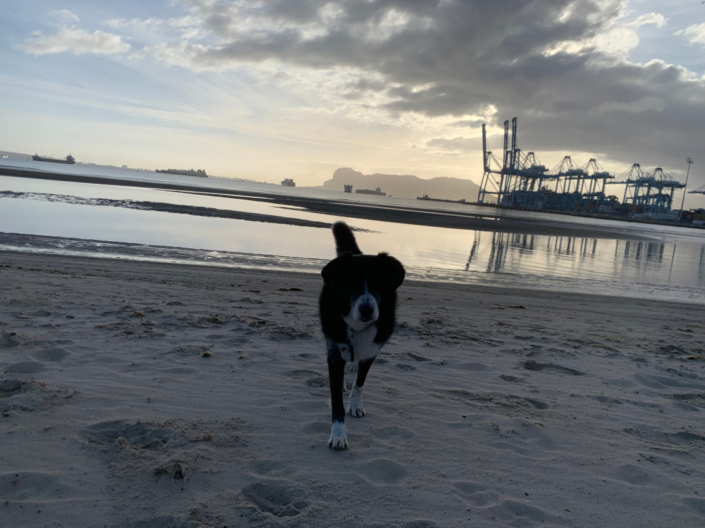
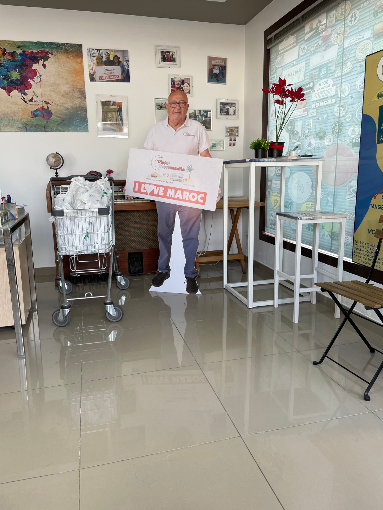
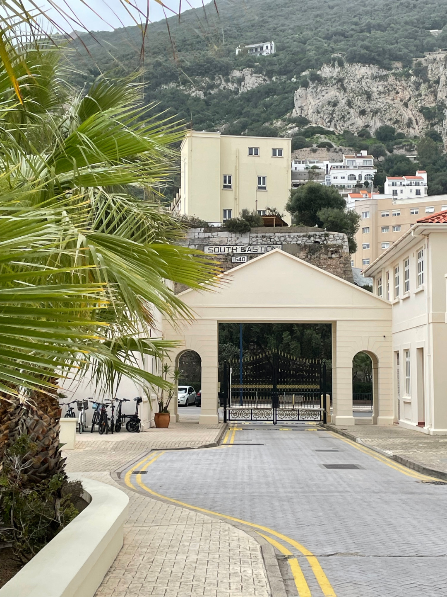
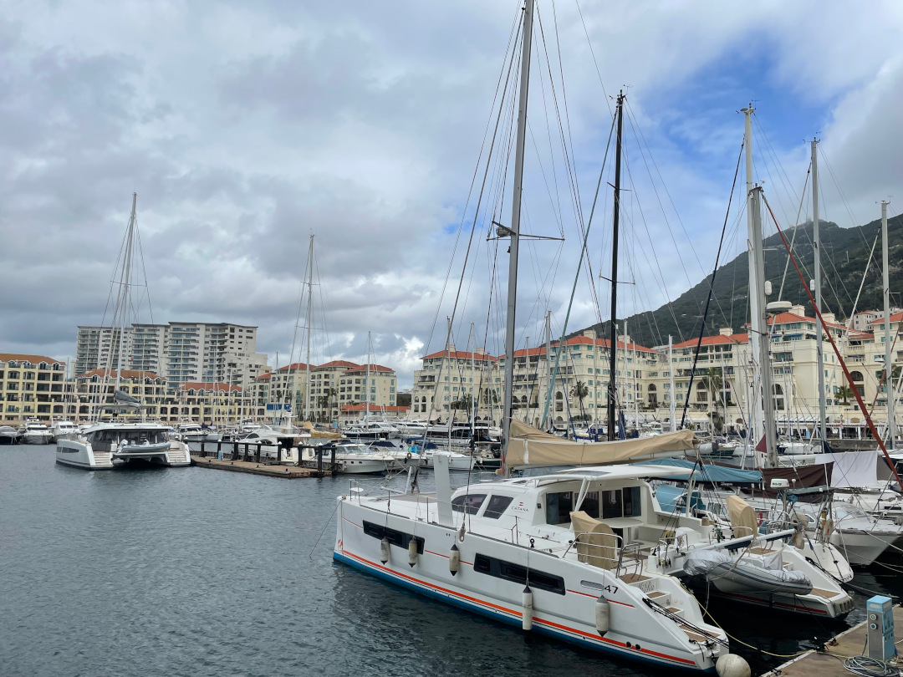
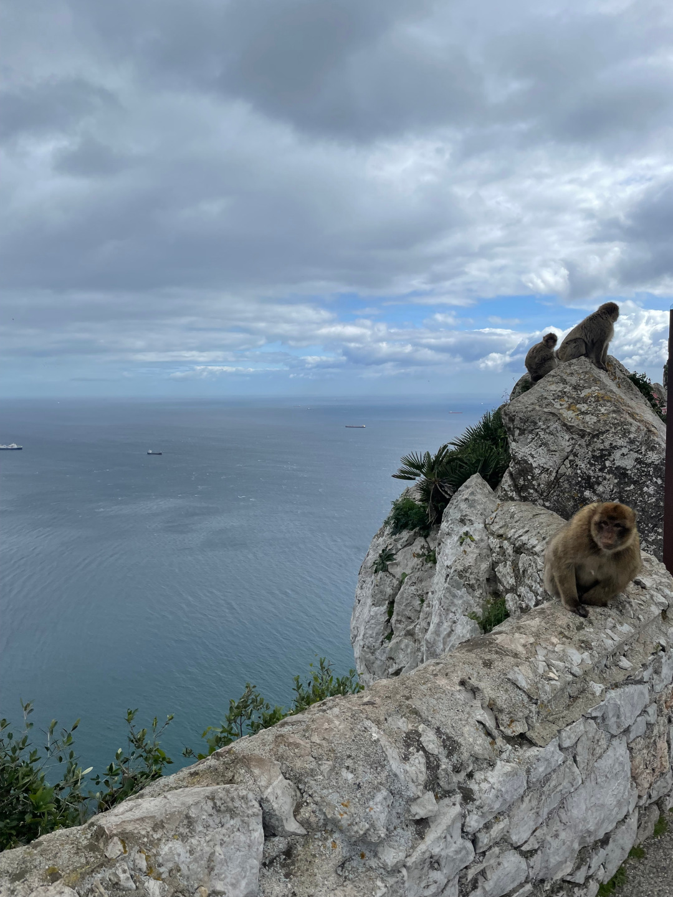

Die letzte Station in Spanien führt uns in die Hafenstadt Algeciras als perfekten Ausgangspunkt für einen Ausflug nach Gibraltar und später für die Überfahrt nach Marokko.

<!--more-->

🗓️ 23. Februar: In dieser Nacht stürmt und regnet es heftig. Morgens merkt man davon aber nichts mehr, obwohl wir relativ früh wach sind, weil eine große Gruppe von Franzosen neben uns sich bereits sehr früh auf den Weg gemacht hat. Wir machen uns ebenfalls abfahrbereit und fahren ein letztes Mal nach Tarifa. Dieses Wochenende ist ja in der ganzen Stadt Karneval und es soll schon heute (Freitag) um 11 Uhr losgehen. Angeblich wird in dieser Region hier um Cádiz der zweitgrößte Karnevalsumzug nach Rio de Janeiro gefeiert. Heute geht es aber wie in Faro erst mit den Schulkindern los. Wir gucken uns das Spektakel an, sind aber nicht ganz so begeistert wie in Portugal. Danach machen wir uns auf den Weg nach Algeciras. Weil es in der Nähe von Gibraltar keinen Campingplatz gibt, der dazu auch noch Hunde erlaubt, entscheiden wir uns direkt in Algeciras im Hotel zu schlafen. Von hier aus wollen wir uns Gibraltar angucken und die Fähre nach Marokko nehmen. Wir checken im Hotel ein und nutzen den restlichen Tag, um schon mal die letzten Einkäufe vor Marokko zu erledigen, wir kaufen insbesondere Bier und Haribo. Danach waschen wir endlich mal den Bulli von außen. Am späten Nachmittag schlendern wir noch etwas durch Algeciras, eine relativ große Hafenstadt gegenüber der Bucht von Gibraltar. Wir suchen uns etwas zu essen und stellen erneut fest, dass wir kein Freund der Siesta sind. Selbst um 19 Uhr hat noch fast jedes Restaurant geschlossen. Wir finden zum Glück doch noch eine geöffnete Pizzeria. Danach geht es zurück ins Hotel, wo wir das erste Mal seit vier Wochen wieder in einem richtigen Bett schlafen.

🗓️ 24. Februar: Die erste Nacht seit Ewigkeiten in einem Bett ist erstaunlich gut und wir gewöhnen uns schnell dran. Das Hotel liegt zum Glück so gut, dass man morgens mit Henry direkt durch einen Park zum Strand spazieren kann. Wir genießen den Sonnenaufgang mit Blick auf den Hafen und Gibraltar. Heute wollen wir noch ein paar Organisatorische Dinge klären. Zuallererst benötigen wir Fährtickets für Montag nach Marokko. Die Fährverbindung von Algericas nach Tangier Med. ist wohl die günstigste, daher fällt die Wahl schnell darauf. Eine Alternative wäre die Fahrt von Algeciras zur spanischen Exklave Ceuta. Dort ist der Grenzübergang wohl aber katastrophal und dauert gerne mal einen ganzen Tag. Die besten Deals bei den Fährtickets hat anscheinend Carlos. So liest man es bei jedem Camper, der nach Marokko fährt. Deshalb fahren wir ins Gewerbegebiet etwas außerhalb von Algeciras und kaufen dort unsere Fährtickets. Carlos wirbt natürlich als lebensgroßer Pappaufsteller noch selber für die Fährtickets. Der Preis ist nicht viel günstiger als bei den Fährbetreibern direkt, dafür gibt es eine Flasche Wein und Kuchen bei jeder Buchung dazu. Weil es in Marokko um den Alkohol sowieso eher mau bestellt ist, nehmen wir das gerne an. Zusätzlich können wir bei ihm gratis unsere Drohne einlagern, deren Einfuhr nach Marokko nicht erlaubt ist. Zurück im Hotel nutzen wir das WLAN aus und planen unsere Route und alles, das wir in Marokko sehen wollen. Bisher haben wir das immer weiter aufgeschoben, so dass wir jetzt mal ein paar Stunden investieren müssen. Der Nachteil an einer Hotelübernachtung ist leider, dass man nicht selbst kochen kann. So kümmern wir uns erneut ums Essen. Diesmal aber etwas später, so dass wir mehr Auswahl haben.

🗓️ 25. Februar: Wir stehen heute mit Wecker auf, weil wir rechtzeitig in Gibraltar sein wollen. Hier findet um 12 Uhr das Frauenländerspiel zwischen Gibraltar und Liechtenstein statt. Da man sonst eher selten in den Genuss des Länderpunktes kommt, muss man das ausnutzen. Die Fahrt zum Parkplatz an der spanischen gibraltischen Grenze beträgt nur ca. 25 Min. Danach gehen wir zu Fuß über die Grenze. Es war wohl das erste Mal für uns beide, dass wir zu Fuß eine Grenze überquert haben. Die Kontrollen sind allerdings nicht der Rede wert. Auch Henry kommt ohne große Kontrolle nach Gibraltar. Ich mache mich direkt auf den Weg zum Stadion, wo ich für 10 £ das Spiel sehen kann. Insgesamt kein Leckerbissen. Das Spiel endet 1:1, auch wenn die Frauen aus Gibraltar das Ding hätten gewinnen müssen. Aber auch heute merke ich, dass man wohl nie der einzige Groundhopper ist. Neben mir sind noch einige andere Hopper aus Europa hier, die sich für dieses Spiel interessieren. Hanna beguckt sich derweil schon mal Gibraltar und die Main Street. Wir treffen uns später wieder, um zusammen auf den Felsen von Gibraltar zu wandern. Weder Seilbahn noch Taxi sind für uns eine Alternative, so dass wir die 350 Meter nach oben zu Fuß bewältigen. Der Weg nach oben ist nicht das Problem, wir sind ja auch seit unserem Reisestart gut im Training. Das Problem ist eher der Preis. Die Seilbahn und das Taxi kosten ca. 50 £ pro Nase. Aber selbst zu Fuß kostet der Eintritt auf den Felsen 18 £. Es wird mit dem Nature Reserve geworben. Das Reservat besteht aus einer Straße, die man hochläuft und währenddessen von unzähligen Taxis überholt wird. Die legendären Gibraltar Affen bekommen wir auch zu Gesicht. Die tummeln sich an den großen Straßenknotenpunkten oder Aussichtspunkten, da Sie wohl hier am meisten von den Touristen gefüttert werden. Ansonsten gäbe es auch hier die letzten freilebenden Affen in Europa nicht mehr. Dennoch ist die Aussicht gut und die Affen auf den Felsen sind ein paar Fotos wert. Leider haben wir die Wirkung von Henry auf die Affen unterschätzt. Auf dem Rückweg kommt es dann zum Kampf zwischen dem rumänischen Straßenhund und dem gibraltischen Felsenaffen. Das kurze Intermezzo endet mit einem fairen Unentschieden. Danach bekommen wir von einem Taxifahrer den Tipp mit einem Stock bewaffnet weiterzulaufen, denn dann kommt kein Affe auf uns zu. Das bewirkt Wunder und wir landen wieder sicher unten. Wir laufen noch etwas am Hafen entlang und über die Main Street zurück zur Grenzkontrolle. Gegen Abend kommen wir zurück ins Hotel. Heute sind wir erneut spät genug für eine gute Essensauswahl. Der Tag endet mit der Erkenntnis, dass man nur einmal in Gibraltar gewesen sein muss.

