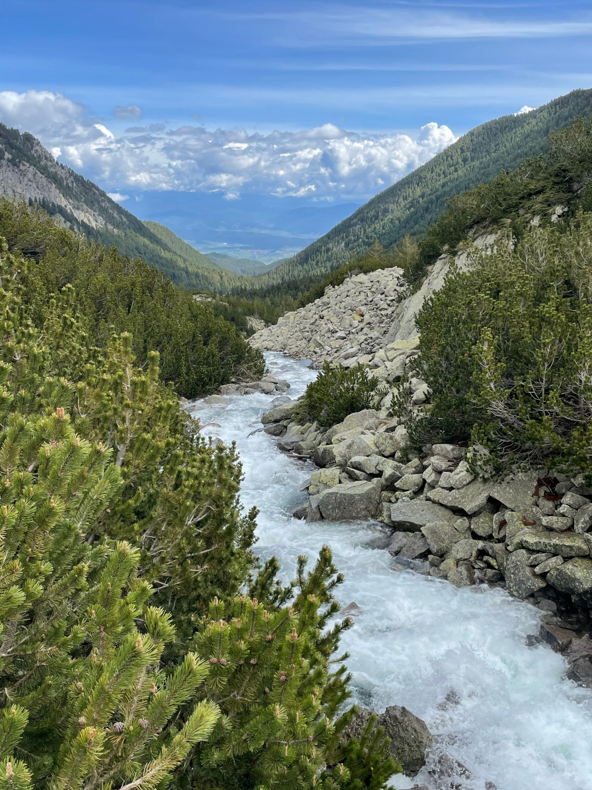
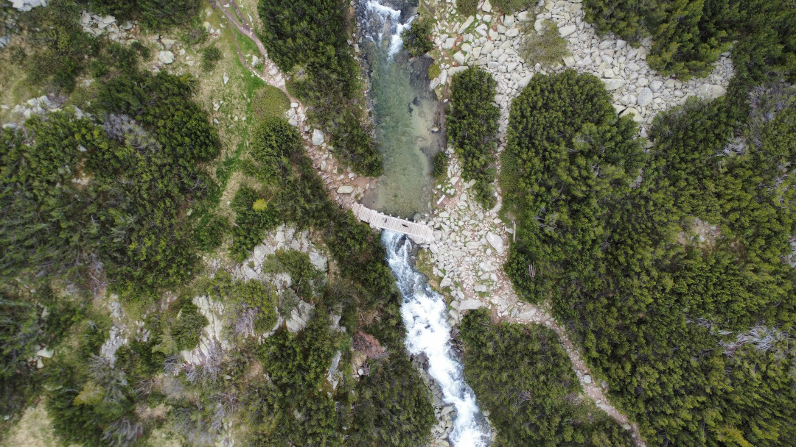
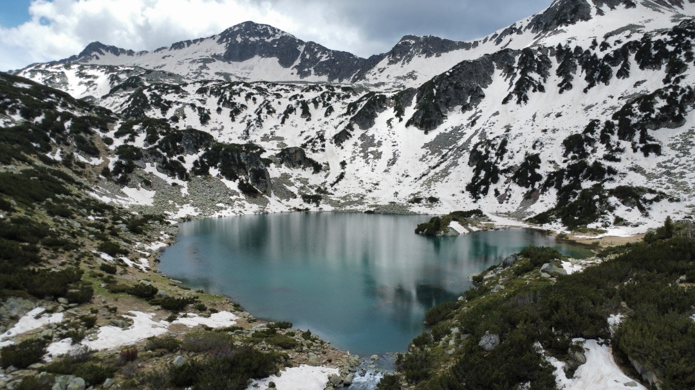
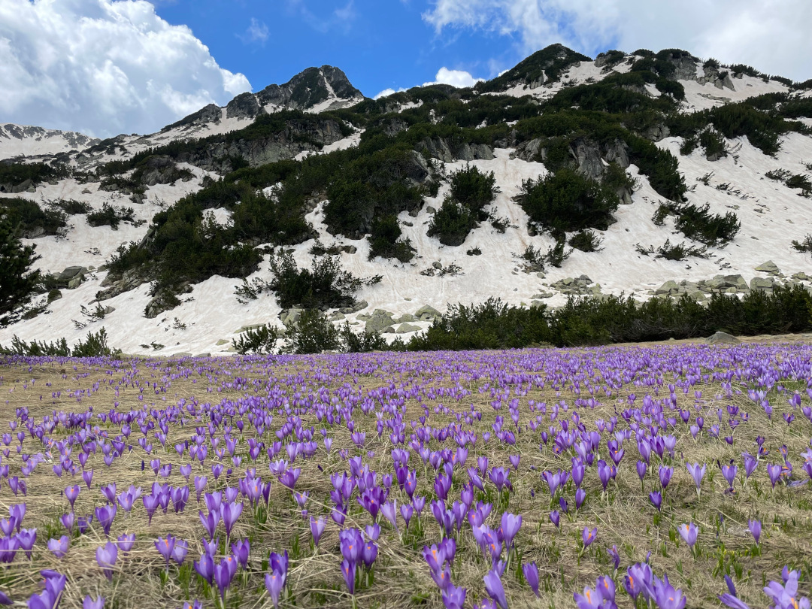
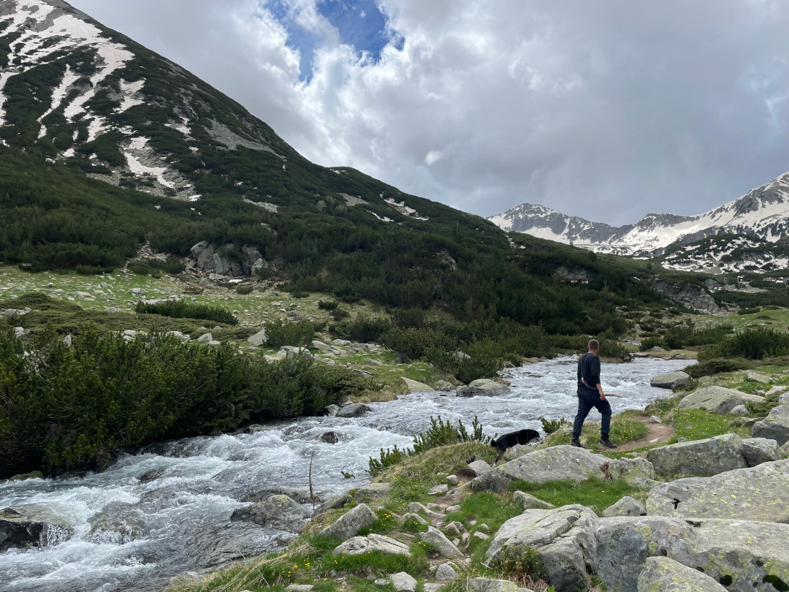
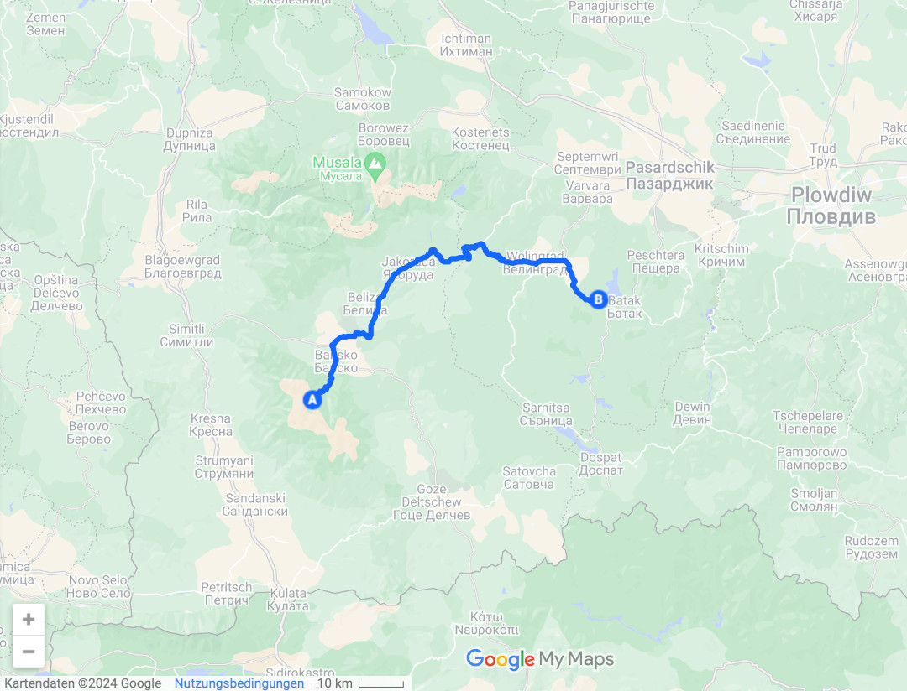
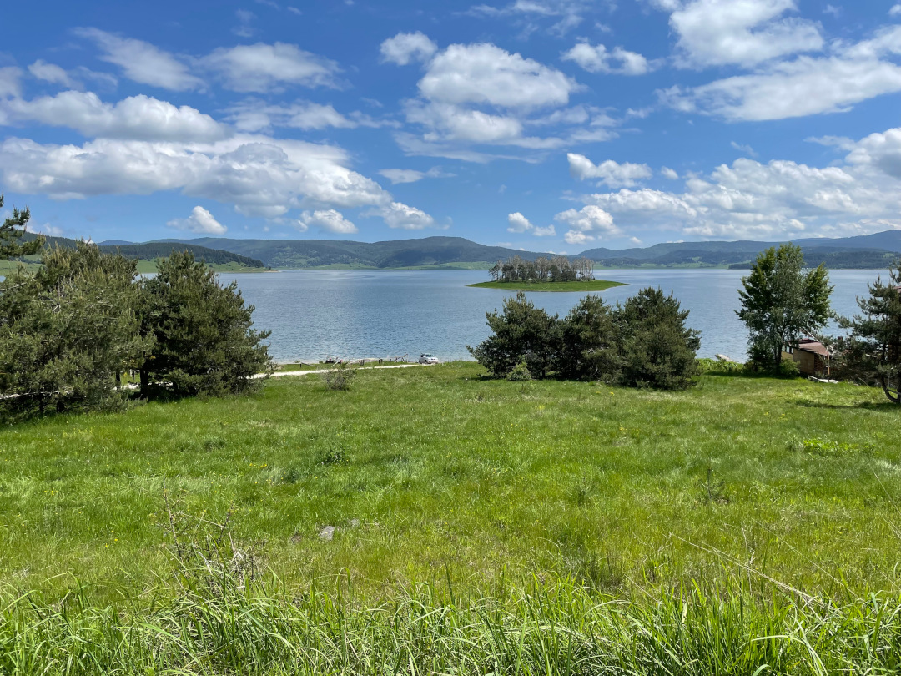
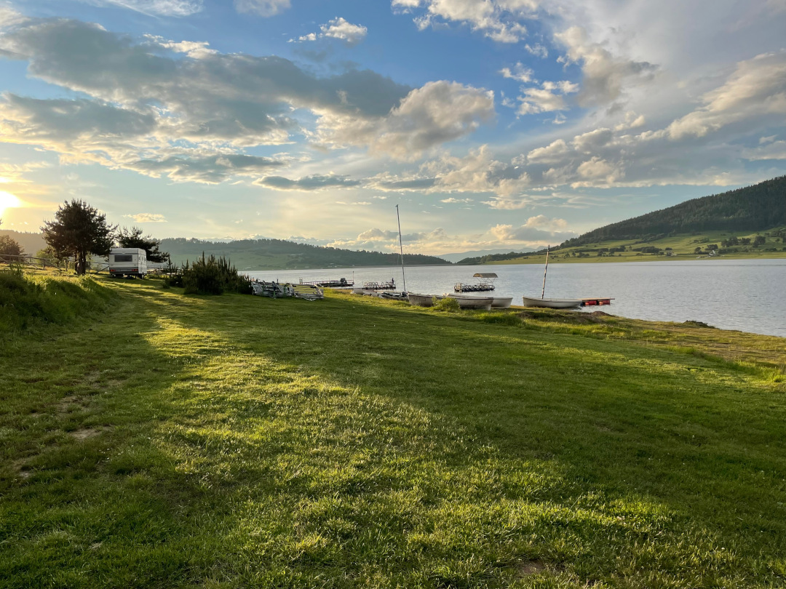
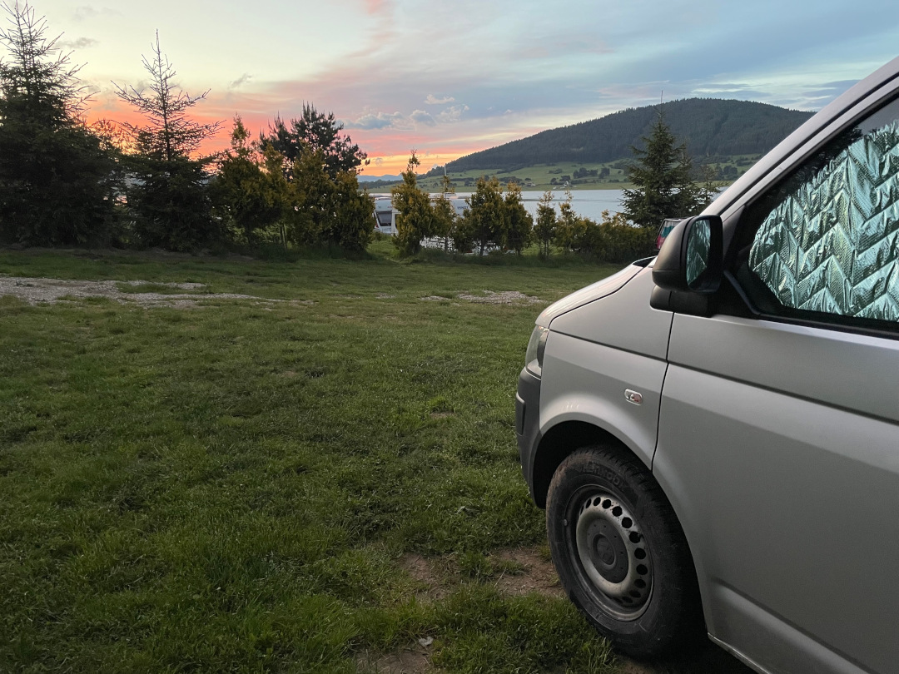

Wir bleiben mit dem nächsten Nationalpark noch in den Bergen und auf Wandertour.

<!--more-->

🗓️ 23. Mai: Nach dem langen Abend gestern schlafen wir relativ lange. Die erste Nacht Freistehen in Bulgarien war ruhig. Wir machen uns startklar und nehmen eine kalte, aber erfrischende Abkühlung im Fluss neben dem Bulli. Die beiden Wiener hatten uns gestern noch den Tipp für eine Wanderung hier im Pirin Nationalpark gegeben, die wir natürlich direkt ausprobieren möchten. Wir verabschieden uns von den beiden und tauschen noch ein paar Tipps für die Weiterreise aus. Eigentlich hatten wir hier nur die Übernachtung geplant und wären weitergefahren, aber so wird jetzt Henrys Morgenrunde die Wanderung. Ein paar Kilometer kürzen wir allerdings mit dem Auto ab, da wir die Straße bis zum letzten Parkplatz hochfahren und so ein paar Höhenmeter sparen. Von hier aus sind es noch knapp 300 Höhenmeter und 6 Kilometer bis zu den Seen im Pirin-Gebirge. Wir laufen immer vorbei an dem Fluss, den wir schon von heute Morgen kennen. Nach dem steilen aber kurzen Anstieg sind wir schon beim ersten See auf ca. 2.100 Metern Höhe. Leider liegt hier auch immer noch Schnee, den wir ja jetzt auf fast jeder Wanderung treffen. Mit Schnee sieht die Umgebung zwar noch etwas besonderer aus, aber der Schnee macht das Wandern auch schwieriger und länger. Daher haben wir nichts dagegen, wenn der Sommer bald auch in den Bergen Einzug erhält. Ein weiterer Nachteil ist, dass durch die Schneeschmelze Teile der Wanderwege überschwemmt sind und wir abenteuerliche Manöver über die Flüsse machen müssen. Im Endeffekt klappt aber alles. Dafür werden wir mit traumhaften Ausblicken belohnt. Wir können schon sagen, dass wir hier in Bulgarien bisher unsere schönsten Wanderungen hatten. Und einen Vorteil hat der Schnee im Mai dann doch: Es ist noch nicht so voll wie in der Hochsaison bei perfektem Wetter. Nach der kurzen dreistündigen Wanderung machen auf wir uns zurück in den Skiort Bansko, um einzukaufen. Weil wir freistanden und direkt wandern waren, fiel unser Frühstück heute aus. Mit viel Hunger im Gepäck geht’s deshalb zum Billa. Endlich mal ein anderer Supermarkt als Lidl und Kaufland, auch wenn es auch hier viele österreichische und deutsche Produkte gibt. Danach geht es ins knapp zwei Stunden entfernte Batak, direkt am Batak-Stausee. Hier stehen wir an einem Campingplatz direkt am See mit super Ausblick. Leider ist es noch zu kalt, um hier schwimmen zu gehen. Dank des österreichischen Supermarkts gibt es heute Abend Käsespätzle.

🗓️ 24. Mai: Für heute haben wir nichts geplant. Wir stehen direkt am See und entscheiden noch eine zweite Nacht hier zu bleiben. Nach den ganzen Wanderungen in den letzten Tagen tut das auch ganz gut. Auch mal nicht Auto zu fahren tut gut. Dennoch schickt uns das Schicksal direkt morgens auf eine erneute Wanderung. Weil wir irgendwo unser Spülmittel vergessen haben, müssen wir zurück in den kleinen Ort, um im Laden/Kiosk neues zu kaufen. Der Laden wird bewacht von drei Straßenhunden, die aber glücklicherweise sehr friedlich sind und mehr Angst vor Henry haben als andersrum. Mit Spülmittel im Gepäck geht’s zurück zum Bulli. Wir frühstücken und lassen es entspannt angehen. Im Laufe des Tages füllt sich der Platz sehr gut. Es ist Freitag und viele Einheimische kommen fürs Wochenende zum See. Auch der aufziehende Regen ändert daran nichts. Um uns herum füllt es sich mit Autos, Zelten und Wohnwagen. Laute Musik darf natürlich nicht fehlen. Wir machen das Beste draus und kochen etwas, ziehen uns dann in den Bulli zurück und erkunden später mit Henry weiter die Umgebung. Abends wird der Regen dann immer mehr, die Party geht aber noch weiter bis zwei Uhr. Jede Altersgruppe feiert mit und alle halten bis zwei Uhr durch. Trotz der Umstände kann man aber ganz gut schlafen.

