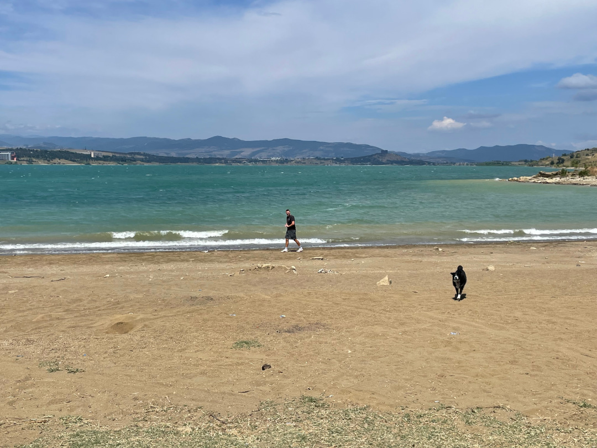
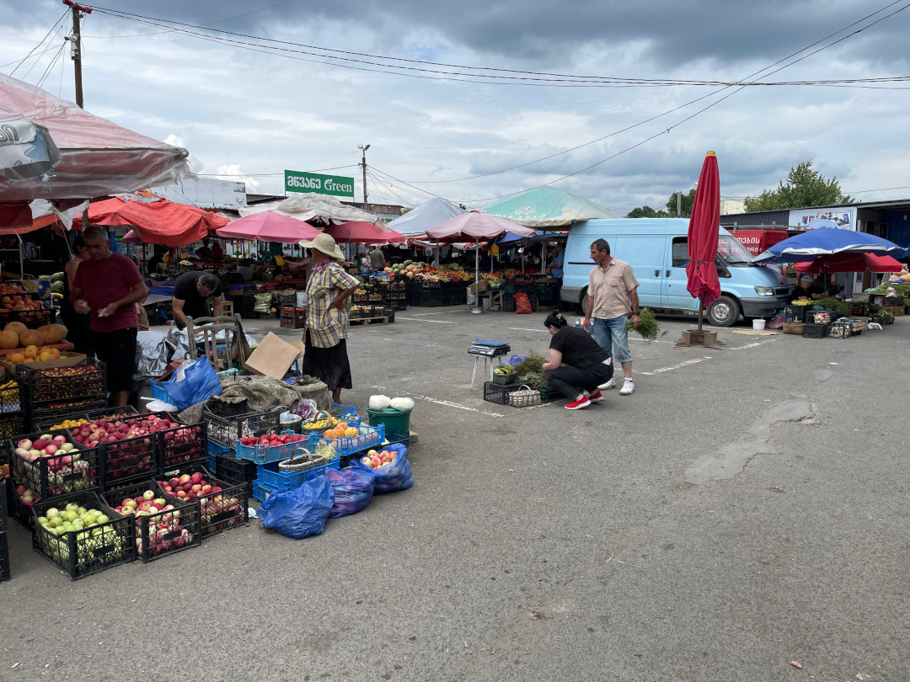

Es geht zurück nach Tiflis, um Tobi wieder am Flughafen einzusammeln. Dann machen wir uns zusammen auf den Weg nach Westen und halten nochmal bei unseren neuen georgischen Großeltern, um uns endgültig zu verabschieden.

<!--more-->

🗓️ 23. Juli: Auf der Wiese am Stausee haben wir einen entspannten Vormittag und frühstücken ganz in Ruhe. Wie beim letzten Mal kommen morgens wieder viele Kühe vorbei. Eine müssen wir etwas von unserem Frühstückstisch fernhalten, aber wir haben Erfolg mit unseren Treibeversuchen. Ansonsten kommen die Straßenhunde vorbei, die ich vom letzten Mal kenne. Mit allen kommt Henry gut klar. Dieses Mal stehen auch vier andere deutsche Wohnmobile hier am See, aber zum Glück etwas weiter unten und somit entfernt von unserem Plätzchen. Auch ein Paar, das wir schon auf dem Campingplatz in der Nähe von Gori getroffen hatten, ist dabei. So klein ist die Welt (oder zumindest Georgien). Heute ist es wieder richtig warm und so kommen wir schon beim Sachen zusammenpacken ins Schwitzen. Mit Henry drehen wir noch eine Runde am See und dann fahren wir am frühen Nachmittag los. Es geht mal wieder in die Hauptstadt, denn heute verlässt mich der hohe Besuch aus Deutschland wieder und fast zeitgleich kommt Tobi aus Deutschland wieder zurück nach Tiflis geflogen. Nach dem Abschied warten Henry und ich noch ungefähr zwei Stunden am Flughafen, um Tobi in Empfang zu nehmen und dann ist unsere ursprüngliche Reisegruppe wieder hergestellt. Weil es inzwischen schon Abend ist und alle müde sind, fahren wir nur noch ein paar Kilometer weiter bis zu einer großen Shopping Mall im Osten von Tiflis. Auf dem separaten Busparkplatz finden wir in der hintersten Ecke einen gut abgelegenen Schlafplatz für uns. Es ist zwar alles andere als ruhig hier neben der großen Straße, aber der Vorteil ist, dass wir alle möglichen Geschäfte um die Ecke haben. So können wir noch jemanden für uns kochen lassen und kriegen sogar noch Eiskugeln zum Nachtisch. Überall sind wie immer richtig viele Menschen. In den Ländern hier geht der Abend einfach immer viel länger und alle Kinder sind lange wach und mit dabei. Wir dagegen fallen nach unserem Eis auch schon schnell ins Bett, müssen aber noch ein paar Mal die Batterien von unserem Ventilator wechseln, denn ohne den könnte man es heute Nacht echt nicht gut aushalten.

🗓️ 24. Juli: Wir sind wieder früh wach und wieder kommt es uns gelegen, denn unser Plan ist, möglichst früh an der berühmten Gergetier Dreifaltigkeitskirche zu sein. Weil es einerseits eine der Hauptsehenswürdigkeiten des Landes ist und andererseits nur am frühen Morgen ein Blick auf die umliegenden Berge ohne oder mit wenigen Wolken möglich ist. Nachmittags soll es hier oben dann auch schon wieder anfangen zu regnen. Vorher wollen wir wieder unten sein. Von unserem Schlafplatz im Trusotal brauchen wir nur noch ungefähr eine Dreiviertelstunde. Früh morgens ist auf der Heerstraße noch etwas weniger Verkehr und wir kommen gut durch. Einige Höhenmeter müssen wir noch überwinden, vor allem das letzte Stück zur Kirche hoch hat es in sich, aber die geteerte Straße ist in gutem Zustand. Oben angekommen haben wir einen schönen Blick auf die Kirche, an der allerdings gerade gearbeitet wird und die deshalb eingerüstet ist. Beeindruckend ist vor allem in welcher Umgebung sie schon im 14. oder 15. Jahrhundert gebaut wurde. Sie ist nur ungefähr 15 Kilometer von der russischen Grenze entfernt und komplett umgeben von Bergmassiven des hohen Kaukasus, unter anderem vom über 5000 Meter hohen und immer noch schneebedeckten Kasbek. Viele machen sich hier morgens bereit für Wanderungen, aber uns sind die Hänge zu steil. Auf dem Rückweg halten wir noch am bekanntesten Mosaik aus der Sowjetzeit in Georgien. Auch von der Aussichtsplattform bieten sich uns spektakuläre Aussichten. Dann geht es in der Schlange des dichten Verkehrs wieder zurück bis kurz vor Ananuri. Hier nehmen wir die Brücke und suchen uns wieder einen Schlafplatz am großen Stausee gegenüber der Wehrkirche. Auch Tobi und ich haben hier ja vor gut einer Woche schon zwei Tage verbracht.

