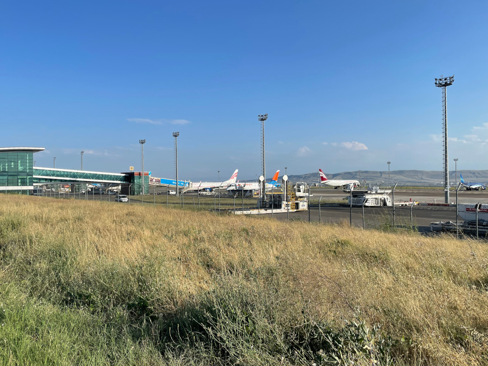

Es geht zurück nach Tiflis, um Tobi wieder am Flughafen einzusammeln. Dann machen wir uns zusammen auf den Weg nach Westen und halten nochmal bei unseren neuen georgischen Großeltern, um uns endgültig zu verabschieden.

<!--more-->

🗓️ 23. Juli: Auf der Wiese am Stausee haben wir einen entspannten Vormittag und frühstücken ganz in Ruhe. Wie beim letzten Mal kommen morgens wieder viele Kühe vorbei. Eine müssen wir etwas von unserem Frühstückstisch fernhalten, aber wir haben Erfolg mit unseren Treibeversuchen. Ansonsten kommen die Straßenhunde vorbei, die ich vom letzten Mal kenne. Mit allen kommt Henry gut klar. Dieses Mal stehen auch vier andere deutsche Wohnmobile hier am See, aber zum Glück etwas weiter unten und somit entfernt von unserem Plätzchen. Auch ein Paar, das wir schon auf dem Campingplatz in der Nähe von Gori getroffen hatten, ist dabei. So klein ist die Welt (oder zumindest Georgien). Heute ist es wieder richtig warm und so kommen wir schon beim Sachen zusammenpacken ins Schwitzen. Mit Henry drehen wir noch eine Runde am See und dann fahren wir am frühen Nachmittag los. Es geht mal wieder in die Hauptstadt, denn heute verlässt mich der hohe Besuch aus Deutschland wieder und fast zeitgleich kommt Tobi aus Deutschland wieder zurück nach Tiflis geflogen. Nach dem Abschied warten Henry und ich noch ungefähr zwei Stunden am Flughafen, um Tobi in Empfang zu nehmen und dann ist unsere ursprüngliche Reisegruppe wieder hergestellt. Weil es inzwischen schon Abend ist und alle müde sind, fahren wir nur noch ein paar Kilometer weiter bis zu einer großen Shopping Mall im Osten von Tiflis. Auf dem separaten Busparkplatz finden wir in der hintersten Ecke einen gut abgelegenen Schlafplatz für uns. Es ist zwar alles andere als ruhig hier neben der großen Straße, aber der Vorteil ist, dass wir alle möglichen Geschäfte um die Ecke haben. So können wir noch jemanden für uns kochen lassen und kriegen sogar noch Eiskugeln zum Nachtisch. Überall sind wie immer richtig viele Menschen. In den Ländern hier geht der Abend einfach immer viel länger und alle Kinder sind lange wach und mit dabei. Wir dagegen fallen nach unserem Eis auch schon schnell ins Bett, müssen aber noch ein paar Mal die Batterien von unserem Ventilator wechseln, denn ohne den könnte man es heute Nacht echt nicht gut aushalten.

🗓️ 24. Juli: Auch am Morgen ist um uns herum viel los, so dass wir nur schnell den Bulli und uns wieder startklar machen. Einen großen Supermarkt gibt es in der Mall auch, so dass wir noch ein paar Einkäufe machen. Zum Frühstück holen wir uns was bei Subway und düsen dann los. Ein letztes Mal müssen wir heute noch durch Tiflis, damit wir wieder in den Westen des Landes kommen. Weil wieder viel Stau ist, versuchen wir einen anderen Weg auf der anderen Seite des Tiflis-Sees. Zwar ist hier auch viel Verkehr, aber so finden wir noch einen kleinen Sandstrand, an dem wir Pause machen und sogar noch schnell in den See springen können. Sandstrand hatten wir gefühlt ewig nicht und wie immer freut sich Henry darüber am meisten. Für unseren letzten Halt in Georgien steuern wir heute nochmal unsere neuen georgischen Großeltern an. In ihrer Gegend gibt es viele Verkaufsstände mit Hängematten und wir möchten uns als Erinnerung noch eine für Zuhause mitnehmen. Bevor wir ankommen, schlendern wir nochmal über den Basar von Chaschuri, dem nächsten größeren Ort. Als wir anschließend an der Tür klopfen und sie aufgeht, blicken wir in strahlende Gesichter bei Shorena und Ushangi und werden in den Arm genommen. Die Freude uns nochmal wiederzusehen scheint groß zu sein und natürlich wird direkt alles für uns zusammengesucht und geerntet. Als erstes kriegen wir direkt Gurken und Tomaten in die Hand gedrückt. Es folgen noch Feigen und Mirabellen. Und auch wir freuen uns nochmal hier zu sein. Auch auf einen Tee werden wir sofort eingeladen, je nach Geschmack wieder mit Zitrone oder Kirschen darin. Dieses Mal können wir mit guter dunkler Schokolade aus Deutschland wenigstens ein bisschen was zurückgeben. Natürlich wird die Nachbarin  auch schnell angerufen, um den besten Käse zu kaufen. Unser Backworkshop geht heute tatsächlich in die zweite Runde. Es gibt wieder Khachapuri, aber dieses Mal die offene Variante mit Ei. Es macht Spaß noch etwas Neues zu lernen und schmecken tut es am Ende auch sehr gut. Genau wie letztes Mal sind wir aber auch schnell seeehr satt. Wir fragen Shorena, ob sie uns morgen nochmal nach Chaschuri begleiten würde. Mit ihr haben wir nämlich mehr Chancen einen richtigen Preis und keinen reinen Touristenpreis für unsere Hängematte zu bezahlen. Und sie freut sich, weil sie sowieso noch einen kleinen Tisch kaufen möchte für das Ferienhaus. Es ist also wieder eine Win-Win-Situation. Am Abend kommt noch ein tapferer Fahrradfahrer an, der den ganzen Weg von Deutschland hierher zurückgelegt hat, also ungefähr 5000 Kilometer. Auch führ ihn reicht unser gebackenes Khachapuri zum Glück noch.

