Wir machen noch ein paar Kilometer Richtung Deutschland und sind in zwei Tagen in drei Ländern.

<!--more-->

🗓️ 23. August: Der Morgen startet so entspannt wie der Abend aufgehört hat. Wir gehen mit Henry eine große Runde durch die grüne Steppe. Eigentlich waren wir wieder auf der Suche nach einem Bergsee in der Nähe der Teefarm, finden ihn aber nicht. Wahrscheinlich ist auch hier kaum noch Wasser drin. Nach ein paar Kilometern drehen wir dann - ohne den See gesehen zu haben - wieder um. Wir packen alles zusammen, besorgen Frühstück in Zabljak und fahren in Richtung Serbien. Dafür müssen wir aber zuerst noch durch die Tara Schlucht im Norden von Montenegro. Natürlich waren wir auch hier vor drei Jahren. Deshalb halten wir nur kurz an der Tara Brücke. Die Brücke ist eine der größten Stahlbeton-Bogenbrücken für den Straßenverkehr und führt in 150 Metern Höhe über die Schlucht. Damals sind wir nicht über die Brücke gefahren, sondern waren nur für den Ausblick und Fotos hier. Heute müssen wir dagegen auch drüber fahren, aber die Brücke hält glücklicherweise. Danach erreichen wir schnell die Grenze zu Serbien. Die Wartezeit ist relativ kurz und die Grenze somit schnell passiert. Wir fahren dann noch knapp zwei Stunden bis zu dem Ort Uzice. Es folgt der Klassiker der letzten Tage. Aktuell gibt der Fußball ein wenig den Takt vor.  Alle offenen Länderpunkte auf der Route wollen wir noch mitnehmen. Der Campingplatz liegt wieder am Stadtrand und ist quasi auch wieder ein Bauernhof mit super vielen Tieren. Wir besuchen jedes Tier einzeln, insbesondere der Hofhund und die Esel sind unsere neuen Freunde. Zur Begrüßung gibt es Pflaumenschnaps, der etwas nach Armenien schmeckt. Das Problem ist, dass der Hofbetreiber und sein Vater immer direkt nachkippen, wenn das Pinnchen leer ist. Also müssen wir wohl oder übel drei trinken. Nach dem Bulli-Vorbereiten für die Nacht fahren wir mit dem Taxi in die Innenstadt. Der Taxifahrer bietet sogar an uns nach dem Spiel wieder abzuholen und gibt uns seine Handynummer. Wir verabreden uns für 23 Uhr am Stadion und haben noch Zeit uns die Stadt anzugucken. Auch hier ist es wie immer: Osteuropäisch, Hochhäuserblocks, grau, großer Platz, Heldenstatuen. Wir suchen uns noch was zu essen und gehen dann zum Stadion. Wie in Montenegro ist auch heute der Eintritt frei. Aber immerhin gibt’s trotzdem Eintrittskarten. Besser geht es fast gar nicht. Heute spielt FK Mladost Lucani gegen FK Cukaricki. Letzteren Verein habe ich sogar schon mal bei einem Spiel in Luxemburg gesehen. Das Spiel gewinnt Lucani 3:1 gegen den Favoriten aus Cukaricki, Belgrad. Es war tatsächlich eins der besseren Spiele in letzter Zeit. Es gab zwar keine Fanszenen vor Ort und in der Halbzeit musste wieder auf Getränke von außerhalb zurückgegriffen werden, aber dafür war der Heimtrainer mit vollem Elan dabei. Nach dem Spiel wollen wir uns ja eigentlich um 23 Uhr mit dem Taxifahrer treffen, der aber nicht kommt. Auf Nachrichten und Anrufe reagiert er nicht, also suchen wir ein neues Taxi. Spätabends in fremden Städten Taxis suchen und den Fahrern dann auch noch erklären, wo wir hinwollen, können wir mittlerweile und so sind wir auch zeitig wieder am Bulli.

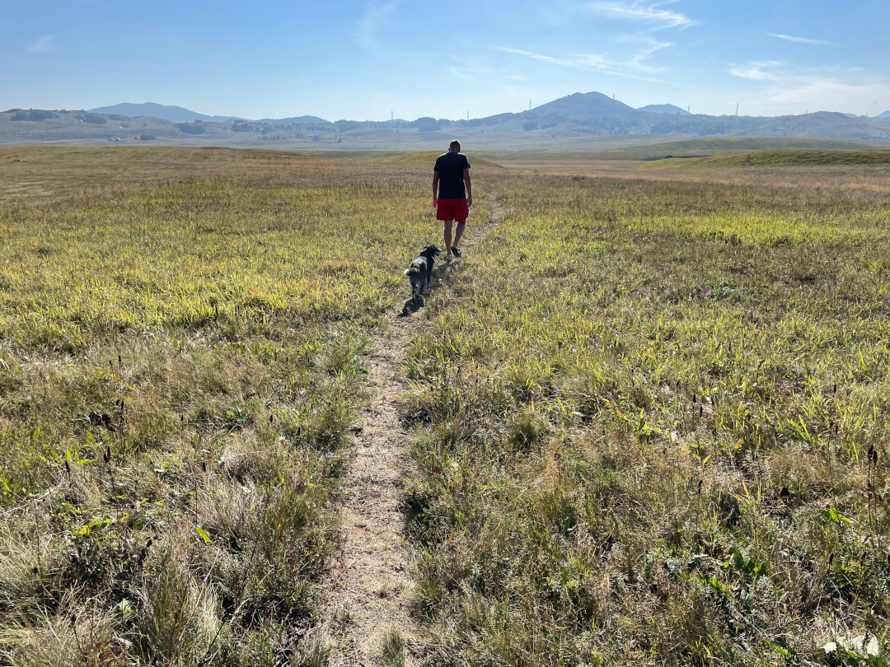

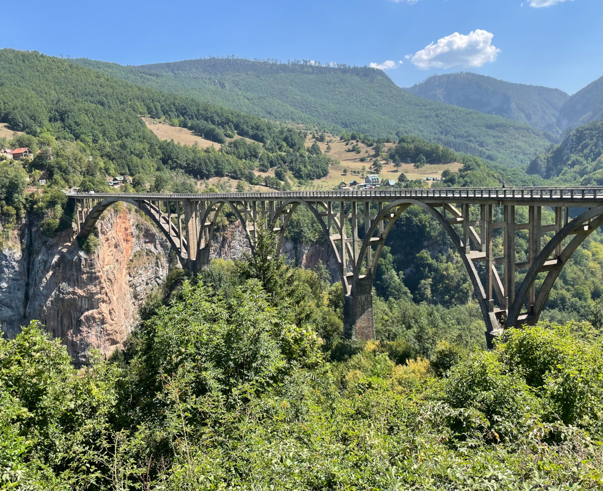

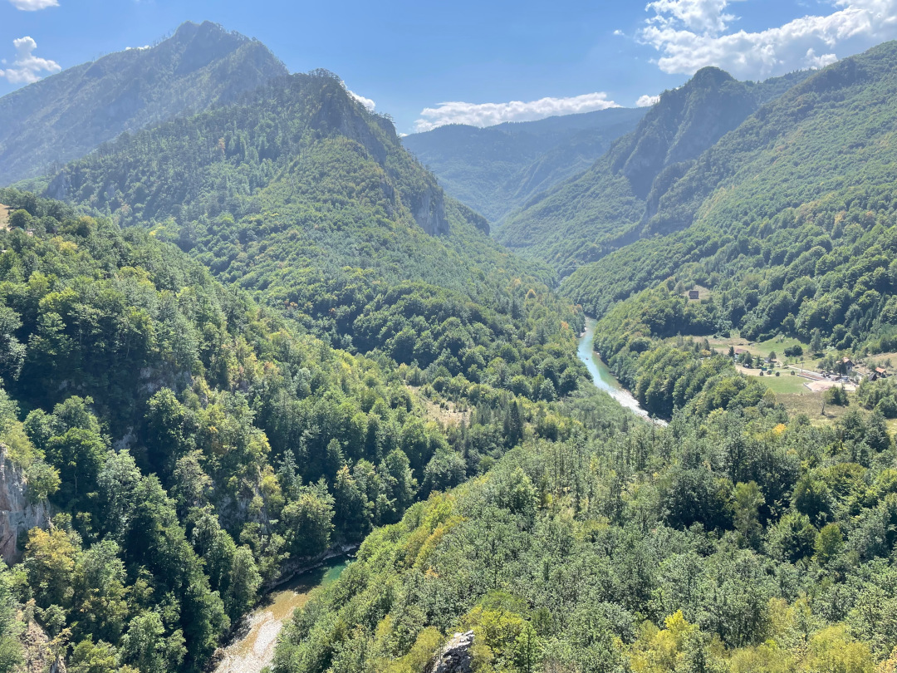

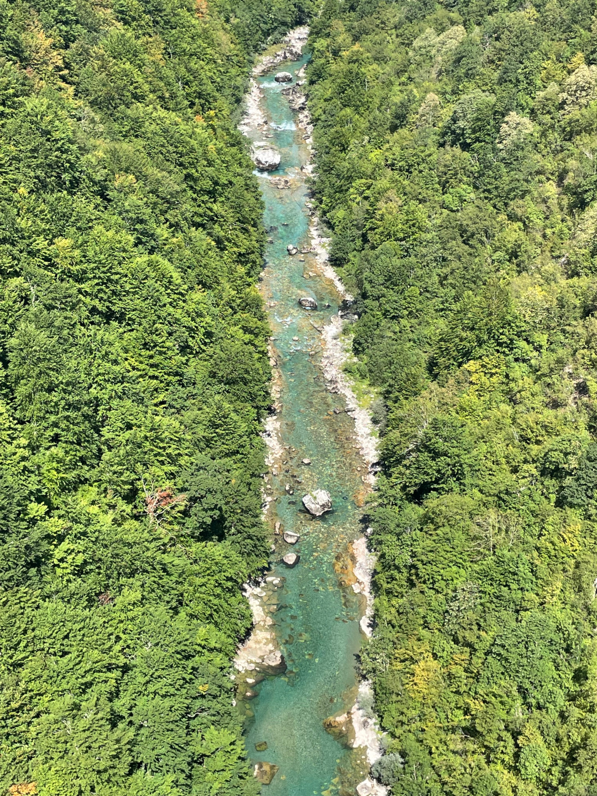

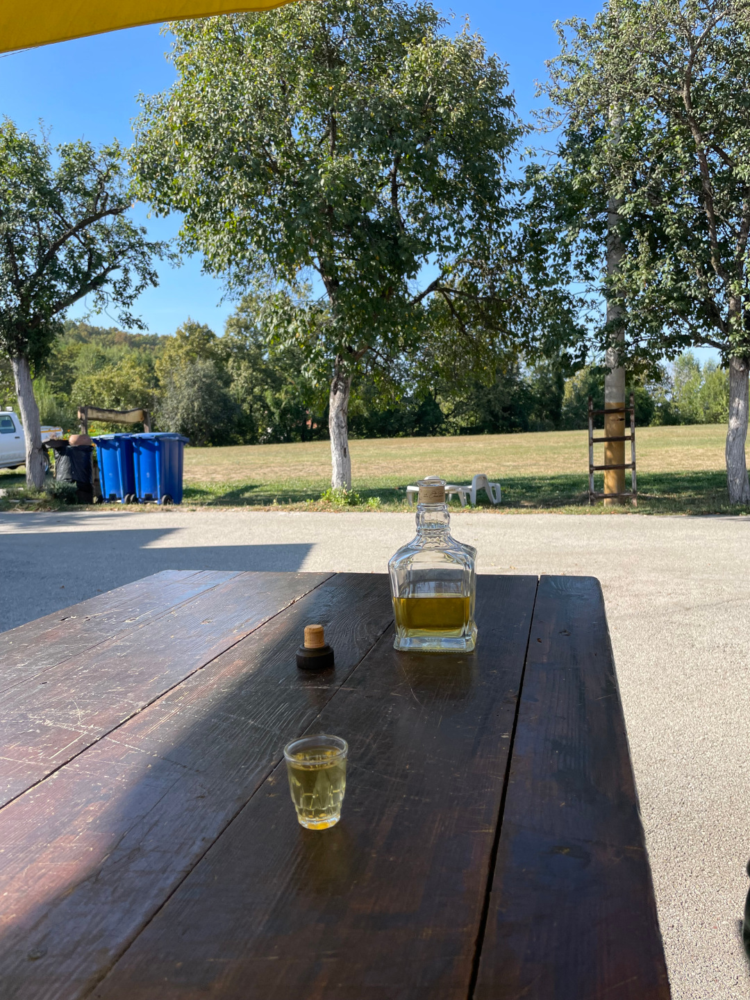

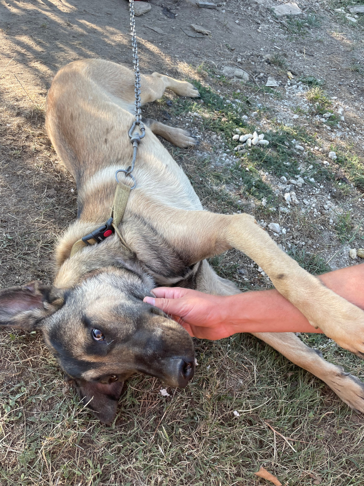

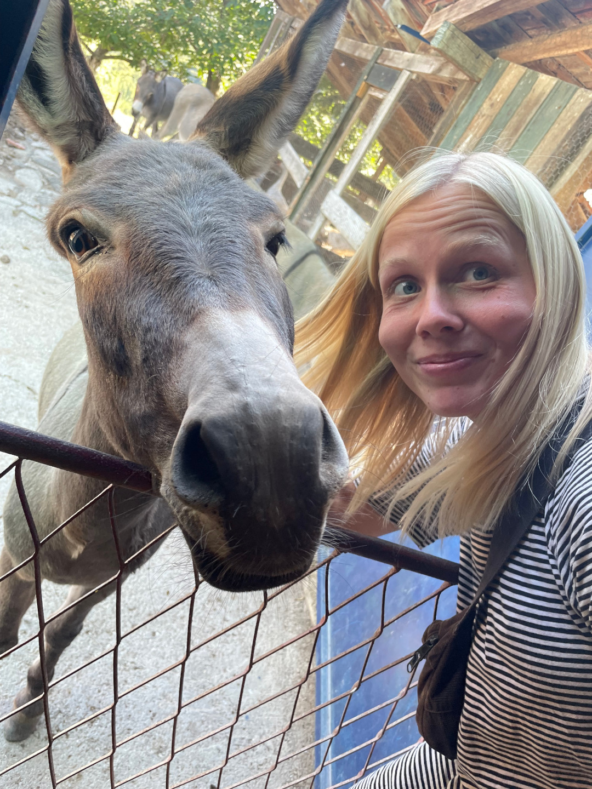

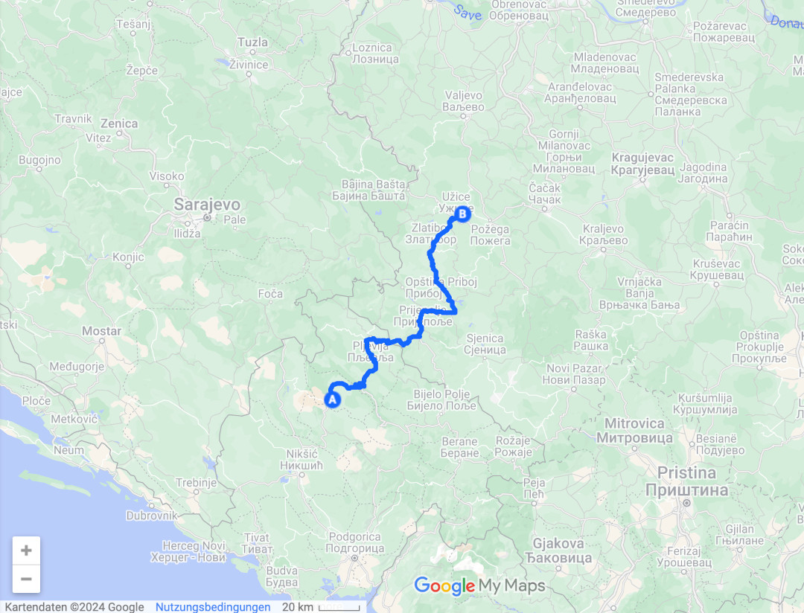

🗓️ 24. August: Die Nacht verläuft etwas unruhig, was aber eher an uns selber liegt. Das Essen bei dem slowakischen Italiener liegt uns doch etwas schwerer im Bauch. Aber es beschränkt sich wirklich nur auf die Nacht. Am Morgen und im Laufe des Tages wird es besser. Wir lassen es daher etwas langsamer angehen und machen uns abfahrbereit. Heute geht es nach Ungarn. Fast jeden Tag in einem anderen Land kann auch anstrengend sein, aber so ist das auf der Rückreise. Wir kaufen ein letztes Mal in Serbien ein und spätestens mittags sind wir auch wieder in der Lage etwas zu essen. Etwas nördlich von unserem Ort, wo wir geschlafen haben beginnt auch endlich die Autobahn und wir fahren quasi bis zur ungarischen Grenze über die Autobahn. Die Maut wird hier wie in Frankreich über ein gezogenes Ticket abgerechnet. In Ungarn wollen wir aber mautfrei fahren. Das haben wir im April auch schon so gemacht und weil die Straßen und Topographie es in Ungarn hergeben, klappt das auch ganz gut. Wir fahren also in Serbien noch vor der Grenze von der Autobahn und passieren die Grenze zu Ungarn auf einer kleinen Landstraße. Wir werden schon vor der Grenze auf der Straße von der serbischen Polizei kontrolliert und merken, dass das hier noch lange dauern könnte. In Serbien landen viele Flüchtlinge, die über die Balkanroute in die EU möchten. Daher wird hier an der ungarischen Grenze super penibel kontrolliert. Die Ausreise aus Serbien klappt noch relativ fix. Die Einreise in die EU dauert dann nochmal anderthalb Stunden. In unseren Bulli wird aber nur kurz geguckt. Und dann sind wir wieder in der EU und verlassen sie auf dieser Reise auch gar nicht mehr. Auch wenn wir Ungarn etwas langweilig finden, merken wir schon die Vorteile der EU. Unter anderem gute Straßen. Unterwegs halten wir noch an einem Feldweg und erkunden etwas die Umgebung mit Henry. Wir fahren über die Landstraßen dann noch knapp zwei Stunden zum Campingplatz in Kisörös bei einem Thermalbad. Als wir im April in Ungarn waren, waren wir quasi noch die einzigen Touristen, aber jetzt wird das Bild hauptsächlich von ostdeutschen Rentnern bestimmt. Das Thermalbad ist bestimmt noch ein zusätzlicher Magnet. Wir gehen auch kurz ins 37 Grad warme Thermalbad, halten aber nicht die vorgeschriebenen 30 Minuten durch, weil wir Hunger haben. Kurz vor Ende der Reise plündern wir nochmal unsere Vorräte. Danach geht es noch auf einen Abendspaziergang durch den Ort. Im Dunkeln mit Henry durch eine Stadt laufen, wäre in anderen Ländern undenkbar. Hier in Ungarn ist es aber quasi wie in Deutschland und freilaufende Hunde gibt es nicht. Wenn wir eins vermisst haben, dann entspannt mit Henry spazierenzugehen. Leider entpuppt sich der Campingplatz später als Rentner-Disco. Mit 99 Luftballons auf den Ohren geht es für uns trotzdem ins Bett.

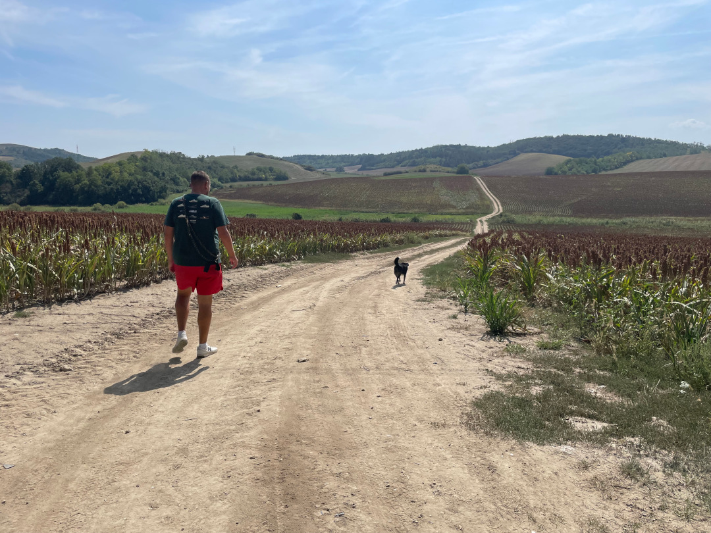

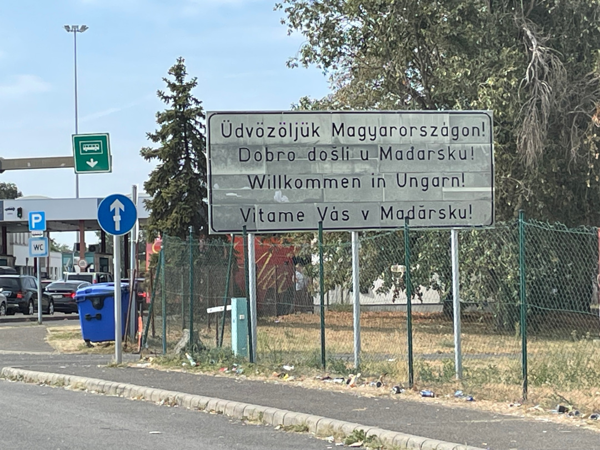

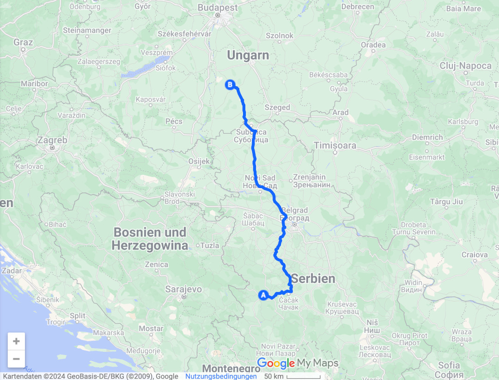