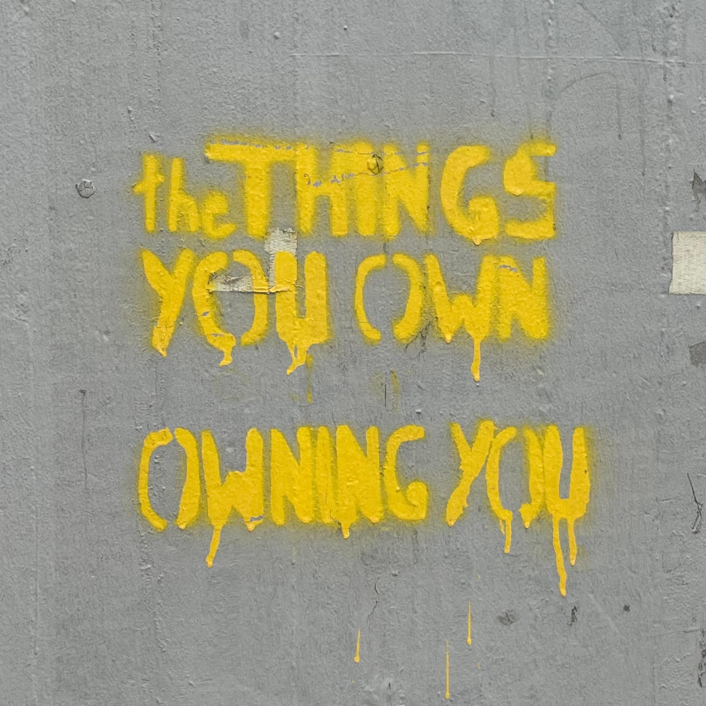
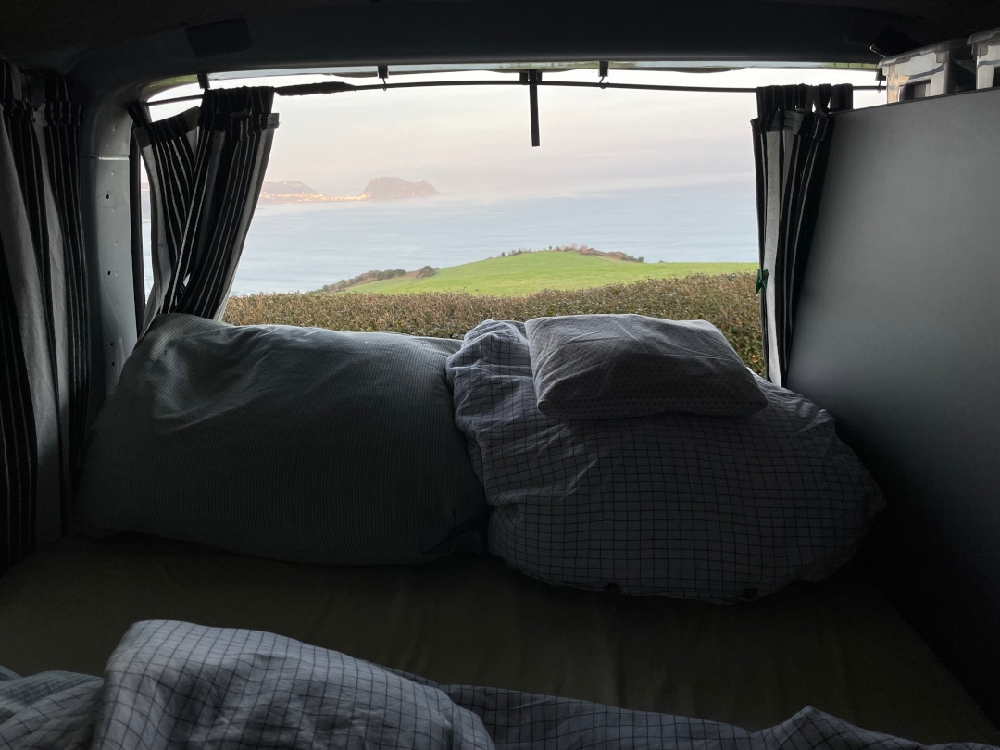

In unseren Köpfen haben wir uns diesen Tag schon lange ausgemalt und jetzt fahren wir einfach los. Etwas unwirklich, aber auch verdammt schön. Die ersten beiden Etappen führen uns von Hamm, über das Pariser Umland, bis nach Zarautz an der spanischen Nordküste. 

<!--more-->

Die letzten Wochen waren für uns vor allem geprägt vom Loslassen: erst den Großteil unserer Möbel und unseres Besitzes, dann unsere Wohnung, unsere Arbeit und schließlich für die nächsten Monate auch Familie und Freunde (und für Tobi den BVB). Am Anfang bedeutete das vor allem eine gefühlt ewig lange To-Do-Liste, viele Termine, Orga-Kram und Unsicherheiten – ein Umbruch eben. Passend dazu begegnete mir in Bochum ein Graffiti.

Als wir uns mit jedem Teil, das wir besaßen, auseinandersetzen mussten, wurde nichts klarer als das. (Übermäßiger) Besitz bindet uns und schränkt unsere Entscheidungsfreiheit ein. Umso besser fühlt es sich jetzt an, nur noch das zu besitzen, für das wir wirklich Verwendung haben, und in den nächsten Monaten nur mit dem Nötigsten unterwegs zu sein. Mehr gibt unser Bulli eh nicht her und das Beste daran: Was man gerade braucht, hat man auch immer bei sich. Das Befreiungsgefühl erleichterte also das Loslassen und im Nachhinein ist klar: Um Neues reinzulassen, auch in die Köpfe, muss erst Altes raus. Wir haben also in den letzten Monaten und Wochen Platz geschaffen und jetzt kommt die Belohnung: Das Neue, die Fremde und mehr kleine und große Abenteuer. Wie cool!

🗓️ 24. Januar: Etwas später als gedacht sind heute Morgen schließlich alles wichtigen Dinge im Bulli verstaut und wir unterwegs. Unser Ziel für heute: möglichst viele Kilometer machen, damit wir schnell nach Nordspanien an die Küste und in die Sonne kommen. Am Anfang spielt der Verkehr mit und nach ein paar Stunden machen wir einen Stopp in Kruishoutem in Belgien. Henry freut sich über einen Spaziergang rund um das kleine Schloss und die frische Landluft. Zwischen Kortrijk und Lille passieren wir danach die belgisch-französische Grenze, aber dann dauert es nicht mehr allzu lang bis wir das Verkehrschaos rund um Paris erreichen. Durch viele Staus brauchen wir länger als gedacht. Um noch das Handballspiel Deutschland-Kroatien online gucken zu können und nicht zu lange im Bulli zu sitzen, entscheiden wir uns dafür die erste Nacht auf einem Rastplatz an der A10 südlich von Paris zu verbringen. Die gute Ausstattung für Übernachtungen an französischen Rasthöfen kennen wir schon aus früheren Urlauben und auch heute sind wir nicht die einzigen deutschen Übernachtungsgäste hier. Wir besorgen uns noch etwas zu essen, gucken Deutschland beim Verlieren zu und lassen den allerersten Abend unserer Reise ausklingen. Fazit bis hierher: Allein der Aufbruch hat sich schon gelohnt, denn der macht was mit einem.

🗓️ 25. Januar: Die Nacht war erstaunlich ruhig, wenn auch zwischenzeitlich noch etwas kühl. Am Morgen haben wir dann das Glück direkt einen guten französischen Bäcker da zu haben, so dass der erste richtige Tag unserer Reise mit perfektem Croissant, Schokobrötchen und Kakao mit Haselnusssirup startet. Nachdem wir uns und den Bulli wieder startklar gemacht haben, geht es wieder auf die Bahn, denn auch heute stehen uns viele Kilometer bevor. Unterwegs legen wir einen Zwischenstopp zum Einkaufen und Tanken in Blois ein und später gibt es wie immer noch eine gute Henry-Runde im Wald bei Villejoubert. Weil die Autobahn zwischen Bordeaux und San Sebastian aktuell gesperrt ist, stehen wir ab dem Nachmittag auf den Ausweichstrecken viel im Stau und sind wieder länger im Auto als gedacht. Wir müssen etwas die Zähne zusammenbeißen und schaffen es gegen 20 Uhr in Zarautz anzukommen. Der Campingplatz liegt etwas erhöht über der Stadt und dem Meer. Der perfekte Ausblick aus unserer Kofferraumklappe, das Meeresrauschen und der klare Sternenhimmel inklusive Vollmond entschädigen schnell für die Strapazen auf der Autobahn. Diesen Ausblick genießen wir noch bis spät in den Abend. 

