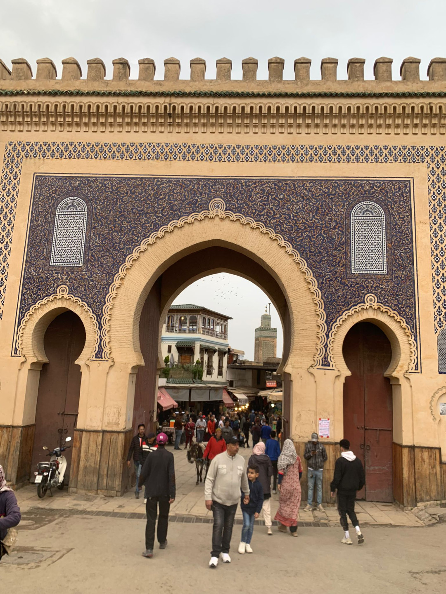
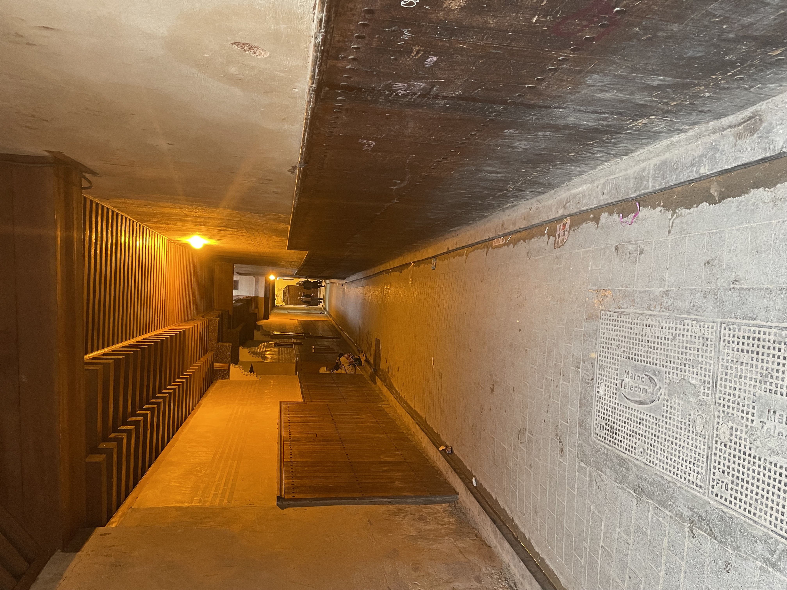
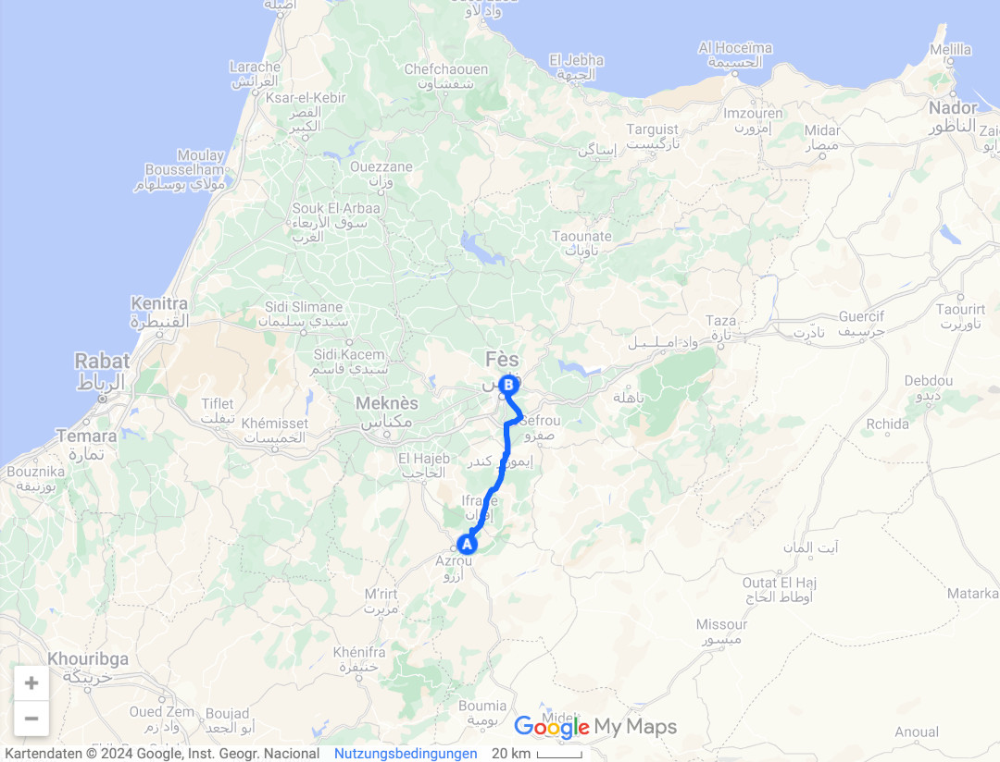
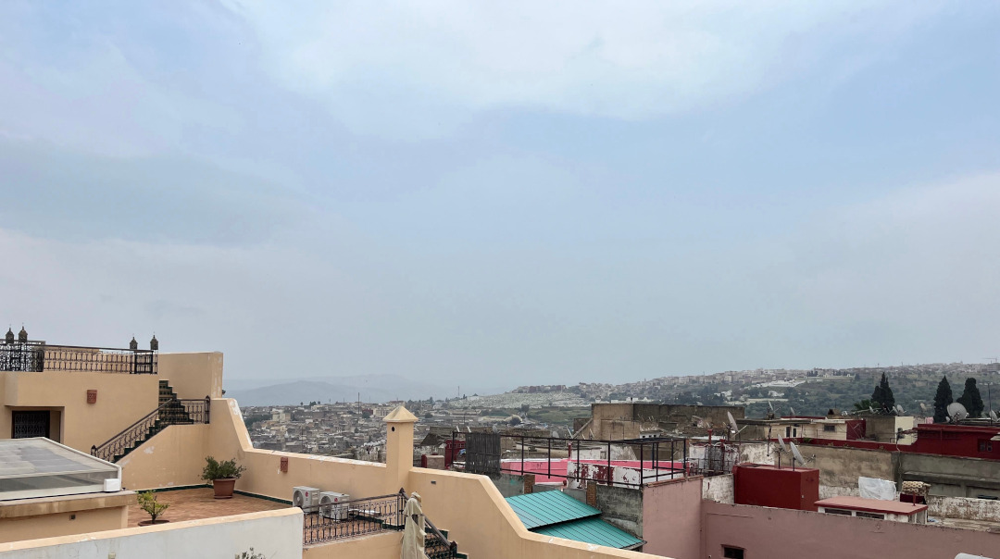
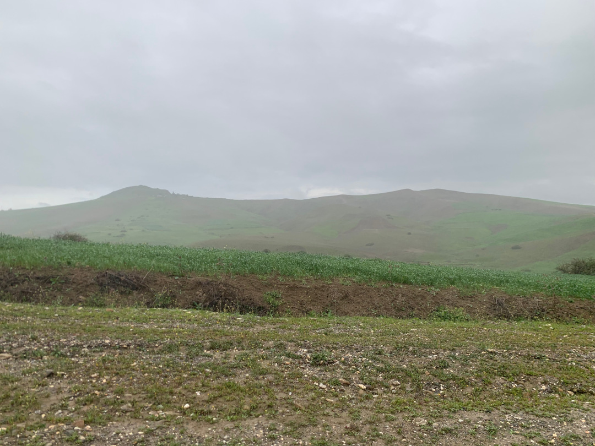
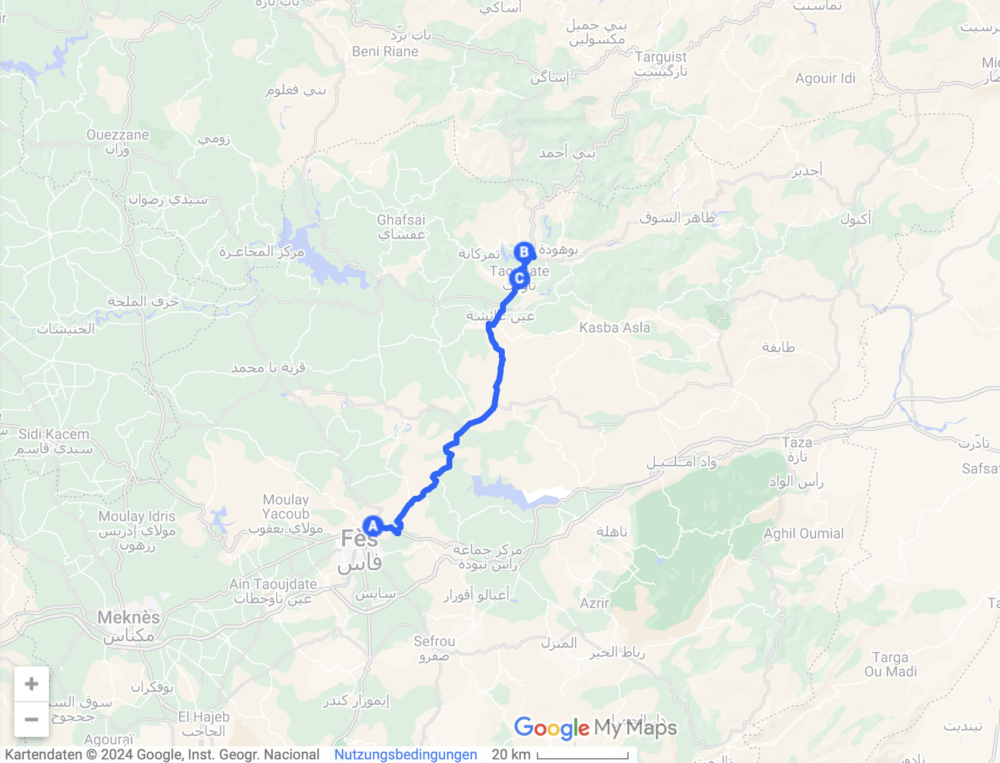

Von den kleinen Dörfern an den Ouzoud Wasserfällen geht es in unsere letzte Großstadt, die wir in Marokko besuchen wollen.

<!--more-->

🗓️ 24. März: Die Nacht und der Morgen sind sehr regnerisch. Das hatten wir wirklich lange nicht mehr. In der kurzen trockenen Phase laufen wir mit Henry etwas durchs Dorf. Danach machen wir uns auf zum Flughafen Fès, um Maik und Nicole abzuholen. Die Fahrt verläuft entspannt auf der Landstraße, bis das Auto vor uns komische Bremsmanöver macht. Hanna zieht etwas nach links, um zu sehen was vor uns liegt und sieht leider eine der vielen Polizeikontrollen. Jetzt haben wir natürlich die Aufmerksamkeit der Polizei und werden raus gewunken. Nach einigen Versuchen kann uns der junge Polizist dann erklären, was sie uns vorwerfen. Es war Überholverbot und schon das Ausscheren nach links ist verboten. Er hat das auch auf seiner Kamera. Wir sehen das Ausscheren nach links nicht als Überholung an und wollen einen Beweis. Der Polizist hält kurz Rücksprache mit seinem älteren Kollegen. Der holt uns dann aus dem Auto und sagt: Give me 400 Dirham (38€). Dann wäre die Sache erledigt. Wir möchten aber die Kamerabilder sehen. Er sagt, dass er das mit seinen Augen gesehen hat (I saw it with my eyes) und das als Beweis reicht. Wenn wir keine Bilder sehen, möchten wir aber wenigstens eine Rechnung für das „Vergehen“. Die kann uns der ältere Polizist gerne besorgen. Wir kommen mit zu seinem Auto, wo er uns den Strafenkatalog und eine Blanko-Rechnung von 400 Dirham zeigt. Ausfüllen möchte er den Zettel aber noch nicht. Wir beharren weiterhin auf die Rechnung. Nach einem arabischen Wortwechsel sagt der jüngere Polizist: We will forgive you. Er gibt uns das Geld wieder und wünscht uns einen schönen Tag. Erst sind wir etwas verwirrt, merken dann aber, dass wir gut reagiert haben. Wir haben die zweite willkürliche Polizeikontrolle gut gemeistert. Danach können wir endlich den Bulli waschen lassen. Das hat er nach dem Regen heute Nacht leider erneut nötig. Trotzdem sind wir noch pünktlich am Flughafen und kommen quasi mit dem Flieger gleichzeitig an. Wir essen eine Kleinigkeit und fahren zur Unterkunft in der alten Medina in Fès. Sobald man die Altstadt befährt, wird man von mehreren Personen in Warnwesten belagert, die einen beim Parken einweisen möchten. Teilweise stellen die sich direkt vors Auto und lassen einem fast keine andere Wahl als irgendwo einzuparken. Wir wissen aber schon, dass hier zwar jeder Warnwesten trägt, aber niemand von offizieller Stelle. Wir finden nach etwas Schwierigkeiten den Parkplatz der Unterkunft. Dazu muss uns dann aber doch ein Junge auf dem Fahrrad den Weg durch ein enges Tor winken. Immerhin trägt er keine Warnweste. Danach erkunden wir die Medina der Königsstadt Fès. Sie ist die weltweit flächenmäßig größte mittelalterliche Altstadt. Fès hat über eine Millionen Einwohner. Auch in der Medina wird man immer wieder angesprochen, dass man bloß nicht weiterlaufen darf, weil die Straßen gesperrt sind und es gefährlich wäre. In den engen und dunklen Gassen kommt man dann wirklich ins Grübeln. Im Endeffekt darf man aber nicht darauf hören, weil die Personen nur möchten, dass man mit ihnen irgendwo anders hingeht. Dennoch lohnt sich natürlich der Ausflug. Ohne das Handy hätten wir uns sicherlich verlaufen. Wir essen noch etwas Traditionelles und laufen dann zurück zur Wohnung. Wir zahlen für vier Personen insgesamt knapp über 20€. Den Abend lassen wir auf unserer Dachterrasse im 4. Stock ausklingen. Wir können direkt auf die beleuchtete Medina schauen. Während Ramadan in Marokko an Bier zu kommen ist quasi unmöglich. Zum Glück haben wir in Spanien etwas vorgesorgt.

🗓️ 25. März: Die Dachterrasse eignet sich auch perfekt für unser Frühstück. Seit Ewigkeiten gibt es mal wieder ein eigenes Frühstück aus einer eigenen Küche, also auch Rührei. Wir checken aus und machen uns auf den Weg in die Berge, konkret nach Taounate circa zwei Stunden nördlich von Fès. Wir haben uns ein Camp rausgesucht, wo Maik und Nicole in einem Zelt schlafen können und wir im Bulli. Schon beim Ankommen haben wir gemerkt, dass das hier nichts wird. Niemand ist da, keine anderen Gäste. Nur ein kleiner Junge, der nicht so viel und wenn nur arabisch spricht und nichts von unserem Kommen weiß, obwohl wir sogar für vier Personen bei Booking reserviert hatten. Ein Besuch bei den Duschen und Toiletten macht dann klar, dass wir woanders übernachten. Wir fahren wieder runter ins Dorf und klappern die Hotels bzw. Riads ab. Mit Henry ist es schwierig eins zu finden, aber nach etwas Suche werden wir fündig. Passend zum Tag geht dabei noch unser rechter Scheibenwischer kaputt. Es hatte sich schon morgens angedeutet. Die Nacht in Fès hat wohl Begehrlichkeiten in jemandem nach einem Original Bosch-Scheibenwischer geweckt. Deshalb hing er nur noch auf halb acht. Wir improvisieren und kleben einen Schwamm als Überbrückung an den Wischer. Das klappt auch. Trotz Regen wollen wir noch raus in die Berge mit Henry. Die Region hier in Marokko ist sehr grün und erinnert eher an Schottland. Der Regen zeigt uns auch warum. Wirklich verrückt, wenn man vor einer Woche im selben Land noch bei 30 Grad Unterschied in der Wüste war. Nachdem Sonnenuntergang können wir im Restaurant des Riads essen. Wie so oft sind wir die einzigen Gäste. Der Kellner muss noch extra organisiert werden. Von der riesigen Karte gibt es nur jedes dritte Gericht, aber es lohnt sich. Das Preis Leistungsverhältnis ist auch hier top. Für kleines Geld gibts top Essen. Auf dem Zimmer des Riads sitzen wir noch kurz zusammen und beenden den Tag.

