Nach den drei Städteausflügen geht es auf die wohl berühmteste Straße Rumäniens.

<!--more-->

🗓️ 24. April: Der Morgen startet mit viel Sonne und einer Runde mit Henry über den Campingplatz bzw. Garten der Besitzerin. Wegen der vielen freien Hunde, vor allem der Hütehunde gehen wir eher vorsichtig mit Henry über Straßen und Wanderwege. Weil wir aber meistens eh die einzigen Gäste auf dem Campingplatz sind, kann man auch gut da mit Henry laufen gehen. Die holländische Besitzerin hat uns ja gestern schon gut auf die Transfăgărășan Hochstraße vorbereitet, so dass wir nach einem kurzen Einkauf im örtlichen Laden (Magazin) losfahren können. Die Transfăgărășan Hochstraße überquert die südlichen Karpaten auf über 2.000 m Höhe. Leider ist der komplette Abschnitt nur von Juni bis Oktober für den Verkehr freigegeben. Im April kommen wir nur auf ca. 1.200 m. Wir wollen also sowohl von Norden als auch von Süden bis auf 1.200 m fahren, um so viel wie möglich zu sehen. Heute starten wir mit dem nördlichen Teil bis zum Balea Wasserfall. Die Strecke bis auf 2.000 m könnte ab da mit der Seilbahn zurückgelegt werden. Vom Campingplatz erreichen wir nach knapp einer Stunde die nördliche Sperrung. Schnee sehen wir nur ganz am Ende etwas. Großartig spektakulär war die Fahrt bisher nicht. Bis zum Balea Wasserfall führt noch eine kleine Wanderung. Da wir uns ab jetzt quasi im Bären Hotspot befinden, überlegen wir kurz, ob Henry mitkommen kann. Wir nehmen ihn mit, lassen ihn aber an der Leine. Die Wanderung führt entlang des Flusses Balea bis oben zum Wasserfall. Der Schnee wird immer mehr und die Wanderung rutschig. Unterwegs treffen wir ein Paar aus Weißrussland, was uns aber ermutigt weiterzugehen. Die Aussicht soll sich lohnen. Am Wasserfall angekommen, merken wir, dass sie Recht hatten. Wir machen unsere Frühstückspause und genießen die Aussicht. Bären lassen sich allerdings (noch) nicht blicken. Der Rückweg danach geht deutlich schneller, so dass wir tatsächlich noch in die Seilbahn steigen und nach oben fahren. Ich bin kein Fan von Seilbahnen, nicht in Deutschland und noch weniger in Rumänien. Aber die Neugierde siegt. Die Hinfahrt war wirklich kribbelig. Zum Glück merkt das ein älterer Mann und versucht mich abzulenken. Er ist 80 Jahre und wohnt in Israel, wurde aber 1944 in einem jüdischen Ghetto in Rumänien geboren und hat mit jungen Jahren den Holocaust überlebt. Dagegen ist eine Seilbahnfahrt nichts. Er lädt mich auf ein Bungeejumping Sprung nach Neuseeland ein. Das hilft gegen Höhenangst, aber ich lehne dankend ab. Oben angekommen versinken wir quasi im Schnee. Anderthalb Meter Schnee liegen hier. Viel mehr als die Aussicht genießen kann man daher nicht, was aber auf jeden Fall ausreicht und die Fahrt legitimiert. Von hier oben erkennen wir, wieso die Transfăgărășan Hochstraße zwischen November und Juni gesperrt ist. Man erkennt die Straße nicht mehr, mit Mühe nur die Leitplanken. Die Rückfahrt runter läuft dann aber besser. Weil die Seilbahn nicht so voll ist, setze ich mich einfach auf den Boden und gucke gegen die Wand. Danach geht es die Transfăgărășan wieder zurück und die Parallelstraße 50 km westlich nach Süden. Hier wollen wir schlafen und morgen den südlichen Teil abfahren. Auf der Parallelstraße ist entsprechend viel los und dazu noch Baustelle, so dass wir das erste Mal seit unserer Anreise im Januar richtig im Stau stehen. Am Campingplatz angekommen sind wir wie so oft die Einzigen. Der Besitzer und seine zwei Hunde begrüßen uns sehr freundlich. Vor allem der größere der beiden bellt alles an, was dem Grundstück zu nah kommt, aber uns streckt er direkt seinen Bauch zum Streicheln hin. Wir stehen direkt an einem kleinen Teich. Wir schwingen den Kochlöffel, bevor wir es uns wegen der Kälte in den Bulli begeben müssen.

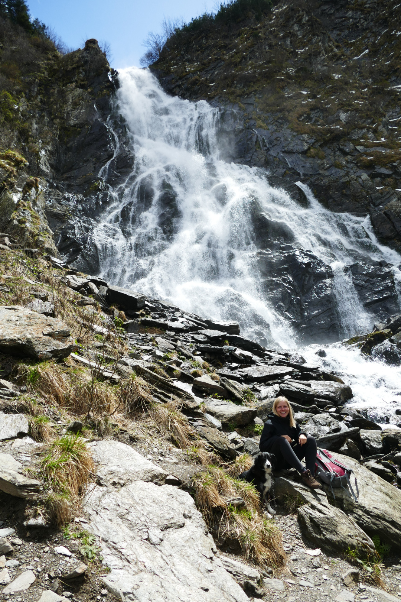

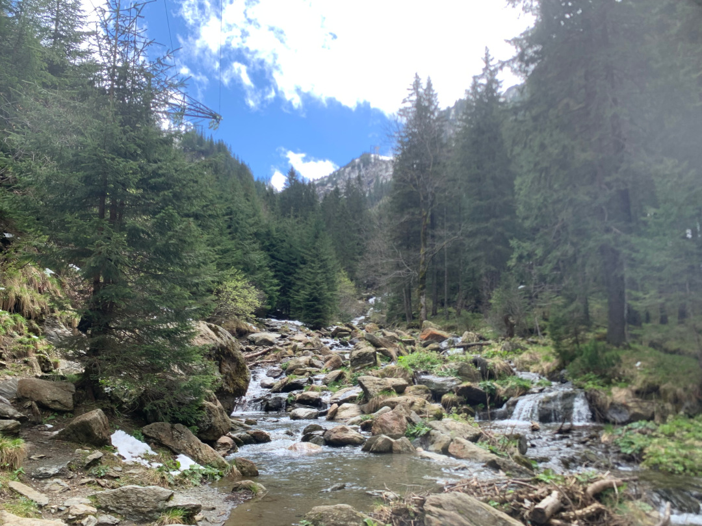

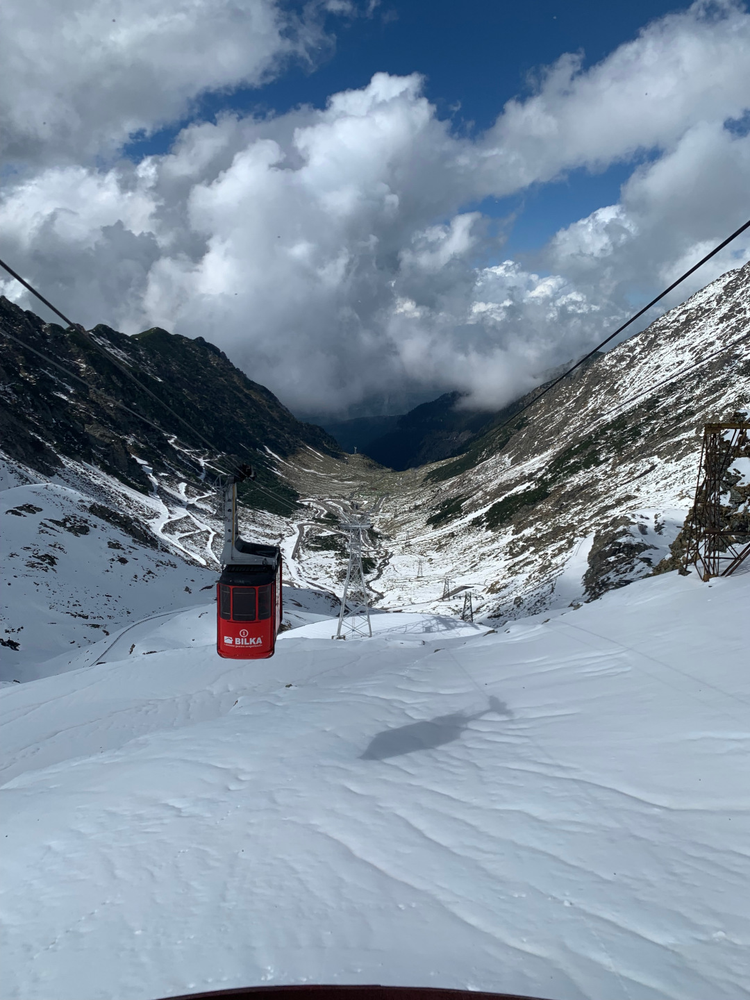

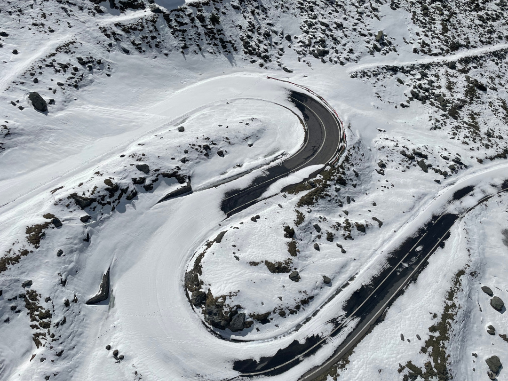

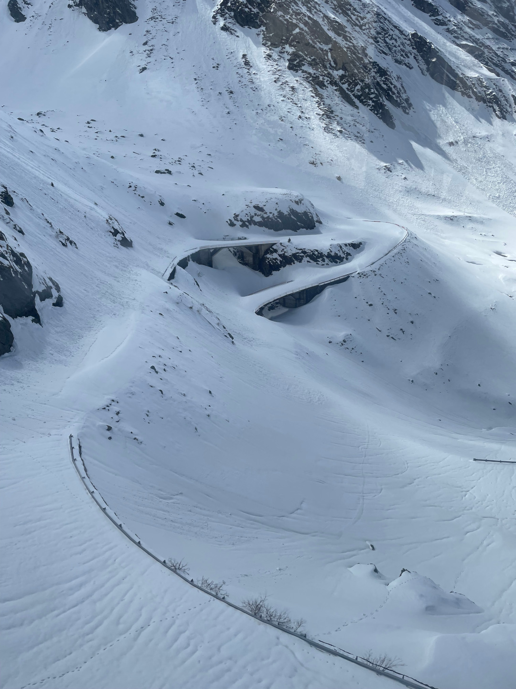

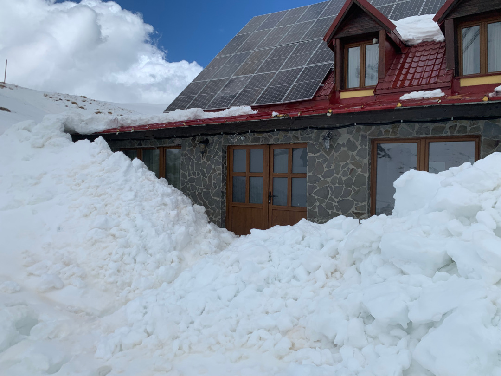

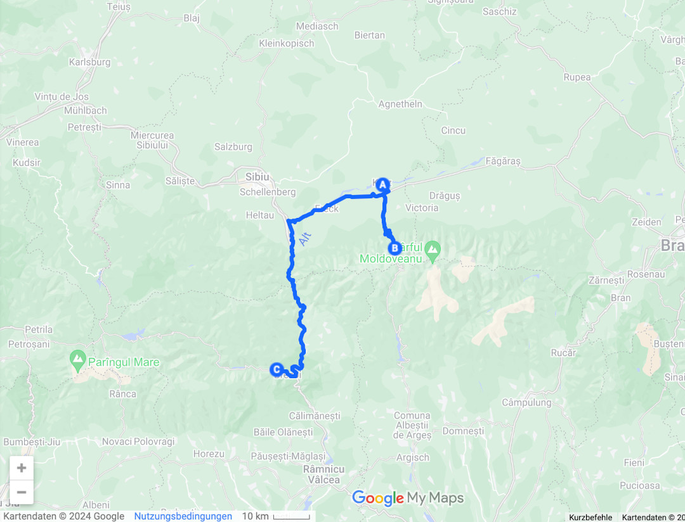

🗓️ 25. April: Heute werden wir leider mit Regen geweckt. Da fällt das Aufstehen nicht unbedingt leichter. Sobald man das Bett und den Bulli verlässt, wird man nass. Wir lassen es daher ruhig angehen. Kurz nach dem Aufstehen kommt eine Gruppe junger Rumänen zum Angeln. Das ist hier wohl angesagt. Wir werden also wie am ersten Tag in Rumänien von angelnden Kindern geweckt. Aber auch die interessieren sich nicht für uns. Als wir gerade losfahren wollen, kommt der Besitzer und schenkt uns noch ein Glas Honig. Wir verabschieden uns und fahren Richtung südliche Transfăgărășan Hochstraße. Die Straßensperrung im Süden ist deutlich später als gestern im Norden. Wir sollen bis zur Sperrung fast zwei Stunden fahren. Wir verlassen den letzten Ort Arges, bevor es in Serpentinen bergauf geht. Wir fahren vorbei am Vidraru See und immer weiter bergauf. Es dauert nicht lange, bis wir den ersten Bären die Straße entlanglaufen sehen. Es ist das erste Mal, dass wir einen Braunbären in freier Wildbahn sehen, wenn auch aus dem Auto. Die Transfăgărășan ist bekannt dafür, dass man Bären entlang der Straße sehen kann. Gerade im Frühjahr sind die Chancen groß. Die Bären hoffen natürlich auf Abfall aus dem Auto, den sie fressen können. Oft werden sie auch direkt von Autofahrern gefüttert, deshalb kommen sie auch immer wieder. Zusätzlich wird ihr Lebensraum immer kleiner. In Rumänien gibt es fast 7.000 Braunbären. Auch wenn die Gründe also eher weniger erfreulich sind sie anzutreffen, freuen wir uns über unseren ersten Bären. Insgesamt sehen wir heute acht Bären (über 0,1 % der gesamten rumänischen Population) am Straßenrand und in den Büschen daneben. Drei einzelne wohl männliche Bären, eine Mutter mit einem Nachwuchs und einmal drei Bären zusammen, eine Mutter mit zwei Jungen. Gerade die Mütter sind riesig. Ohne Auto wäre das vielleicht anders verlaufen. Trotz der Bären halten wir aber ab und zu am Straßenrand, um Fotos zu machen oder doch eine Runde mit Henry zu gehen. An Fußgängern sind die Bären aber weniger interessiert, so dass wir keine direkte Begegnung ohne Auto haben. Die umgekippten Mülltonnen zeigen aber, dass hier vor kurzem noch ein Bär entlanggelaufen ist. Auf so eine große Wanderung wie gestern verzichten wir aber. Das Wetter wäre sowieso nicht so gut dafür gewesen. Es regnet seit heute Morgen durchgehend. Nach den Bärensichtungen und an der Straßensperrung angekommen drehen wir um und machen wir uns zurück auf den Weg nach Arges. Etwas südlich vom Ort liegt unser Campingplatz. Weil es weiterhin so regnet, fällt unser Kochen heute im wahrsten Sinne des Wortes ins Wasser und wir besorgen uns Pizza. Bei Kaufland kaufen wir noch ein paar weitere Dinge ein. Sehr viele Produkte sind aus Deutschland und sogar die Verpackung ist Deutsch, man erkennt quasi alles wieder. Wir würden ja woanders einkaufen, wenn die Alternative zu Kaufland nicht Aldi, Lidl und Penny heißen würde, wo es nicht anders ist. Nur die kleinen Magazine sind eher heimische Einkaufslädchen. Gegen Abend hört es dann auf zu regnen und so können wir die Pizza bei 8 Grad noch draußen essen.

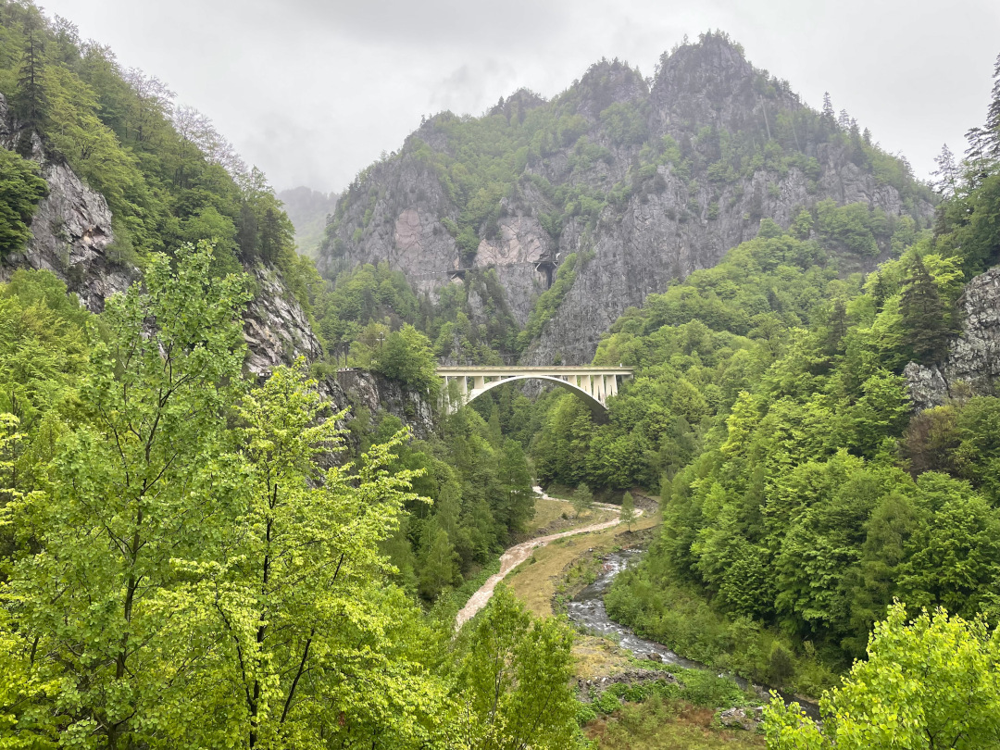

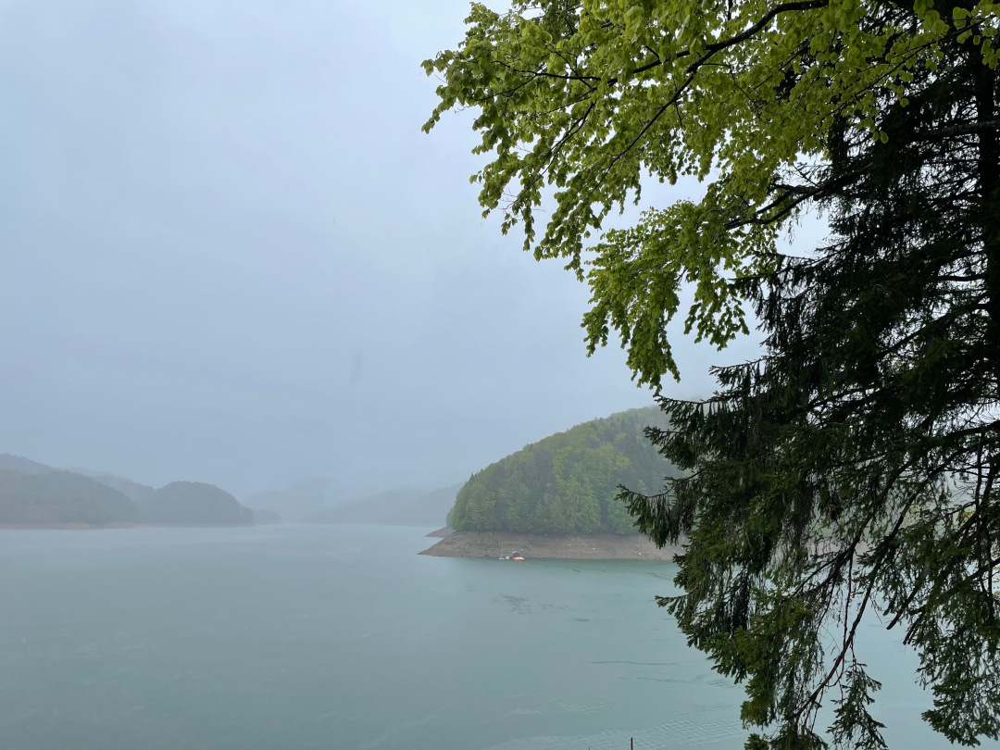

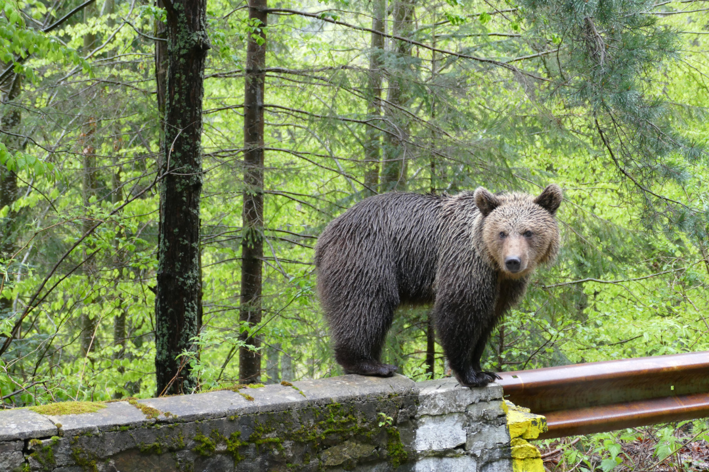

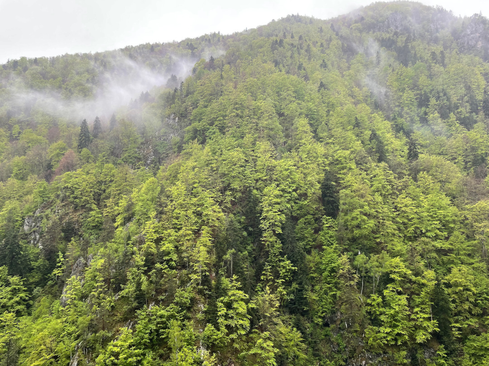

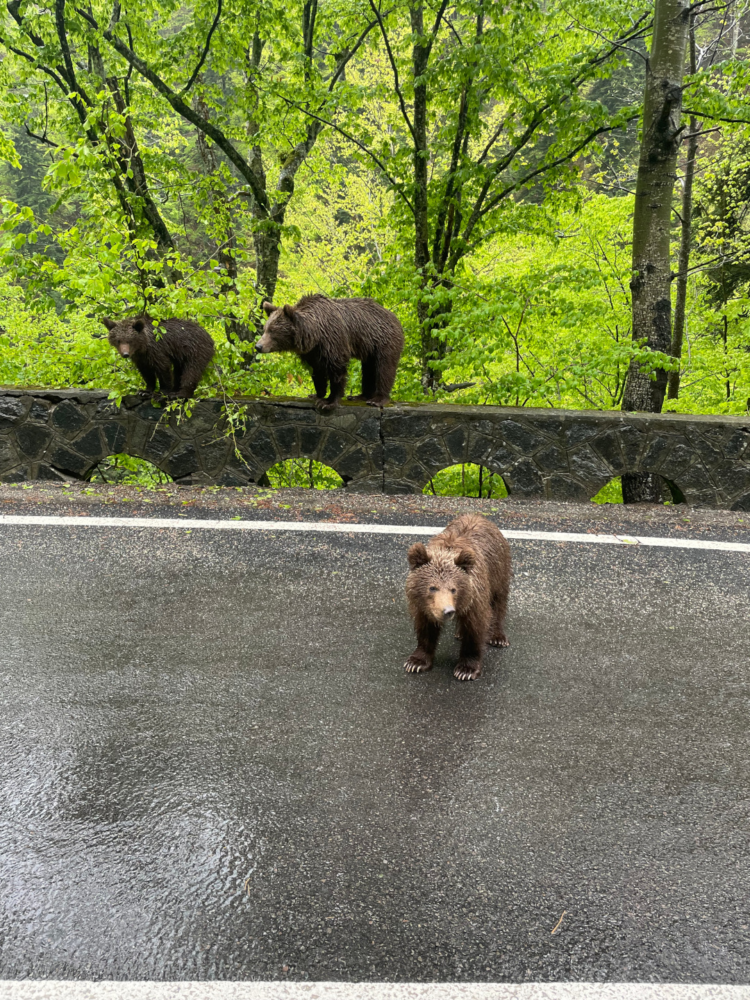

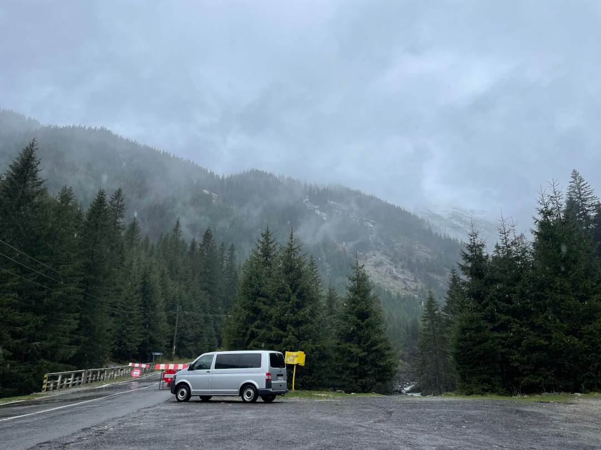

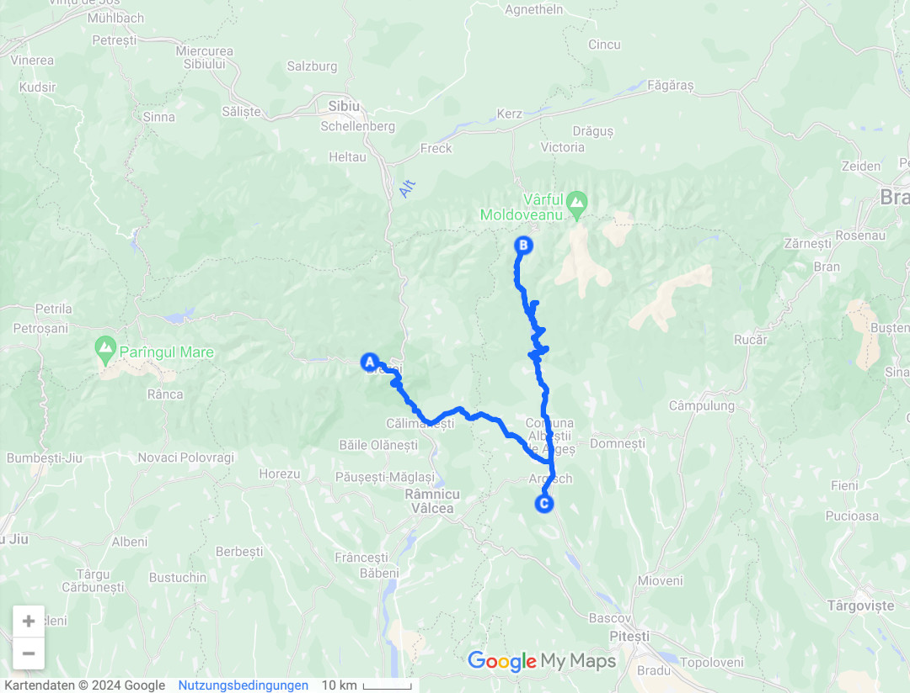