Am Vansee entlang geht es immer weiter ins Grenzgebiet der Türkei zu Armenien und dem Iran, und damit auch zum höchsten Berg der Türkei.

<!--more-->

🗓️ 24. Juni: Erneut ist die Aussicht auf den Kratersee beim Aufstehen wirklich super schön. Mit Henry geht’s direkt wieder runter zum See, damit wir unsere morgendliche Schwimmtradition fortführen können. Danach nutzen wir mal unsere Outdoor-Dusche. Wir machen den Bulli startklar, verabschieden uns von den anderen und düsen zurück über die Feldwege und die holprige Pflasterstraße, bis wir wieder unten in der Stadt Tatvan ankommen. Hier besorgen wir uns Wasser und Dürüm und fahren weiter, bis zu einer kleinen Landzunge, die in den Vansee hineinragt, um in Ruhe zu essen und ein paar Sachen zu erledigen, nachdem wir jetzt zwei Tage im Telefon- und Internetloch steckten. Anschließend geht es weiter, und zwar (wen wunderts) Richtung Osten. Wir müssen nach den Holperpisten dringend mal wieder unseren Reifendruck prüfen. Nachdem wir an den ersten Tankstellen nicht fündig wurden, empfiehlt uns jemand ein Reifengeschäft neben der Moschee. Hilfsbereit kommt sofort jemand, allerdings mit Schläuchen, an denen man den Druck gar nicht ablesen kann. Deshalb ist es uns ein Rätsel, ob er jetzt Luft drauf gemacht oder eher abgelassen hat. Unser Geld möchte er jedenfalls nicht annehmen. Wir fahren erstmal weiter, aber so ganz beruhigt sind wir noch nicht. An einer Shell-Tankstelle sehen wir dann doch noch ein Luftdruckgerät. Tatsächlich hatten wir jetzt eher zu viel als zu wenig Druck. Jetzt können wir also beruhigt sein und gönnen dem Bulli direkt auch mal ne Wäsche nach dem ganzen Staub. Auf unserem Weg zum Ararat kommen wir der Grenze zum Iran immer näher. An einer Stelle sind es nur wenige Meter. Deshalb sehen wir viele Grenzposten, Zäune und Mauern oben in den Bergen. Heute bleiben wir von Polizeikontrollen aber verschont. Im Hof eines Hostels im Ort Doğubayazıt finden wir noch ein Plätzchen für den Bulli und lustigerweise ist auch der britische Jeep wieder hier. Jetzt haben wir uns schon zum dritten Mal wieder getroffen, aber immer mit ein paar Tagen dazwischen. Der Empfang beim Hostel ist sehr freundlich, auch wenn es natürlich ein guter Kontrast zum Freistehen am Kratersee ist, hier im kleinen Hof. Aber es gibt eine schöne Terrasse mit Blick auf den Ararat. Hier kann man sich einfach immer umsonst an Kaffee und Tee bedienen und weil sie etwas höher gelegen ist, schön im Wind etwas abkühlen. Nach einer Henry-Runde gehen wir noch in ein Restaurant um die Ecke. Weil wir schon müde sind, gehen wir nicht in das vom Betreiber empfohlene Restaurant sondern wirklich in das mit kürzester Distanz. Danach sitzen wir noch etwas auf der Terrasse und verkriechen uns dann im Bulli.

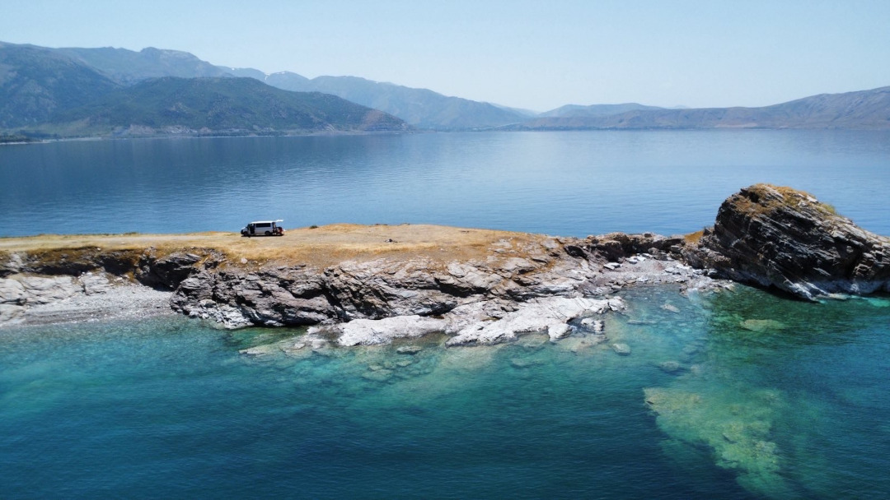

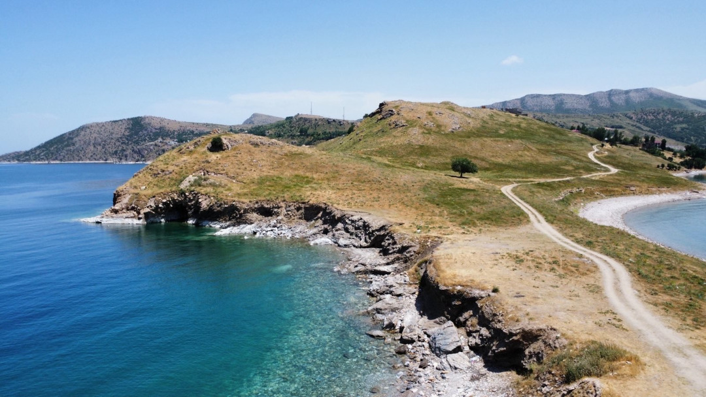

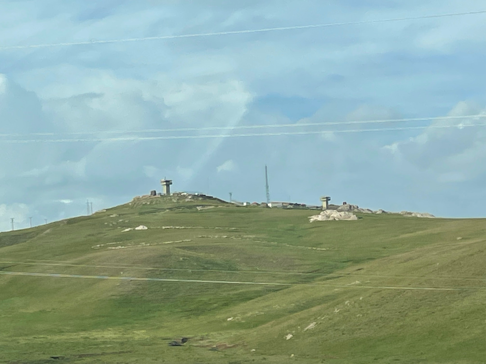

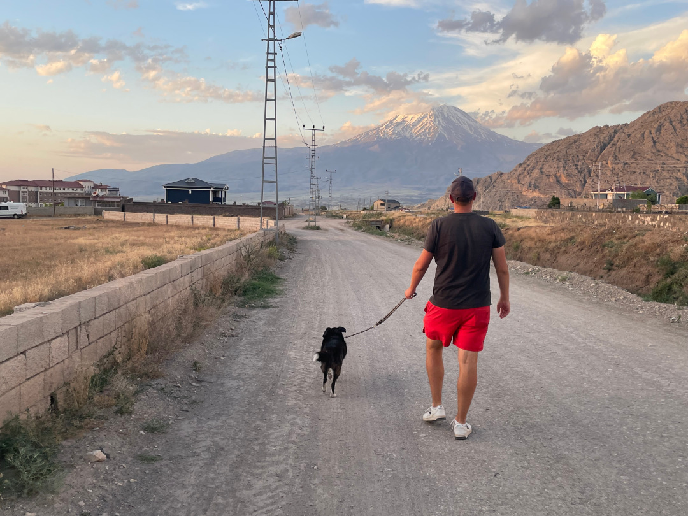

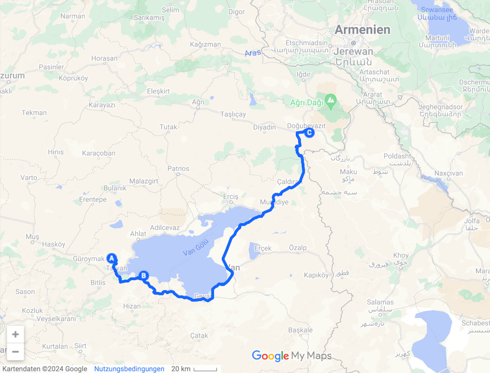

🗓️ 25. Juni: Wir sind relativ früh wach und drehen eine erste Henry-Runde mit Blick auf den Ararat. Dann entscheiden wir noch eine Nacht zu bleiben, sprechen mit dem Betreiber ab, dass er uns unseren Platz freihält und düsen nochmal mit dem Bulli los. Wir besorgen mal wieder alles für ein Picknick. Der Ort hier ist echt vergleichbar wuselig wie in Marokko. Die Autos schieben sich nur so in alle Richtungen und jeder bleibt stehen, wo er gerade stehen möchte. Wir passen uns an und finden gegenüber vom Supermarkt noch ein Plätzchen. Mit unserem Einkaufswagen manövrieren wir also fachmännisch durch den Stau. Dann fahren wir noch näher an den Ararat heran, halten an einer Schotterpiste in der Landschaft und picknicken. Nach einer Weile düsen wir weiter zum Ishak Pasa Sarayi, einem burgähnlichen Palast aus Zeiten des osmanischen Reiches. Der fügt sich schön in die bergige Landschaft ein und man hat eine gute Aussicht, es ist aber auch relativ viel los. Anschließend geht’s zurück zum Hostel. Wir nutzen nochmal die Waschmaschine und dann die Dachterrasse aus. Abends geht’s noch auf eine letzte Henry-Runde, bevor wir wieder ins Restaurant gehen. Dieses Mal schaffen wir es aber den einen Kilometer bis zum empfohlenen Restaurant zu laufen. Und der Hostel-Besitzer behält recht. Das Essen, Preis-Leistung und vor allem die gute Stimmung der Mitarbeitenden sind hier wirklich top und so schlemmen wir uns so durch. EM zeigen sie auch noch, so dass wir nebenbei Holland gegen Österreich gucken. Wir sind so etwas wie die Stars im Restaurant. Jeder heißt uns willkommen und begrüßt uns im Namen der gesamten Türkei. Verabschiedet werden wir mit Handschlag. Den Abend lassen wir auf der Terrasse ausklingen.

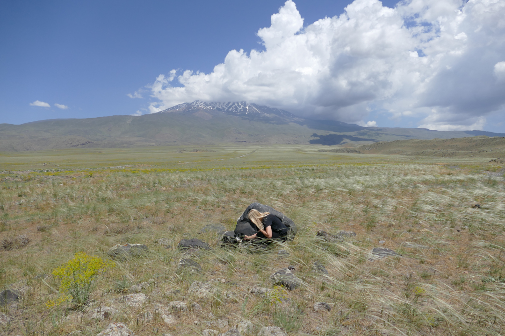

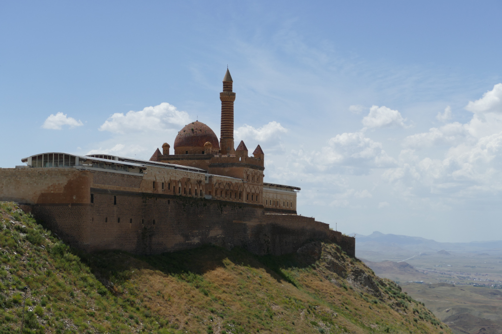

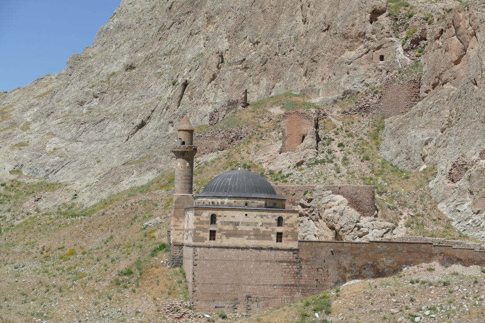

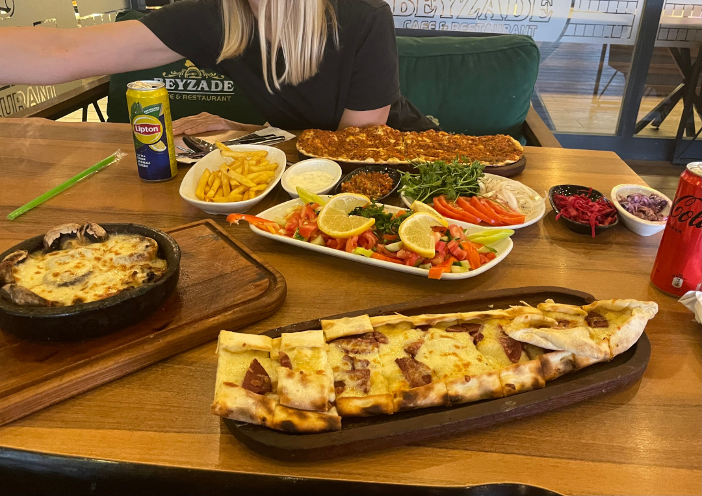

🗓️ 26. Juni: Ein letzter Morgen im Hof de Hostels heißt auch eine letzte Henry-Runde mit Blick auf den Ararat. Der liegt aber noch in den Wolken. Die verschwinden nämlich meistens erst gegen Abend. Als wir uns verabschieden, gibt der Besitzer des Hostels uns noch ein paar Tipps mit auf den Weg. Im Ort besorgen wir unterwegs auch noch schnell Frühstück. Dann sind wir bereit für die Fahrt nach Ani. Der Ort liegt an der Grenze zwischen der Türkei und Armenien auf einer Hochebene neben einer Schlucht, war früher ein wichtiger Knotenpunkt der Seidenstraße und bildete die Hauptstadt des mittelalterlichen armenischen Königreichs. Heute sind nur noch Ruinen der Stadt übrig, die im Laufe der Jahrhunderte von christlichen und muslimischen Dynastien geprägt wurde. Wir spazieren also durch die Ruinen und Wiesen. Auf der anderen Seite blicken wir schon auf Armenien und auch unsere Handys wählen sich schon im armenischen Netz ein. Trotzdem wird es noch dauern bis wir in dem Land ankommen, denn die Grenze zwischen der Türkei und Armenien ist geschlossen. Deshalb werden wir in den nächsten Tagen den Umweg über Georgien nehmen.  Erstmal fahren wir weiter nach Kars, um einzukaufen. Da kündigt sich schon durch sehr starken Wind ein Unwetter an. Auf der Weiterfahrt in die Berge fängt es dann auch an zu regnen und wird immer kälter. Zum Glück hält der Regen nicht lange an, aber die Temperatur fällt auf 7,5 Grad. Heute Morgen waren es noch 30 Grad. Der Kontrast ist also mal wieder perfekt. Jetzt kramen wir in den Tiefen des Bullis also lange Hosen, Pullis und sogar Jacken raus. Belohnt werden wir aber mit einem sehr schönen Platz zum Freistehen in der Nähe von Cidir, direkt an einer Schlucht gelegen und gegenüber einer kleinen Burg, der Seytan Kalesi. Die Aussicht ist echt traumhaft. Wir kochen noch und kämpfen dabei sehr gegen den Wind, aber kriegen es hin, dass das Tortellini-Wasser endlich kocht. Abends verschwinden dann sogar etwas die Wolken und die Sonne geht genau über der Schlucht unter. So gehen wir staunend ins Bett und nachts gibt es noch einen tollen Blick auf den Sternenhimmel über der Schlucht.

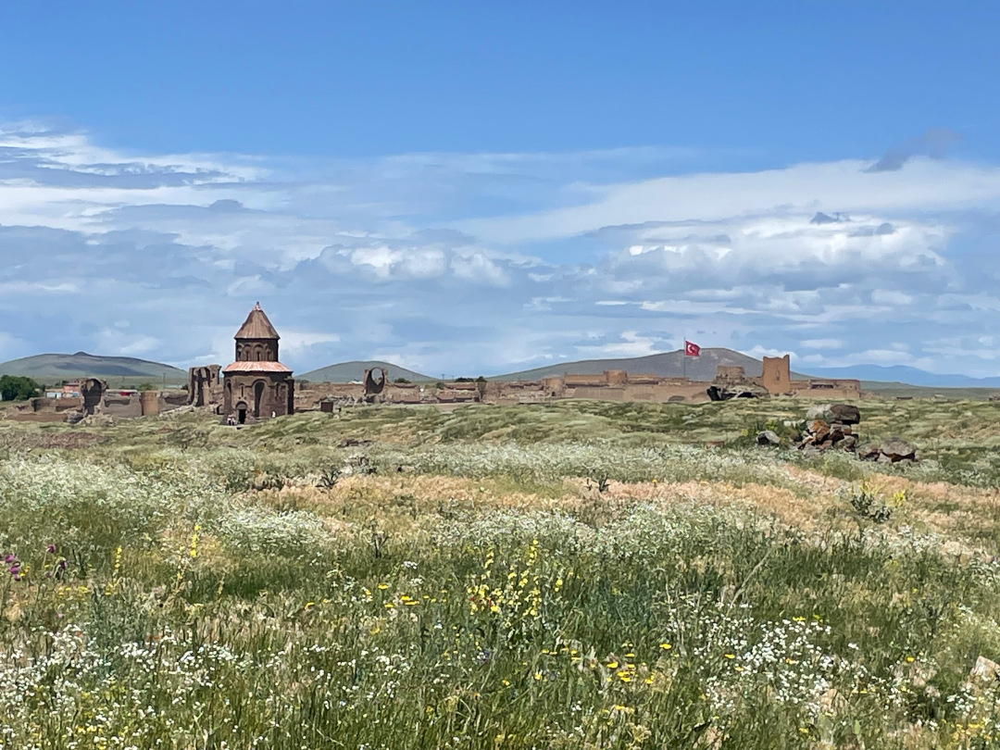

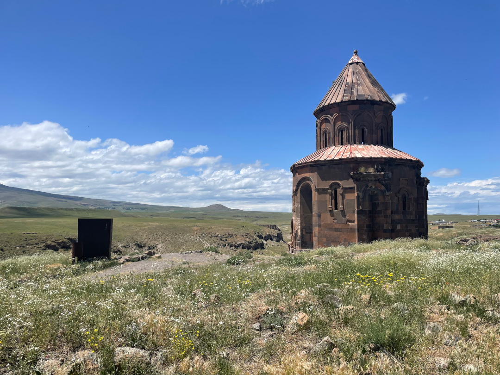

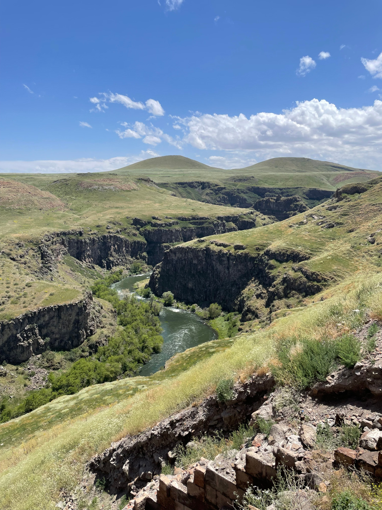

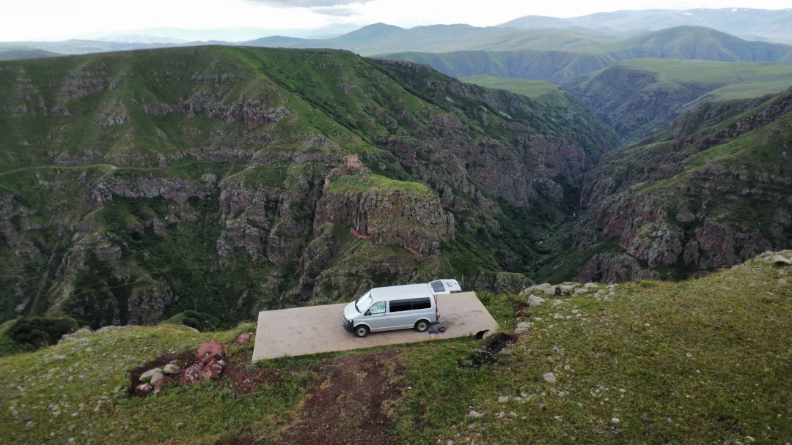

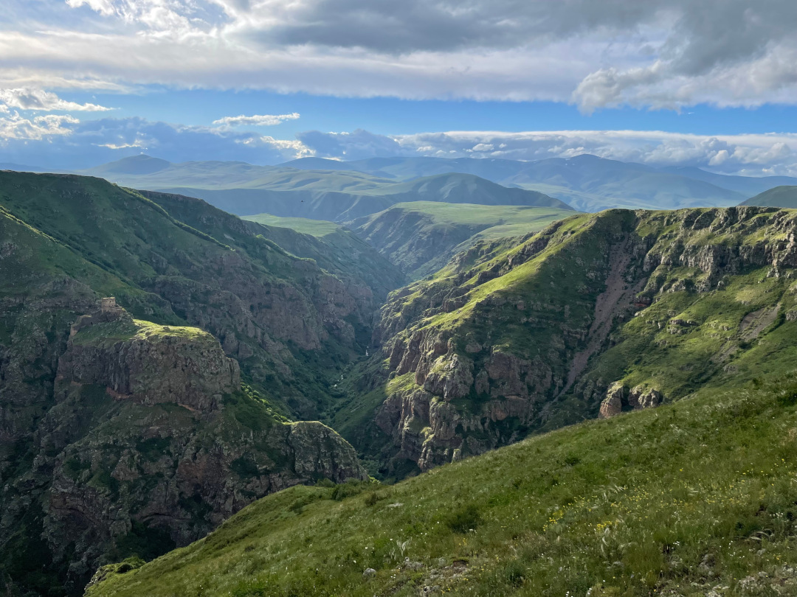

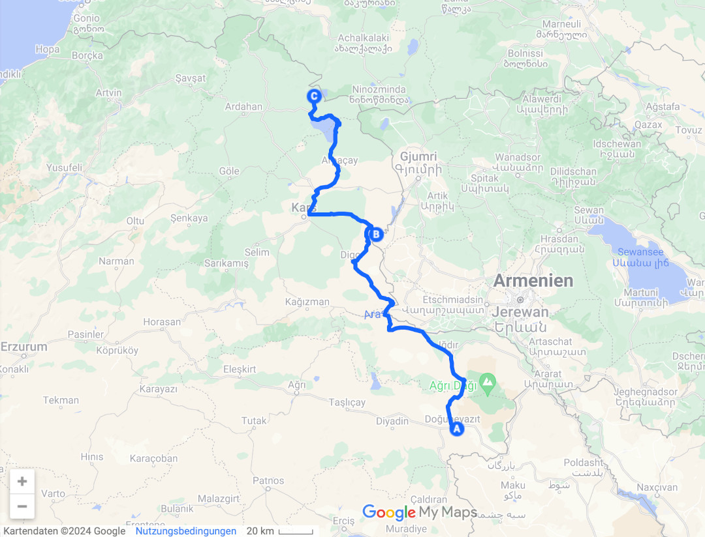