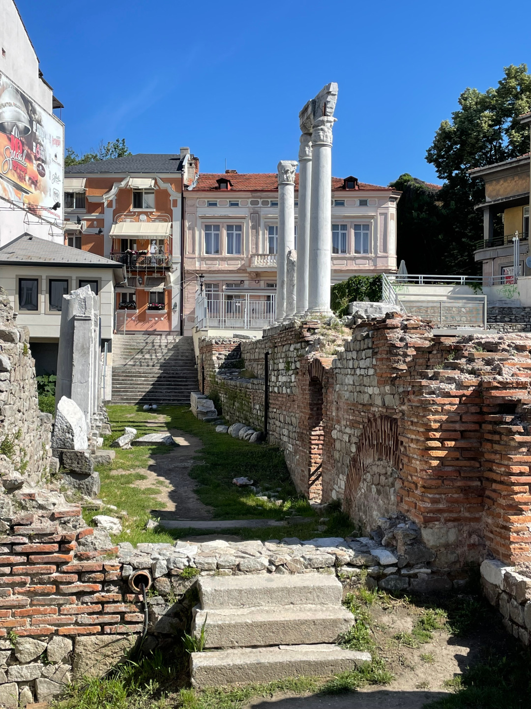

Wir lassen die Nationalparks hinter uns und fahren in die zweitgrößte Stadt des Landes.

<!--more-->

🗓️ 25. Mai: Trotz der Party neben uns, konnte man später ganz gut schlafen. Kurzzeitig ist sogar der Sommer zurück und weckt uns mit Sonne. Wir gehen unsere Morgenrunde mit Henry am See und machen uns auf den Weg. Das Ziel ist Plovdiv, die zweitgrößte Stadt Bulgariens. Vorher wollen wir aber noch einen Zwischenstopp in den Rhodopen machen und zum Sitovo Wasserfall fahren. Unterwegs besorgen wir uns wie immer Frühstück und fahren dann noch anderthalb Stunden bis zum Wasserfall. In der Stadt, in der wir Frühstück besorgen, suchen wir noch eine Post, die wir nach langem Suchen dann auch finden. Das sieht alles sehr ausgestorben aus. Im wahrsten Sinne des Wortes. Direkt daneben hängen die Todesanzeigen. Der Wasserfall hingegen ist wirklich eher ein Geheimtipp, auch wenn ein paar andere Leute da sind. Der Wasserfall liegt direkt an der Straße, die durch die Rhodopen führt. Wir spazieren etwas dort entlang. Durch die Lage an der Straße sieht es mit der Brücke über den Wasserfall ganz cool aus. Danach machen wir uns auf nach Plovdiv. Hier haben wir am Stadtrand einen Campingplatz gefunden. Der ist komplett digital. Mitarbeiter gibt es so gut wie keine. Man bucht online, bekommt einen QR-Code und kann so auf den Platz fahren, parken und Toiletten und Duschen nutzen. Neben uns sind nur noch zwei andere Camper vor Ort. Wir erkunden die Umgebung mit einem Spaziergang zum nächsten Billa. Neben unserem Campingplatz befindet sich noch das Trainingsgelände von Botev Plovdiv, wo wir zufälligerweise noch ein Spiel der zweiten Mannschaft sehen können. Wir kochen danach noch etwas und entspannen am digitalen Campingplatz.

🗓️ 26. Mai: Weil der Sommer ja jetzt Einzug erhalten hat, stehen wir heute sehr früh auf, um uns die Altstadt von Plovdiv anzugucken. Das ist für uns und für Henry wegen der Wärme entspannter. Das Busfahren ist quasi wie in Moldau. Entweder sitzt eine Ticketverkäuferin mit im Bus oder man kann beim Busfahrer Tickets kaufen. Nach zwanzig Minuten erreichen wir die Altstadt. Teilweise liest man, dass Plovdiv die ältestes Stadt Europas ist. Genau beweisen kann man das aber nicht. Wenn man durch die Altstadt läuft, kann man das aber teilweise denken: Viel römischer Einfluss, unter anderem durch die antiken Stadien. Sonntagmorgens ist zum Glück noch nicht viel los. Wir laufen vom antiken Stadion zum ethnographischen Museum und durch die Altstadt-Gassen. Auch hier gibt es wieder die Handwerker-Gasse, in der früher und sogar noch heute das ganze Handwerk angesiedelt ist. Danach laufen wir durch den moderneren Teil der Innenstadt, der jetzt die neue Fußgängerzone ist. Alles in allem ist das an einem Sonntag eine sehr entspannte Sache. Gegen 11 Uhr sind wir schon wieder am Bulli, wo wir noch mit zwei deutschen Rentnern ins Gespräch kommen, die uns noch Tipps für die Türkei geben, auch wenn ihr Besuch schon zehn Jahre her ist. Davon begeistert planen wir schon mal etwas die ersten Tage in der Türkei, auch wenn es für uns noch etwas hin ist. Danach gehen wir mit Henry in den benachbarten Park, wo wir draußen in einem Restaurant sitzen können. Wie so oft gibt es in Bulgarien gegrilltes Fleisch. Schmeckt aber auf jeden Fall. Als Vorspeise bringt uns der Kellner eine Schale Blaubeeren, ganz frisch bulgarisch wie er sagt. Gegen Abend als es wieder etwas angenehmer von den Temperaturen wird, geht es erneut in die Stadt. Dieses Mal aber zum Fußball. Heute spielt Lokomotive Plovdiv gegen CSKA Sofia, die wir ja letzte Woche schon in der Hauptstadt gesehen haben. Heute sehen wir aber unser wohl bestes Spiel in Bulgarien. Aus Sofia kommen ungefähr 300 Leute mit und in der Plovdiv Kurve stehen auch mindestens 1000 Leute. Wir beide übrigens auch, weil wir wohl beim Ticketkauf nicht ganz aufgepasst haben. Es bleibt aber alles ruhig, niemand interessiert sich für uns. Das erste Mal gibt es auch Bier in einem bulgarischen Stadion, was auf Seiten Plovdivs auch gut angenommen wird. Mit bester Sicht in der Kurve können wir viele betrunkene bulgarische Fußballfans sehen. Das macht das Spiel noch besser. Es ist aber auch so schon viel Feuer drin. CSKA und Lokomotive Plovdiv haben wohl nicht das beste Verhältnis. Es fliegen Leuchtraketen, Böller und Pyrotechnik aufs Spielfeld, was aber anscheinend niemanden interessiert. Knallhart wird weitergespielt. Auch wenn die Playoffs gelaufen sind und der bulgarische Meister feststeht, macht das Spiel Spaß. Plovdiv gewinnt 1:0. Nach dem Spiel ergattern wir noch mit Mühe ein Taxi, das uns kurz vor Mitternacht zurück zum Bulli bringt. Dort angekommen merken wir, dass wir komplett alleine sind. Ein bisschen wie Freistehen also, weil ja durch den komplett digitalen Campingplatz auch kein Personal vor Ort ist. 

