Die zweite Tour durch die Türkei führt uns diesmal durch den Norden entlang der Schwarzmeerküste.

<!--more-->

🗓️ 25. Juli: Wir stellen uns früh den Wecker, weil wir heute einige Kilometer fahren wollen und Georgien in Richtung Türkei verlassen. Vorher möchten wir aber noch die Hängematte kaufen. Und weil Shorena sowieso noch einkaufen möchte, machen wir uns zu dritt auf den Weg. Wir haben ja beim letzten Besuch schon zu dritt vorne im Bulli gesessen und genau dasselbe machen wir jetzt auch. Bei einem der vielen Straßenhändler gibt es Hängematten, Stühle, Tische und Liegestühle. Wir finden eine coole bunte Hängematte und Shorena findet einen Klapptisch. Sie kann für uns auf georgisch verhandeln und wir zahlen für unsere Hängematte keine 20 € und das, obwohl wir sogar noch die teurere Variante genommen haben. Danach geht es noch auf den Basar und zum Bäcker, um ein letztes Mal georgischen Kuchen mitzunehmen. Der Basar ist genauso wuselig wie sonst auch, aber weil wir hier schon zum dritten Mal sind, sind wir quasi Profis. Als dann aber noch ein Taxi über den Basar fährt, wirds eng. Aber wenn man mit dem Taxi Obst kaufen will und dafür bezahlt, wird man hingebracht, wo man möchte. Auch wenn es zum Zielort keine Straßen gibt. Wir kaufen noch etwas Obst und Gemüse und fahren zurück zum Campingplatz. Wir laden alle Einkäufe aus und verabschieden uns nun ein wirklich letztes Mal von Ushangi und Shorena. Wir bekommen noch den Khachapuri von gestern mit auf die Reise und geben im Gegenzug Shorena noch deutsches Vollkornbrot. Ein guter Deal für alle. Danach geht es ein letztes Mal über die katastrophalen georgischen Straßen zur Grenze. Mit Georgien endet dann auch die Gefahr durch Pferde und Kühe auf den Straßen, was wir heute nochmal gut zu spüren bekommen. Wir nehmen wieder den Grenzübergang bei Batumi und müssen also mitten durch den Stadtverkehr. Der Fernverkehr in Georgien muss leider immer mitten durch die Städte. Und das kann in Tiflis und Batumi sehr anstrengend sein. Auf einmal werden wir von einem Zivilpolizeiwagen hinter uns angehupt und zurechtgewiesen, weil wir uns zwischen einem schwarzen Mercedes mit Diplomatenkennzeichen und der Zivilpolizei einordnen wollen. Bei dem Chaos können wir das nicht rechtzeitig erkennen. Es bleibt aber alles ruhig und wie durch ein Wunder bleibt auch der Bulli in Georgien und Armenien unversehrt und wir erreichen die Grenze zur Türkei. Kurz vorher tanken wir für knapp über 1 Euro pro Liter nochmal voll. Die Grenze ist wie immer sehr langwierig. Hanna muss wieder zu Fuß über die Grenze und der Bulli wird schlussendlich viermal kontrolliert, bevor wir in die Türkei dürfen. Auch wenn Georgien und Armenien echt super schön waren und wir nette Menschen kennengelernt haben, sind wir froh wieder in der Türkei zu sein. Der Verkehr ist etwas ruhiger und wir werden direkt mit einer gut ausgebauten vierspurigen Straße begrüßt. Wir fahren noch eine Stunde an der Schwarzmeerküste entlang bis wir kurz vor Trabzon unseren Campingplatz finden. Der liegt direkt an einem Fluss, der ins Schwarze Meer mündet. Im Hintergrund steht eine kleine Moschee und der Muezzin begrüßt uns ebenfalls. Der Platz an sich ist zwar sehr klein und voll, aber für uns total ok. In Georgien und Armenien waren wir oft alleine, weil dort vor allem ausländische Touristen campen. In der Türkei campen aber vor allem Einheimische. Das war auf der Hinfahrt auch schon so, aber alle sind super nett und man gewöhnt sich an die Nähe. Henry kann sich mit dem Hund vor Ort nicht so ganz anfreunden und ist sehr auf Krawall gebürstet, aber es kommt zum Glück zu keinen nennenswerten Schäden. Den Tag lassen wir natürlich mit leckerem türkischem Essen und Blick auf den Fluss und die Moschee ausklingen. Allein dafür lohnt sich schon ein zweiter Besuch in dem Land.

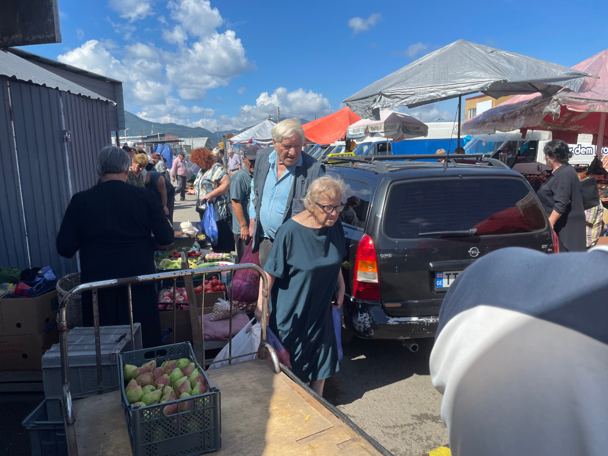

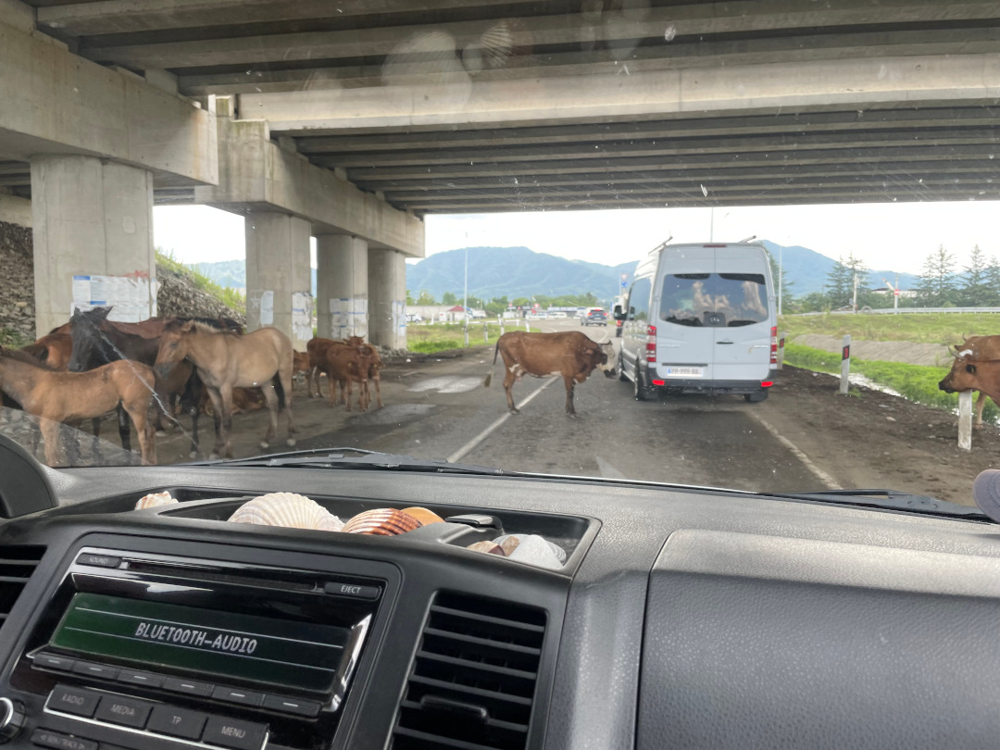

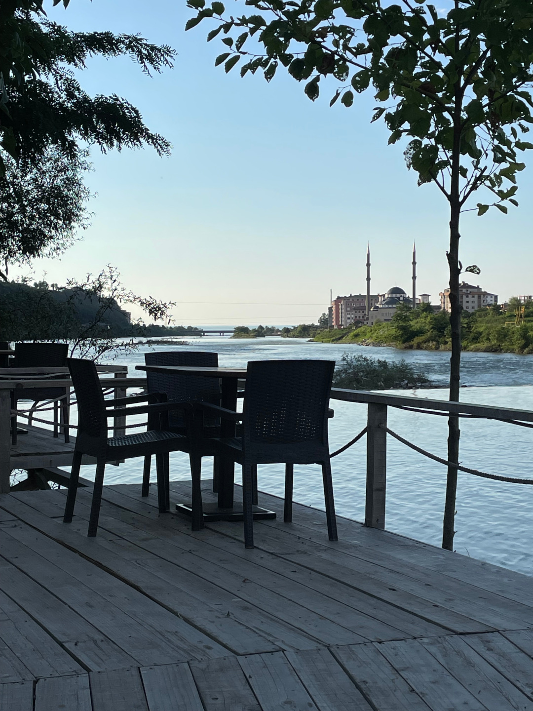

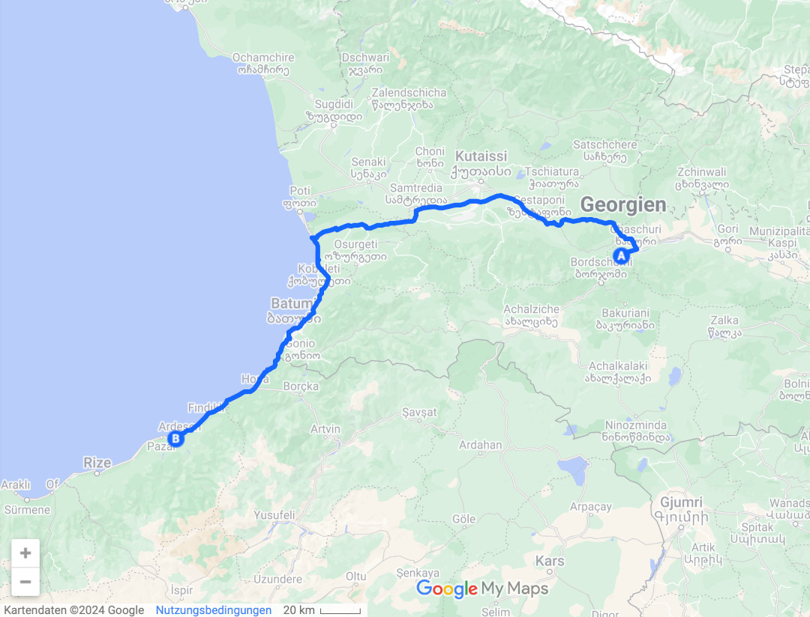

🗓️ 26. Juli: Heute sind wir auch ohne Wecker früh wach, weil es schon sehr früh sehr laut wird. Wir packen alles zusammen und machen uns schon früh auf den Weg. Auch heute machen wir viele Kilometer und fahren immer entlang der Schwarzmeerküste. In Trabzon versorgen wir uns mit Frühstück und Wasser und fahren noch etwas weiter zu einer Bucht. Wir haben uns für die Mittagspause eine der wenigen ruhigen Stellen an der Küste rausgesucht. Dass der Strand hier noch so idyllisch in einer Bucht liegt, macht es noch besser. Ansonsten ist die Schwarzmeerküste in der Türkei aus unserer Sicht nicht unbedingt sehenswert. Es ist überall sehr bebaut und es gibt viele große Städte. Auch die vierspurige Straße führt eigentlich immer direkt an der Küste entlang. So richtig ruhig ist es dadurch am Strand nie. Der Strand ist auch meistens aus Stein oder Kiesel. Wo es nicht bebaut ist, gibt es viele Teeplantagen. In Rize sehen wir ein Gebäude, das wie ein Teeglas gebaut wurde. Das sind aber neben unserer Bucht auch die einzigen Highlights. Ansonsten könnte man hier gut Fußball gucken, weil viele große Städte in der ersten türkischen Liga spielen, leider ist aber immer noch Sommerpause. Dafür sehen wir die ganzen großen Stadien. Wir machen also Mittagspause, gehen schwimmen und entspannen. Danach fahren wir noch knapp zwei Stunden zu unserem Stellplatz für die Nacht. Direkt am Meer gibt es einen Campingplatz, wenn man ihn so nennen möchte. Alles ist sehr einfach gehalten und die Toiletten nicht wirklich benutzbar, aber zum Glück sind wir dahingehend autark. Wir können direkt am Strand stehen und haben vom Bett aus die beste Sicht aufs schwarze Meer. Natürlich können wir so auch nochmal schwimmen gehen. Als wir ankommen, werden wir direkt von unseren Nachbarn begrüßt. Als ich ihnen erkläre, dass wir aus Deutschland kommen, dauert es nicht lange und er drückt mir ein Bier in die Hand. Er hat deutsches Bier und ich bin Deutscher. Das ist wohl seine Begründung. Ich setze mich zu allen und wir sprechen etwas. Leider kann ich nur ein paar türkische Wörter und die anderen nur ein paar englische Wörter. Deshalb ruft er seine Freunde aus Deutschland an, die für uns übersetzen. Seine Freunde wohnen im Saarland und wundern sich, wo wir Urlaub machen. Wir erklären, dass es ein sehr langer Urlaub ist. Danach kapseln wir uns ab und wollen uns auf den Weg zu einem Restaurant machen. Leider finden wir keins, so dass wir wohl oder übel in der Türkei selber kochen müssen. Als wir gerade anfangen wollen zu kochen, kommt unsere Nachbarin rüber und bringt uns einen Teller Nudeln mit Gemüse. Teilweise hat man zwar wenig Privatsphäre, aber dafür sind hier die meisten Leute sehr nett. Im Supermarkt werden wir manchmal gefragt, wo wir herkommen und dann von allen in der Türkei willkommen geheißen. Als Dank können wir unseren Nachbarn etwas deutsche Schokolade abgeben. Wir werden noch eingeladen uns dazu zusetzen, sind aber echt zu müde. Mit Blick aufs Meer schlafen wir mit Wellenrauschen ein.

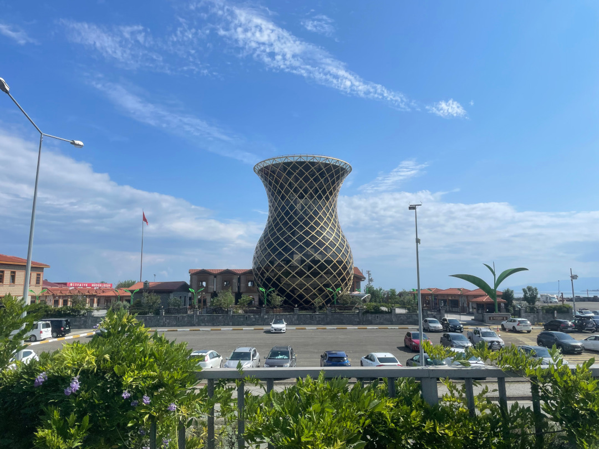

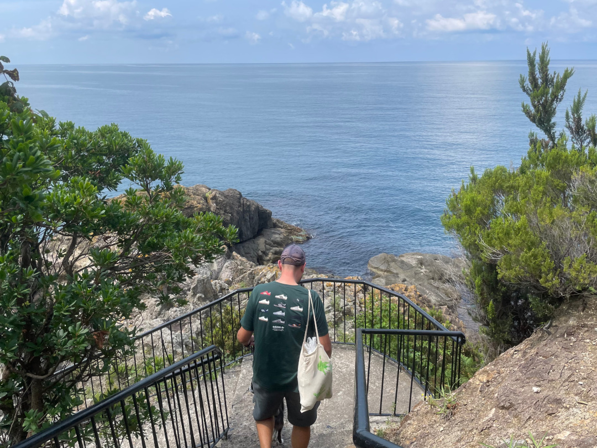

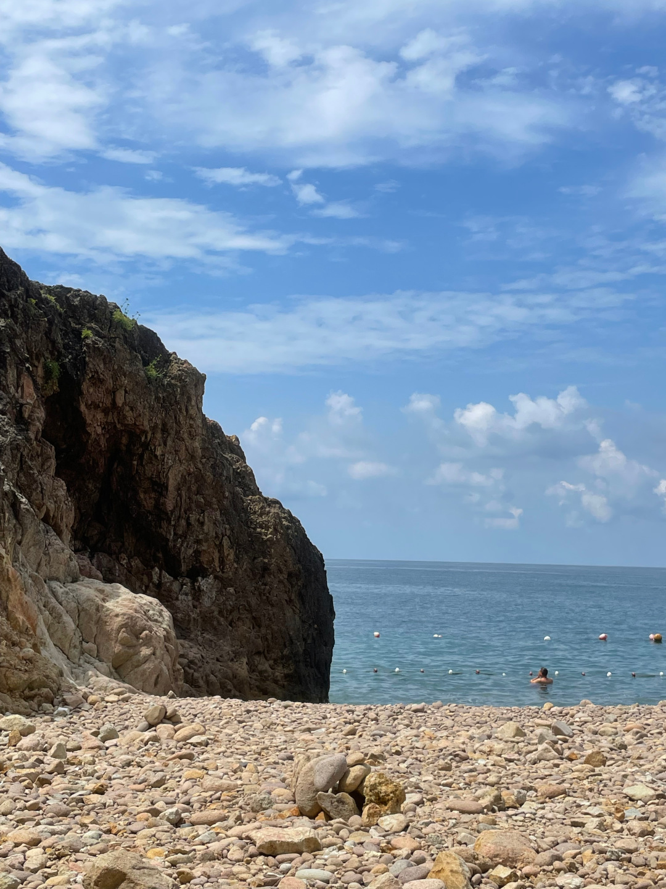

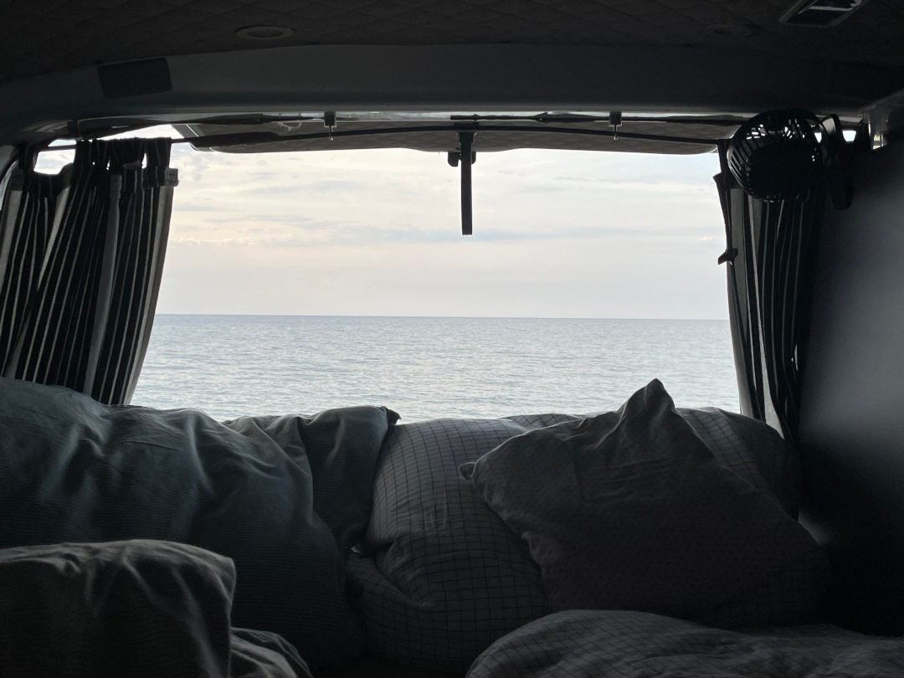

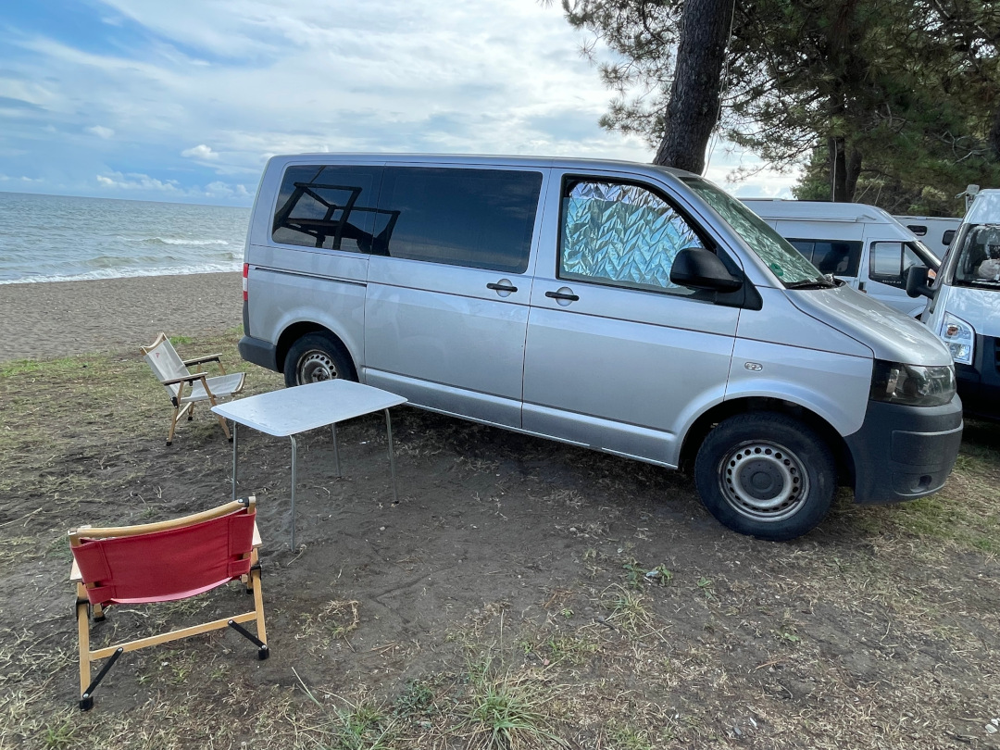

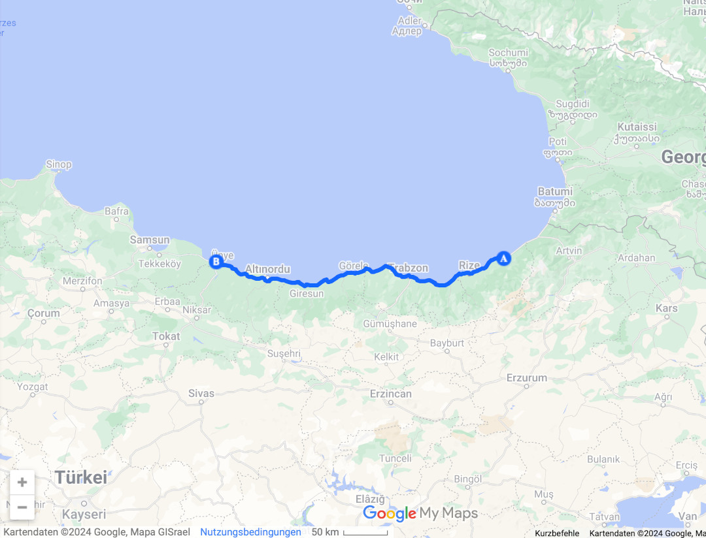

🗓️ 27. Juli: Wir stehen im Schatten und können deshalb mal etwas länger schlafen. Als wir den Bulli verlassen wollen, fällt mir auf, dass ich meine Schuhe draußen stehen gelassen habe. Meine Badeschlappen und meine New Balance. Leider ist von beiden Schuhen nur noch einer da. Das heißt, dass die Täter Straßenhunde gewesen sein müssen, die damit nachts spielen wollten. Wir machen uns am Strand auf die Suche nach den Schuhen. Den roten Badeschlappen finden wir relativ schnell nur ein paar Meter von Bulli entfernt. Weiter weg finden wir auch den New Balance Schuh und sogar der Socken ist noch im Schuh. Nach dem ersten Schreck am Morgen machen wir uns dann schnell startklar und fahren los. Auf einen Sprung ins Schwarze Meer verzichten wir. Es ist nämlich super windig und die rote Fahne weht. Heute geht es weiter immer entlang der Küste. In Samsun, der größten Stadt an der türkischen Schwarzmeerküste, besorgen wir Frühstück und Wasser. Heute stehen insgesamt sechs Stunden Fahrt auf dem Programm. Zum Glück finden wir ein gutes Hörbuch, das uns quasi die ganze Zeit beschäftigt. Ab und zu halten wir an der Küste an und gehen ein Stück mit Henry oder lassen uns vom Wind den Kopf frei pusten. Die Straße führt wirklich immer direkt an der Küste entlang. Bei Sinop verlassen wir dann aber nach über 1000 Kilometern die Küste und fahren ins Landesinnere. Wir wollen nach Safranbolu, eine Stadt, die für ihre Altstadt und die Fachwerkhäuser bekannt ist. Sie gilt als eine der schönsten Städte der Türkei und ist seit 1994 UNESCO Weltkulturerbe. Den Campingplatz im Ort hatte uns direkt am ersten Tag in der Türkei ein Engländer empfohlen und jetzt, anderthalb Monate später, profitieren wir davon. Am frühen Abend erreichen wir Safranbolu. Der kleine Campingplatz liegt nur zehn Minuten zu Fuß von der Altstadt entfernt. Wir machen uns auf den Weg zum Basar und es lohnt sich wirklich. Teilweise erinnert das Fachwerk sogar etwas ans Sauerland. Es ist zwar viel los, aber wir können entspannt über den Markt schlendern. Wir wollen endlich mal wieder Pide essen und finden in der Neustadt einen guten Laden. Leider ist die Neustadt 110 Meter oberhalb der Altstadt, was wir vorher nicht wussten. Also müssen wir vor dem Abendessen noch unser Sportprogramm absolvieren. Der Döner-/Pidemann empfängt uns sehr herzlich. Zum Abschluss gibt es noch Tee und dann geht es zurück zum Bulli (zum Glück jetzt bergab). Wir gehen noch eine Runde mit Henry und gehen ins Bett.

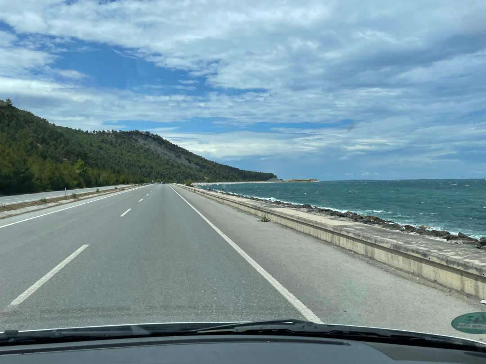

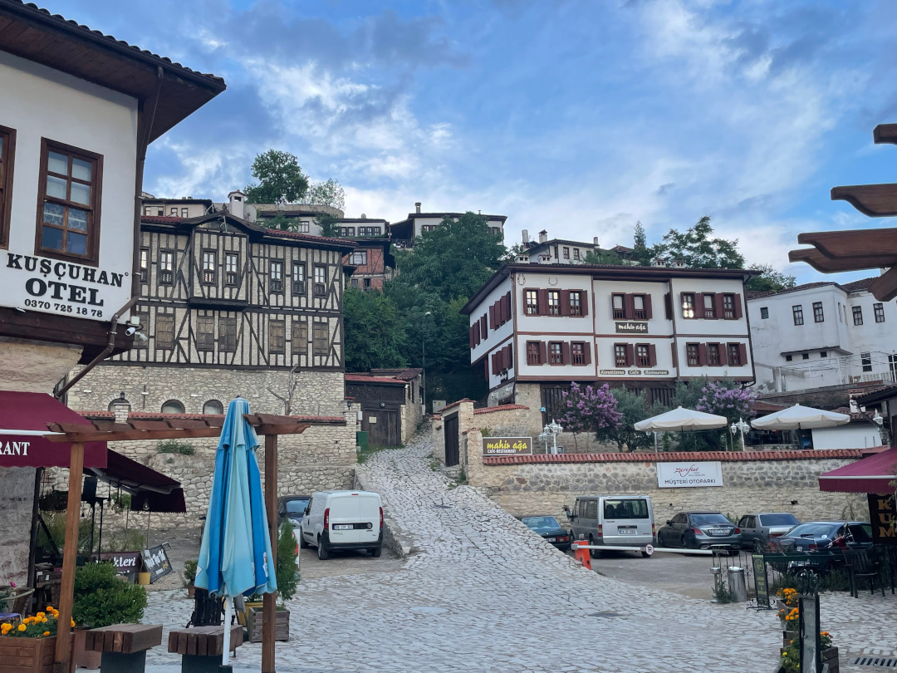

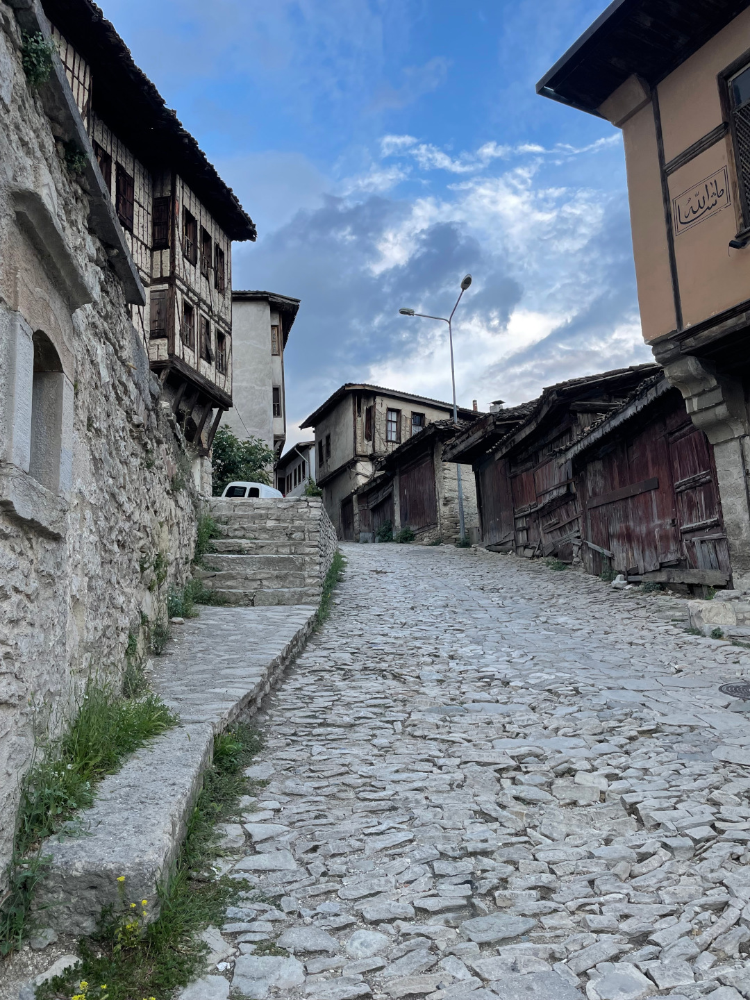

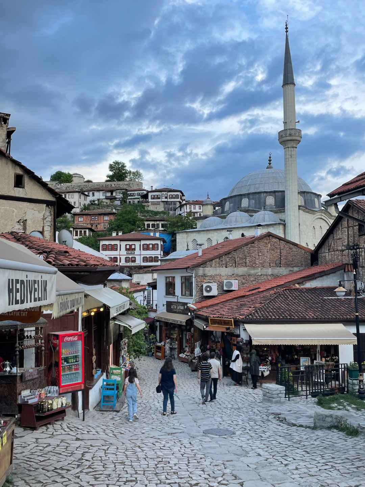

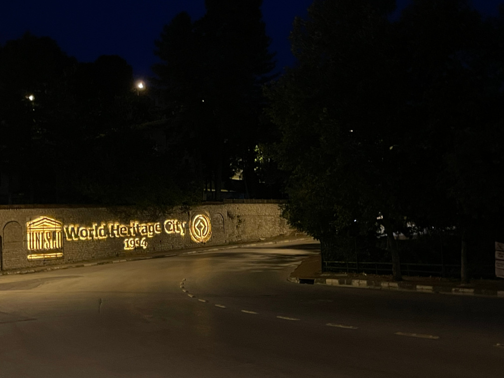

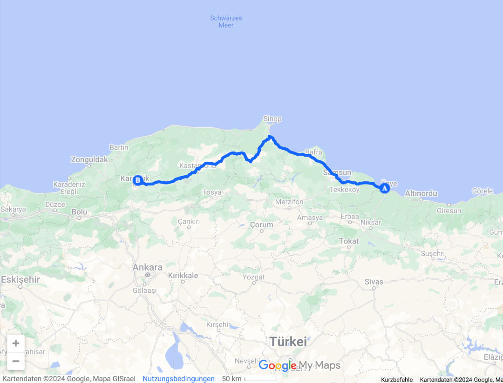