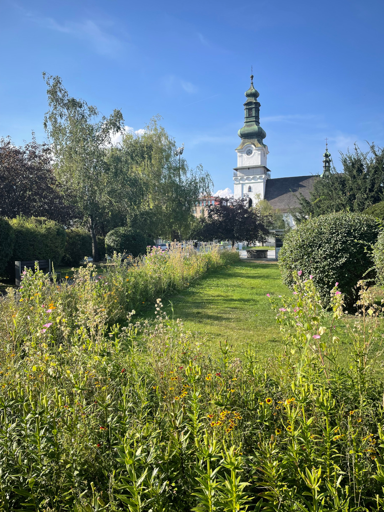
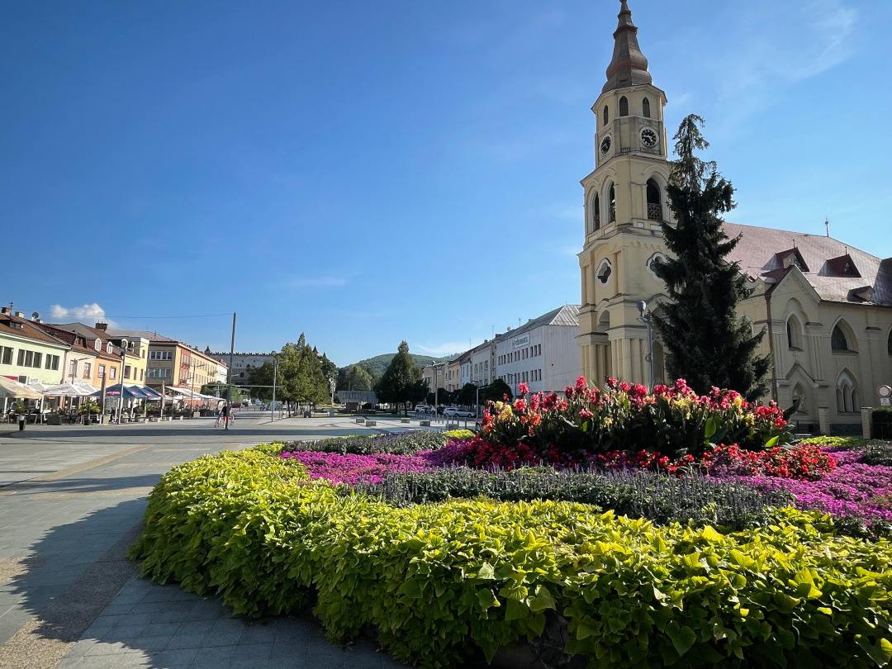
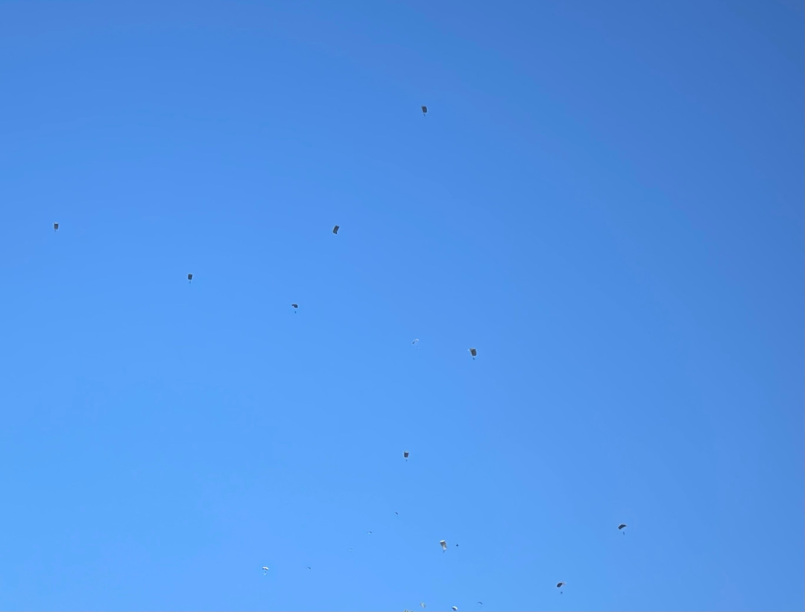
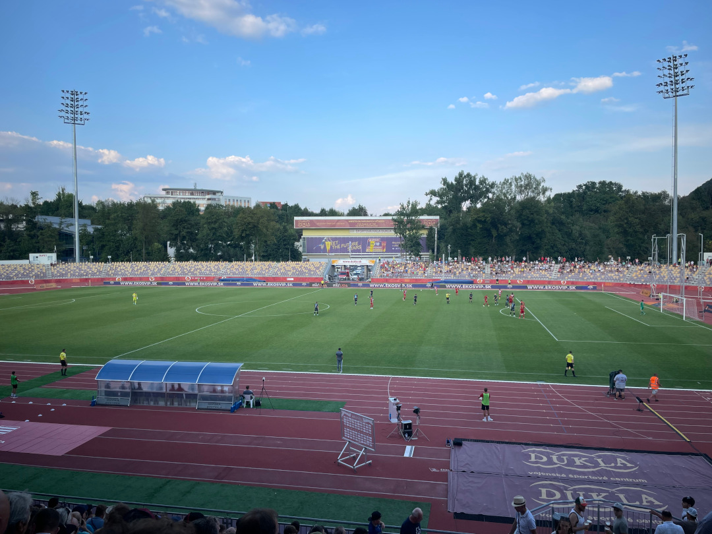
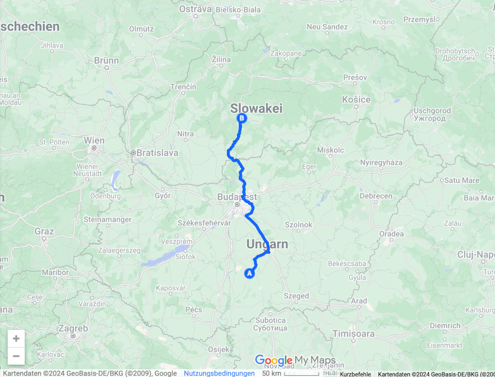
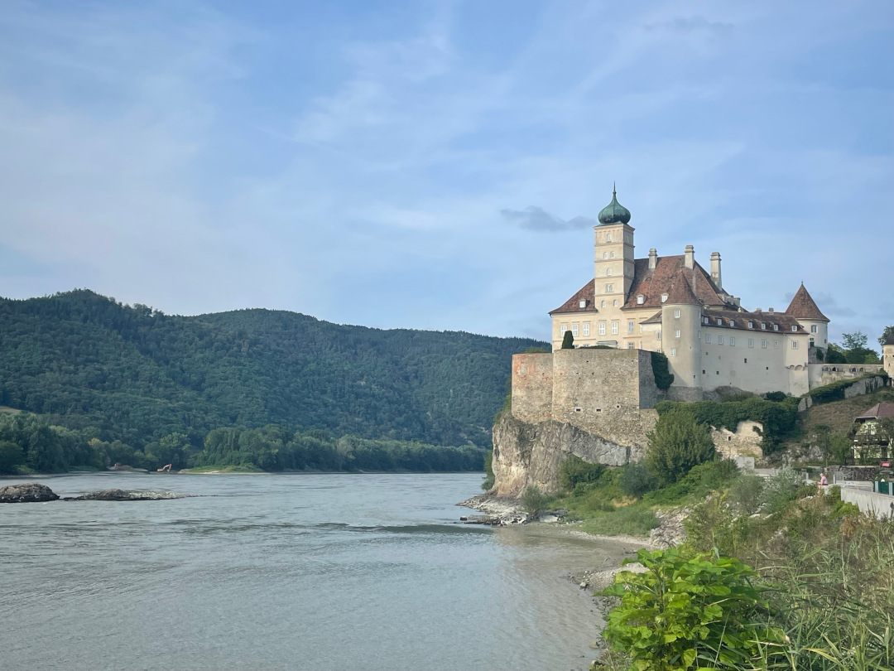
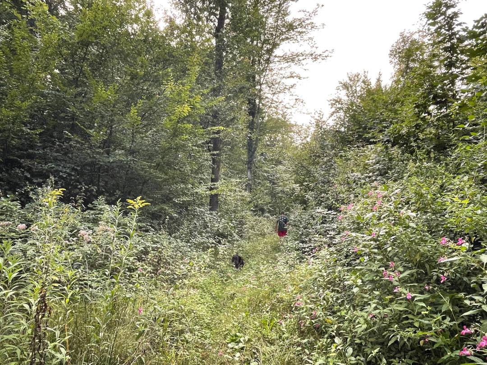
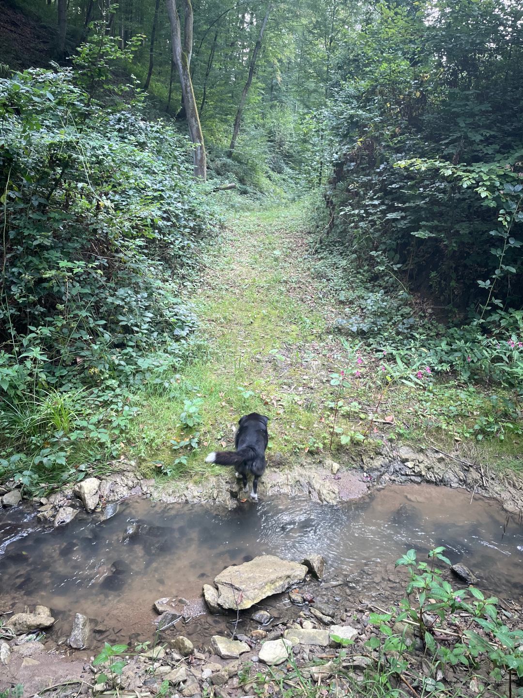
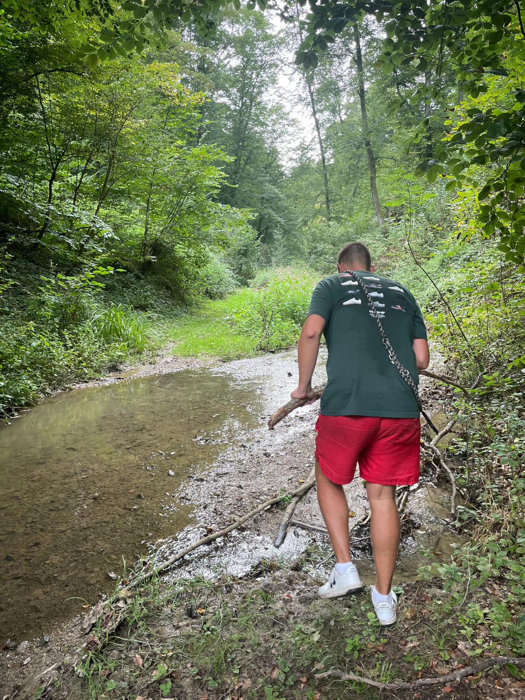
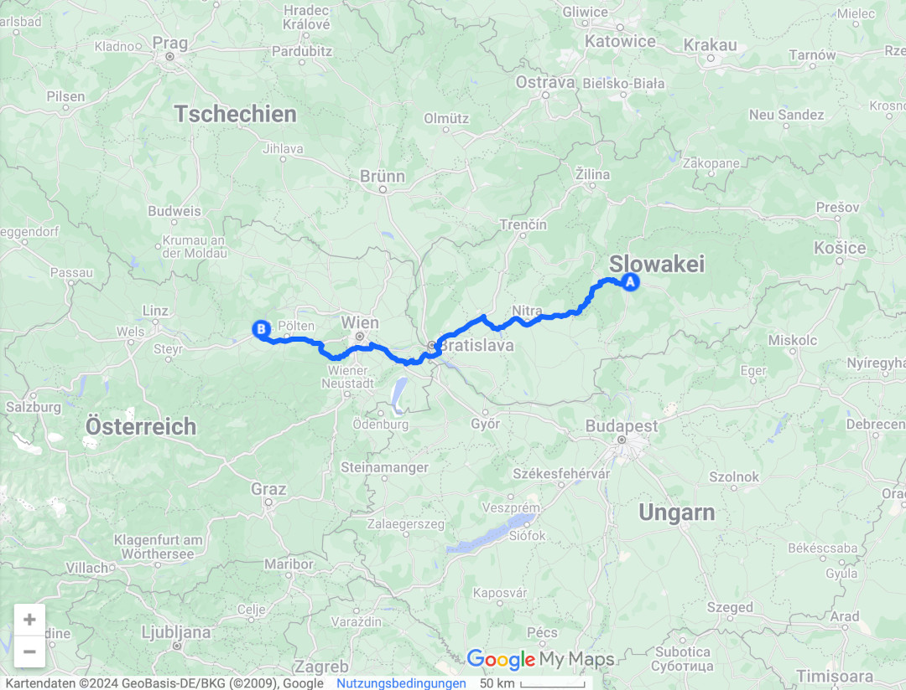

Zwei neue Tage mit zwei weiteren Ländern, durch die wir auf unserem Rückweg fahren.

<!--more-->

🗓️ 25. August: Trotz Rentnerdisko schlafen wir an dem Thermalbad ganz gut und drehen morgens wieder eine Runde mit Henry durch die kleine Stadt. Ansonsten sind die deutschen Rentner sehr kommunikativ. Hier unterhält man sich halt mit seinen Nachbarn. Wenn sie hören, wie lange wir schon unterwegs sind, sind die meisten etwas verwirrt. Schließlich sind sie ja die Rentner und nicht wir. Dann entdeckt Tobi leider, dass es fußballtechnisch in der Slowakei zu einer kurzfristigen Änderung eines Spielorts gekommen ist. Das wirbelt unsere Planung für heute kurz durcheinander, aber wir fangen uns wieder und suchen uns aus Mangel an guten Campingplätzen nochmal ein Hotel raus. Dann gehts wieder zur Kasse des Thermalbads, wo wir uns genau wie gestern Abend wieder eher mit Händen und Füßen verständigen. Dann machen wir uns schnell auf den Weg, denn die nächste Landesgrenze wartet schon auf uns. Wir vermeiden wieder Mautstraßem und steuern deshalb eine kleine Grenze an. Wobei man, dank EU und Schengenabkommen, eher keine Grenze sagen muss. Wir fahren in der Grenzstadt über eine Brücke und haben das Land gewechselt, sind jetzt also in der Slowakei. Ohne Willkommensschild hätten wir es nicht mal bemerkt. Also mal wieder ein hoch auf die EU. Wir steuern also unser Hotel an, checken ein und erkunden dann entspannt mit Henry die kleine Stadt mit ihren zwei Kirchen. Irgendwie haben wir ein ganzes Apartment bekommen, obwohl wir nur ein Doppelzimmer gebucht haben, aber uns soll es recht sein. Gegen 17 Uhr setzen wir uns dann wieder in den Bulli und düsen los Richtung Stadion. Nach einer Weile stoßen wir bei einer Kaserne auf eine Straßensperrung und wissen noch nicht, dass es für heute nicht die letzte sein wird. Auf dem weiteren Weg sehen wir immer wieder viel Militär, unter anderem sechs Hubschrauber, aus denen bestimmt 30 Fallschirmspringer herausgesprungen kommen. Auch während des Fußballspiels überqueren immer wieder laute Jets im Niedrigflug das Stadion. Es scheint irgendeine größere Übung im Gange zu sein, auch wenn wir nicht herausfinden, was genau los ist. Weil niemand beunruhigt scheint und alles sehr geplant aussieht, gucken wir trotzdem entspannt das Spiel. Banská Bystrica spielt heute gegen Slovan Bratislava, den größten Club der Slowakei. Deshalb sind vergleichsweise viele Zuschauer da. Wir legen uns unfreiwillig noch mit ein paar Leuten an, die uns trotz angeblich freier Platzwahl von unseren Plätzen scheuchen wollen. Am Ende werden wir vom Security Mann zu anderen Plätzen geführt, aber auch er sagt uns wie nervig das für ihn ist und dass es jedes Mal passiert. Wir sammeln hier unsere letzten Länderpunkte dieser Reise (für Tobi Nummer 37 und für mich aus Versehen auch schon 20). Nach dem Spiel stehen wir noch etwas im Stau und an mehreren Straßensperrungen und sehen ganze Kolonnen von Militär LKW, die Soldaten geladen haben. Am Hotel angekommen, wecken wir Henry wieder, drehen noch eine Runde mit ihm und holen uns auf dem Weg eine Pizza. Vielleicht haben wir in letzter Zeit einen leichten Pizza-Überschuss, aber der Dönermann war schon am putzen. Trotzdem schmeckts sehr gut und wir legen uns zufrieden in ein richtiges Bett.

🗓️ 26. August: Wir nutzen den Hotelaufenthalt und schlafen uns ordentlich aus. Dann gehts mit Henry durch den kleinen Ort. Hier könnte man auch echt in einer deutschen Kleinstadt sein. Alles ist sehr verschlafen und auf den Straßen sind nur wenig Menschen unterwegs. Anschließend nutzen wir das Frühstücksbuffet aus und lassen es danach auch noch ruhig angehen, weil wir erst um 12 Uhr wieder aus dem Apartment raus müssen. Wir müssen sowieso noch entscheiden, wo wir heute eigentlich hinwollen. Wir entscheiden uns für einen kleinen Campingplatz in Niederösterreich, der direkt an der Donau liegt. Weil die Zeitersparnis über die Autobahnen doch ziemlich groß ist, kaufen wir für heute eine Tagesvignette für die Slowakei und auch eine Mehrtagesvignette für Österreich. Während der Fahrt sind wir mehrmals begeistert, wie viel Strecke man so zurücklegen kann und wie wenig man sich im Vergleich zu manch anderem Land dabei konzentrieren muss. So erreichen wir die Landesgrenze relativ schnell. Zwar gibt es wegen illegaler Migration aktuell wieder Grenzkontrollen zwischen Österreich und der Slowakei, aber nur sporadisch und so kommen wir auch hier schnell und unkompliziert weiter. Wien lassen wir noch hinter uns, aber sind dann bald am Ziel. Auf dem Weg halten wir natürlich im Supermarkt und der ist für uns das Eldorado. Wir wissen gar nicht, was wir als erstes essen sollen, entscheiden und dann aber für die Salattheke und Brot. Eigentlich simpel, aber für uns ein Genuss. Auf dem Campingplatz suchen wir uns ein schattiges Plätzchen unter den Birnbäumen, auch wenn das inzwischen eigentlich gar nicht mehr so wichtig ist. Dann machen wir uns mit Henry auf den Weg in den Wald. Wir staunen über das ganze Grün und vor allem über den feuchten Waldboden. Hier ist wirklich nichts mehr so staubtrocken wie oft in den letzten Wochen. Wir dachten es sind leichte 6 Kilometer, aber am Ende stecken wir ziemlich in Pflanzen fest und der Boden wird auch ziemlich matschig. So oft scheint der Weg nicht begangen zu werden. Mehrmals müssen wir einen Bach kreuzen und oft selber noch Steine oder Stöcke reinwerfen, um überhaupt trockenen Fußes rüberkommen zu können. An einer Stelle kommen wir vor lauter Pflanzen und Dornen dann gar nicht mehr weiter und nehmen einen anderen Weg. Der landet am Ende im Garten eines Hauses und wir somit auch. Zum Glück können wir aber schnell unbemerkt durchschleichen und dann über Straßen zurück zum Campingplatz. Hier machen wir uns über unsere Ausbeute aus dem Supermarkt her und freuen uns abends darüber, dass es in unseren kurzen Klamotten richtig frisch wird. Das ist ungewohnt, aber auch gut für unseren Schlaf.

