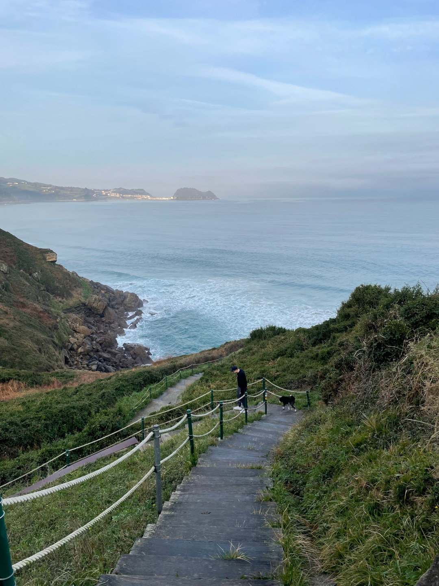
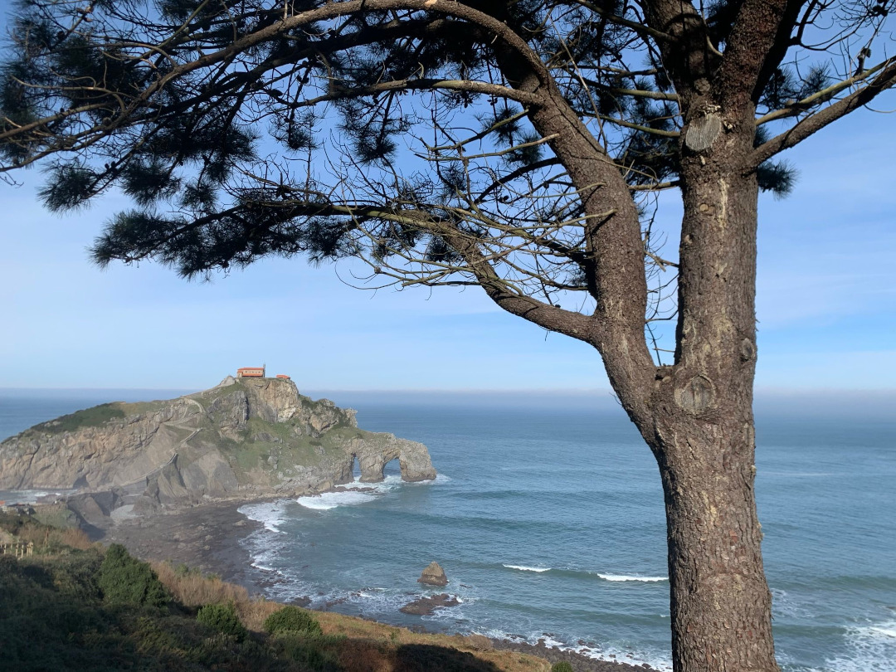
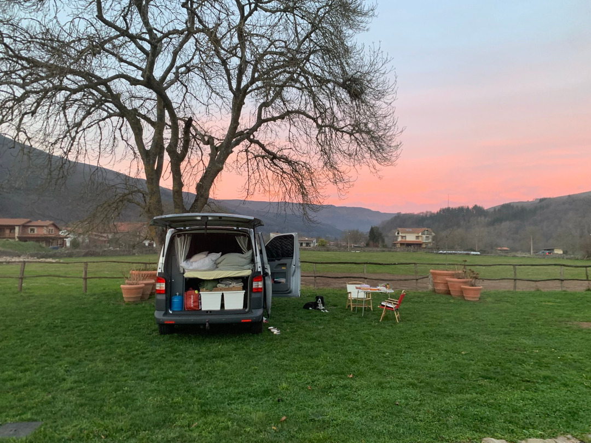
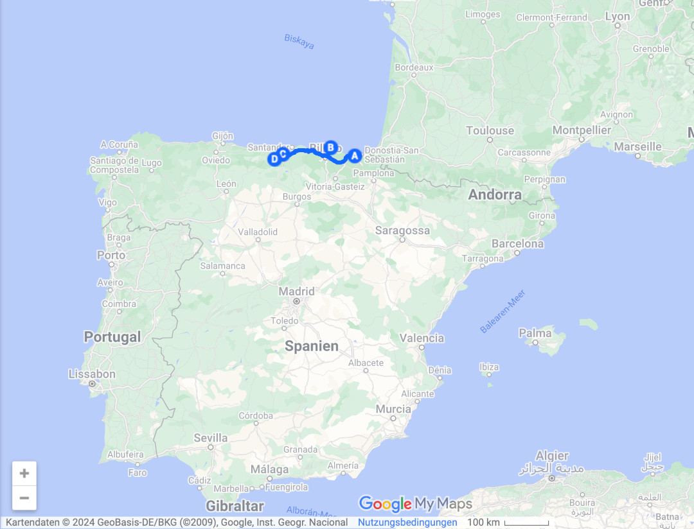

Nach zwei langen Anreise-Tagen im Bulli beginnt jetzt so richtig das Reisen. Wir nehmen uns Zeit, um rechts und links des Weges zu gucken und einfach in der Sonne zu sitzen. Von Zarautz geht es für uns die Küste entlang in Richtung Gaztelugatxe und Sopeña.

<!--more-->

🗓️ 26. Januar: Wir schlafen relativ lange, wohl auch begründet durch die Ruhe auf diesem Campingplatz. Der perfekte Ausblick kann sich auch bei Tageslicht sehen lassen. Mit Henry geht es zum Start in den Tag an eine ehemalige Erzverladestation direkt am Atlantik. Heute sind nur noch Reste davon zu erkennen und sie dient eher als Ausstellungsbühne. Wir entscheiden noch eine weitere Nacht hier zu bleiben, um den Rest der Umgebung zu erkunden. Gegen Mittag steigen wir hinab in den Ort Zarautz und somit an den Strand. Die 434 Stufen sind bergab noch relativ leicht machbar. Unten angekommen spazieren wir den 3 Kilometer langen Strand entlang und lassen auch die Drohne fliegen. Zarautz lebt wohl eher vom Sommertourismus, so ist Vieles zu und der Ort eher verlassen. Bei fast 20 Grad hätte sich wenigstens der Eismann blicken lassen können, auch wenn diese Temperaturen hier für Januar wohl auch eher die Ausnahme sind. Dennoch finden wir einen Supermarkt, um fürs Abendessen einzukaufen. Nach einem Spaziergang durch den Ort geht es zurück an Strand. Währenddessen haben hier irgendwelche Surfwettkämpfe begonnen und wir gucken noch einigen mehr oder weniger talentierten Surfern zu. Nachdem wir die endlosen Stufen auch wieder bergauf gemeistert haben, entspannen wir noch etwas am Bulli und schwingen dann Kochlöffel und unseren Gaskocher.
Am Abend gucken wir erneut Handball, auch dieses Mal mit nicht so erfolgreichem Ausgang. Später füllt sich der Campingplatz immer mehr. Viele Spanier aus der Umgebung sind anscheinend übers Wochenende hier zu Besuch. Der Abend endet wie gestern mit Sonnenuntergang aus dem Bett.

🗓️ 27. Januar: Wir werden von dichtem Nebel geweckt, so dass man leider nicht mehr viel sehen kann. Außerdem ist es auch noch morgens um 8 Uhr dunkel. Dennoch geht es mit Henry erneut zur ehemaligen Mine. Danach bezahlen wir den Platz, packen alles zusammen und machen uns auf den Weg zum Kloster San Juan de Gaztelugatxe auf der gleichnamigen Landzunge etwas nördlich von Bilbao. Auch hier sind einige Stufen und Höhenmeter zu erklimmen, dennoch ist die Wanderung gut machbar. Der Blick auf das Kloster ist die Reise dorthin auf jeden Fall wert. Trotz Nebensaison im Januar sind viele Menschen unterwegs. Das liegt wohl daran, dass heute Samstag ist und viele Spanier hier ihren Tag verbringen. Fußball kommt hier samstags wohl nur auf Platz zwei. 
Wir beschließen etwas weiter die Küste Richtung Westen zu fahren. In Torrelavega machen wir einen Einkaufsstop und gehen mit Henry etwas spazieren. Wir gehen in einen Park, wo aktuell das ganze Dorf versammelt ist. Hier gibt es das erste Eis der Reise und wir erkennen den Grund, wieso es hier so voll ist. Neben dem Park ist eine Straße abgesperrt, die wohl sonst neben dem Fußballplatz herführt. Die Straße ist jetzt die Haupttribüne für das Fünftligaspiel UC Cartes gegen CD Laredo. Das Passieren der Straße ist für Fußgänger kostenlos, wenn man aber dabei auf das Spielfeld gucken möchte, kostet es 10 Euro. Dafür sorgen die beiden glatzköpfigen Ordner an jeder Straßenseite. Zunächst sind wir nur Passanten, weil ich aber gerne eine Eintrittskarte hätte, sind wir später dann doch Zuschauer. Den Preis (Zwanni für beide) haben wir leider erst dann erfahren. Immerhin bekommen wir dafür ein packendes Spiel geboten. Der Favorit aus Laredo gewinnt 2:0. Die Heimseite hat aber immerhin einen ca. 20 Mann starken Mob aufgestellt, der seine Fangesänge einfach per Lautsprecher einspielt und dann mitsingt. Nach dem erfolgreichen Ausflug geht unsere Fahrt weiter Richtung Sopeña, etwas weiter ins Landesinnere. Hier schlafen wir auf einem Campingplatz/Bauernhof. Neben uns sind noch eine Hand voll Spanier hier. Wir begucken uns noch den kleinen Ort und kochen bei Sonnenuntergang. Nachdem Abendessen wird es relativ schnell kalt, so dass wir uns in den Bulli verlagern.

