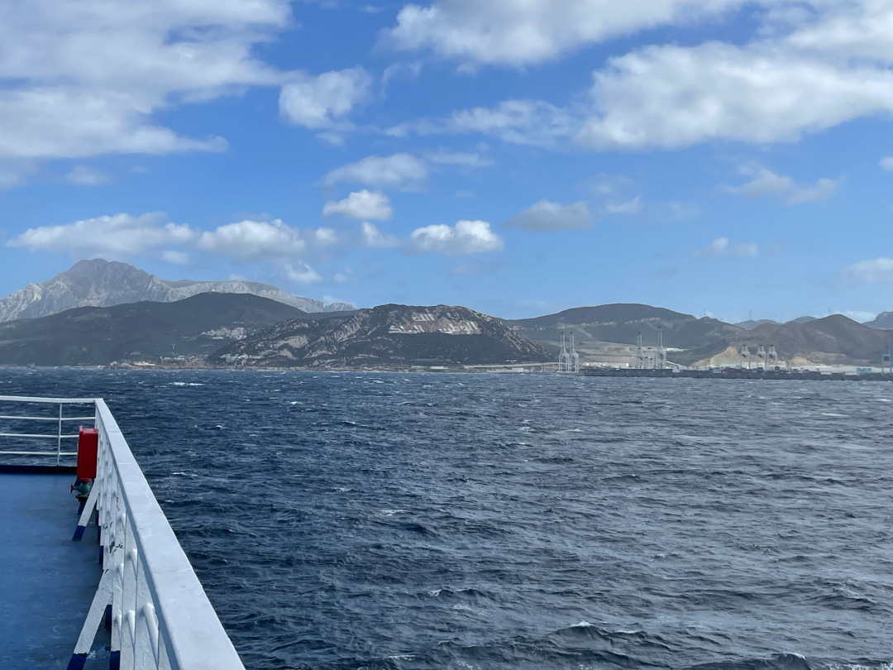
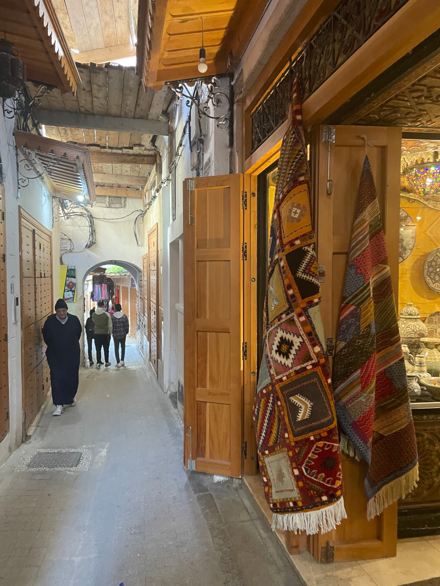
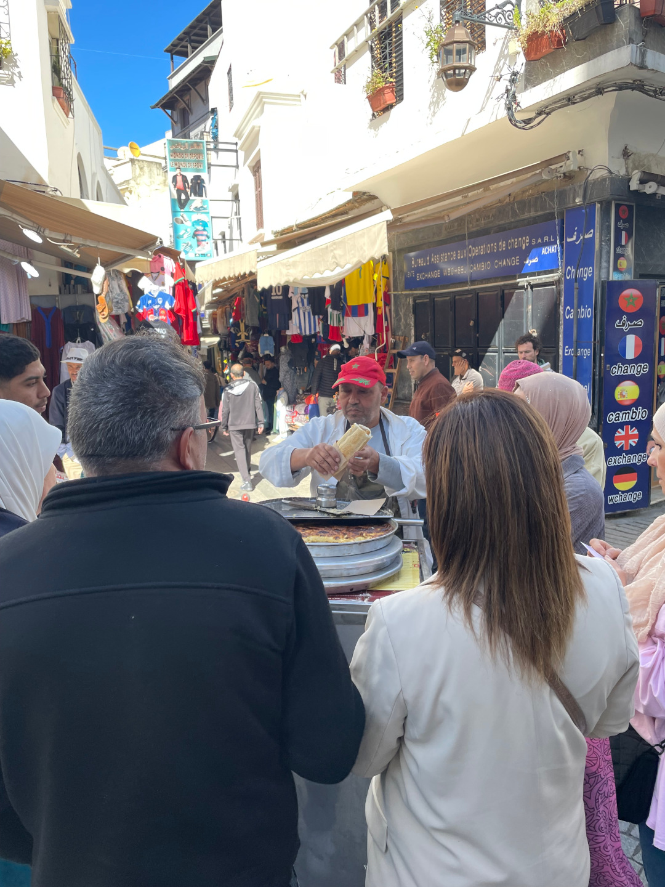
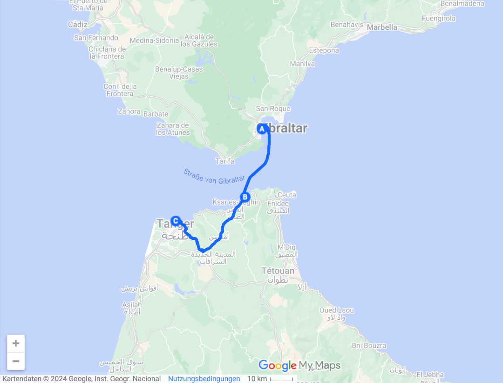
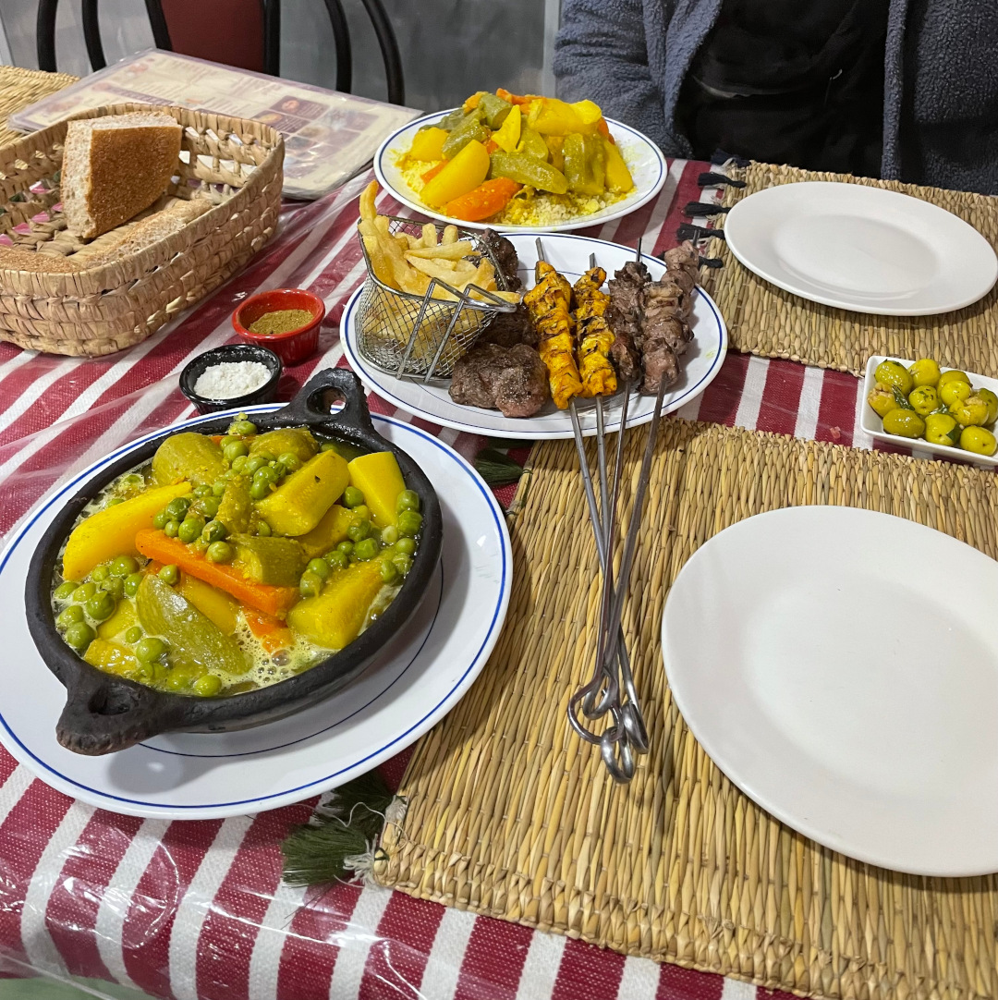
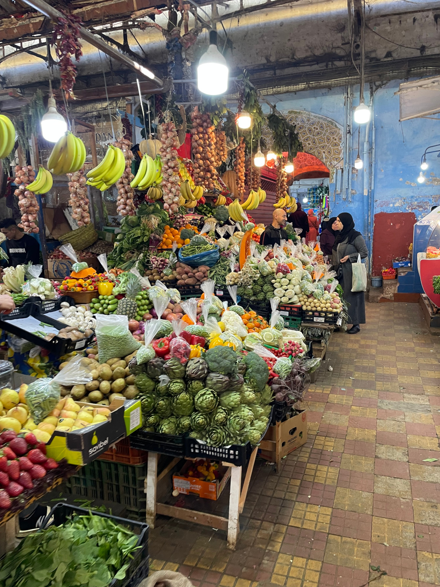
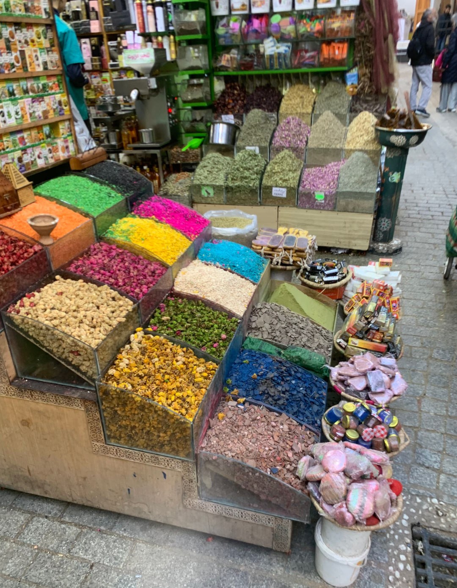

Wir nehmen die Fähre von Algeciras nach Tanger Med und landen so in Afrika.

<!--more-->

🗓️ 26. Februar: Nach letzten Erledigungen und einer letzten Henry-Runde am Strand machen wir uns am späten Vormittag auf den Weg in den Hafen von Algeciras. Vom Hotel aus sind es nur noch ein paar Minuten Fahrt und so stehen wir pünktlich in der Schlange und warten, bis die Fähre beladen wird. Als wir reinmanövriert sind, verbringt Henry die Überfahrt entspannt im Bulli und wir holen uns an der Rezeption jeweils ein Einreiseformular ab, um unsere Daten einzutragen. Zum Glück sind wir vorbereitet und haben Stifte schon eingesteckt. Mit dem Formular und unseren Pässen geht es dann in einen Raum, in dem sich die marokkanische Polizei zwei kleine Plätze eingerichtet hat, um Stempel zu verteilen. Damit ist unsere Pflicht fürs Erste erledigt und wir gehen nach oben ans Deck. Ein paar arabische Vokabeln eignen wir uns hier noch an, weil unser Französisch genau so schlecht ist, wie unser Arabisch, und man meist auf einer dieser beiden Sprachen angesprochen wird. Auch die Durchsagen auf der Fähre beschränken sich darauf, aber nach ungefähr zwei Stunden merken wir, dass alle zurück in die Autos gebeten werden. Dort angekommen zieht es sich noch etwas, bis wir dran sind mit rausfahren, aber wir überbrücken die Zeit mit Snacks. Als es dann so weit ist, folgt eine erste schnelle Passkontrolle. Dann sieht man nicht so richtig, wo man hin muss und irgendwie müssen wir uns noch in eine Schlange entgegen unserer Fahrtrichtung stellen. Nach einer Weile wird dann klar, dass alle Fahrzeuge durch ein Röntgengerät auf einem LKW durchleuchtet werden. Dazu fahren immer so 7-8 Fahrzeuge auf eine kleine Rampe, alle Insassen (inklusive Henry) müssen aussteigen, alle Fahrzeugscheine werden eingesammelt und der Scanner fährt an der Rampe entlang. Dann steigen alle schnell wieder ein und beim Runterfahren gibt es (zum Glück den passenden) Fahrzeugschein wieder zurück. Nächste Station ist der Zoll, auch hier ist es relativ unübersichtlich, überall stehen wartende Fahrzeuge und eine Weile tut sich gefühlt nichts. Am Rand müssen einige Transporter ihre ganze Ladung ausräumen, aber die sehen eher aus wie Händler als Touristen, und so hoffen wir, dass dieses Schicksal an uns vorbeigeht. Schließlich werden wir ein Stückchen weiter gewunken, müssen am Rand halten und ein Zollbeamter verschwindet mit Fahrzeugschein und dem Pass des Halters. In der Zwischenzeit schauen die Polizeihündin Izzy aus der Slowakei und ihr Polizist im Bulli vorbei, die wahrscheinlich wegen Henry auf uns aufmerksam geworden sind. Also müssen Henry und sein Futter kurz raus und Izzy darf rein. Sie findet nichts und die Frage nach einer Drohne können wir auch verneinen. Die wartet ja bei Carlos in Algeciras auf unsere Rückkehr, weil die Einfuhr nach Marokko streng verboten ist. Schließlich kommt der Zollbeamte zurück, wir erhalten unsere Sachen zurück und eine Einfuhrgenehmigung für den Bulli. Auch er fragt erneut nach einer Drohne, will nochmal die Seitentür und den Kofferraum checken und dann gibt es plötzlich einen Daumen hoch, ein OK und wir fahren weiter. Eine letzte Schranke gibt es noch, an der wir die vorübergehende Einfuhrgenehmigung vorzeigen müssen und dann sind wir tatsächlich in Marokko angekommen. Unsere letzten beiden To-Dos können wir auch noch auf dem Hafengelände erledigen. Hier versorgen wir uns mit Dirham und schließen noch eine vorübergehende KFZ-Versicherung ab, weil unsere deutsche Versicherung Marokko ausschließt. Dann geht es vom Hafen über die Autobahn ungefähr eine Stunde bis in die Stadt Tangier. Hier ist der Verkehr noch völlig in Ordnung. Der Anstieg zum Campingplatz hat es etwas in sich, aber darauf sind wir mental schon vorbereitet und werden super freundlich und aufmerksam empfangen. Mit Henry machen wir noch einen ersten Spaziergang an der marokkanischen Küste, regeln die ersten Begegnungen mit Straßenhunden und fallen dann ins Bett.

🗓️ 27. Februar: Nach einer erneuten Küstenrunde mit Henry machen wir uns allein zu Fuß auf den Weg in die Medina von Tangier. Mit all den frei lebenden Katzen und Hunden und mit den vielen Menschen in engen Gassen, wäre der Ausflug für Henry zu stressig. Der wartet deshalb im schattigen Bulli und schläft sich erstmal aus. An jeder Ecke gibt es für uns etwas zu sehen und vor allem zu kaufen und so merken wir gar nicht, wie die Zeit vergeht und durch wieviel Gassen wir schon gelaufen sind. Unsere wichtigste Vokabel, lā šukran (nein, danke), können wir dabei schon mal des Öfteren einsetzen. Gegen Mittag kehren wir in einem kleinen Restaurant ein und werden auch hier sehr herzlich empfangen. Schnell merken wir, wie riesig die Portionen hier in Marokko sind und geben unser Bestes, um nicht unhöflich viel auf den Tellern zurückzulassen. Anschließend genießen wir noch einen Tee und zahlen dann bei dem Mann, der am Eingang sitzt, fern sieht, ab und an eine Katze verscheucht oder dafür sorgt, dass wir Papier um die Teekanne gewickelt kriegen, damit auch wir Europäer das heiße Messing gut anfassen können. Wir verabschieden uns von ihm und von denjenigen, die uns bekocht haben, und gehen dann in Richtung Markt. Auch hier gibt es für unsere Augen und Nasen viel Neues und wir besorgen noch ein paar Kleinigkeiten für heute Abend. Viel handeln musste wir allerdings noch nicht. Dann machen wir uns auf den Rückweg. Den Abend verbringen wir am Campingplatz und nochmal unten an der Küste. Die ersten beiden Tage in Marokko machen auf jeden Fall Lust auf mehr!

