Zwei Tage entspannen wir noch an der Atlantikküste, bevor wir die Fähre zurück nach Spanien nehmen und sowohl Marokko als auch den Atlantik endgültig hinter uns lassen.

<!--more-->

🗓️ 26. März: Der Tag könnte besser starten. Es regnet in Strömen und auf den Pisten haben sich schon richtige Bäche mit Strömung gebildet. Obwohl wir gestern extra gefragt hatten, ob es möglich ist im Riad zu frühstücken, geht heute gar nichts. Nach einer kurzen Henry-Runde machen wir uns deshalb einfach schnell auf den Weg. Zur kleinen Pechsträhne passend habe ich meinen Kindle in unserer Unterkunft in Fès vergessen. Weil der Umweg zu unserem nächsten Ziel sich noch in Grenzen hält, geht es für uns deshalb zurück dorthin, wo wir herkamen. An einer Tankstelle ergattern wir Schokobrötchen. Dafür muss man allerdings selbst hinter die Theke, damit man sich etwas aussuchen kann. Also bewirten wir uns einfach selbst. In einem der kleinen Dörfer auf dem Weg halten wir außerdem, um nach einem neuen Scheibenwischer zu fragen. Als wir fragen, wieviel der Ersatz kostet, wird ohne zu antworten unser heiler Scheibenwischer abmontiert. Nachdem der Händler damit einige Zeit verschwunden ist, kommt er zum Glück mit zwei Scheibenwischern wieder zurück. Als alles montiert ist, dürfen wir noch testen und bezahlen dann nur etwa 6 Euro. Vielleicht ist die Pechsträhne damit durchbrochen, denken wir. Auch die Kindle-Übergabe klappt reibungslos. Ein letztes Mal quetschen wir uns mit eingeklappten Spiegeln mit dem Bulli durch das kleine Tor und fahren, nachdem wir noch etwas gegessen haben, weiter Richtung Atlantik. In Kenitra gehen wir nochmal auf Bier-Suche, aber das gibt es während Ramadan im Land wirklich nicht. Schließlich kommen wir in dem kleinen Ort Moulay Bousselham an, in dem unser Ferienhaus für die nächsten beiden Nächte liegt. Das Wetter wurde auf der Fahrt auch immer trockener. Direkt von unserer Terrasse aus gibt es einen Zugang zum Strand und so können wir mit Henry noch ausgiebig laufen und das Meer genießen. Abendessen gibt es in einem etwas dubiosen Café, in das uns ein Holländer gelockt hat. Das Essen wird von nebenan gebracht, schmeckt aber ganz gut. Während wir dort sind, geht allerdings auch der Regen wieder los, so dass wir nass wieder in der Unterkunft ankommen.

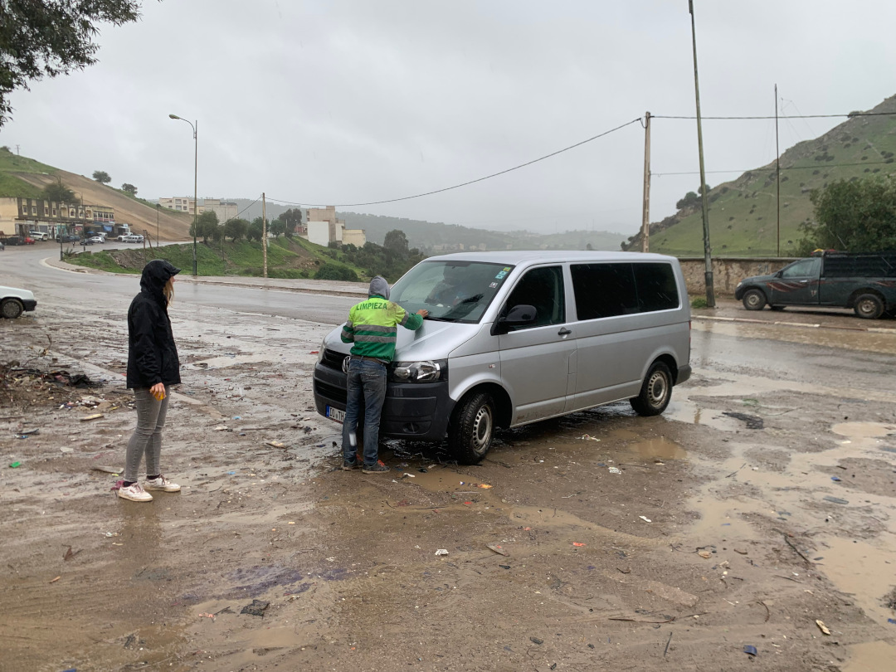

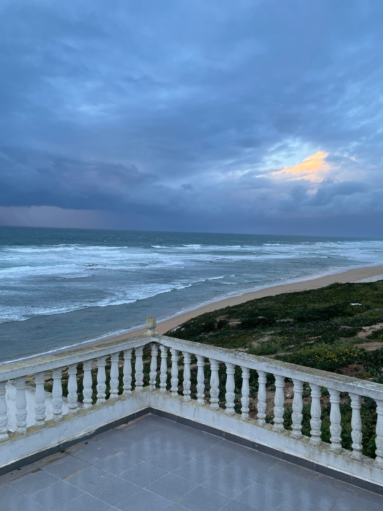

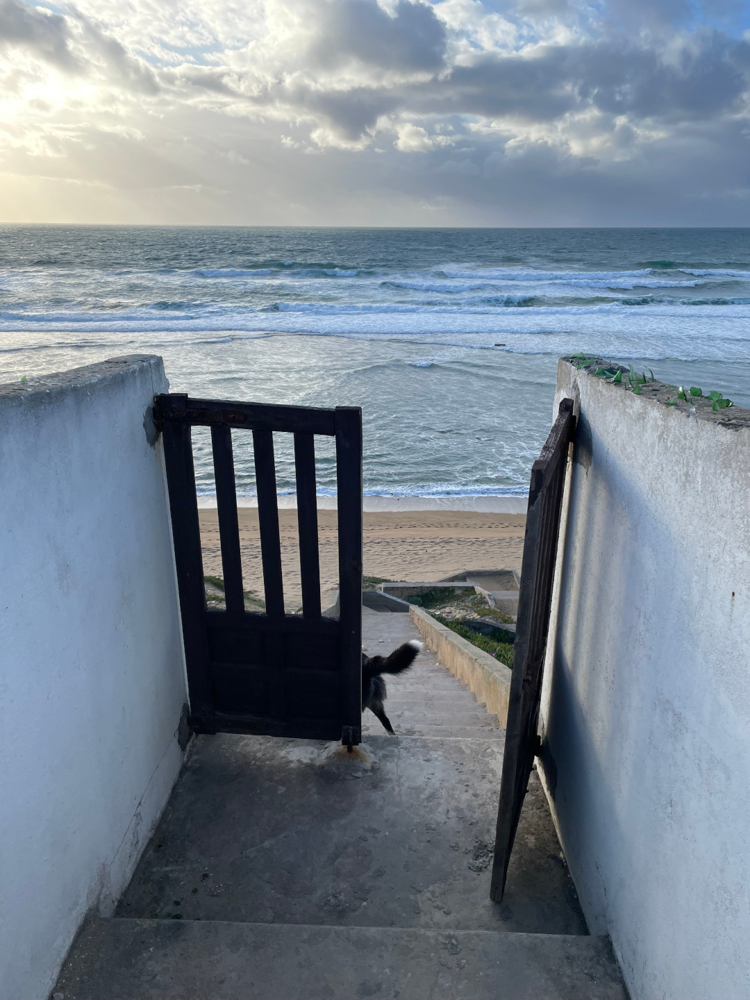

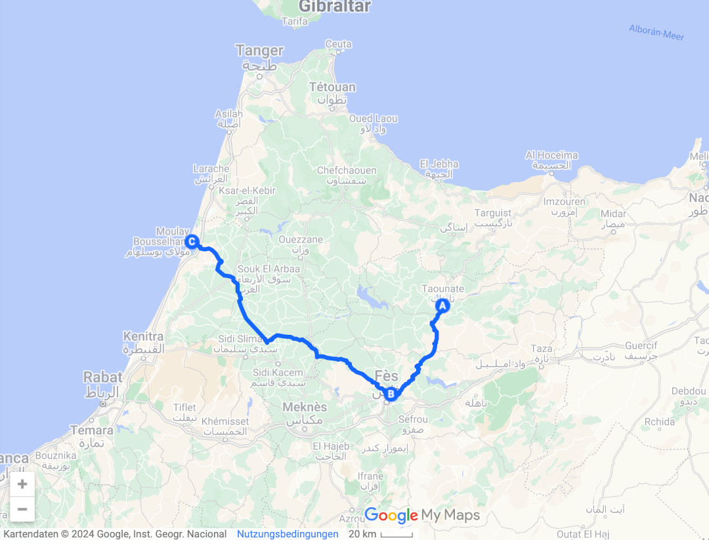

🗓️ 27. März: Als wir aufwachen, freuen wir uns über den jetzt wieder strahlend blauen Himmel und die wärmende Sonne. Wir genießen als erstes ein gutes Frühstück auf der Terrasse. Anschließend sorgen wir schon mal für nachmittags vor und kochen Flan. Den klassischen Pudding mit Karamellsoße haben wir im Restaurant in Fès als Nachtisch bekommen und sind dabei auf den Geschmack gekommen. Als der Pudding bereit zum Abkühlen ist, machen wir uns fertig für eine kleine Strandwanderung. Zurück am Haus geht es noch ins Meer und dann haben wir für heute eigentlich auch genug gemacht. Auf der Terrasse findet schon wieder die nächste Snackrunde statt, schön mit Schnittchen und Flan. Nachdem wir dort noch eine Weile einfach zusammensitzen, gehen wir dann noch auf den kleinen Markt des Ortes und schlendern dort durch die Gassen. Dabei treffen wir auch zwei Leute aus dem Café von gestern wieder, natürlich sind wir jetzt schon ihre German Friends. Der Holländer lädt uns direkt wieder ein ins Café zum Abendessen zu kommen, alles wäre gratis. Nach einer kurzen politischen Auslassung zur Vergangenheit Deutschlands seinerseits verzichten wir darauf aber gerne und gehen stattdessen in ein kleines Restaurant, das wir gestern schon gesehen hatten und in dem es Tacos für uns gibt. Bei Tee statt Bier und einer Runde Kniffel verbringen wir danach einen ruhigen Abend im Ferienhaus.

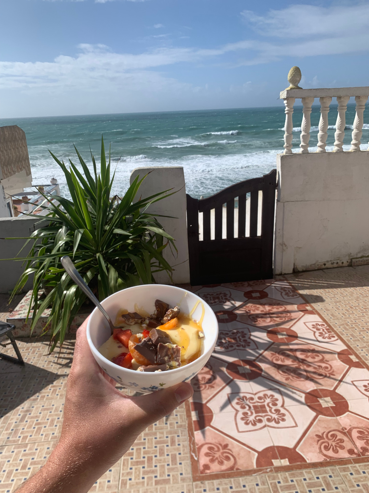

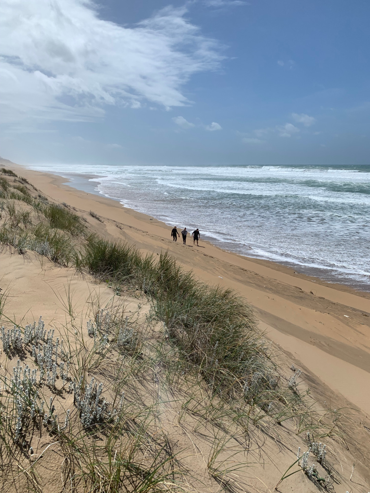

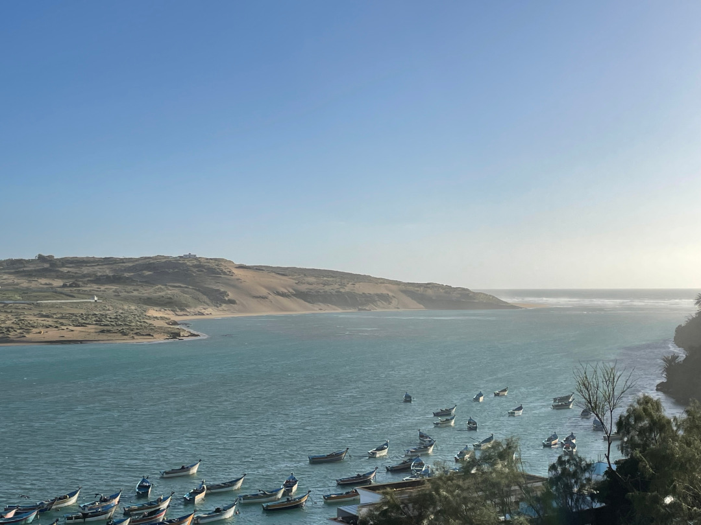

🗓️ 28. März: Wir stehen seit Ewigkeiten mal wieder mit Wecker auf, denn heute steht viel an und wir müssen pünktlich am Flughafen sein. Natürlich haben wir dabei aber auch Zeit für ein letztes gutes Frühstück eingeplant. Die Fahrt zum Flughafen ist nicht mehr weit und führt komplett über die Autobahn, so dass es bei wenig Verkehr eigentlich immer geradeaus geht. Der Flughafen von Tanger ist genauso klein und entspannt wie der von Fès und so sitzen wir noch bei einem letzten gemeinsamen Tee im Aero Café zusammen, bevor Tobi und ich uns wieder auf den Weg machen. Wir wollen noch kurz in die Altstadt und eine der Messingteekannen mitnehmen. Schnell werden wir fündig und gut umsorgt, so dass aus der Kanne natürlich ein ganzes Set mit Tablett und Gläsern wird. Im Kiosk holen wir noch den passenden Tee und verballern dann unsere restlichen Dirham mit Tanken und Snacks. Gegen 14:15 Uhr kommen wir wie geplant am Hafen in Tanger Med an und denken gut in der Zeit zu sein für die Fähre nach Algeciras um 16:00 Uhr. Am Schalter tauschen wir noch schnell unsere Bestätigung gegen die echten Tickets und merken dann, dass darauf schon 18:00 statt 16:00 Uhr Abfahrt steht. Naja, wird schon passen, denken wir und fahren erstmal wieder durch den Röntgen-LKW und die Zollkontrolle. Dieses Mal geht der Hund auch einfach an uns vorbei und wir stehen schnell am richtigen Kai. Dort erzählt uns ein anderer Wartender, dass wirklich erst später wieder eine Fähre fahren soll. Etwas ernüchternd, aber so haben wir immerhin Zeit im Bulli wieder klar Schiff zu machen und ihn nach den letzten Nächten in Unterkünften wieder fürs Campen einzurichten. Wieviel Zeit wir tatsächlich haben werden, ahnen wir noch nicht. Erst als wir schon auf der Fähre sind und an Deck stehen, wird klar, dass es noch dauern kann. Die Beladung scheint komplett unterbrochen zu sein. Es tut sich gar nichts. Wir sind verwirrt, aber alle scheinen entspannt zu sein und so warten wir einfach. Nach über eine Stunde fragen wir nach. Die Beladung wurde wegen des Fastenbrechen unterbrochen. Jetzt soll sie aber weitergehen. Verständnis dafür haben wir, aber das wäre doch durchaus vorher einkalkulierbar gewesen. Der Sonnenuntergang kommt ja nicht ganz überraschend. Inzwischen ist es so spät, dass wir nicht wissen, ob wir am Ziel noch etwas zu essen kriegen. Deshalb essen wir doch noch etwas Richtiges auf der Fähre. Als wir endlich abgelegt haben, vergeht die Zeit dann irgendwie doch schnell und die Durchsage, dass wir gleich da sind, ertönt schneller als gedacht. Die reine Fahrzeit war auf jeden Fall kürzer als auf der Hinfahrt. Um 22:30 Uhr marokkanische Zeit bzw. 23:30 Uhr spanische Zeit legen wir an. Leider haben wir wieder eine lange Wartezeit, bis wir von der Fähre runterfahren können, weil wir im untersten Deck gegen eine Wand guckend eingeparkt sind. Dafür gibt es dieses Mal sogar jemanden, der uns rauswinkt. Bei der spanischen Zollkontrolle winkt uns der Hundeführer einfach durch und wir freuen uns schon. Ein bisschen weiter möchte aber ein Polizist unseren Kofferraum kontrollieren. Weil in dem Moment ein Polizeihund am Bulli schnuppert, sage ich aus Reflex, dass wir einen Hund dabeihaben. Damit bugsiere ich uns direkt an den Rand und wir müssen zusätzlich alle Dokumente von Henry in einem kleinen Häuschen vorzeigen. Natürlich mit entsprechender Wartezeit. Zum Glück sind aber alle sehr freundlich und danach ist es auch geschafft und wir können einen Parkplatz ansteuern, auf dem wir gut übernachten können. Die anderen Pläne, wie Einkauf für die Feiertage oder Drohne abholen, können wir für heute aber vergessen.

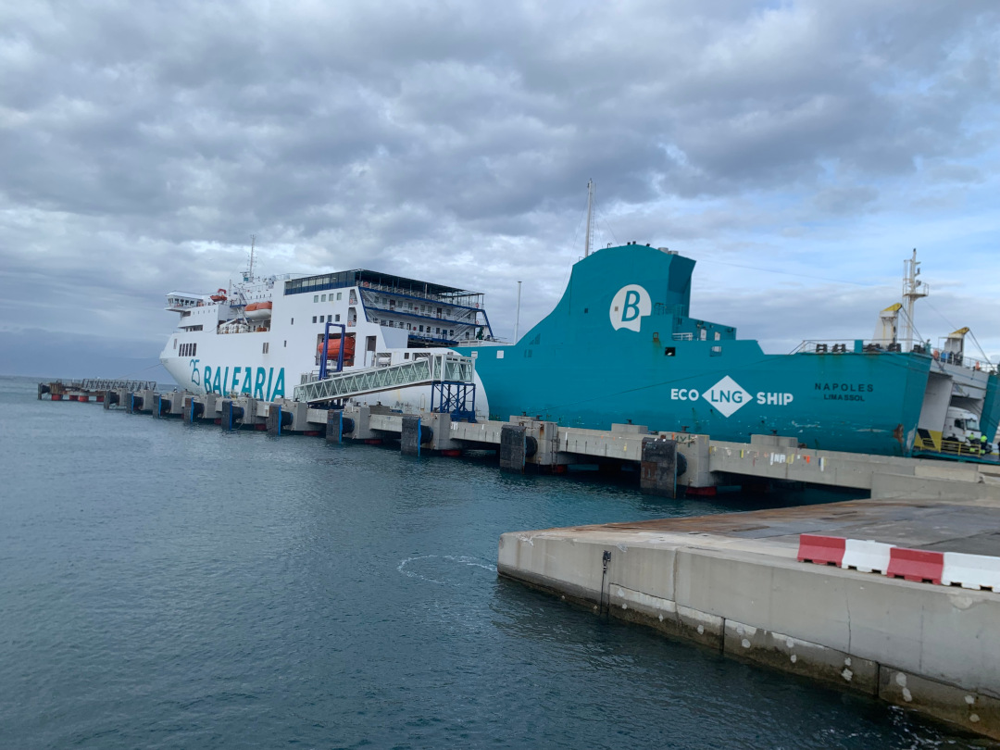

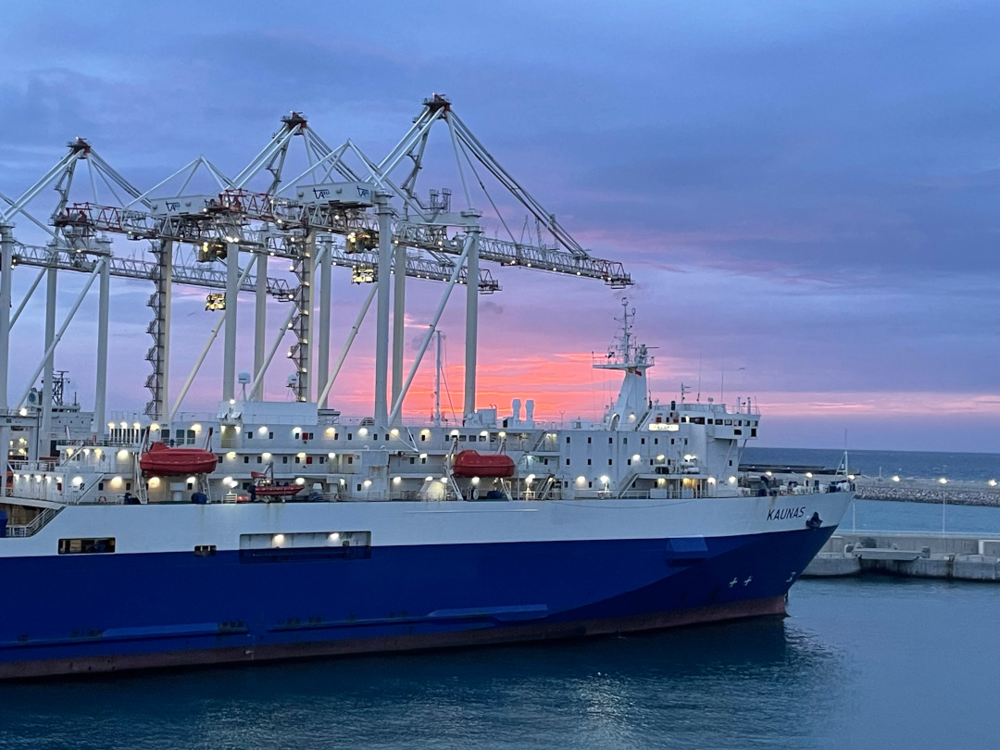

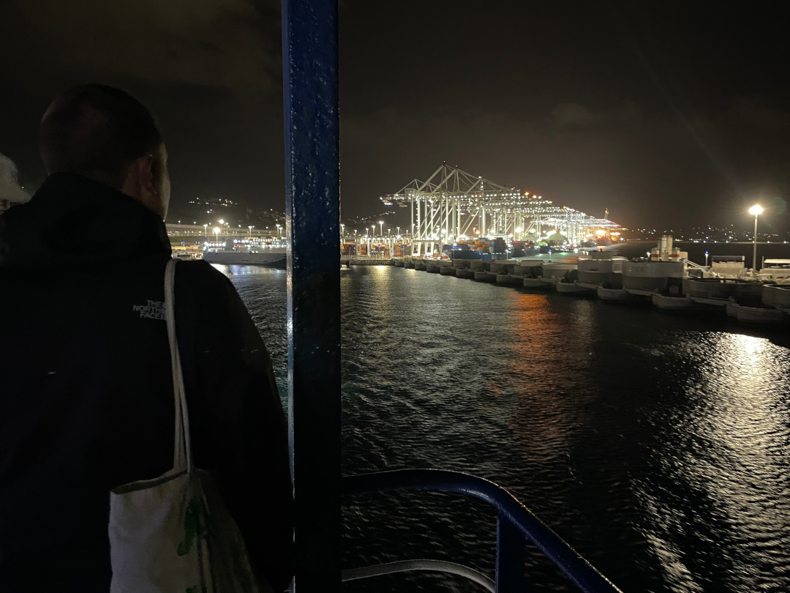

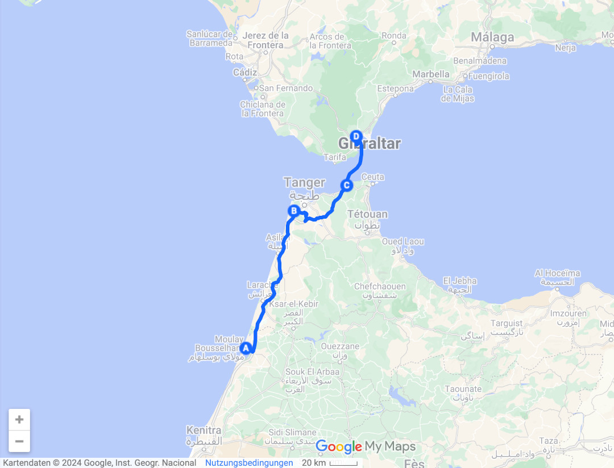