Wir lassen die Bären in den Karpaten hinter uns und fahren als großen Kontrast in die Hauptstadt Rumäniens.

<!--more-->

🗓️ 26. April: Wir werden von der Sonne geweckt. Der Regen von gestern ist weg und so soll es auch erstmal die nächsten Tage bleiben. Da auf dem Campingplatz neben uns nur ein Engländer ist, haben wir wieder sehr viel Platz, um mit Henry durchs Grüne zu spazieren. Danach packen wir alles zusammen und fahren in die nächste Großstadt, Pitesti. Wir haben ewig nicht mehr waschen können, auch weil das hier auf den Campingplätzen oft schwierig ist. Also steuern wir einen Waschsalon an. Wir parken mitten im Plattenbau-Wohngebiet und finden einen topmodernen Waschsalon. Weil sonst niemand da ist, können wir auch alle drei Waschmaschinen zeitgleich benutzen. Mit WLAN und Fernseher im Salon vergehen die fast zwei Stunden relativ fix. Wir packen wieder alles in den Bulli und fahren nach Bukarest. Hier haben wir für das Wochenende ein Hotelzimmer gebucht und kommen nach viel Stau am frühen Abend an. Das Hotel liegt direkt an einer vierspurigen Straße im Norden von Bukarest, aber ist für den Preis echt top. Wir erkunden mit Henry die Umgebung und machen uns danach auf zum ersten Fußballspiel in Rumänien. Am Abend spielt Dinamo Bukarest in der Relegation um den Abstieg in die rumänische Liga Zwei. Die großen Erfolge von Dinamo sind also mittlerweile vorbei. Dazu kommt, dass man seit 2022 nicht mehr im alten Dinamo Stadion spielt, sondern übergangsweise im nationalen Rugbystadion direkt am Arcul de Triumf, der wirklich so aussieht wie der französische Bruder. Das Stadion und der Tabellenplatz versprechen also keinen Leckerbissen, dennoch versuche ich mein Glück vor dem Stadion, um ein Ticket zu bekommen. Das Spiel ist nämlich eigentlich ausverkauft, aber wie so oft wird man am Stadion durch zwielichtige Gestalten noch fündig. Bei der Einlasskontrolle wird jedem das Kleingeld weggenommen, weil man das sonst auf die gegnerische Mannschaft werfen könnte. Auf dem Boden vor dem Einlassbereich liegt dann einfach ein großer Haufen Kleingeld. Dinamo spielt übrigens 1:1 und der Klassenerhalt wird weiter unrealistisch. Die Stimmung ist anfangs echt gut und quasi jeder im Stadion singt mit. Es sind auch sehr viele Kinder im Stadion. Die Väter bringen ihre Söhne mit, sobald es die gibt. Auch wenn man Tickets für einen bestimmten Sitzplatz hat, gilt ungeschrieben freie Sitzwahl. Mein Block, wo mein Ticket gewesen wäre, ist sogar gesperrt. Der Polizist meint nur, ich soll woanders hingehen, Hauptsache weg und nicht in den Block J. Bei einem ausverkauften Spiel findet sich dann natürlich jeder in den offenen Blöcken ein. Überall stehen und sitzen Menschen, aber alles klappt gut und bleibt friedlich. Nach dem Spiel geht es mit dem letzten Bus zurück zum Hotel. Die Nutzung des ÖPNVs kostet für 90 Minuten ca. 60 Cent. Man kann in den Bussen einfach an die Kartenlesegeräte seine Kreditkarte halten und hat sein Ticket ist gekauft. Wenn man dann kontrolliert wird, sagt man die letzten vier Ziffern der Kreditkarte und die Kontrolleure gucken, ob in den letzten 90 Minuten von der Kreditkarte ein „Ticket“ gekauft wurde. Traumhaft unkompliziert das Ganze. Am Hotel angekommen hat zum Glück noch der Burgerladen geöffnet. Der erste Tag in Bukarest und der Länderpunkt Rumänien wurden also erfolgreich absolviert.

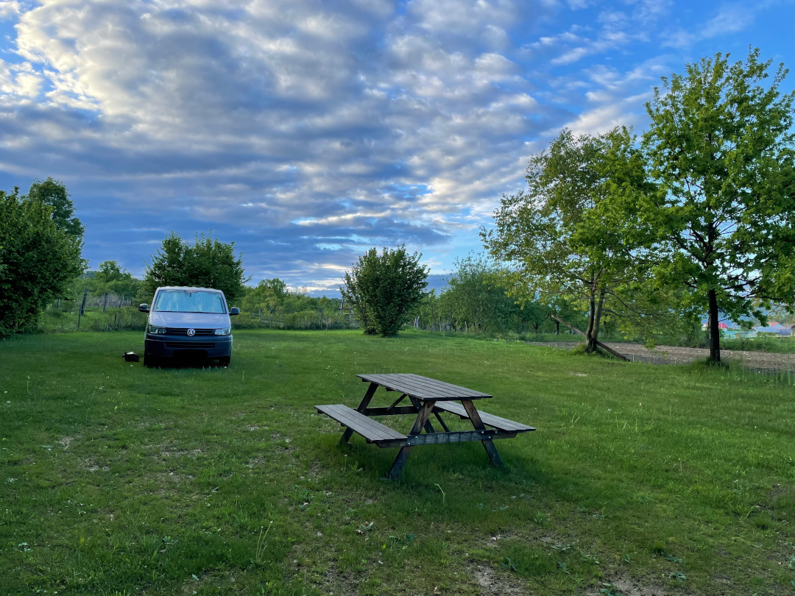

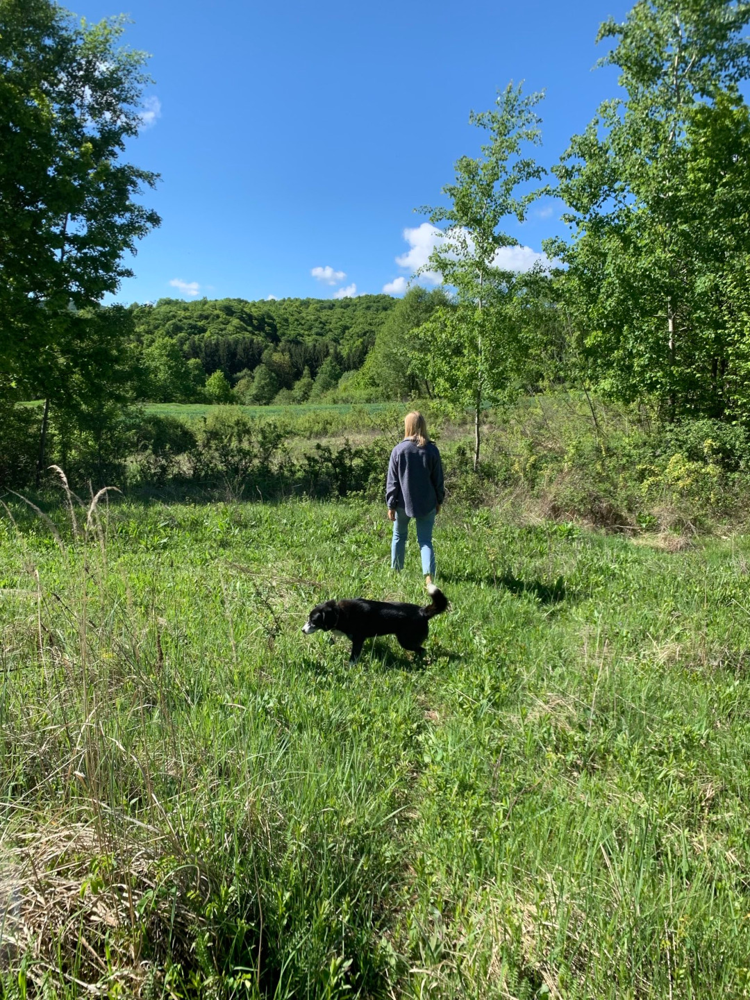

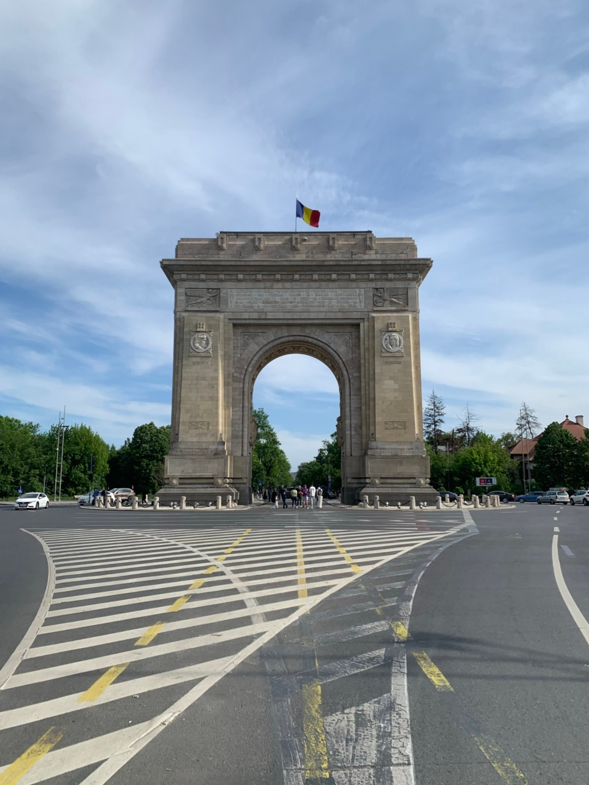

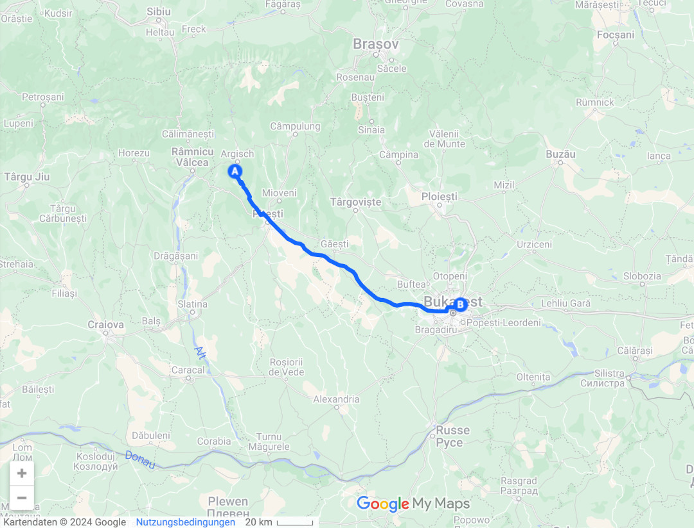

🗓️ 27. April: Weil wir gestern erst so spät im Hotel waren, schlafen wir relativ lange. Wir suchen fieberhaft nach einer guten Runde für Henry, weil der Verkehr in Bukarest katastrophal ist. Die Autos nehmen noch mehr Platz ein als in deutschen Innenstädten. Wo geparkt werden will, wird auch geparkt. Die Bürgersteige sind also Parkplätze. Zum Glück gibt es viele Parks. Der nächste Park an unserem Hotel führt sogar entlang des Wassers. Da müssen wir aber erstmal hinkommen. So wird die morgendliche Henry-Runde schon fast 9 km lang. Auf dem Rückweg besorgen wir uns als Frühstück die leckeren Covrigi. Danach steht für heute der Norden von Bukarest auf dem Programm.  Als erstes geht es zum alten Stadion von Dinamo Bukarest, das ich gestern leider nicht sehen konnte. Das Stadion soll abgerissen werden und ein neues gebaut werden. Bis dahin ist es offen und jeder kann rein und Sport machen. Die Chance nutze ich aus, also natürlich nur um Fotos zu machen. Wirklich eine alte rumänische Stadionperle. Von hier aus geht es nochmal zum Arcul de Triumf und direkt in den gegenüberliegenden König Michael I. Park. Auch dieser Park liegt direkt am Wasser und ist gut besucht. Das liegt auch am guten Wetter und am Samstag. Direkt daran grenzt auch das „Bankenviertel“ und das Haus der freien Presse. Hier sitzen viele Zeitungsredaktionen des Landes. Danach geht es zurück zum Arcul de Triumf und mit demselben Bus wie gestern Abend zurück zum Hotel. Auch heute Abend steht noch ein Fußballspiel an. Steaua Bukarest spielt gegen Farul Constanta und kann mit einem Sieg die rumänische Meisterschaft perfekt machen. Das Spiel findet im rumänischen Nationalstadion statt, so dass man noch ausreichend Tickets kaufen kann. Das klappt sehr entspannt und ist deutlich günstiger als der Schwarzmarkt gestern Abend. Direkt am Stadion gibt es noch im völlig überfüllten und wuseligen Schawarma Imbiss sehr leckeres Essen für uns. Wer da wie den Überblick behält ist uns ein Rätsel, aber Fotos zu machen ist leider verboten. Quasi zum Anstoß kommen wir ins Stadion. Ich erkenne schon ein paar Österreicher wieder, die sich gestern Abend auch schon das Dinamo Spiel angetan haben. Steaua gewinnt das Spiel 2:1 und wird rumänischer Meister. Was man nicht unbedingt gemerkt hätte, wenn man es nicht gewusst hätte. Die Stimmung ist gut, aber so hätte ich mir in Rumänien kein Meister-Werden vorgestellt. Nach dem Spiel gehen alle wieder nach Hause. Liegt vielleicht auch daran, dass Steaua zum 27. Mal Meister wird. Aus Constanta kommen ca. 100 Fans mit, die sich vor dem Spiel sogar auch noch Hoffnungen auf die Meisterschaft machen konnten. Hanna feiert heute auch schon ihren zwölften Länderpunkt. Wie immer geht es mit dem letzten Bus zurück zum Hotel, wo wir nach fast 30 gelaufenen Kilometern ins Bett fallen.

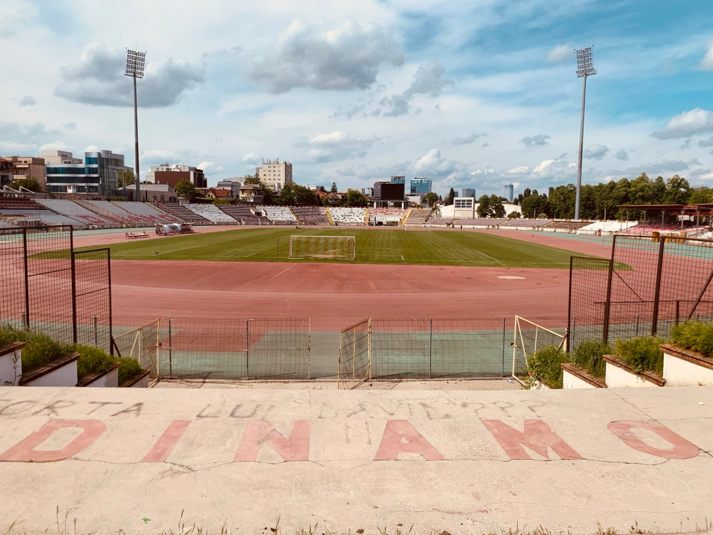

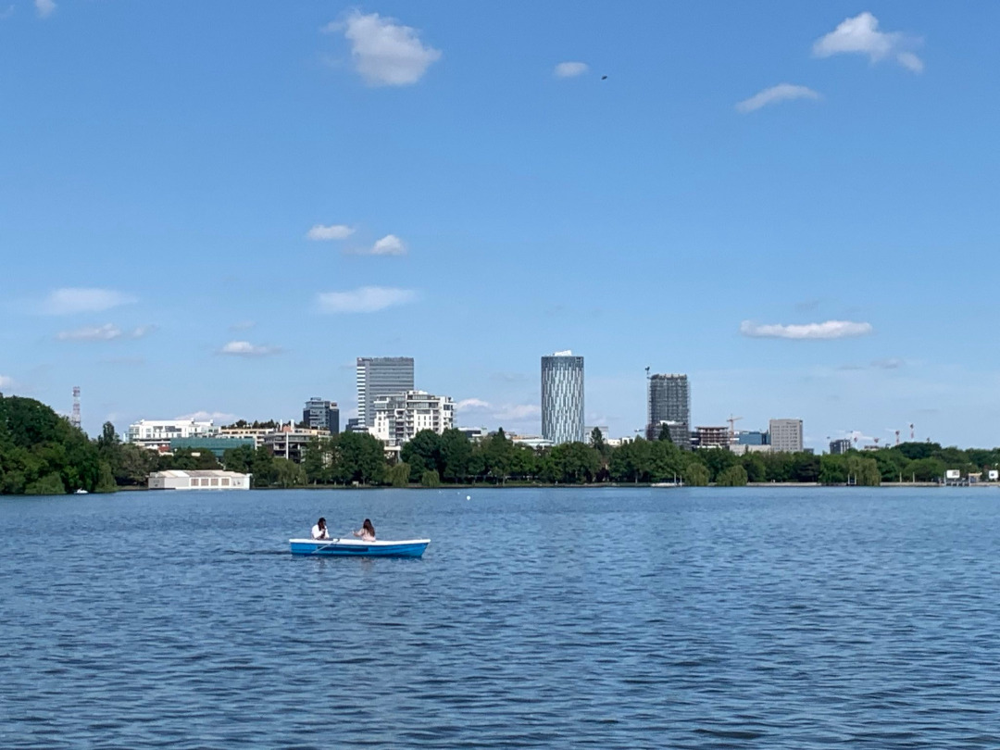

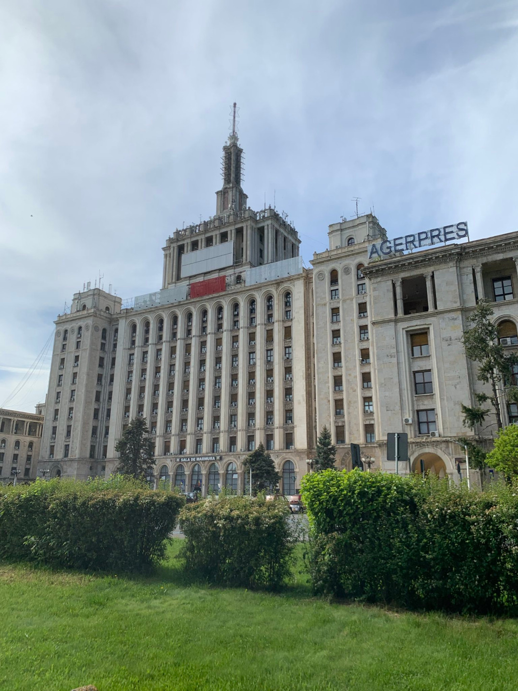

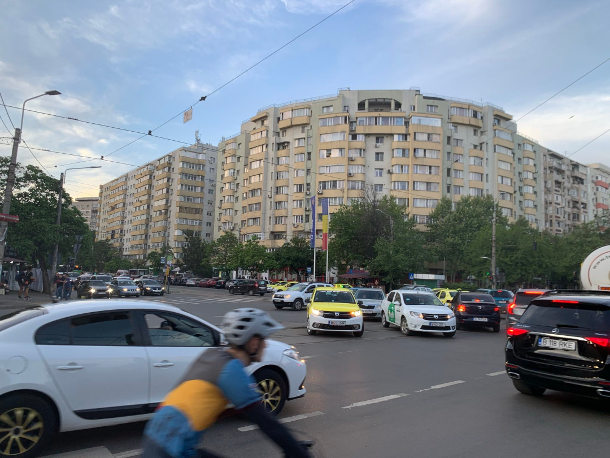

🗓️ 28. April: Auch heute schlafen wir relativ lange und gehen danach wieder die morgendliche Parkrunde mit Henry. Wir starten also wieder aktiv in den Tag. Seit Freitag regnet es auch wirklich nicht mehr und so laufen wir entspannt bei 20 Grad und Sonne durch den Park entlang am Wasser. Heute wollen wir uns die Altstadt und Innenstadt von Bukarest angucken. Weil die Kreditkartenzahlung nur in den neueren Bussen funktioniert und nicht in den alten Straßenbahnen kaufen wir am Kiosk zwei Tickets. In die Altstadt fährt von uns aus nämlich nur die Straßenbahn. Und tatsächlich werden wir sogar kontrolliert und haben das Ticket nicht abgestempelt. Die drei Kontrolleure sind schon etwas sauer, bis ein junger Rumäne für uns übersetzt. Wir sagen ihm einfach, dass das Gerät kaputt war. Als der Kontrolleur es dann ausprobiert, funktioniert es natürlich. Es reicht aber um nicht als Schwarzfahrer zu gelten und er belässt es bei einer Ticketentwerter-Für-Dummies-Belehrung. Die Innenstadt von Bukarest ist deutlich entspannter zu Fuß zu erkunden als die Wohngebiete. Teilweise sind sogar Straßen komplett für Autos gesperrt und auch am Sonntag hat fast alles auf. Wir starten an den Athenräumen und dem Nationalen Kunstmuseum (von außen) und laufen von dort aus in die Altstadt. Überall sind kleine Passagen, aber auch große Boulevard-Straßen. Wir besuchen laut einem Internetblog den wohl schönsten Buchladen der Welt, stimmen dem aber nicht ganz zu. Wir wollen auch noch etwas typisch Rumänisches essen und finden eine Art Biergarten. Noch sind wir nicht ganz überzeugt vom rumänischen Essen. Vielleicht müssen wir nochmal mehr raus aus der Touristenfalle und in kleineren Orten Essen gehen. Der letzte Stopp für heute ist das rumänische Parlament, das übrigens das zweitgrößte Gebäude der Welt ist. Über 7.000 Zimmer gibt es in diesem einen Gebäude. Wir fahren danach wieder mit der Straßenbahn und entwertetem Ticket zurück zum Hotel. Kontrolliert werden wir aber leider nicht. Wir besorgen uns noch etwas Abendessen und entspannen noch etwas im Hotel.

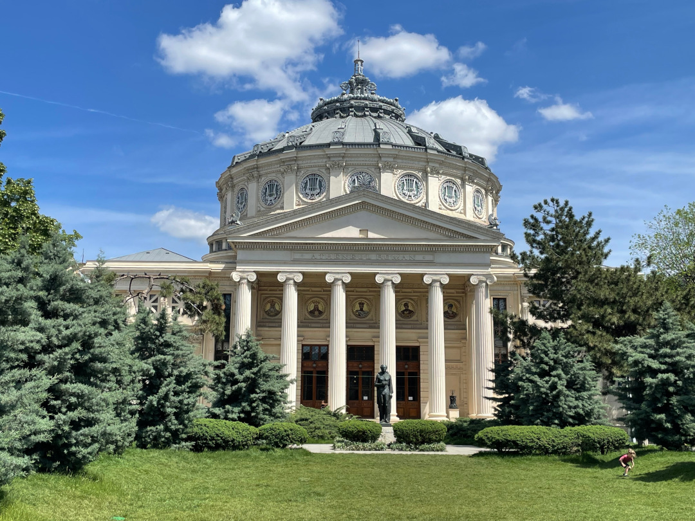

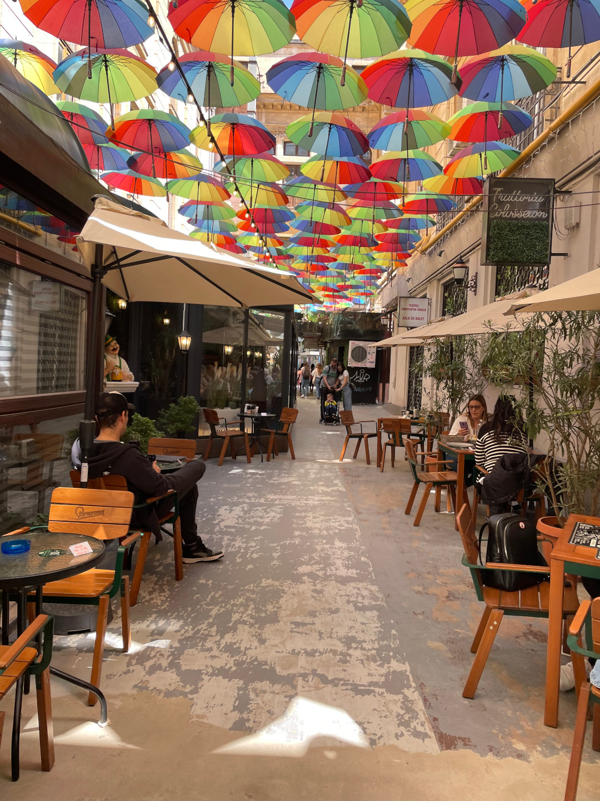

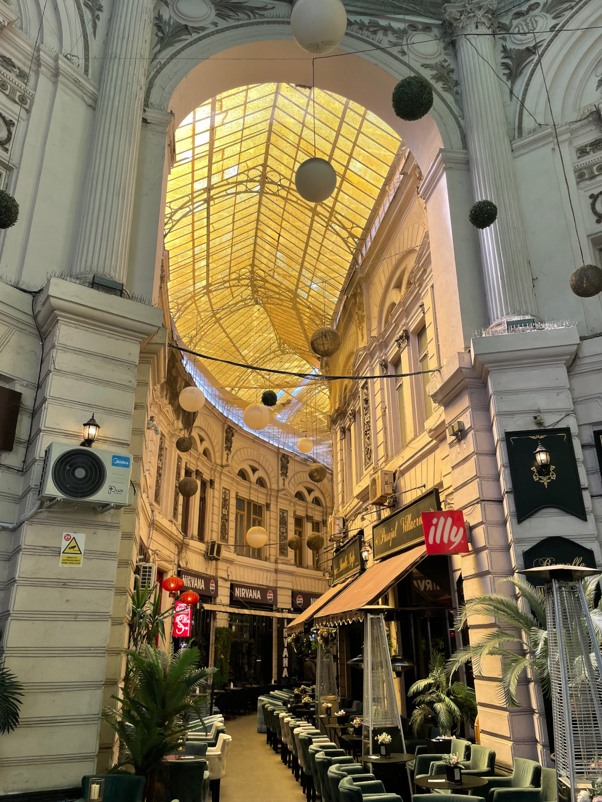

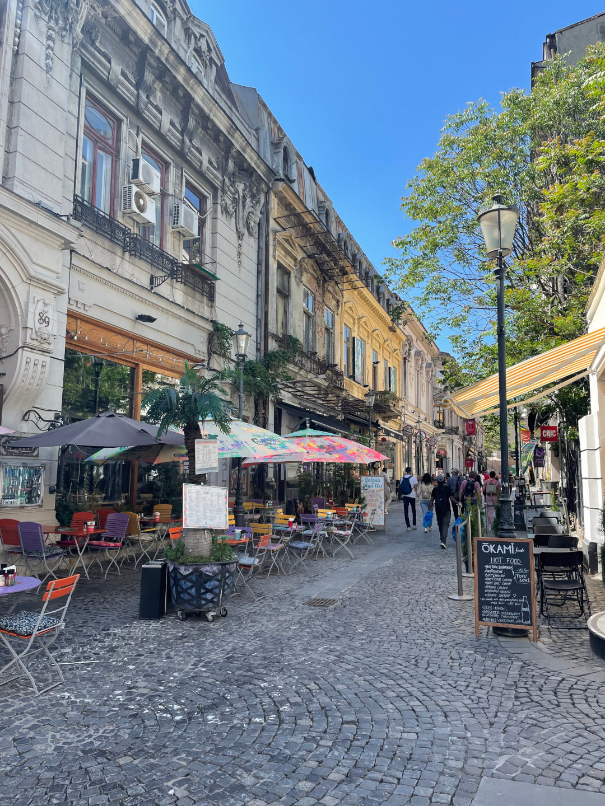

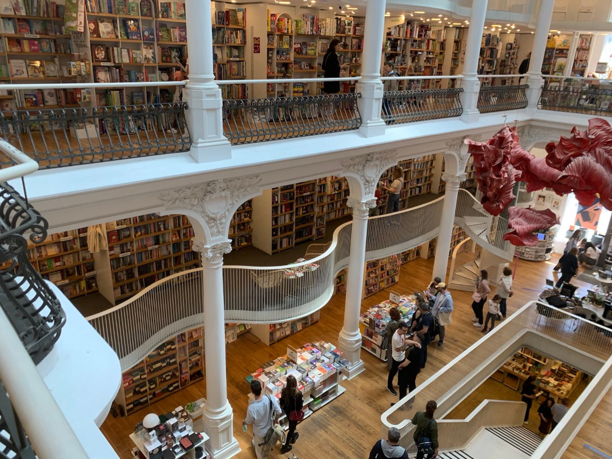

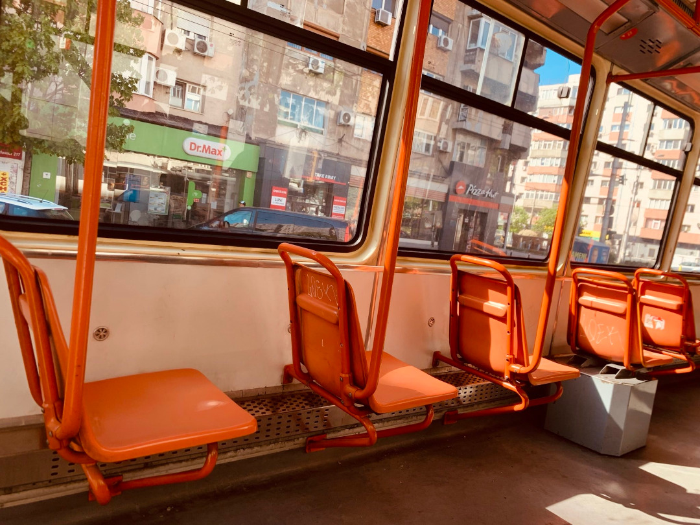