Weil wir unsere letzten Strandspaziergänge noch in Spanien gemacht haben, machen wir uns nach einer gefühlten Ewigkeit mal wieder auf den Weg ans Meer und können sogar etwas schwimmen.

<!--more-->

🗓️ 27. Mai: Nach einer ruhigen Nacht verändert sich die Umgebung heute morgen schnell. Das Wochenende ist vorbei und so wird nebenan auf einer Baustelle schon gearbeitet und der Campingplatz wird von drei Arbeitern gekapert, die mit Rasenmäher, Kantenschneider und Laubbläser anrücken. Nach einer Henry-Runde und dem Zusammenpacken machen wir uns deshalb schnell bereit zur Abfahrt. Als erstes geht es für uns in ein Shoppingcenter in Plovdiv, weil wir unsere Vorräte bei DM auffüllen wollen. Anschließend machen wir uns auf die Suche nach einem Camping Shop, weil wir befürchten, dass unsere Gasflasche bald leer sein könnte. Wir fahren ja immer noch mit der krüppeligen aus Marokko rum. Am Ende landen wir in einem Gewerbegebiet, also eher bei einem Haufen Garagen, mitten in einer Baustelle. Keine Spur von dem Laden. Das Problemchen vertagen wir also, denn noch haben wir ja etwas Gas. Stattdessen machen wir uns seit langem mal wieder auf den Weg ans Meer. Ungefähr drei Stunden sind wir dahin unterwegs und für uns beide ist es das erste Mal, dass wir am schwarzen Meer sind. Trotzdem freut Henry sich wohl am meisten endlich wieder am Strand pesen zu können. Es gibt hier auf jeden Fall mehr Wellen als wir dachten. Wir machen einen langen Spaziergang am Strand entlang, auch wenn leider wieder Wolken aufgezogen sind und ein paar Regentropfen fallen. Zum Glück ist es aber nichts Wildes oder Anhaltendes. An einigen Strandabschnitten kann man erahnen, was hier im Sommer los sein kann. Im Ort selber merkt man auch, dass Ende Mai noch Nebensaison ist und vieles noch geschlossen ist. Trotzdem sind definitv mehr deutsche Wohnmobile an der Schwarzmeerküste als im Rest des Landes zu finden.

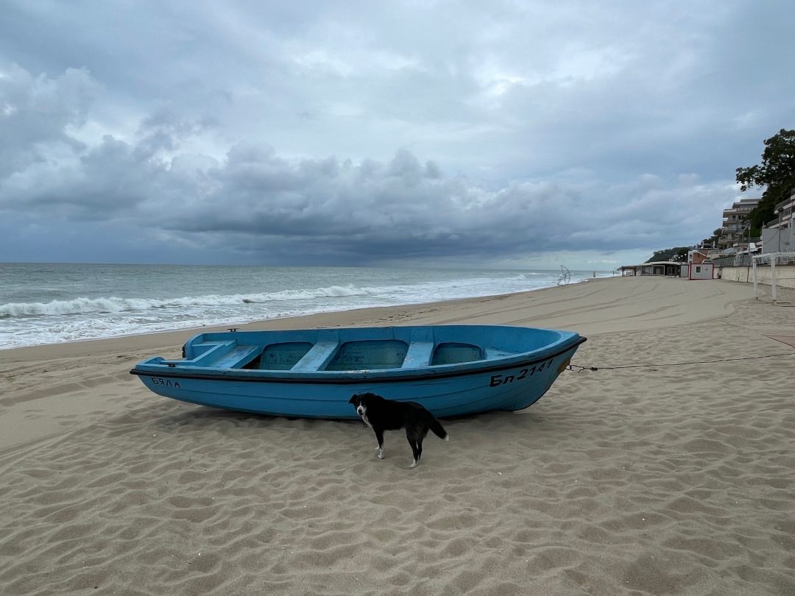

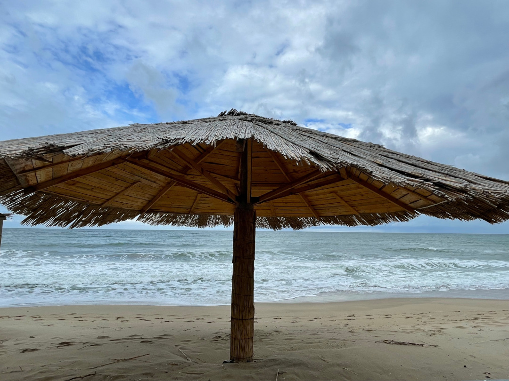

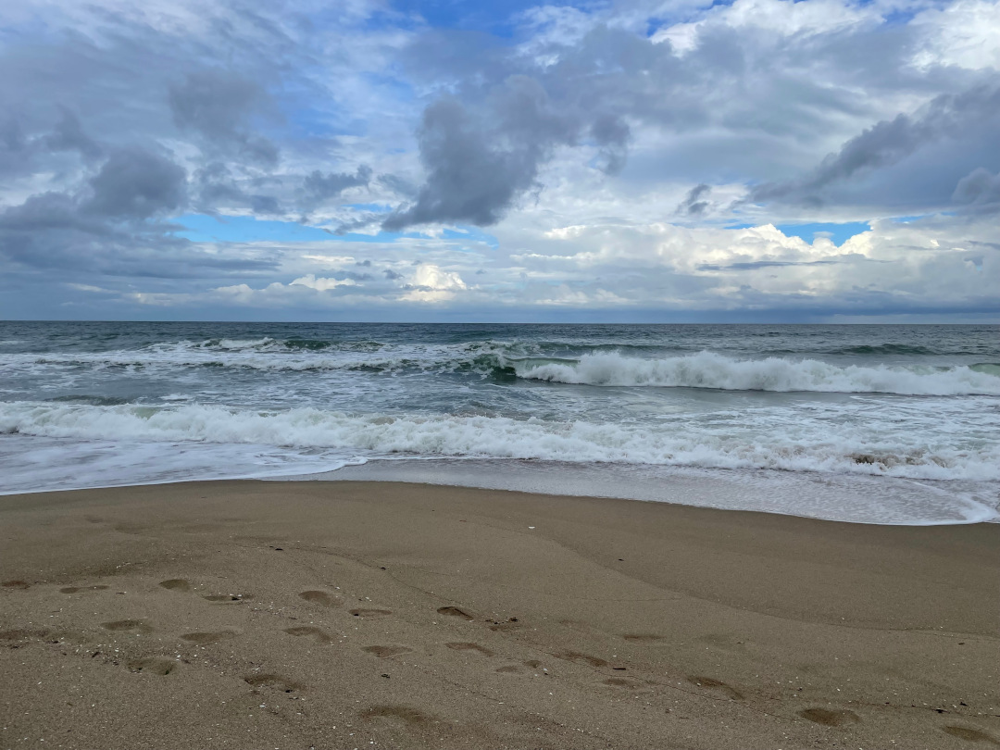

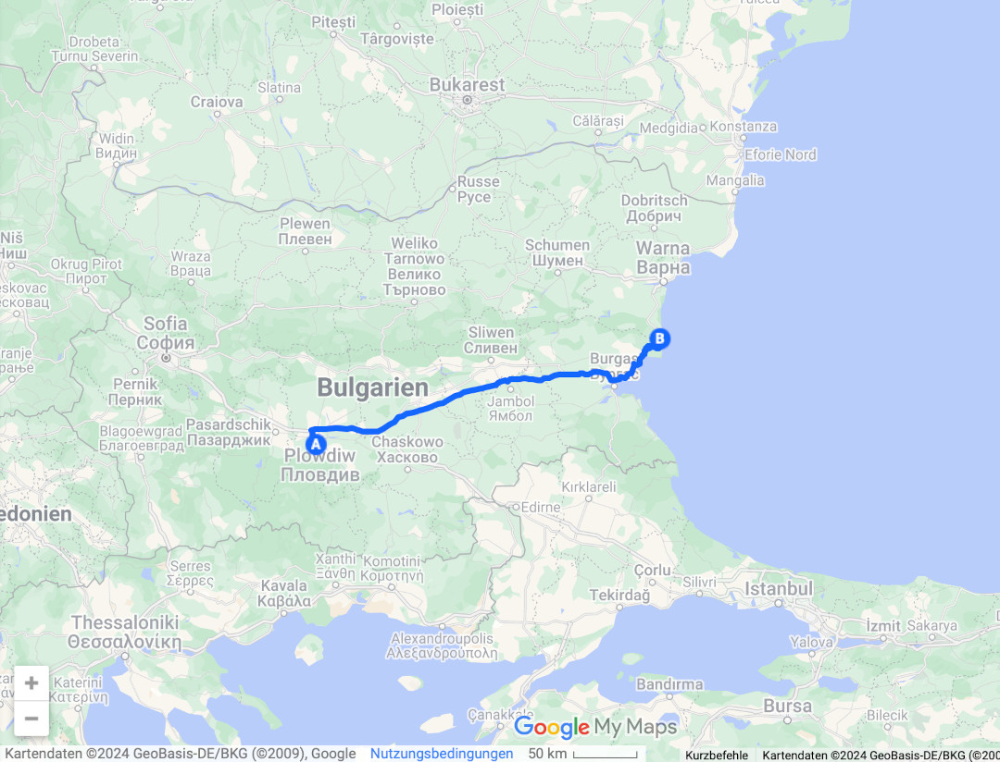

🗓️ 28. Mai: Als erstes gehen wir natürlich direkt an den Strand, laufen ein Stück und trauen uns dann auch noch ins Wasser. Mit 17 Grad ist es wirklich ziemlich frisch, so dass man noch tief durchatmen muss, aber trotzdem ist es eine willkommene Erfrischung am Morgen. Es sind sogar richtig gute Wellen heute, aber wir müssen auch etwas aufpassen, weil der Strand teils steil abfällt und man das wegen der Wellen nicht gut sehen kann. Danach sammeln wir Henry wieder ein, der in der Zwischenzeit entspannt am Strand gelegen hat. Inzwischen weiß er, dass Menschen, die ins Wasser gehen, gar keine andere Wahl haben, als irgendwann auch wieder rauszukommen. Wir gehen kurz zurück zum Bulli und machen uns fertig. Dann besorgen wir uns Frühstück, was mehrere Stopps erfordert, weil viele Läden noch zu haben und eher die kleinen Kioske geöffnet sind.  Am Ende sind wir aber erfolgreich und lassen es dann langsam angehen. Gegen Mittag packen wir unsere Sachen und legen uns an den Strand. Allerdings nur bis leider (mal wieder) ein Gewitter aufzieht. Wir kommen aber noch trocken wieder am Bulli an. Abends gehen wir mit Henry noch in eine Pizzeria, weil die eigentlich das einzige Restaurant ist, das schon offen hat und wir so nicht im Regen kochen müssen.  Auf dem Rückweg ergattern wir Eiskugeln und laufen am Strand entlang zurück. Inzwischen hat es wieder aufgehört zu regnen und so können wir draußen in der Dämmerung noch eine Partie Schach spielen. Die dauert länger als die letzten Male, aber am Ende heißt der Sieger leider trotzdem Tobi. 

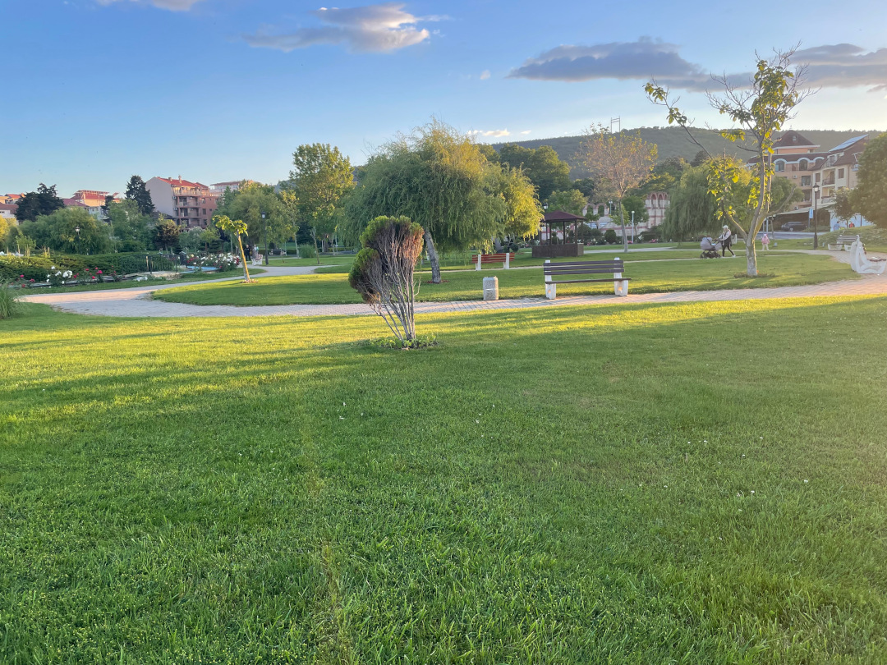

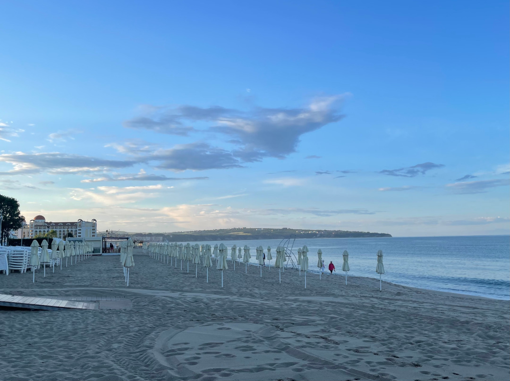

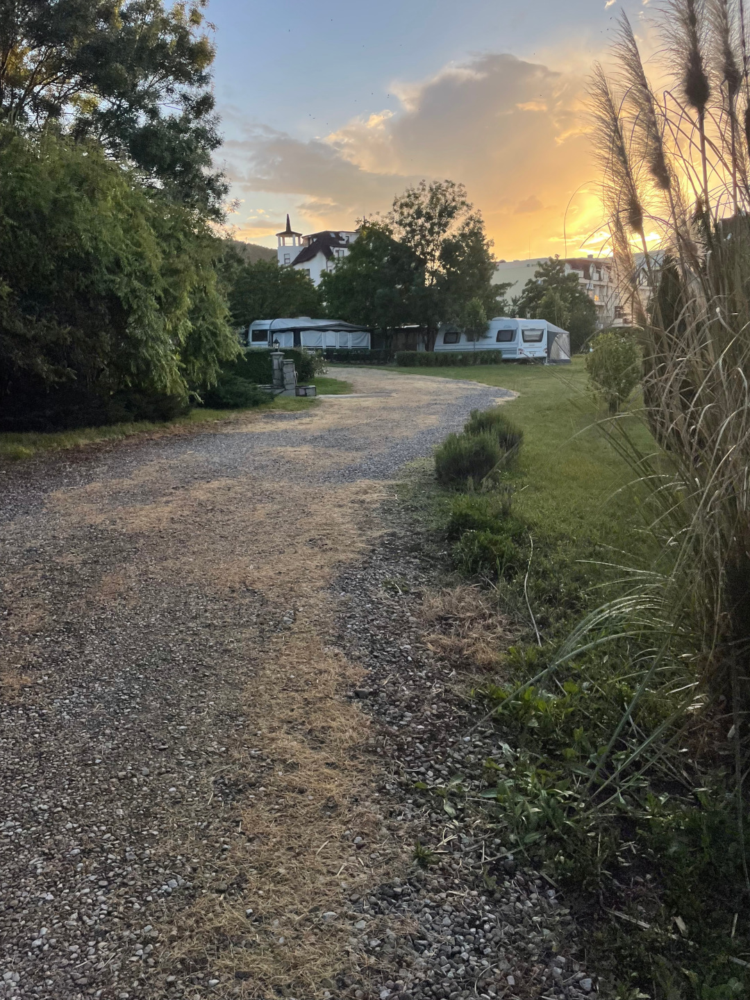

🗓️ 29. Mai: Unser erster Weg führt, wie könnte es anders sein, wieder an den Strand. Vormittags scheint in letzter Zeit immer am besten und verlässlichsten die Sonne. Deshalb hüpfen wir schnell nochmal rein. Heute ist das Meer im Gegensatz zu den letzten Tagen so ruhig, wie wir uns das schwarze Meer vorher vorgestellt hatten. Erst jetzt erkennen wir, wie schön klar das Wasser eigentlich ist. Die Erfrischung tut genau wie gestern sehr gut und anschließend machen wir uns fertig und düsen wieder los in Richtung Nordwesten. Unterwegs besichtigen wir die Ovech Festung, von der man eine tolle Aussicht über die Stadt Prowadija hat. Die Anlage besteht aus zwei Festungsteilen, die mit einer langen Holzbrücke verbunden sind. Den Bulli lassen wir lieber ganz unten stehen und gehen mit Henry zu Fuß, auch weil ein kyrillisches Schild schon davor warnt, dass die Straße nach oben für Autos schwierig ist. Oben angekommen eröffnen sich sehr schöne Spazierwege und so laufen wir spontan noch ungefähr eine Stunde weiter bis wir zum kleinen Höhlenkloster Shashkanite kommen. Der einzige Weg in die Höhlen führt über eine rostige Brücke, durch die man auch noch nach unten gucken kann. Tobi und Henry warten deshalb lieber auf festem Boden. Als ich zurück bin, gehen wir auf der anderen Seite der Felsen mit Blick auf das nächste Dorf wieder zurück. Den Abgang verfehlen wir ganze zwei Mal, bevor wir ihn wiederfinden, so unscheinbar ist er. Als wir ihn gefunden haben, geht es wieder runter zum Bulli. Wir fahren noch schnell einkaufen und dann weiter in ein kleines Dorf, in dem wir auf einem kleinen Campingplatz übernachten wollen. Der Platz ist mal wieder schön grün und ruhig und wir werden sehr freundlich von dem schottischen Besitzer empfangen. Neben uns ist nur ein anderes Paar aus Tschechien hier. An den großen Kirschbäumen dürfen wir uns so viele Kirschen pflücken, wie wir möchten, aber so viele wie überall hängen, können wir gar nicht schaffen. Die Kirschen sind auf jeden Fall total süß und saftig, also sehr lecker. Abends können wir dann noch ein Feuer machen. Weil wir das gar nicht so oft machen, ist es für uns allerdings etwas Arbeit es überhaupt ans laufen zu kriegen, aber als das dann einmal geschafft ist, haben wir einen sehr entspannten Abend. Und falls wir es mal vergessen: Der beste Trick bleibt gute trockene Rinde als Zunder und eine solide gebaute Pyramide aus dünnen und dickeren Ästen. Wir bleiben noch lange sitzen, bis die Glut nicht mehr länger glüht, müssen uns aber keine Sorgen um ein erneutes Entfachen machen, weil es nachts wieder anfängt zu regnen. 

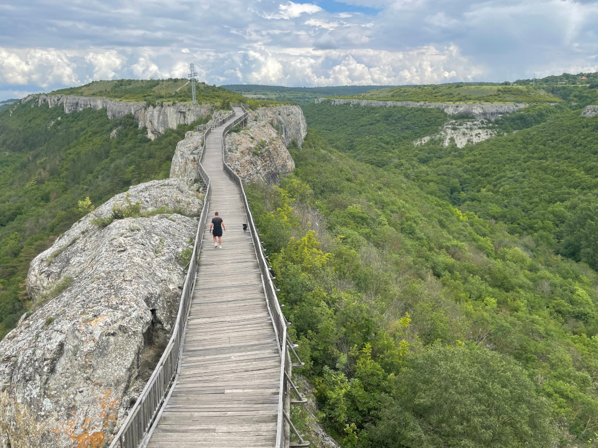

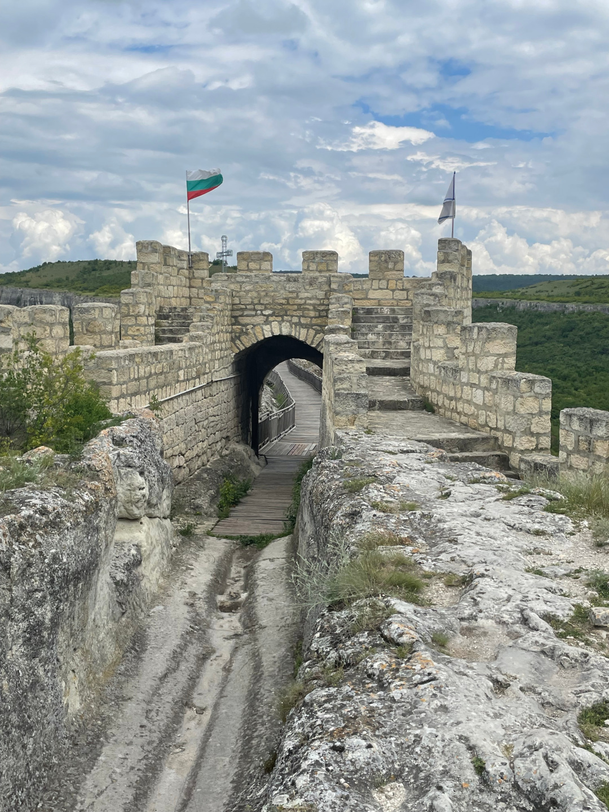

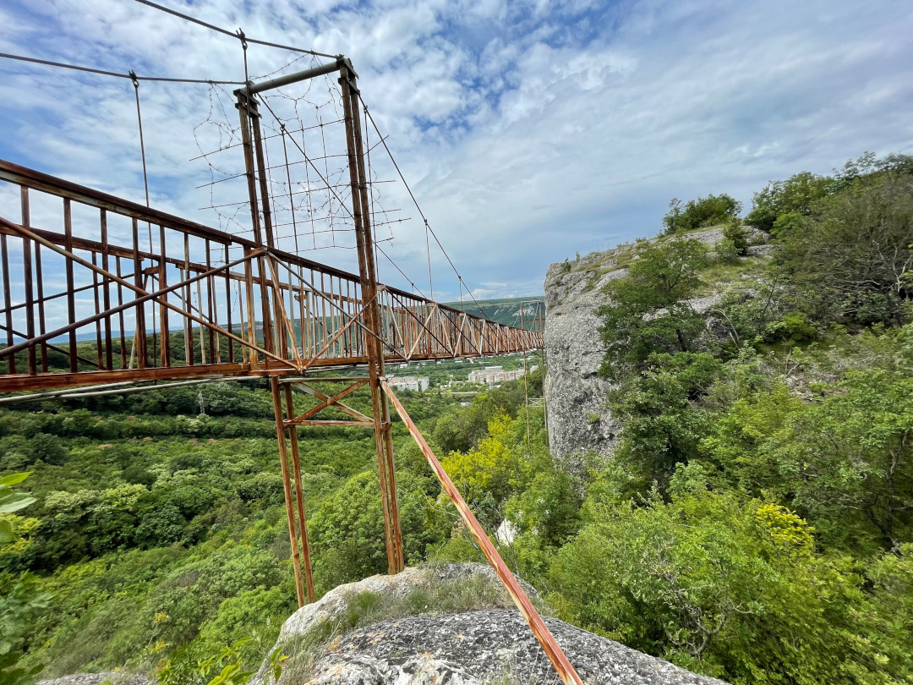

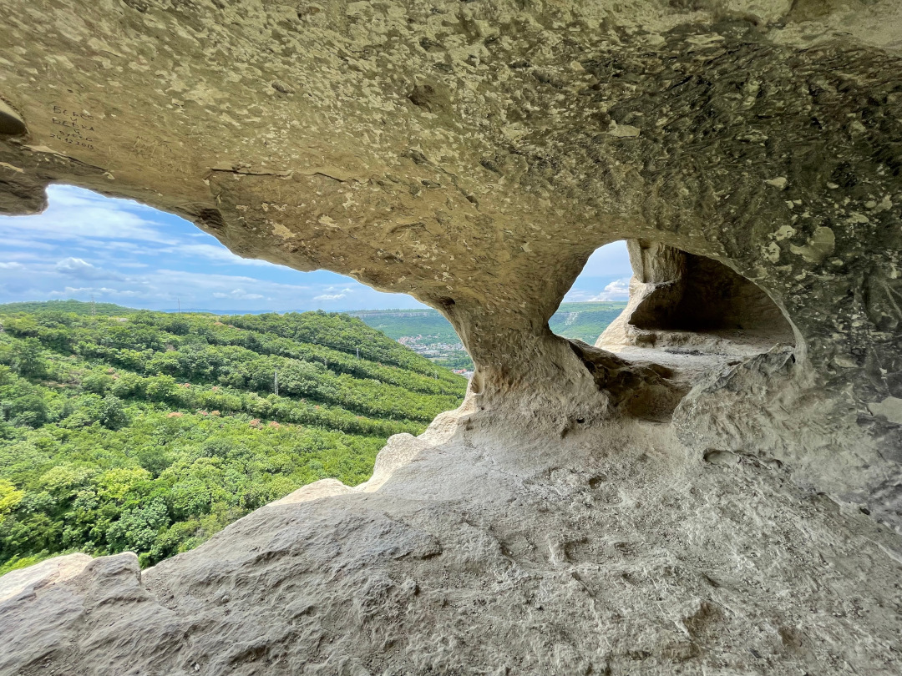

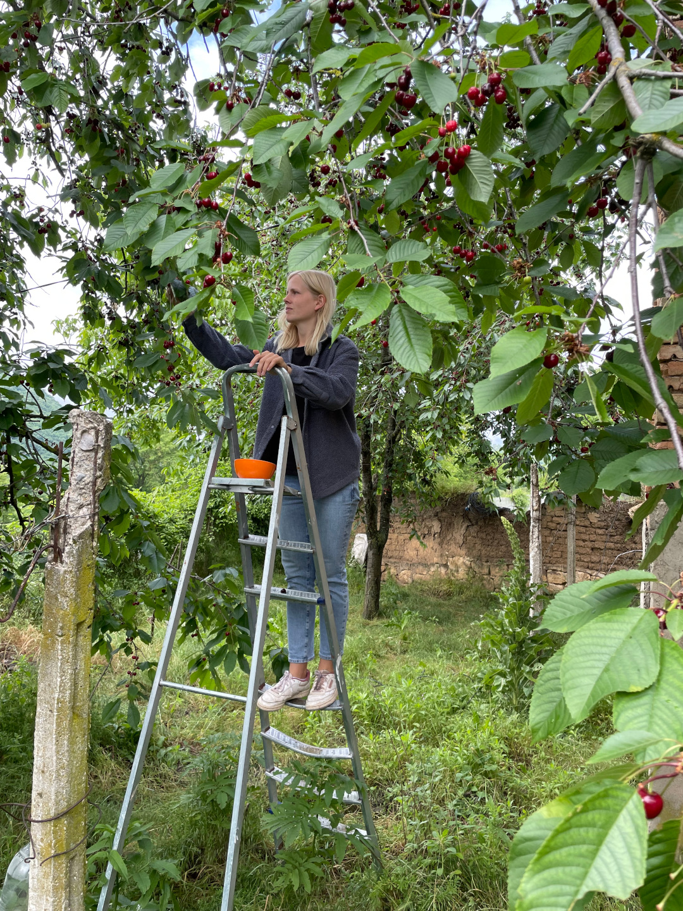

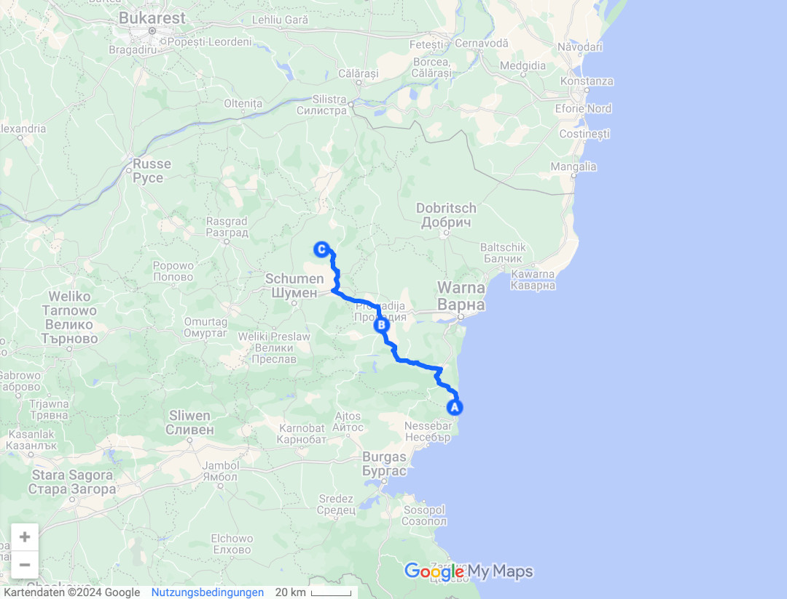