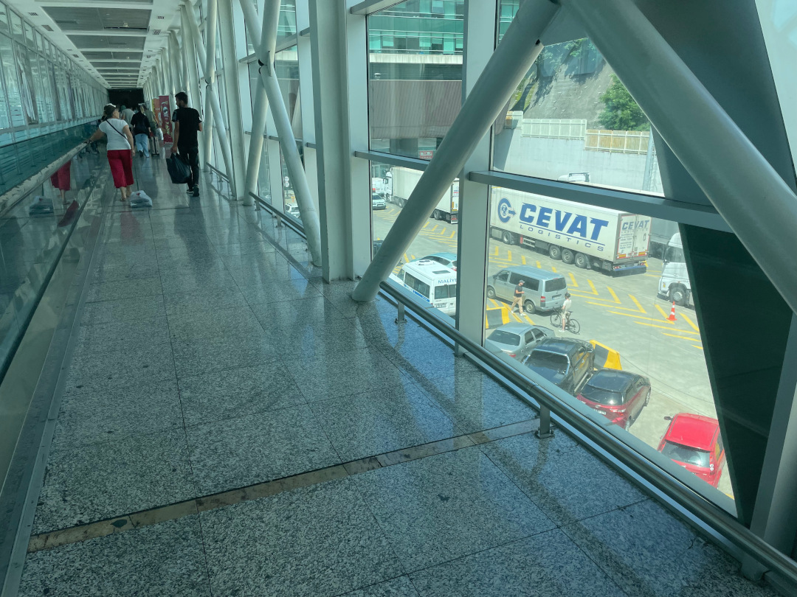
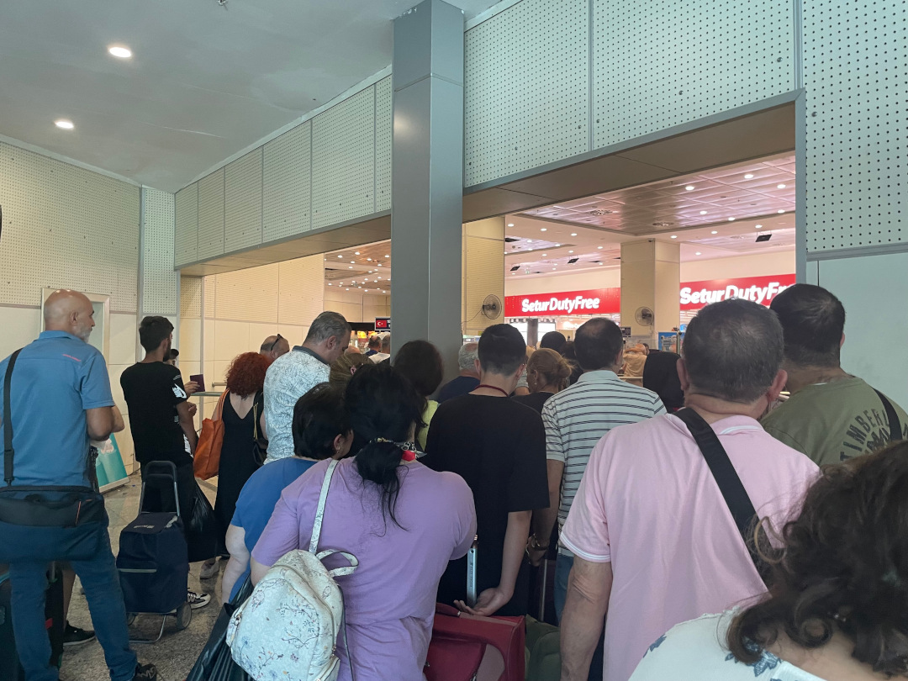
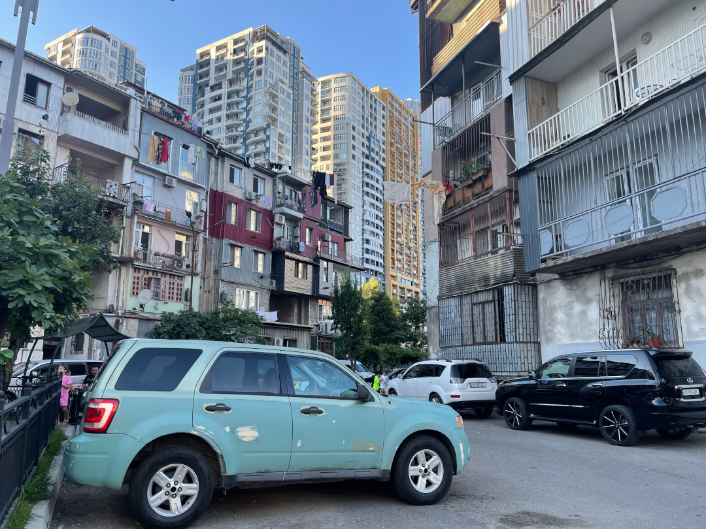
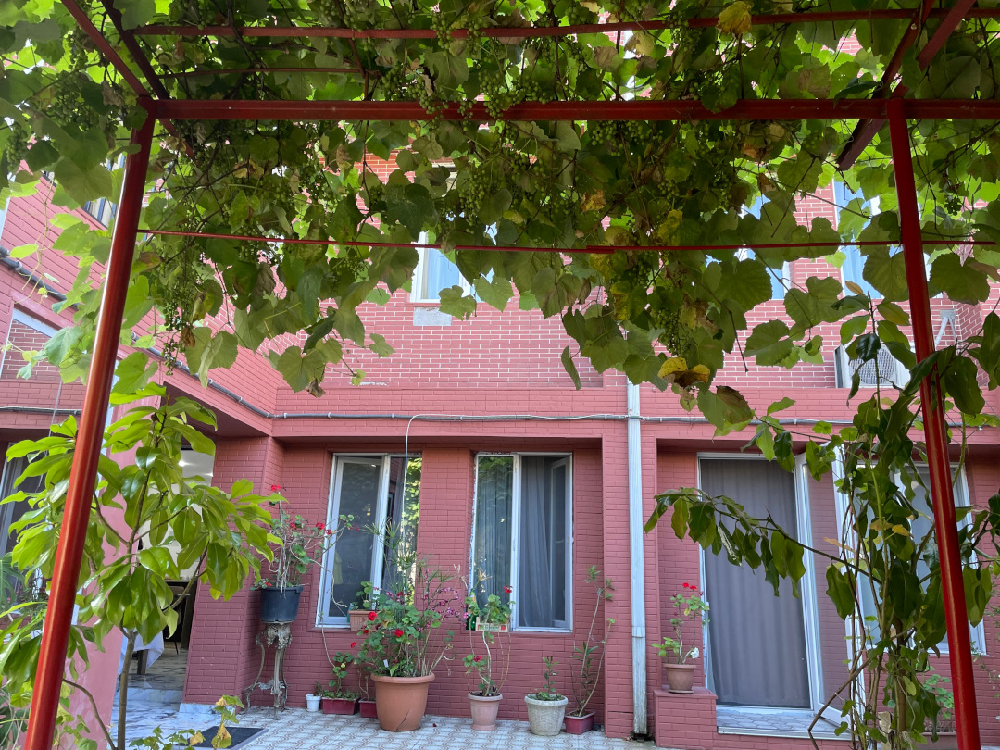
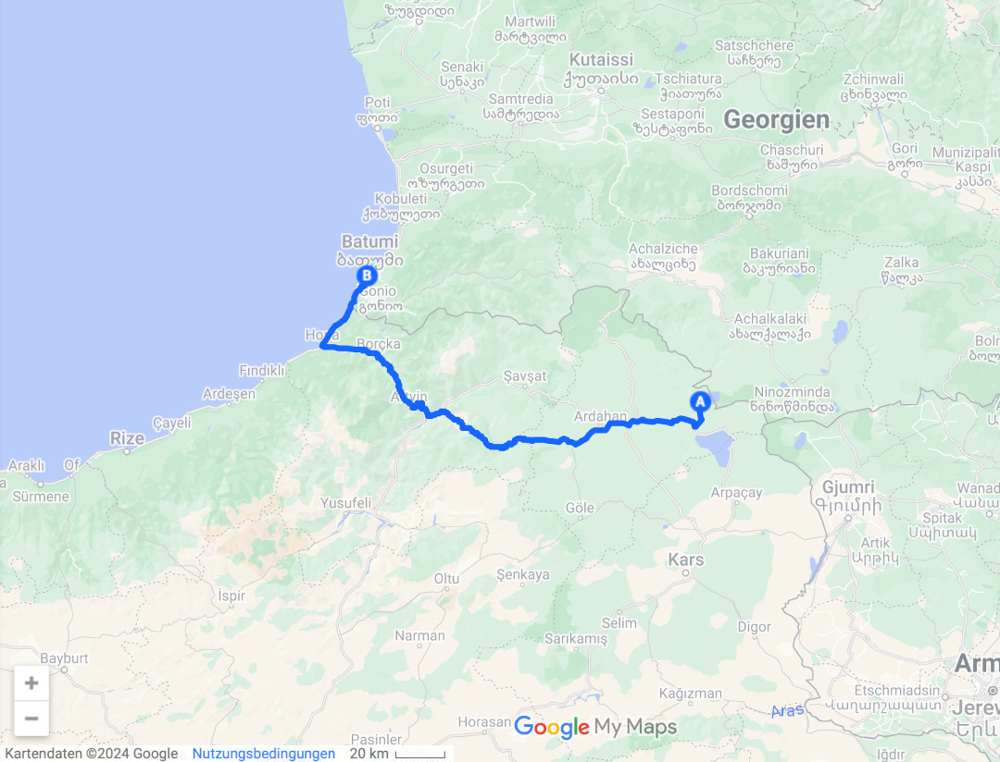
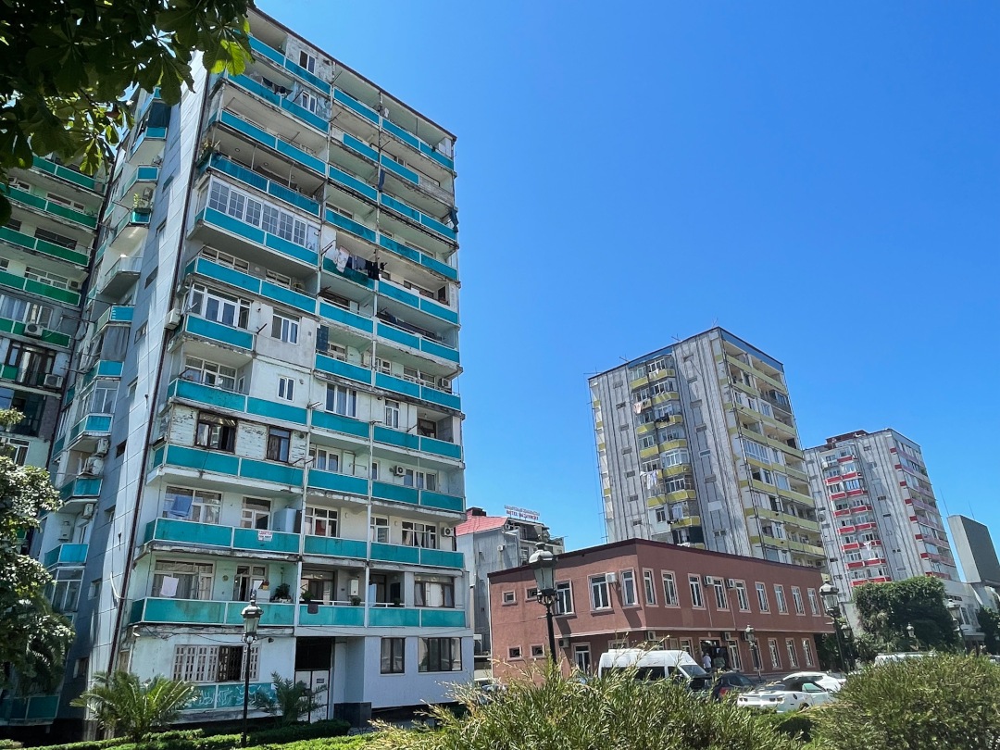
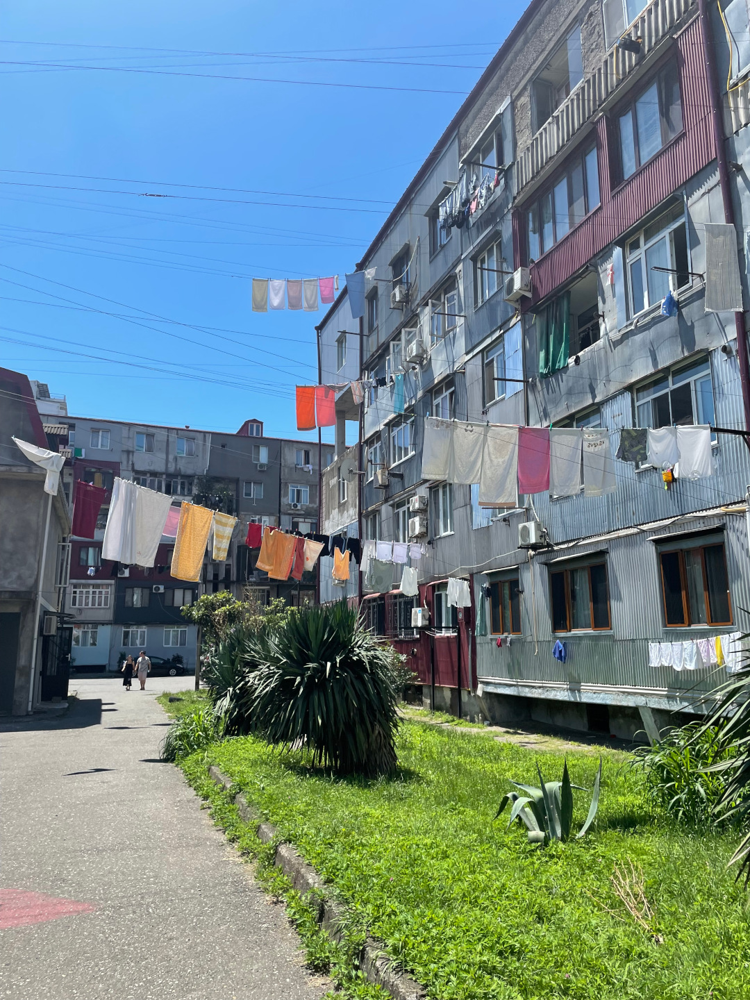
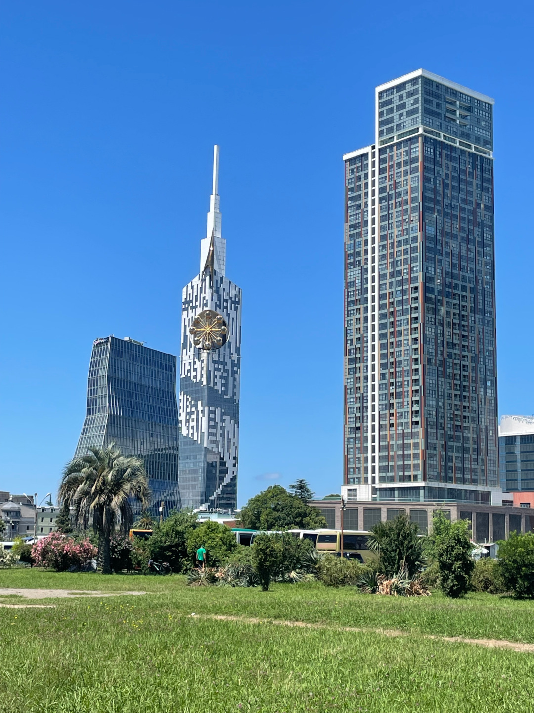
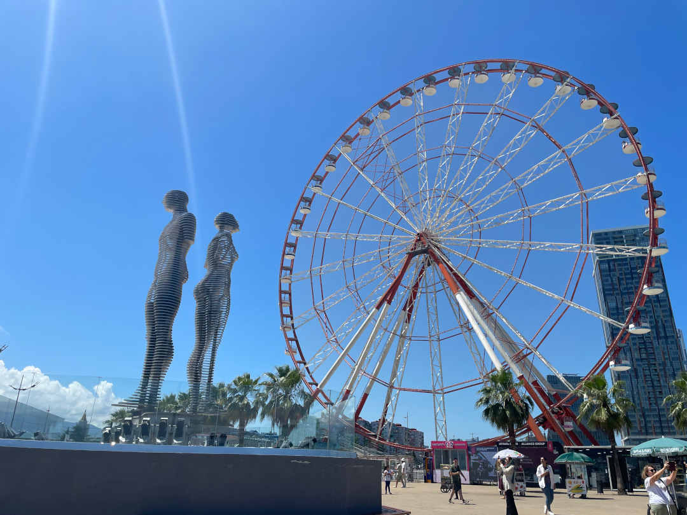
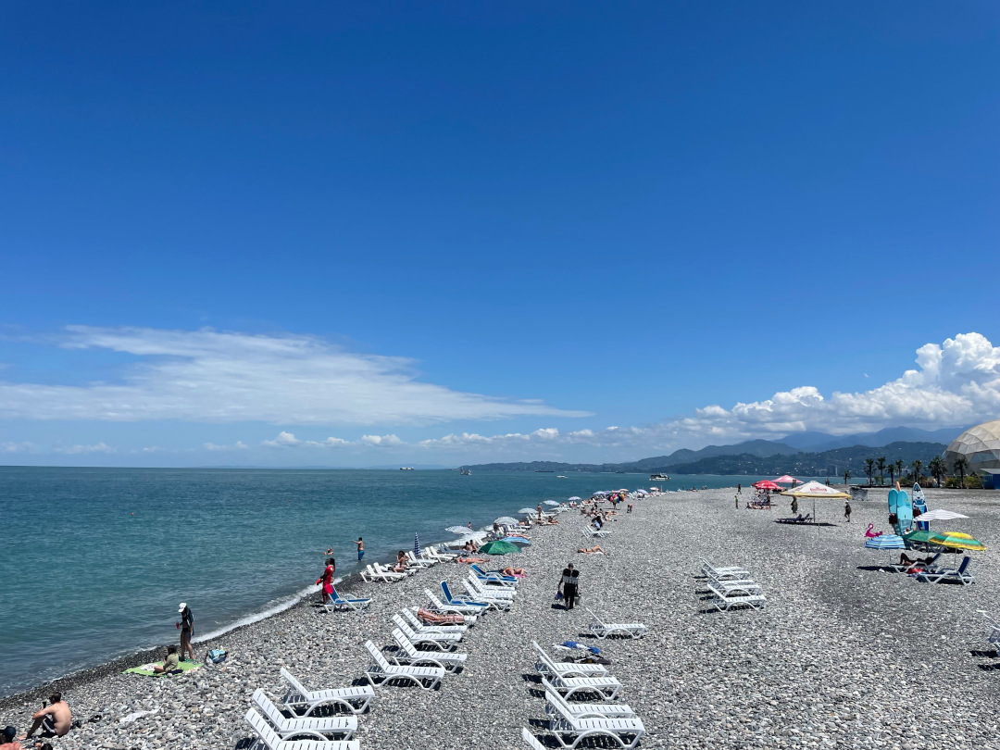

Wir müssen zwangsweise den Umweg von der Türkei über Georgien nach Armenien nehmen, weil die Grenzen zwischen der Türkei und Armenien geschlossen sind.

<!--more-->

🗓️ 27. Juni: Wir wachen bei bestem Panoramablick auf. Der Wind war nachts teilweise so heftig, dass wir etwas Sorge um den Bulli hatten, aber im Endeffekt ist alles gut gegangen. Gestern Abend haben sich noch unsere Pläne geändert, weil wir spontan die Ansetzung des georgischen Supercups herausgefunden haben. Also führt uns unser Weg nun nach Batumi, in die zweitgrößte Stadt Georgiens direkt am schwarzen Meer. Wir gehen eine letzte Henry-Runde durch die Türkei und machen uns auf zur Schwarzmeerküste. Die Fahrt dauert gut vier Stunden, wovon wir noch mindestens dreieinhalb durch die Türkei fahren. Dann erreichen wir aber relativ schnell die Grenze zu Georgien. Wir halten an dem ersten Grenzposten, der fragt, wem das Auto gehört. Weil ich als Besitzer eingetragen bin, muss Hanna (die eigentlich gefahren ist) aussteigen und zu Fuß über die Grenze laufen. Nur der Besitzer darf mit dem Auto über die Grenze. Hanna merkt, dass es nicht nur in Marokko aktives Anstehen gibt, sondern auch in Georgien. Wenn man seinen Platz nicht verteidigt, ist es schwierig die Grenze zu passieren. Mit dem Auto läuft es ebenfalls sehr chaotisch ab. Es gibt insgesamt vier Kontrollen und davon wird zwei Mal das Innere vom Auto kontrolliert. Ich befinde mich schon in der letzten Kontrolle als der georgische Beamte Henrys Pass sehen möchte. Den kann ich ihm natürlich geben. Das Problem ist nur, dass die wichtigsten Daten (Chipnummer) im Pass auf eine Folie mit Folienstift eingetragen sind. Es war aber wohl die letzten Tage so heiß im Bulli, dass davon nichts mehr zu lesen ist. Es findet sich also keine Chipnummer. Mittlerweile stehen vier Beamte an dem Bulli und lassen mich nicht einreisen. Als sie schon vom Bulli zum nächsten Auto gegangen sind und mich quasi abblitzen lassen wollten, finde ich noch ein Tierarzt-Dokument mit der Chipnummer. Ich rufe den Sheriff schnell heran und kann tatsächlich weiterfahren. Das hätte ich nicht gedacht. Bis ich merke, dass zwei Typen in Warnweste hinter mir herlaufen. Ich halte mit dem Bulli an, merke aber, dass die beiden mir nur eine georgische KFZ-Versicherung verkaufen wollen. Die haben wir aber schon online abgeschlossen. Direkt hinter der Grenze hält dann jeder überall an, um seine Mitfahrer einzusammeln, also das nächste Chaos. Ich finde nach einigen hundert Metern einen Parkplatz am Straßenrand und will Hanna suchen. Dann steht der nächste Typ in Warnweste neben mir. Der Parkplatz kostet angeblich 3 Lari (1€), weil ich aber noch keine Lari habe, gebe ich ihm 5€ und sage: its ok. Sein Glückstag. Hanna finde ich dann zum Glück relativ schnell und sie hat sogar schon georgisches Bargeld abgehoben. Wir suchen noch die Toilette und merken dann was uns die nächsten Tage in Georgien als Toilette blühen könnte und besorgen uns auf den Schreck eine Cola und wollen raus aus dem Gewusel. Das geht leider nicht, weil wir schon fast in Batumi sind und der Verkehr hier ebenfalls sehr wuselig und chaotisch ist. Schlimmer als in Marokko und der Türkei. Straßenschilder sind nur Hinweise und im Endeffekt fährt jeder so wie er möchte und hält da an, wo er möchte. Es wird schon seinen Grund haben. So sehen aber auch viele Autos aus. Selten hat die Stoßstange dieselbe Farbe wie der Rest des Autos und teilweise fahren die Autos komplett ohne Stoßstange. Wir erreichen aber heile unser Hotel für heute Nacht. Die Campingplätze müssen erstmal warten, weil es rund um Batumi keine gibt, und Freistehen machen wir erst, wenn wir das Land etwas kennengelernt haben. Der Hotelpreis mit Frühstück im grünen Hinterhof ist aber günstiger als ein Campingplatz in Spanien. Wir kommen relativ spät an, so dass wir nur etwas die Umgebung angucken und auch als Fußgänger echt aufpassen müssen. Autos haben quasi immer Vorfahrt auch bei grünen Fußgänger Ampeln. Die Straßenhunde sind bis jetzt aber erstmal relativ ruhig, so dass man auch etwas mit Henry durchs Getümmel laufen kann. Wir besorgen uns noch etwas zu essen und beenden den ersten Tag in Georgien.

🗓️ 28. Juni: Die erste Nacht in Georgien ist ruhig. Morgens laufen wir sogar noch eine etwas größere Runde mit Henry, die auch ruhig bleibt. Wir haben zwar gehört, dass die Straßenhunde hier noch spezieller sein sollen, aber das lässt sich jetzt erstmal nicht bestätigen. Weil wir ja sogar Frühstück im Hotel haben, starten wir gut genährt in den Tag und können uns die Stadt angucken. Der Kontrast zwischen der alten Stadt und den Neubauten ist echt extrem. Auf der einen Seite gibt es noch viel sowjetischen Plattenbau und auf der anderen Seite die neuen Hochhäuser und Hotels. Allein ein Hochhaus macht Werbung für über 23.500 Apartments in dem Haus. In einem Hotel gibt es ein kleines Riesenrad, um die Stockwerke zu wechseln. Dahinter steht dann wieder ein Plattenbau, wo jeder Balkon zum Wäsche trocknen genutzt wird. Das Schwarze Meer überzeugt uns heute aber nicht, so dass wir drauf verzichten reinzuspringen. Auf dem Rückweg besorgen wir uns in einem Carrefour Mittagessen. Nach der langen Zeit in der Türkei nun endlich wieder ein großer Supermarkt mit vielen vertrauten Produkten. Das nutzen wir natürlich direkt aus und kaufen viel. Abends spielt dann Dinamo Batumi gegen Torpedo Kutaissi im georgischen Supercup. Gespielt wird in der großen Batumi Arena, in die 20.000 Leute reinpassen. Das Stadion wurde 2020 eröffnet und ist das größte Stadion außerhalb von Tiflis. Heute sind aber nur knapp 3-4.000 Leute da. Die Karte kostet umgerechnet 1,75 €, also sehr fair. Es gibt sogar Bier im Stadion und Gästefans. Der Favorit aus Batumi führt kurz vor Ende 2:1 und es wird in den Unterbrechungen schon die Siegerplaylist gespielt, als Kutaissi im letzten Angriff ausgleicht. Es gibt keine Verlängerung, sondern direkt Elfmeterschießen. Wie hätte es anders sein sollen, denn das gewinnt schlussendlich Kutaissi. Die Länderpunkte Nummer 31 und 14 werden also sogar in über 90 Minuten absolviert. Wir haben es auch Kutaissi gegönnt, weil die Gästefans deutlich mehr Stimmung gemacht haben als die „Black Sea Pirates“ aus Batumi. Nach dem Spiel geht es schnell zurück zum Hotel und nach der Henry-Runde ab ins Bett.

