Es geht nach über sieben Monaten zurück nach Deutschland und wir genießen noch etwas die bayrische Natur.

<!--more-->

🗓️ 27. August: Endlich kühlt es sich nachts auch wieder gut ab, so dass wir auch wieder mit geschlossenen Türen schlafen können. Direkt an der Donau jogge ich eine Runde und Hanna geht mit Henry spazieren. Danach machen wir uns auf den Weg nach Deutschland. Für Hanna ist es nach über sieben Monaten das erste Mal zurück in Deutschland. Vorher gibt es aber noch zwei Zwischenstopps. Zuerst halten wir bei einem Friseur für Hanna. Sie konnte in Tirana ja leider nicht fündig werden, daher hat sie sich einen Friseur in Enns ausgesucht. Enns ist die älteste Stadt Österreichs. Ich laufe mit Henry in der Zeit einmal durch die Stadt. Großartig sehenswert ist sie allerdings nicht. Nach viel Wartezeit ist Hanna dann auch endlich an der Reihe. Danach geht es in die Nähe von Linz zur KZ Gedenkstätte Mauthausen. Hanna durchläuft mit Henry die Gedenkstätten außerhalb des Lagers und ich gehe einmal durch das Lager. Der Eintritt und das Parken ist sogar kostenlos.  Außerhalb des Lagers hat jedes Land, aus dem hier Menschen starben, seine eigene kleine Gedenkstätte errichtet. Im Lager stehen noch einige Baracken, das Lagertor und die Außenmauern. Es ist wie jedes Mal an so einem Ort sehr bedrückend. Leider finde ich am Ende den Buchshop nicht und muss ohne Bücher abreisen. Wir kriegen schnell die Köpfe frei und gehen ein letztes Mal in Österreich einkaufen. Natürlich stilecht Spätzle. Die Grenze nach Deutschland passieren wir auf einer sehr kleinen Straße zwischen zwei Dörfern. Es ist sehr unspektakulär und ohne Schild hätten wir es nicht gemerkt. Wir bleiben direkt an dem Ort an der Grenze und finden hier einen super Stellplatz für die Nacht. Viel Grün, viel Platz, viel Ruhe und mitten in der Natur entscheiden wir zwei Nächte zu bleiben, so dass wir morgen wandern können. Wir kochen noch fix, trinken Spezi und machen uns dann nach dem langen Tag auf den Weg ins Bett.

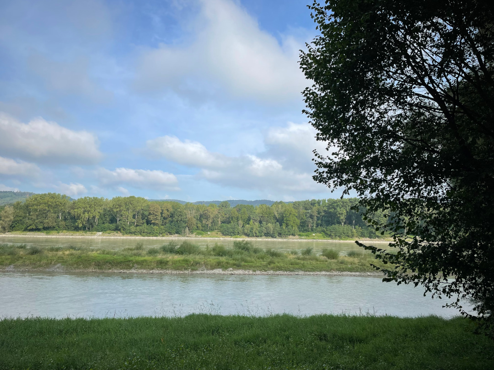

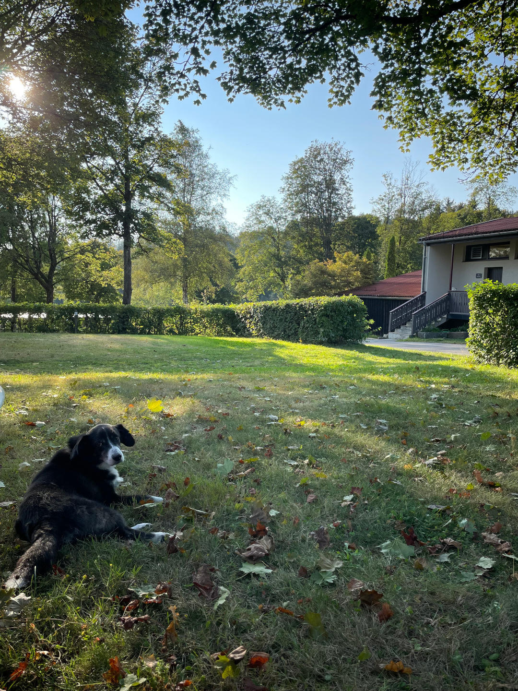

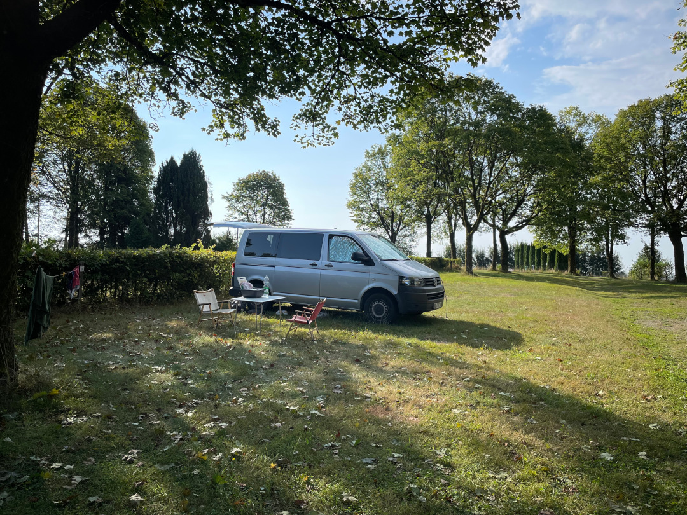

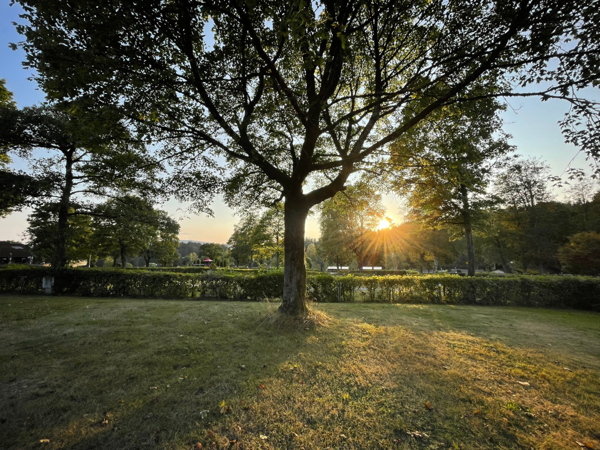

🗓️ 28. August: Als wir aufwachen und den Vorhang zur Seite schieben, steht schon eine Papiertüte mit Brötchen auf unserem kleinen Tisch draußen. An diesen Service könnten wir uns gewöhnen. Wir haben hier richtig gut geschlafen, weil es super ruhig war. In der Nacht hatten wir außerdem noch einen richtig guten Blick auf den Sternenhimmel und die Milchstraße. Wir frühstücken also erstmal in Ruhe. Dann gehen wir direkt vom Platz aus los auf einen Wanderweg. Unser Ziel ist der Rannasee. Dorthin geht es auf schönen Wegen durch den Wald. Dabei wechseln wir immer wieder zwischen Deutschland und Österreich hin und her (also nochmal ein Hoch auf die EU). Ein altes Schild ist alles, das an eine Staatsgrenze erinnert. Von zwei benachbarten Höfen liegt der eine in Deutschland und der andere in Österreich. Am Rannasee angekommen finden wir direkt eine schöne Stelle mit Steg. Erst sind wir dort ganz alleine und springen schnell rein. Nach dem warmen Mittelmeer sind wir so kaltes Wasser gar nicht mehr gewöhnt. Es tut aber sehr gut. Als wir wieder rausgehen, kommt ein Mann von irgendwoher angeschwommen und klettert auch auf unseren Steg. Schnell wird klar, dass er ein großes Redebedürfnis hat und so sitzen wir über eine halbe Stunde mit ihm auf dem Steg und er erzählt viel. Wir auch ein bisschen. Dann springen wir nochmal rein, ziehen die Wanderschuhe wieder an und machen uns auf den Rückweg. Der geht ganz gut bergauf. Als wir zurück sind, ruhen wir uns aus und kümmern uns ein letztes Mal unterwegs um unsere Wäsche. Diesmal schon wieder mit Trockner, denn die Zeiten, in denen die Wäsche auf der Leine selbst nachts trocknen konnte, sind vorbei. Abends machen wir uns auf den Weg in den kleinen Ort zu einem Landgasthof und essen erstmal ein Cordon Bleau. Danach gibt’s noch ein Tischtennisduell, das sehr knapp im letzten Spiel an Tobi geht. Für die Revanche sind wir für Dortmund verabredet.

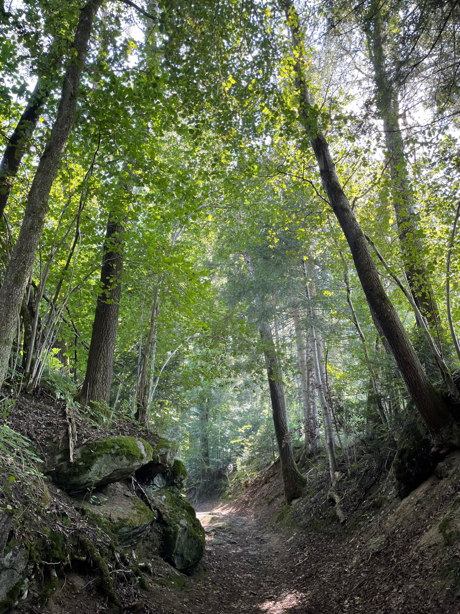

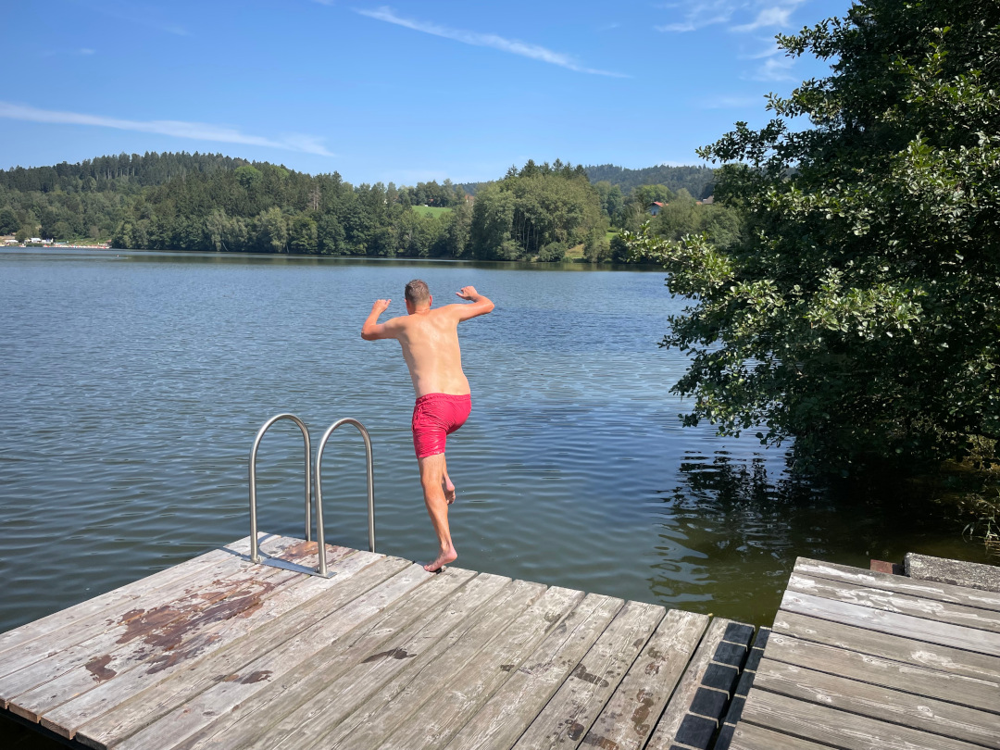

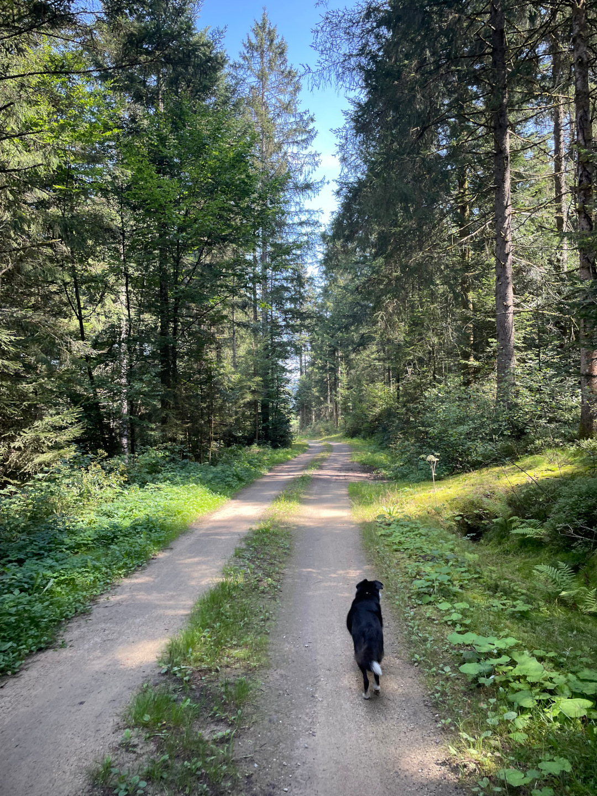

🗓️ 29. August: Auch die letzte Nacht hier in Gottsdorf war sehr ruhig. Mit etwas Muskelkater gehen wir eine letzte Runde mit Henry durchs Grüne. Danach machen wir uns auf den Weg nach Passau. In dieser Ecke in Deutschland waren wir beide noch nie. Daher wollen wir uns noch etwas die Umgebung angucken. Vom Stellplatz sind wir in einer halben Stunde in Passau. Wir finden einen Parkplatz und laufen einmal durch die Altstadt bis zum Dreiflüsseneck und zum Dom. Die Altstadt auf der Halbinsel ist wirklich cool, fast so schön wie Dortmund. Es sind nur leider viele Donauschiffsfahrtstouristen in der Stadt. Das ist wiederum ein Vorteil von Dortmund. Hier gibt es keine Touristen. Wir besorgen uns noch Frühstück/Mittag und fahren weiter nach Kitzingen, wo wir die letzte Nacht der Reise verbringen wollen. Wir erreichen Kitzingen gegen 17 Uhr und sind auf einem echten deutschen Campingplatz. Super voll, hoher Altersdurchschnitt, sehr teuer und mehr Verbote als Erlaubtes. Wäre das Camping weltweit so, dann hätten wir die Reise wohl nicht gemacht. Wir machen das Beste draus und können immerhin das Schwimmbad nebenan umsonst besuchen. Danach drehen wir mit Henry noch eine Runde durch Kitzingen und suchen einen Dönermann. Die meiste Vorfreude auf Deutschland ist aufgrund des Döners. Nach langer Suche finden wir einen, der noch geöffnet hat. Mit Spezi und Döner im Bauch geht’s zurück zum Bulli. Wir machen uns das letzte Mal bereit fürs Bett und die letzte Nacht der Reise steht an.

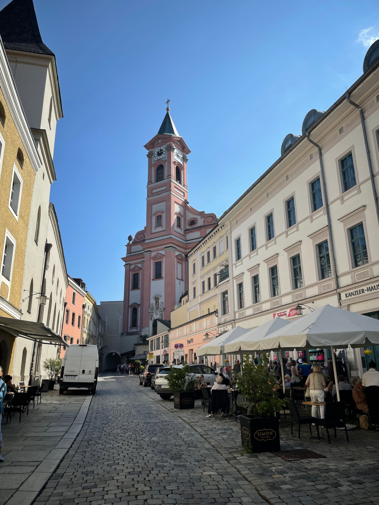

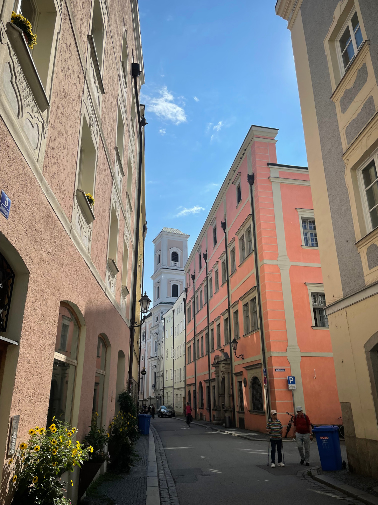

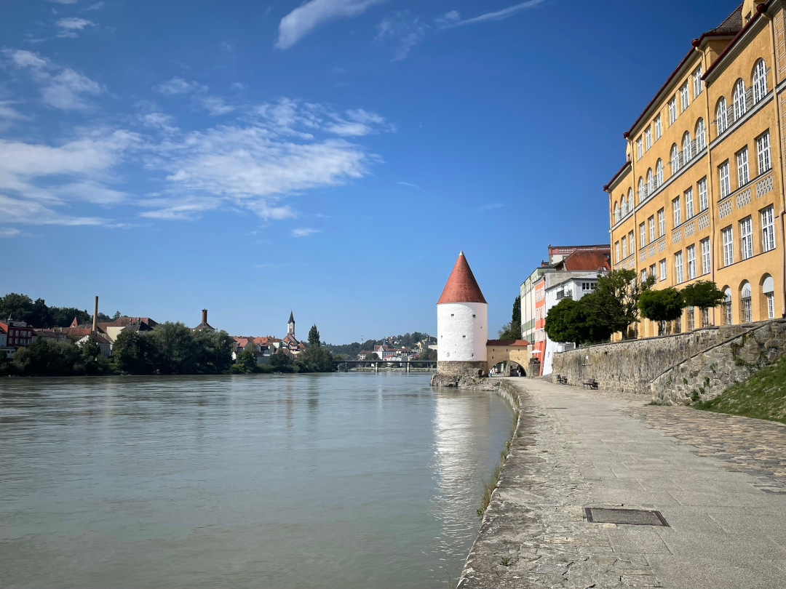

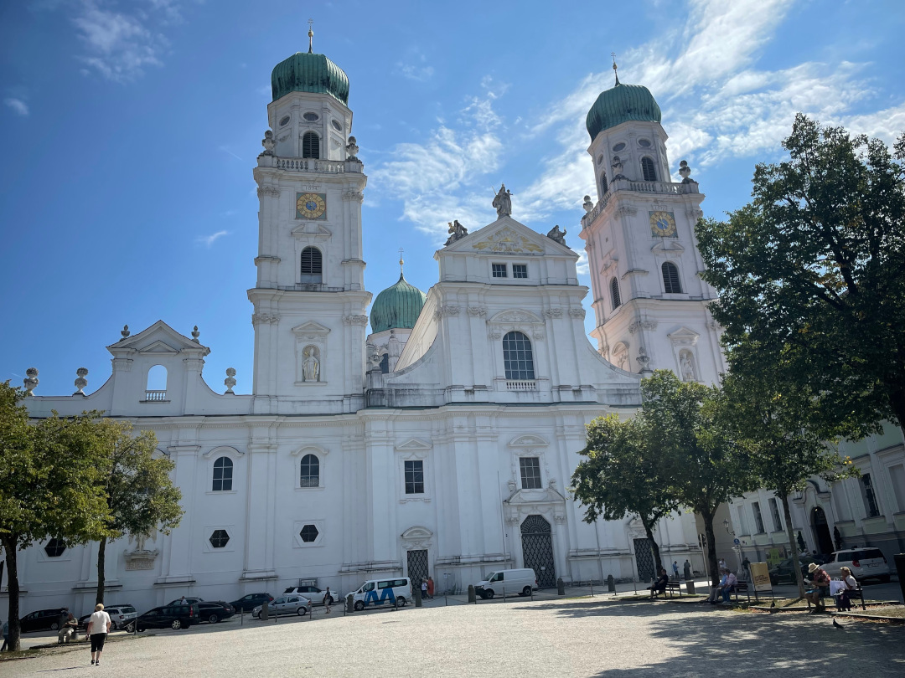

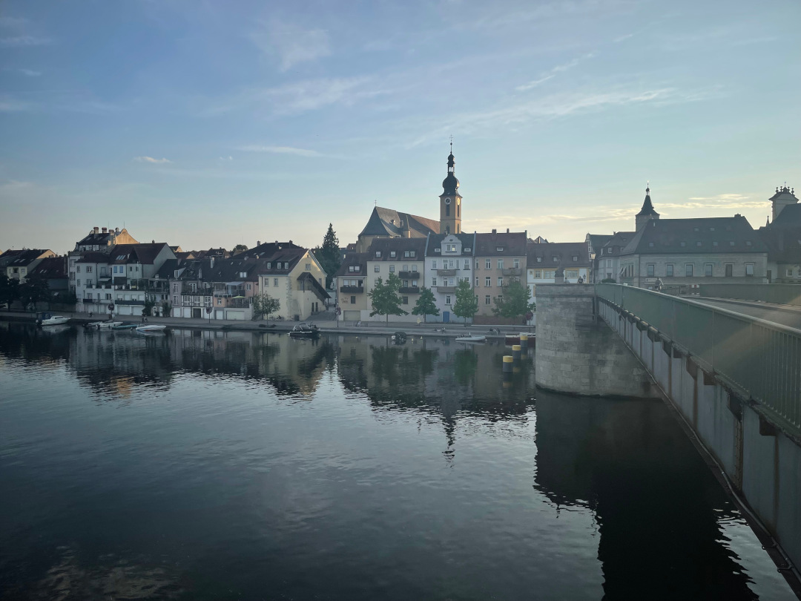

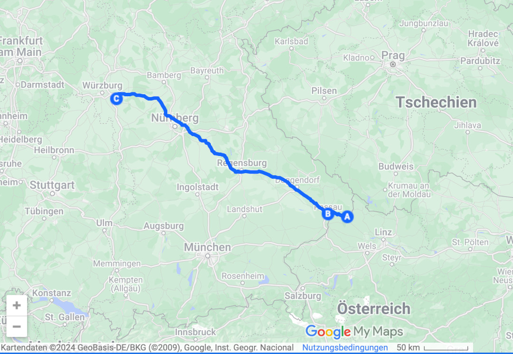