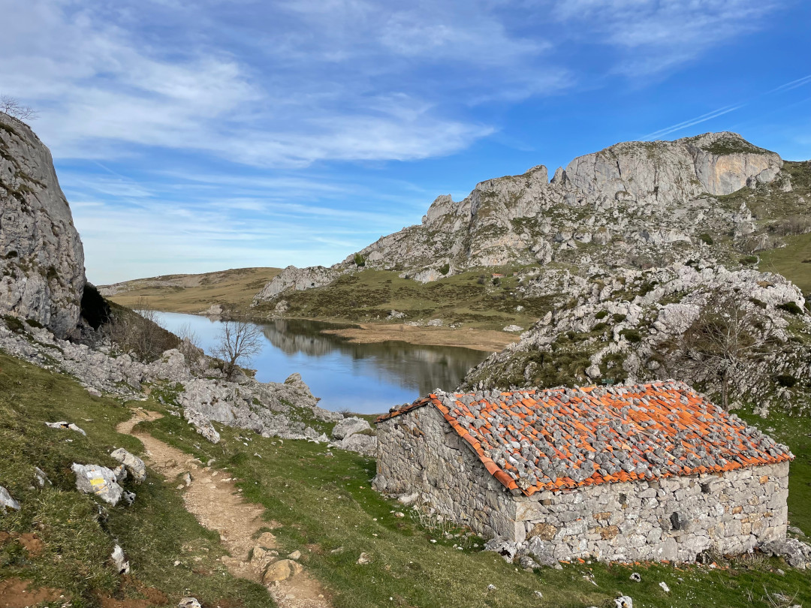
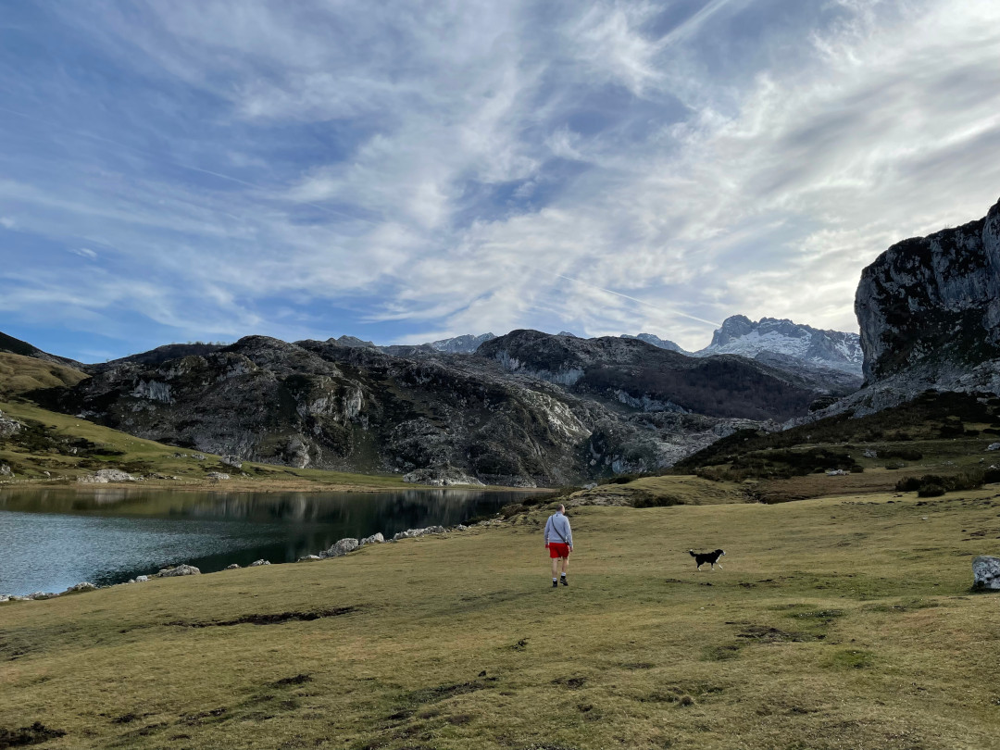
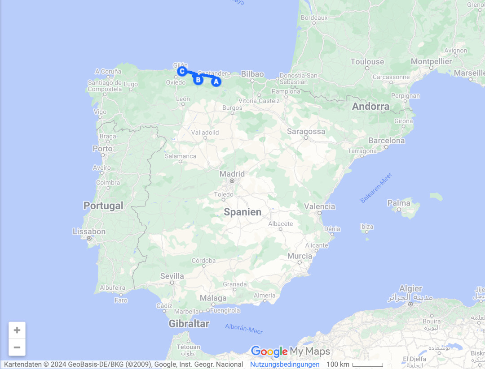
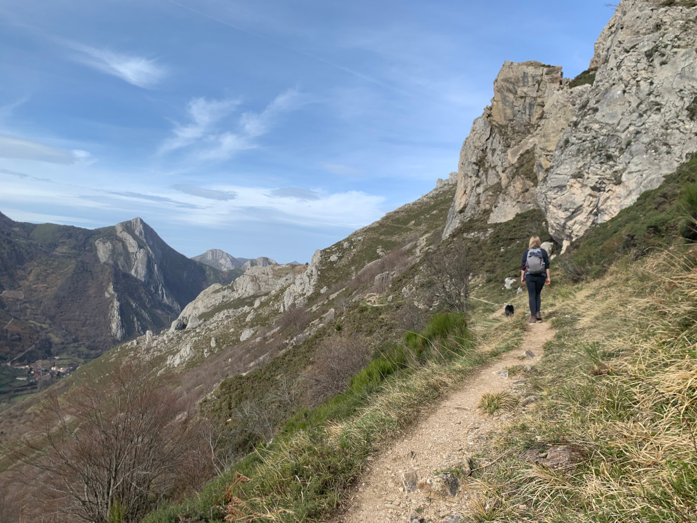
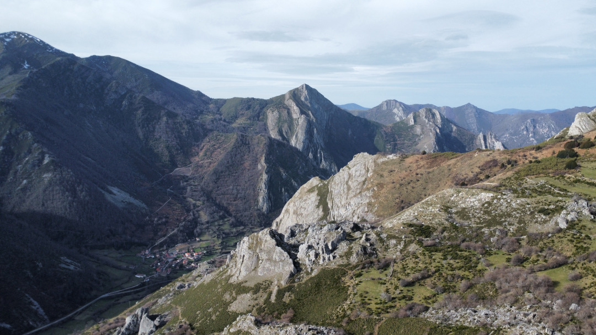
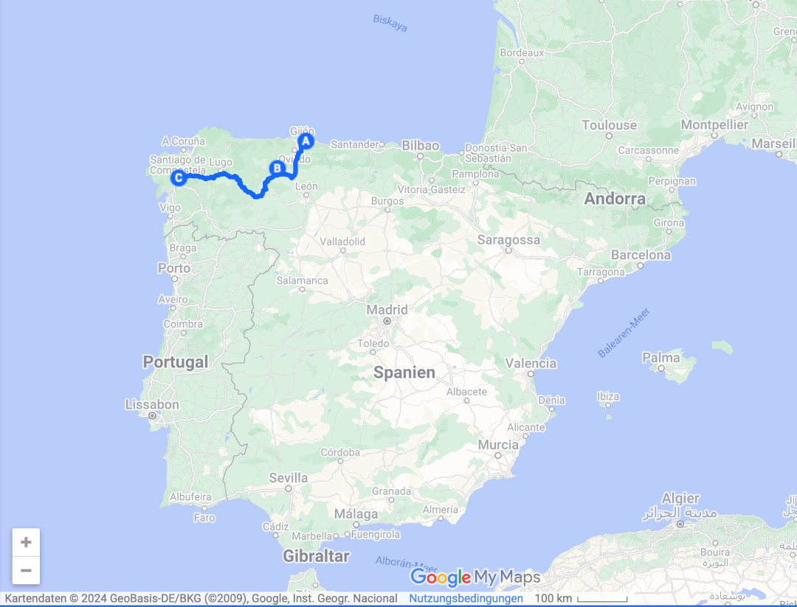
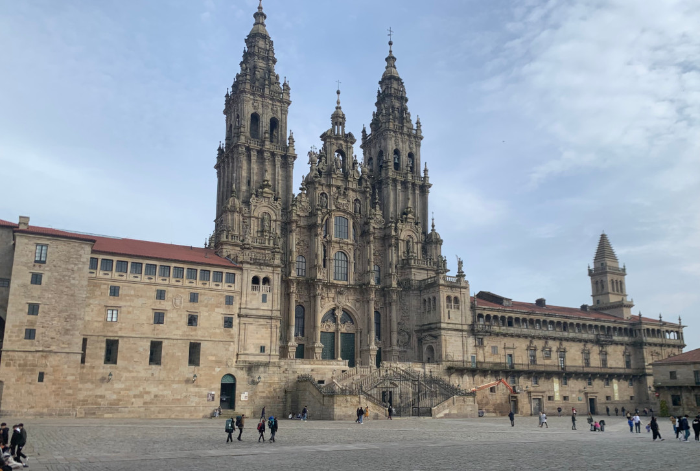
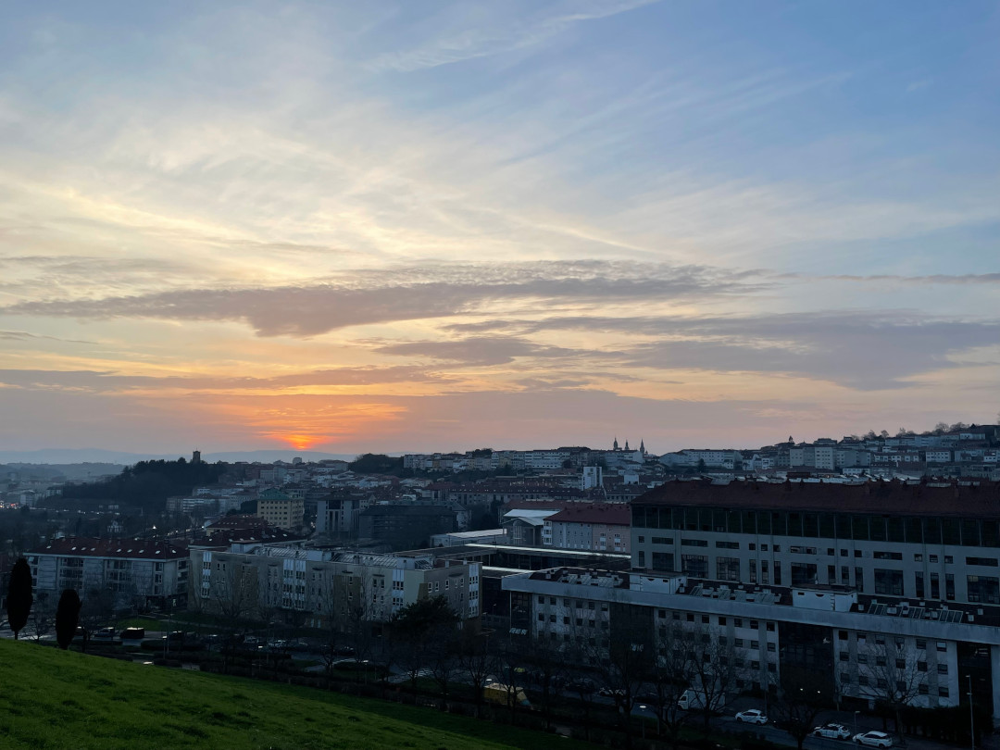

An den vorerst letzten Tagen in Spanien fahren wir entlang der Küste in den äußersten Nordwesten. Von Sopeña geht es über Gijon nach Santiago de Compostela.

<!--more-->

🗓️ 28. Januar: Die bisher kälteste Nacht liegt hinter uns. Sopeña liegt umgeben von Bergen in einem Tal, so dass es heute Nacht nur ca. 7 Grad waren. Dennoch schaffen wir es momentan noch ohne Heizung auszukommen. Der Bauernhof liegt direkt an einem Wanderweg, was wir morgens mit Henry ausnutzen und so am nahegelegenen Fluss entlang spazieren. Danach packen wir wieder all unsere Sachen zusammen und machen uns auf in Richtung des Nationalparks Picos de Europa, genauer gesagt zur Mina de Buferrera. Wie der Name schon sagt, handelt es sich - wie schon in Zarautz – um eine ehemalige Erzmine. Dieses Mal allerdings nicht direkt am Atlantik gelegen, sondern auf ca. 1.300 m Höhe. Wir suchen uns eine Wanderung aus, die um die beide Bergseen in der Nähe führt. Da eine Straße die Höhenmeter überwindet und direkt zur Mine und den Bergseen führt, ist es entsprechend voll. Wie gestern liegt es wohl am Wochenende. Allerdings beschränken sich die Leute auf die Bergseen und das Restaurant, so dass wir entspannt und quasi allein auf dem Wanderweg laufen können. In der Hauptsaison würden wir aber nicht hinfahren wollen. Der Ausblick ist perfekt und mit der Drohne kann man schicke Bilder machen. Das Wetter ist super: Trotz Bergen ist es nochmal wärmer als an der Küste und die 20 Grad Marke wird geknackt. Endlich kann also die kurze Hose eingeweiht werden. Gegen Nachmittag fahren wir nach Gijon und somit wieder zurück an die Küste. Wir stehen an einem Stellplatz am Stadtrand und fahren mit dem Bus in Richtung Innenstadt. Zwei Minuten vor Abfahrt entscheiden wir uns dafür und rennen mit entsprechender Geschwindigkeit von unserem Stellplatz zur Haltestelle. Dort angekommen erstmal Ernüchterung. Die Abfahrt steht gar nicht angeschlagen, doch wir haben Glück, denn 2 Minuten später kommt trotzdem ein Reisebus vorbei und mit einer unserer wenigen spanischen Vokabeln (Estadio - Stadion) kommen wir ans Ziel. Wir essen noch etwas und besorgen uns Tickets für das Fußballspiel Sporting Gijon gegen Racing Ferrol, das Topspiel der zweiten spanischen Liga. Bisher haben mich die Eintrittspreise im spanischen Fußball noch nicht ganz überzeugt. Die heutige günstigste Kategorie liegt bei 30 Euro. Dafür bekommen wir allerdings einiges geboten und Sitzplätze auf der Haupttribüne. Wir kommen passend zur Ankunft des Mannschaftsbusses am Stadion an. Die Sporting Fans begrüßen den Bus mit reichlich Pyro, Rauch und Böllern. Danach geht es für den gesamten Fanmob zurück in die Kneipen. Wie so häufig in Spanien öffnete auch dieses Stadion erst kurz vor Anpfiff. Das Stadion ist mit über 20.000 Leuten gut gefüllt und das an einem Sonntagabend um 21 Uhr. Aus Ferrol kommen ca. 1.000 Fans mit, bei einer Strecke von ca. 250 km. Das Spiel an sich ist ein Traum: Viele Torchancen, viele Fouls, viel Gemecker auf den Tribünen und ein 2:1 Auswärtssiegtreffer in der 96. Minute. Also alles, was man sich hätte wünschen können. Nachdem Spiel geht es mit dem Bus zurück zum Bulli.

🗓️ 29. Januar: Weil es gestern etwas später wurde, werden wir heute erst von der Sonne geweckt. Wir machen uns startklar und fahren erneut in die Berge. Dieses Mal in den Naturpark de Somiedo. Unterwegs besorgen wir Frühstück und meistern (bzw. Hanna meistert) die abenteuerlichen Straßen durch das Gebirge. Am Wanderparkplatz angekommen sind wir heute – dem Montag sei Dank – das einzige Auto. Wir wandern weiter hoch ins Gebirge. Trotz Warnhinweisen zu den Bären ist der Einzige, der uns heute Angst einflößt, der Pyrenäen-Berghund, der seine Ziegenherde beschützen möchte. Leider befinden die sich direkt auf dem Wanderweg. Nach mehrmaligen Versuchen schaffen wir es endlich an ihm vorbei.  Die Wanderung ist gut machbar, auch wenn es auf dem Hinweg nur bergauf geht. Dafür hat man einen perfekten Panorama-Ausblick. Oben angekommen machen wir einige Bilder und lassen erneut die Drohne fliegen. Als wir gerade etwas zur Ruhe gekommen sind und sogar die Augen zugemacht haben, fliegt ca. drei Meter über uns ein großer Greifvogel. Leider können wir ihn nicht schnell genug fotografieren. Es war wohl ein Steinadler, der in Spanien noch relativ häufig vorkommt. Er war auch deutlich größer als die Geier, die wir in den Pyrenäen gesehen haben. Kurz danach folgt anscheinend sein Nachwuchs, aber auch für dieses Foto waren wir zu langsam. Mit der Kamera bewaffnet steigen wir den Berg wieder hinab. Leider lässt sich kein Vogel mehr blicken. Glücklicherweise auch nicht mehr der Berghund. Wir entscheiden noch heute bis Santiago de Compostela zu fahren, auch wenn das noch gut drei Stunden Fahrt bedeutet. Gegen 20 Uhr kommen wir auf dem Campingplatz an. Gegenüber im Einkaufszentrum gibt es glücklicherweise einen Dönermann, der zwar nicht mit dem Dönermann in der Kaiserstraße in Dortmund mithalten kann, aber für einen spanischen Döner in Ordnung ist. Gut gestärkt geht es ins Bett.

🗓️ 30. Januar: Trotz Stadtcampingplatz finden wir eine gute Morgenrunde für Henry. Danach putzen  wir und räumen etwas den Bulli auf. Nachdem Frühstück geht es in die Innenstadt von Santiago de Compostela. Wir laufen die letzten Kilometer des Jakobswegs in die Altstadt und zur Kathedrale. Verständlicherweise sind im Januar wenig Pilger unterwegs, daher ist die Stadt nicht unbedingt überfüllt. Das macht es sehr sympathisch. Die Stadt lebt größtenteils vom Pilgertourismus, überall findet man Wandershops und Herbergen. Die Kathedrale ist riesig, kann aber leider nur gegen Eintritt besichtigt werden. Deswegen verzichten wir darauf uns die angebliche Grabstätte von Jakobus anzugucken. Nun weiß ich aber auch endlich, wieso der Jakobsweg Jakobsweg heißt. Auf dem Rückweg besorgen wir uns etwas zu essen und schwingen zurück am Bulli den Kochlöffel. 

