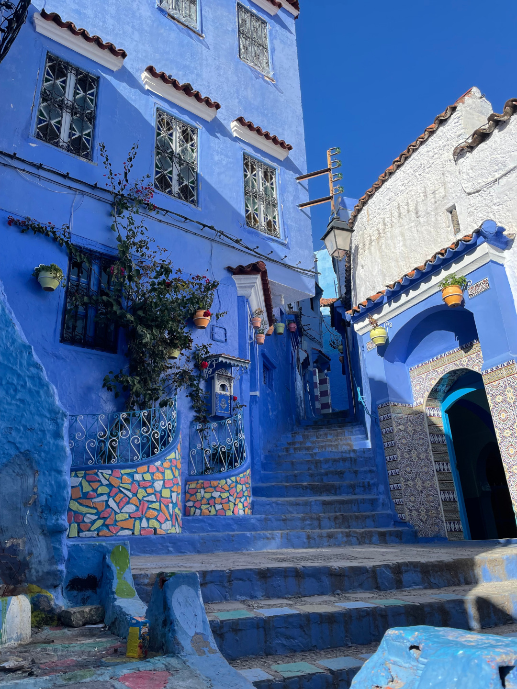
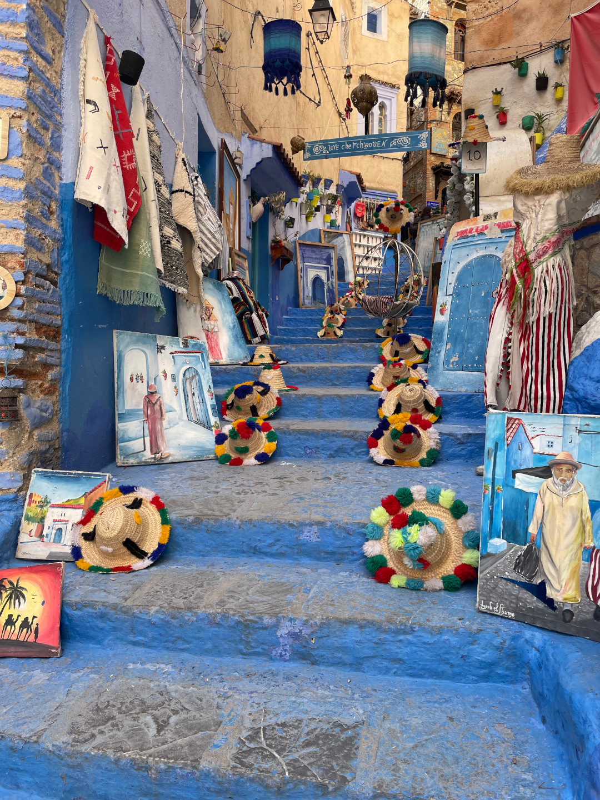
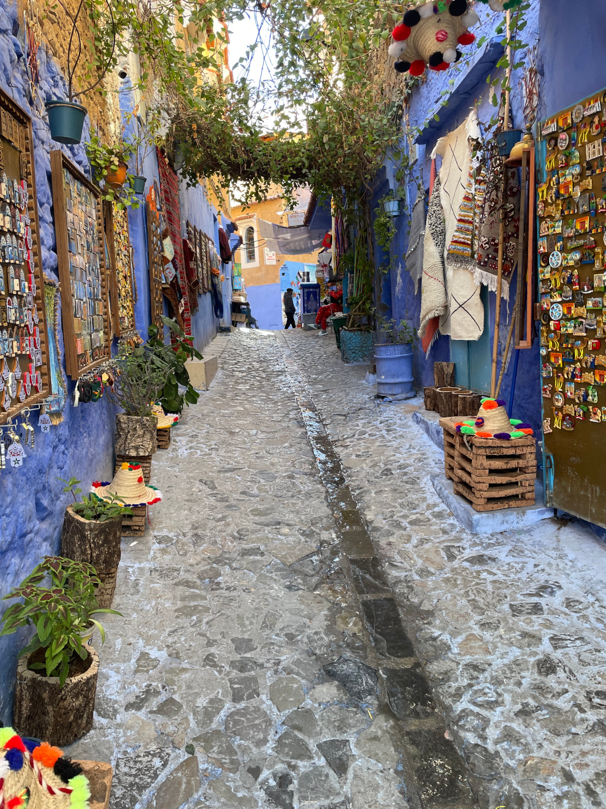
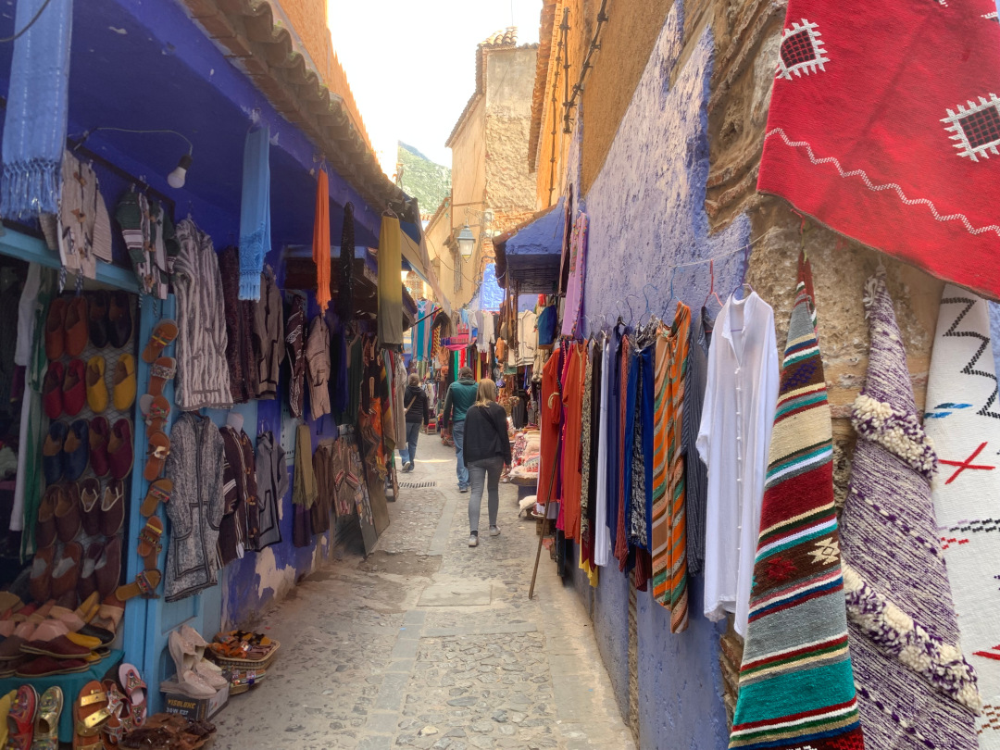
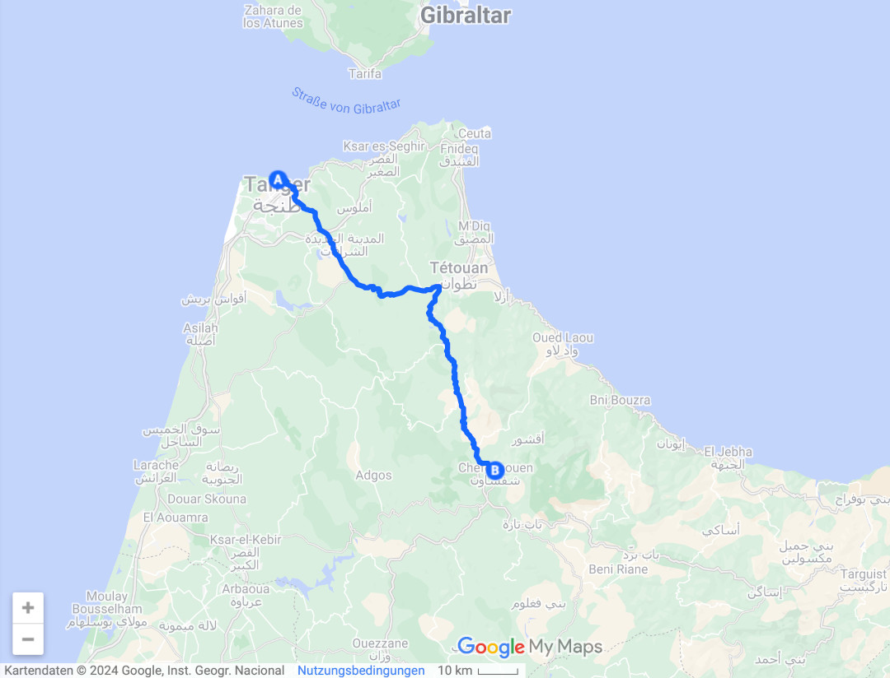
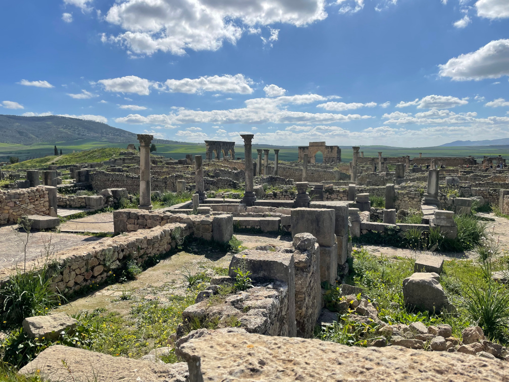
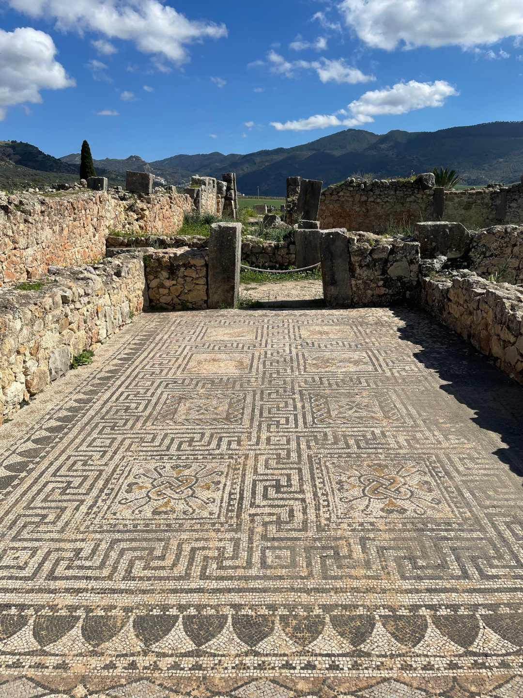
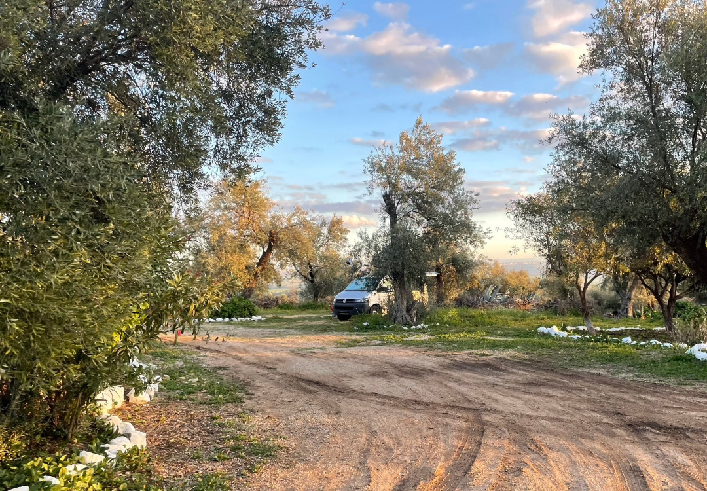
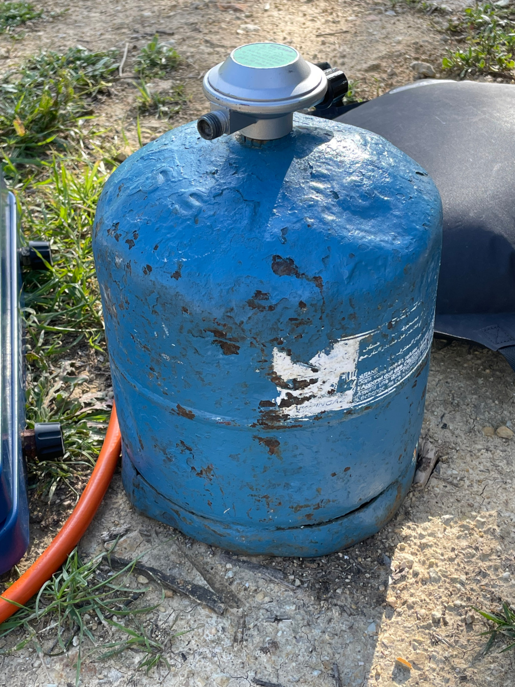
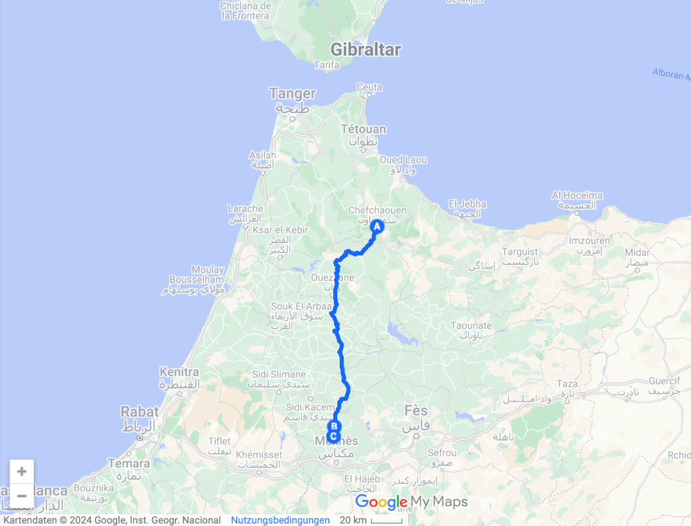

Wir verlassen fürs Erste die marokkanische Küste. Im Landesinneren führt unsere erste große Fahrt in die blaue Stadt und anschließend zu einer bekannten archäologischen Stätte.

<!--more-->

🗓️ 28. Februar: Ein letztes Mal steigen wir den steilen Hügel zum Meer hinunter und wieder rauf und machen uns dann auf den Weg zu einem größeren Supermarkt. Als wir ankommen, sehen wir noch wie sich einige Kinder hinten an ein Wohnmobil dranhängen. Wir fallen mit unserem Bulli aber weniger auf und sie rutschen lieber das steile Treppengeländer unter lautem Gelächter runter. Im Supermarkt angekommen drückt ein Mann erstmal jedem von uns ein Schokobrötchen in die Hand. Essend laufen wir also durch die Regalreihen und sein Verkaufstrick geht natürlich auf. Am Ende gehen wir nämlich unter anderem mit vier sehr leckeren Schokobrötchen aus dem Laden, die natürlich nicht eingeplant waren. Auf einer Landstraße, die bis auf kurze Baustellenabschnitte super in Schuss ist, fahren wir anschließend nach Chefchaouen. Die bei Touristen beliebte blaue Stadt kann sich wirklich sehen lassen. Der Campingplatz liegt oberhalb der Stadt und über einen schönen, aber natürlich steilen Weg gelangen wir zu Fuß direkt durch die Stadtmauern in die kleinen blauen Gassen. Über einige Treppen steigen wir dann immer weiter ins Herz der Altstadt. Wieder wird überall etwas zum Kauf angeboten. Hier sind unter anderem auch viele Malereien und Kunstwerke dabei. Es ist viel los und das erste Hasch-Angebot lässt auch nicht lange auf sich warten. Immer wieder hören wir auf Englisch ein „komm in meinen Laden“, „wie geht’s“ oder „woher kommst du“ und ein Mann landet sogar einen Volltreffer und tippt auf Borussia Dortmund. Einmal kriegen wir ein Kompliment für unser ja so gut wie gar nicht vorhandenes Arabisch. Unser „Nein, danke“ konnten wir aber auch schon oft genug üben. In einem kleinen Laden besorgen wir das Nötigste für ein schnelles Abendessen. Als wir nach dem Anstieg wieder am Platz ankommen, geht beim Kochen nur leider unser Gas leer. Nochmal runter ist keine Option, aber immerhin hat’s für die Soße noch gereicht. Für Nudeln nicht mehr, aber Suppennudeln kriegen wir so gerade noch gar. Unser To-Do für morgen steht also und wir fallen mal wieder ins Bett. Mit nur 4 Grad ist heute wohl unsere bisher kälteste Nacht auf dieser Reise. Den Lüftungshaken lassen wir ausnahmsweise besser mal draußen, aber dann ist es im Bulli sehr gut auszuhalten.

🗓️ 29. Februar: Wir schlafen lange, denn irgendwie ist es auf dem Campingplatz sehr ruhig, obwohl sogar schon Aufbruchsstimmung herrscht, als wir aus dem Bulli kriechen. Schon auf der ersten Henry-Runde werden wir wieder gefragt, ob wir etwas rauchen wollen. Unsere Standard-Vokabel muss ich jetzt glaube ich nicht mehr wiederholen. Wir packen alles zusammen und düsen los. Der erste Stopp ist allerdings schon nach ein paar Minuten, denn wir haben gehört, dass es in der letzten Rechtskurve vor dem langen Anstieg zum Campingplatz einen Laden geben soll, der Gasflaschen in der für uns passenden Größe hat. Und tatsächlich, vor der Tür sitzt schon ein älterer Mann in der traditionellen Dschellaba, der uns freundlich begrüßt und den wir nach Gas fragen. Er ruft schnell seinen Kumpel und der gibt uns wirklich eine passende Gasflasche, öffnet sie mit seinem Messer und schraubt unser Ventil auf. Wir dürfen noch testen, bezahlen dann und schenken ihm zum Dank noch unsere leere Campinggaz-Flasche, die er bestimmt auffüllen und super an den Mann oder die Frau bringen kann. Im Vergleich zu unserer Neuen, die eindeutig schon bessere Zeiten gesehen hat, ist die Alte nämlich ein Topmodell gewesen. Nach 3 Stunden Fahrt erreichen wir dann die archäologische Stätte Volubilis. Die alte römische Stadt hatte zeitweise geschätzte 10.000 Einwohner und dementsprechend weitläufig ist das Gelände. Vieles ist noch gut erhalten. Der Parkplatz ist eigentlich kostenlos, aber natürlich hat sich wie immer trotzdem irgendjemand eine orangene Warnweste angezogen und verlangt Geld. Nachdem wir noch ein paar Guide-Angebote abgelehnt haben, sehen wir uns alles in Ruhe an. Danach geht es für uns noch ein paar Kilometer weiter zu einem Campingplatz auf dem Land, auf dem wir zwischen den vielen Olivenbäumen stehen. Etwas weiter den Weg hoch haben wir noch eine tolle Aussicht über das Umland und die Stadt Meknès. Weil es heute so klar ist, können wir am Horizont auch schon die Berge des Atlas erkennen. Auch wenn wir vorher viel darüber gelesen haben, dass Marokko mit Hund eher schwierig sein soll, weil der Hund im Islam als unrein gilt und viele große Angst vor Hunden haben sollen, machen wir bisher eher gegenteilige Erfahrungen und Henry ist oft der Star. So auch beim Besitzer des Platzes und seinem Freund. Schon als sie Henry von Weitem sehen, freuen sie sich unfassbar und rufen ihn zu sich. Sein Name, laut ihnen wie Henry Kissinger, löst direkt den zweiten Begeisterungssturm aus. Weil es heute auch nach Sonnenuntergang wieder etwas wärmer ist, sitzen wir, nachdem wir die neue Gasflasche eingeweiht und trotz ihres Aussehens für gut befunden haben, draußen und genießen die Ruhe. Bis auf ein paar Schafe, Hunde und Esel hört man nämlich nicht wirklich etwas. Weil hier nicht mehr so viel los ist, kommen aber auch ein paar andere Deutsche auf uns zu und wir kriegen noch ein paar Tipps von alten Hasen in Sachen Marokko.

