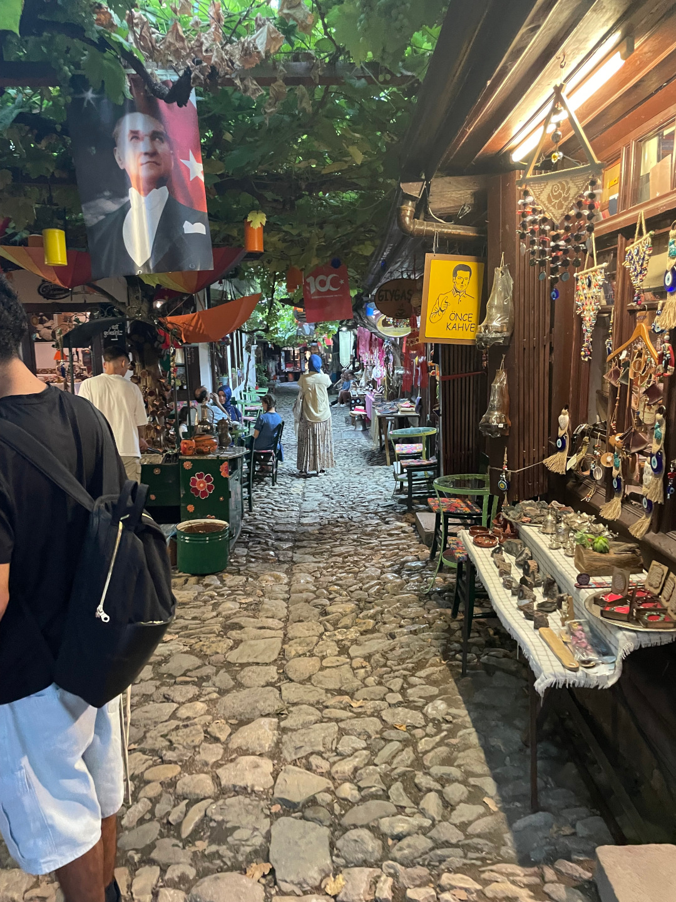
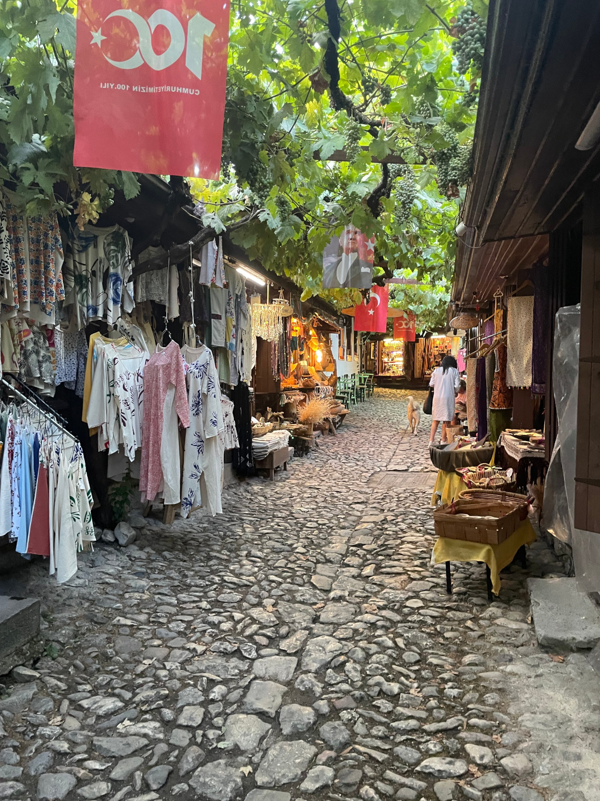
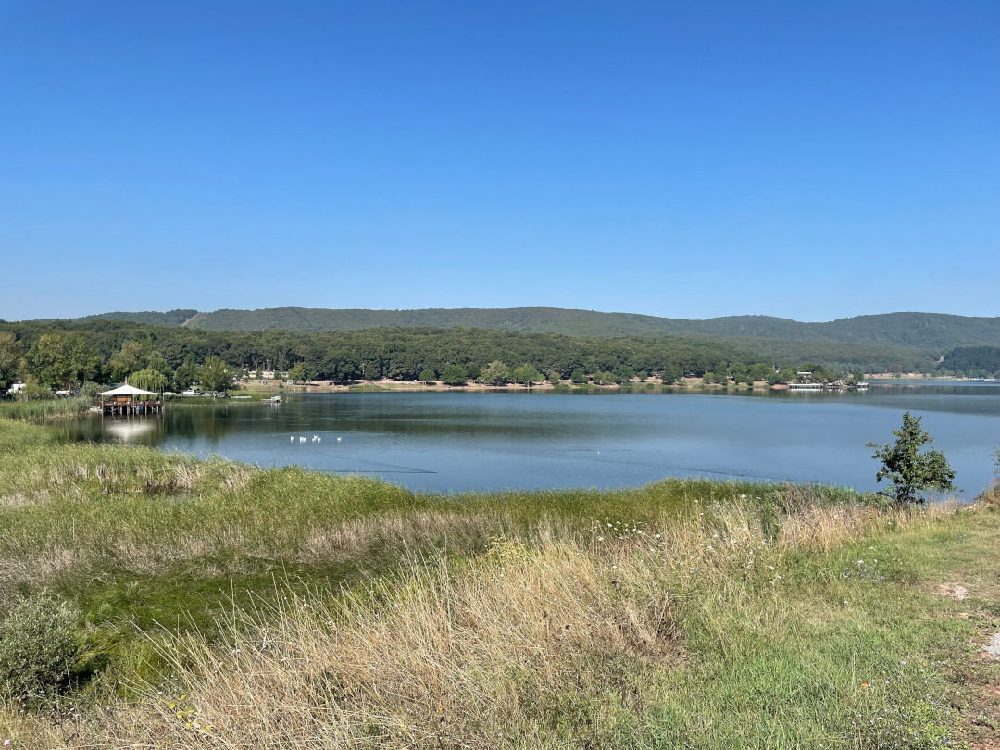
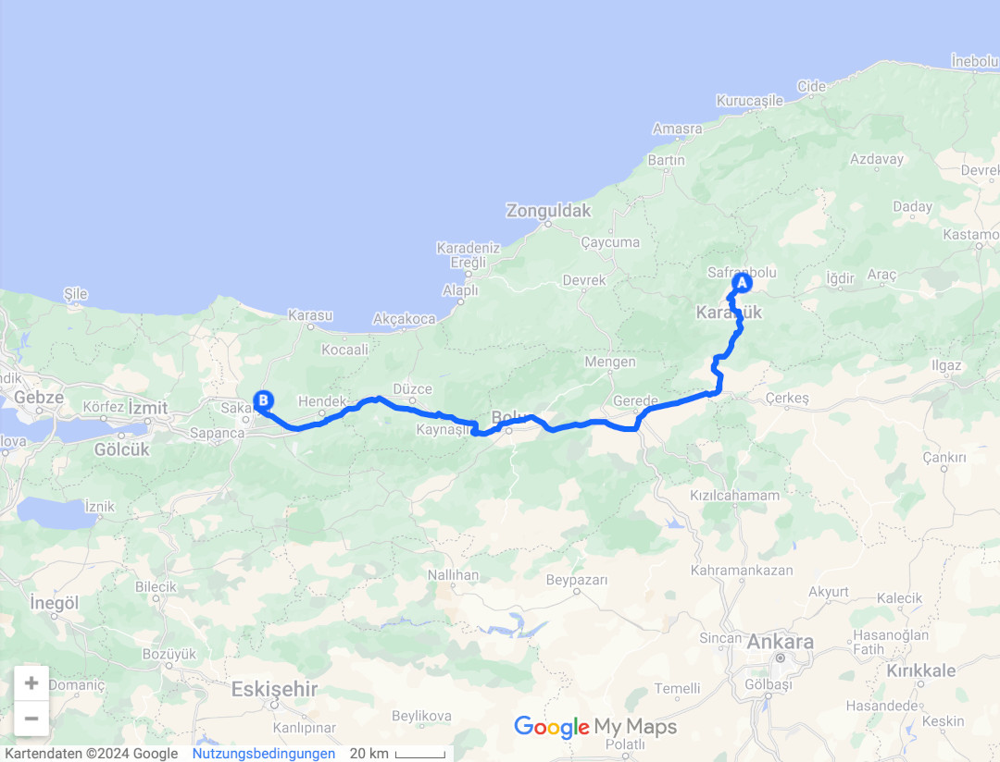
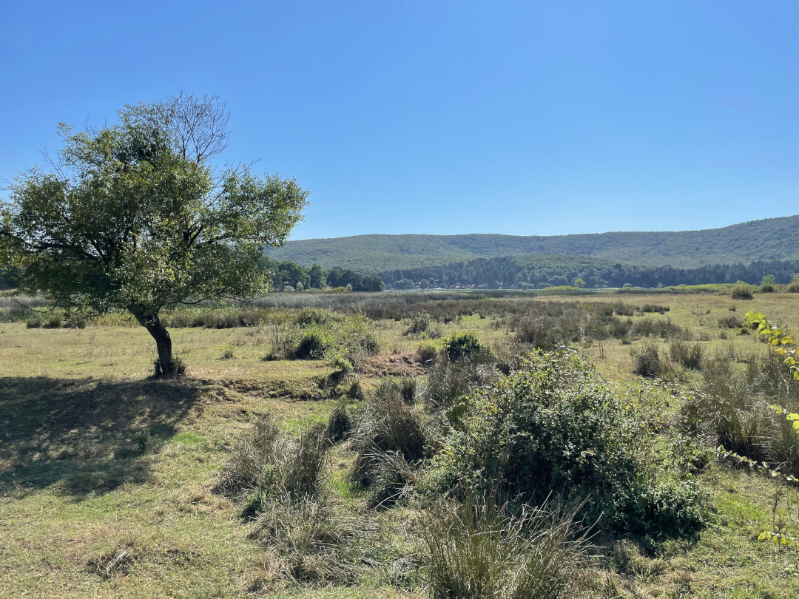
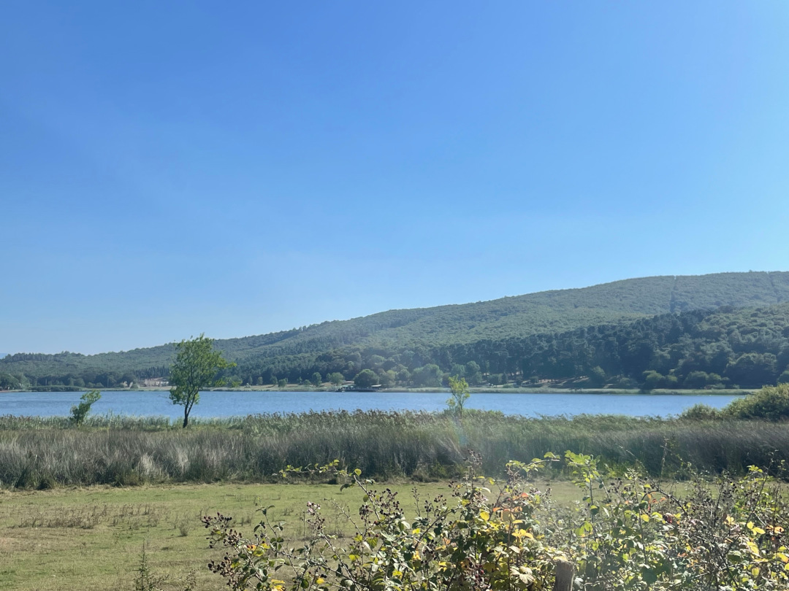
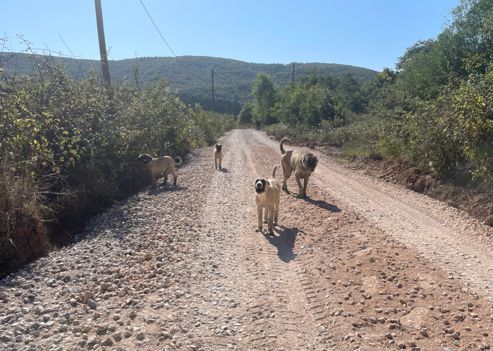

Nach so vielen Kilometern machen wir eine kleine Pause auf einem ruhigen Campingplatz an einem kleinen See.

<!--more-->

🗓️ 28. Juli: Hier in der Stadt hören wir den Muezzin gleich von drei Moscheen um die Ecke. Wir hören ihn aber zum Glück gerne und im Moment geht die Sonne ja auch so früh auf, dass man sich danach bestens wieder umdrehen und weiterschlafen kann. Nachdem wir eine Henry-Runde gedreht haben, gehen wir nochmal kurz in den kleinen Ort und schlendern durch die Gassen und an den Verkaufsständen vorbei. Anschließend machen wir uns auf den Weg weiter nach Westen bis kurz vor Istanbul. Nach einer gefühlten Ewigkeit rasen wir mal wieder über eine echte Autobahn. Das merken wir vor allem daran, dass sich 130 km/h schon wie fliegen anfühlen. Dass wir auf der Autobahn fahren, ist aber auch gut, weil wir wahrscheinlich noch sehr viel Geld auf unseren HGS-Sticker haben, über den die Maut hier läuft. In Sakarya kaufen wir noch ein, bevor wir am Nachmittag dann schon auf einem kleinen Campingplatz ankommen und es uns bequem machen. Rundherum liegen richtige Weiden. Die Zeit der freien Kühe und Tiere ist jetzt wieder vorbei. Hier geht es schon wieder sehr viel geordneter zu. Man könnte auch denken wir wären in Deutschland. Es ist ein sehr entspannter Platz und wieder dauert es nicht lange, bis wir wieder was von unseren Nachbarn geschenkt bekommen. Dieses Mal gibt es Melone. Ansonsten müssen wir mal wieder etwas Zeit investieren, um uns mit unserer weiteren Route zu beschäftigen. Irgendwie müssen wir ja wieder nach Dortmund kommen, aber in Griechenland wollen wir noch etwas mehr Zeit verbringen. Mit Henry können wir hier außerdem super um den See herum laufen und es gibt eine gute Küche zum Kochen. Es gibt von Tobi frisch importiere Spätzle, auch mal lecker. Für den Nachtisch sorgt dann ja die Melone.

🗓️ 29. Juli: Wir schlafen aus und genießen nach den letzten Tagen im Auto, dass wir heute nicht weiterfahren. Stattdessen gehen eine extra große Runde mit Henry durch die Felder und den angrenzenden Wald. Als wir zurück sind, frühstücken wir in Ruhe mit ein, zwei Gläsern Tee. Dann verbringen wir mehr Stunden als geplant damit Tickets fürs Stadion in Istanbul zu kaufen. So einen komplizierten Prozess bin ich noch nie durchlaufen. Das toppt sogar noch die Abgabe der Dissertation. Wir brauchen eine App, nämlich Passo. Da müssen wir uns registrieren. Dann startet der freie Vorverkauf, aber wir kriegen immer eine Fehlermeldung, weil wir keine Passolig Karte mit unserem Passo Account verknüpft haben. Das Portal ist super nervig. Immer wieder fliegen wir raus, als wir uns mit unseren Reisepässen dort registrieren wollen. Dann akzeptieren sie unsere Fotos nicht, dann gibt es für Ausländer scheinbar nur die Prepaid Passolig Karte, aber auf der Seite muss man bestätigen, dass man unter 18 Jahre alt ist, was wir offensichtlich nicht mehr sind. Total verwirrend also. Dann kommen manchmal Bestätigungscodes per SMS nicht an, weil meine Handynummer eine Ziffer zu lang ist. Als wir das alles durch und gemeistert haben, stellen wir fest, dass das Spiel im offiziellen Portal jetzt ausverkauft ist. Danke für nichts also. Auf dem Zweitmarkt fängt Tobi nochmal an zu suchen und das Spiel geht da von vorne los: Wieder mit Passnummer registrieren und so weiter. Natürlich sind die Karten hier teurer, aber wir haben mittlerweile schon so viel Zeit investiert, dass wir da jetzt auch hinwollen. Am Ende heißt es noch warten, ob bzw. bis die Tickets zugestellt werden. In der Zwischenzeit planen wir weiter die Zeit in Griechenland und erledigen ein paar Sachen. Gegen Nachmittag wollen wir noch eine große Runde mit Henry drehen. Dieses Mal werden wir nach ein paar Kilometern in den Feldern allerdings von einer kleinen Hundegang lautstark gestoppt. Statt weiter durch die Felder geht es deshalb lieber weiter in den Wald. Nichtsdestotrotz tun solche Henry-Runden echt gut, denn das war auch die einzige Begegnung auf dem ganzen Weg. Abends nutzen wir die Küche nochmal aus und ein Geschenk lässt nicht lange auf sich warten. Dieses Mal bringt uns ein kleines Mädchen gebackene Maiskolben. Wir haben nicht wirklich etwas, um uns zu revanchieren, aber die Kinder freuen sich auch über eine von Tobi importierte Packung Toffifee. Um 23:30 Uhr erhalten wir dann noch die Nachricht, dass unsere Tickets fürs Stadion da sind. Und nach noch ein paar Fehlermeldungen werden sie auch endlich in unserer Passo App angezeigt, wo heute Morgen alles angefangen hat. Für das richtige Ticket müssen wir nur nochmal mit unserem Reisepass am Stadion zum Passolig Office. Wenn das mal gut geht. Und eigentlich wollten wir doch nur ein Fußballspiel gucken.

