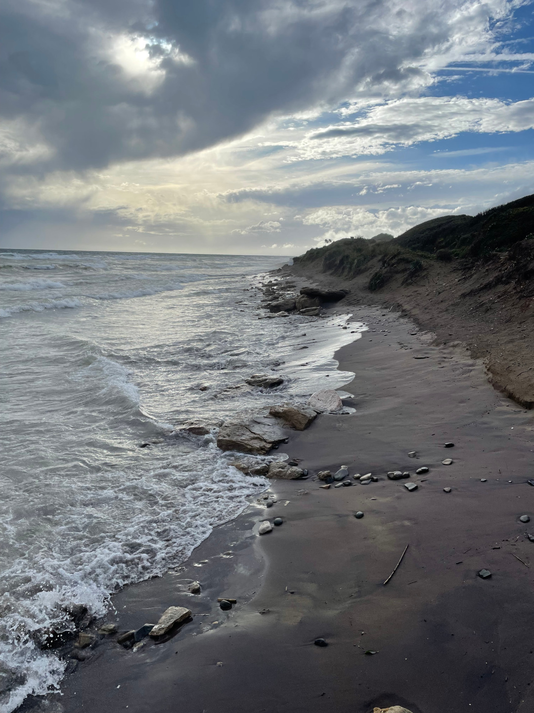

Die ersten Tage in Spanien verbringen wir bei viel Regen an der Südküste Andalusiens.

<!--more-->

🗓️ 29. März: Wegen der späten Ankunft mitten in der Nacht schlafen wir sehr lange. Wir werden mit Regen geweckt. Die Prognosen sagen es so noch weitere zwei Tage voraus. Heute ist Karfreitag und deshalb geht es auf unserem Schlaf-Parkplatz glücklicherweise sehr ruhig zu. Wir starten entspannt in den Tag und gehen mit Henry die erste Runde nach Ankunft in Spanien. Der Strand ist nicht weit entfernt. Danach holen wir unsere Drohne bei Carlos ab. Hier herrscht am Karfreitag im wahrsten Sinne des Wortes gähnende Leere. Alles hat aber super geklappt und die Drohne hat unsere Zeit in Marokko gut überlebt. Danach frühstücken wir im nahegelegenen Taco Bell. Unsere Premiere in diesem Laden und wir kommen bestimmt wieder. Danach fahren wir etwas weiter die Küste entlang, um in einem Waschsalon unsere Wäsche zu waschen. In Marokko haben wir nur einmal waschen können, so dass sich einiges angehäuft hat. Der Waschsalon ist direkt an der Straße zum Strand. Wir machen zwei Maschinen an und gehen währenddessen am Strand spazieren. Teilweise ist sogar blauer Himmel zu sehen, wenn auch nur kurz. Dasselbe machen wir während der Trocknerrunde. Jetzt ist wieder alles sauber und wir können wieder aus den Vollen schöpfen. Danach suchen wir uns einen Stellplatz für heute Nacht aus. Wir wollen wieder freistehen. Und finden einen guten Platz nicht weit vom Strand. Wir genießen das vermeintlich Freie im Gegensatz zu Marokko. Die Straßen sind gut, der Verkehr ist gesittet, man kann im Dunkeln Autofahren, niemand spricht einen an und man kann etwas sorgenfreier rumlaufen. Dennoch hat sich Marokko gelohnt. In über einem Monat haben wir viel gesehen. Marokko ist vielseitig: Schneebedeckte Berge, grüne Hügel, Atlantik, Mittelmeer, Steppe und Wüste. Uns hat besonders der Süden gefallen, speziell die Sahara, das Anti-Atlas Gebirge und das Tal der Ammeln. Hier sind auch weniger Touristen unterwegs im Gegensatz zur jetzigen Region in Spanien. In der Nähe unseres Stellplatzes finden wir ein gutes Restaurant. An die neuen Preise müssen wir uns aber noch gewöhnen. In Marokko hätten wir wohl drei Mal davon Essen gehen können. Nichtsdestotrotz hat es gut geschmeckt. Den Abend verbringen wir bei prasselndem Regen im Bulli.

🗓️ 30. März: Der Regen weckt uns auch heute. Trotzdem führt uns die erste Runde mit Henry wieder an den Strand. Weil gestern Feiertag war und wir nicht einkaufen konnten, steht heute unser erster Einkauf nach Ankunft in Spanien an. In Agadir haben wir vor ein paar Wochen den turbulenten Einkauf vor Ramadan-Beginn miterlebt, heute ist der Ostereinkauf in Spanien an der Reihe. Es ist nicht ganz so wuselig, aber dennoch voll. In dieser Region von Spanien sind Gründonnerstag und Karfreitag Feiertage, so dass an dem Samstag nochmal mehr los ist als in Deutschland. Wir freuen uns über die gewohnte Auswahl. Endlich können wir auch wieder spanischen Schinken mitnehmen. Die Auswahl an Schinken hier kann schon fast einen eigenen Supermarkt füllen. Wir besorgen uns noch ein paar Sachen und Vorräte für abends. Beim Bäcker holen wir noch Baguette und Pastei de Nata, die wir schon auf dem Hinweg in Portugal und Spanien probiert haben. Natürlich wieder mit Zimt und Erdbeeren (Geheimtipp). Für heute haben wir uns einen Campingplatz rausgesucht. Wir müssen mal wieder duschen. Es regnet so heftig, dass wir auf den Besuch in Marbella verzichten und direkt zum Campingplatz fahren. Wir zahlen fast 50(!)€ für einen Stellplatz, nehmen das Angebot aber dennoch aus Mangel an Alternativen an. Heute kann man fast nichts anderes machen als im Bulli zu warten bis es aufhört zu regnen. Zum Glück haben wir gut eingekauft und duschen wollen wir ja sowieso noch. Gegen Abend gibt es ein kurzes Zeitfenster ohne Regen. Das nutzen wir aus und gehen wie so oft mit Henry ans Meer. Die Umgebung lohnt sich aber. Bei besserem Wetter wohl noch etwas mehr. Dennoch kann man eine gute kleine Wanderung durch die Dünen machen. Zurück am Bulli regnet es direkt wieder. Wir gucken noch BVB gegen Bayern und essen noch etwas.

🗓️ 31. März: Natürlich weckt uns heute auch wieder der Regen, aber auch der Wecker. Wegen der zweiten Uhrumstellung innerhalb von zwei Tagen müssen wir früh raus, weil der Campingplatz sogar eine Sauna hat. Das nutzen wir bei dem Wetter natürlich aus. Danach machen wir uns auf in Richtung Málaga. Auf dem Weg besorgen wir wieder Baguette. Die Parkplatzsuche ist schwierig, aber in der Nähe eines Krankenhauses werden wir fündig. Wir frühstücken erstmal ausgiebig im Bulli. Was anderes wäre auch nicht wirklich möglich bei dem Wetter. Danach wollen wir aber endlich mal wieder länger raus aus dem Bulli. Wir beschließen uns trotz strömenden Regen die Innenstadt von Málaga anzugucken. Mit Regenhose, Regenjacke und Wanderschuhen geht es los. Trotz Ostersonntag und Regen ist sogar etwas los. Der Ausflug lohnt sich aber. Málaga ist echt cool und hätte wohl bei besserem Wetter noch mehr Charme. Das können wir aber nur erahnen. Es gibt viele coole Kaffees und Kneipen. Kneipen haben wir fast anderthalb Monate nicht mehr gesehen. Wir laufen zu einem Aussichtspunkt, von wo wir auf die gesamte Innenstadt gucken können. Danach bringen wir Henry zurück zum Bulli und laufen zum Stadion. Hier spielt heute Málaga CF gegen Linares Deportivo, dritte Liga Spanien. Fast auf den Tag genau vor 11 Jahren habe ich noch das wohl beste Fußballspiel meines Lebens in Dortmund gegen Málaga im Viertelfinale der Champions League gesehen und jetzt spielt man in der dritten Liga. Dazu noch die Vereinsfarben Blau-Weiß und das Gründungsjahr 1904. Für mich sind das viele Parallelen nach Deutschland. Das Stadion ist nur teilweise überdacht, daher sind die Tickets natürlich gefragt, aber leider auch mit 35€ sportlich für eine dritte Liga. Dennoch kaufen wir sie. Das Stadion ist mit fast 15.000 Leuten zur Hälfte gefüllt, womit ich nicht gerechnet hätte. Fast 200 Personen kamen aus Linares, die im Gästeblock im Regen standen. Mit den gelben, roten, blauen und grünen Regencapes sah das eher nach Zirkus aus und man hätte keinen Gästeblock vermutet, hätten sie nicht alle guten Support hingelegt. Die Unterstützung für Málaga war teilweise erschreckend leise. Das Spiel endete 1:1, was wohl die Aufstiegschancen von Málaga beendete. Nach dem Spiel laufen wir durchnässt zum Bulli. Wir ziehen uns um und fahren zu einem Vorort Málagas direkt am Strand. Hier wollen wir heute schlafen. Wir besorgen uns noch eine Pizza, gehen mit Henry am Strand spazieren und trocknen etwas im Bulli.

