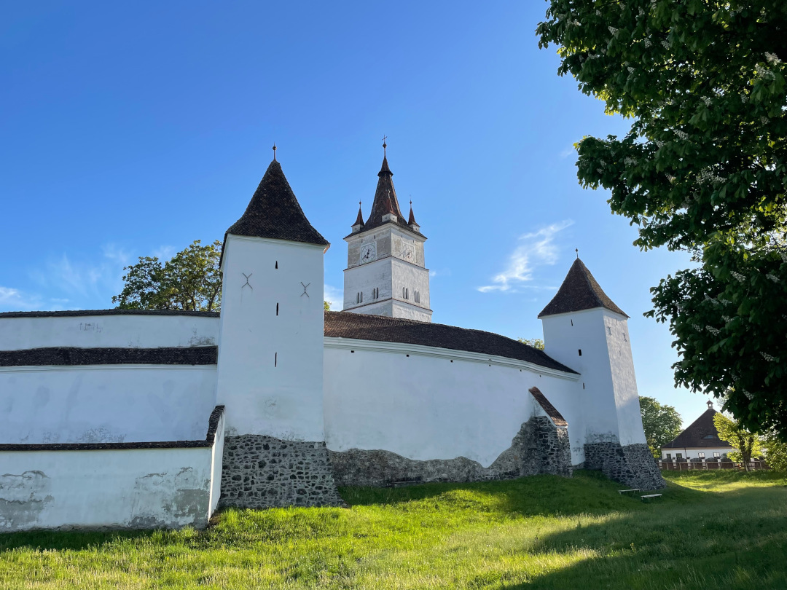

Es geht wieder raus aus der Hauptstadt: erst rein ins Grüne und dann in eine der meistbesuchten Städte Rumäniens, die im Zentrum des Landes liegt.

<!--more-->

🗓️ 29. April: Wir drehen eine letzte Runde mit Henry entlang der Kanäle in Bukarests Norden, weil wir eh erst um 12 Uhr aus dem Hotel raus müssen. Auf dem Rückweg holen wir für die Fahrt bei unserem Stammbäcker Covrigi und belegte Brötchen für die Fahrt. Auf dem Parkplatz des Hotels machen wir erstmal den Bulli wieder bereit zum Campen und düsen dann los. Der Weg aus der Stadt ist zum Glück leicht, weil wir nicht mitten im Zentrum sind. Der Verkehr in Bukarest ist aber auf jeden Fall hektischer und drängeliger als im Rest des Landes. Auch die Innenstadt ist von Autos geprägt und Gehwege dienen oft eigentlich nur als Parkplatz ohne Platz zum Gehen. Deshalb sind wir nach den Hauptstadt-Tagen jetzt froh dem Straßenlärm zu entkommen und nicht ständig aufpassen zu müssen. Nach einem kurzen Autobahn-Abschnitt führt unser Weg zurück ins Grüne über Landstraßen und tatsächlich sind die hier teils holpriger und haben manchmal tiefere Schlaglöcher als in Marokko. Bei hohen Geschwindigkeiten sollte man da schon aufmerksam bleiben, auch wegen der teils riskanten Überholmanöver aus dem Gegenverkehr. Schon gegen 14:30 Uhr kommen wir aber sicher in der Nähe von Berca auf einem Campingplatz an. Umgeben von grünen Hügeln liegt er sehr ruhig und die ländliche Idylle tut uns gut. Leider gibt es am Platz gerade Probleme mit dem Strom. Eigentlich nicht schlimm für uns, aber die Wasserpumpe geht deshalb auch nicht. Nach ungefähr einer Stunde ist aber zum Glück alles wieder geregelt. Wir ruhen uns nach den Stadttagen vor allem aus und machen nachmittags nur einen kleinen Abstecher zu den Schlammvulkanen von Berca (Vulcanii noroioși), die zu Fuß direkt vom Platz aus erreichbar sind. Es geht einfach einen Hügel hinauf und dann ist man in der Mondlandschaft angekommen. Der kalte Vulkanismus, bei dem Gase aus ungefähr 3000 Metern Tiefe durch ton- und wasserhaltige Schichten hochkommen, ist für uns neu. Der trockene Schlamm an der Oberfläche sieht Vulkanen ähnlich und weil er salz- und schwefelhaltig ist, gibt es rundherum kaum Vegetation. Als wir wieder unten sind, freuen wir uns mal wieder selbst zu kochen und genießen die Ruhe. Alles was man hier hört sind Grillen, Vögel und der Wind in den Bäumen, obwohl auf dem Campingplatz sogar mehr los ist als wir seit unserer Einreise nach Ungarn und Rumänien gewohnt sind. Dann entscheiden wir zum Sonnenuntergang nochmal auf den Hügel zu steigen, denn das Licht ist heute traumhaft. Der Eintritt kostet umgerechnet 40 Cent für Studenten, aber der Mann am Eingang erkennt uns wieder („aaah studentii“) und so dürfen wir das zweite Mal umsonst rein und sogar Henry darf mit, obwohl Hunde auf dem Gelände eigentlich nicht erlaubt sind. Jetzt sind wir die Einzigen hier und laufen durch das leise Blubbern der Schlammvulkane und staunen über den Himmel und zeitweise sogar noch über einen Regenbogen, bevor wir wieder zurück und bald schlafen gehen.

🗓️ 30. April: Nach einer sehr ruhigen Nacht werden wir von der Sonne aufgeweckt, die langsam den Bulli aufwärmt. Als wir aussteigen, lernen wir den Hund des Platzes kennen, den wir gestern gar nicht getroffen hatten. Er ist riesig, aber sehr friedlich und nur auf Streicheleinheiten aus. Durch die Hügel laufen wir noch eine Henry-Runde und machen uns dann wieder auf den Weg. Wir machen einen kurzen Einkaufsstopp, damit wir frühstücken können und fahren dann ungefähr zweieinhalb Stunden bis zum Schloss Peles. Dort angekommen möchte der Typ im Häuschen nur fürs Parken 60 Lei, also umgerechnet 12€. Wir gucken uns nur kurz an und lehnen dankend ab. Da parken wir doch lieber 150 Meter weiter unten am Berg kostenlos und benutzen unsere Füße. So spazieren wir durch die schöne Parkanlage, die das Schloss umgibt. Es gibt sogar noch ein zweites Schloss hier, das Castelul Pelișor. An beiden Schlössern wird gerade etwas gewerkelt und Teile sind deshalb eingerüstet, aber was wir sehen können, ist wirklich sehr schön, mit vielen Verzierungen und Malereien. Anschließend fahren wir noch ungefähr eine Stunde bis nach Honigberg (auf rumänisch Hărman) nahe Brașov. Der Campingplatz liegt im Garten des Pfarrheims der evangelischen Kirche der deutschen Minderheit hier. Weil es nicht mehr genug Leute in der Gemeinde gibt, lohnt es sich nicht mehr das Gebäude nur als Kirche zu nutzen. Ist wohl überall das Gleiche. Stattdessen gibt es für uns hier jetzt den kleinen Campingplatz und ein Museum. Die Betreiber sind total freundlich und erklären uns alles. Auch die Kirchburg ist sehenswert und so lässt sich alles am besten mit ‚klein aber fein‘ zusammenfassen. Henry ist hier auch sehr willkommen, denn die Betreiber fungieren auch als Pflegestelle für Hunde, die aus den Tötungsstationen gerettet werden. Das hier hätte also auch eine von Henrys Zwischenstationen sein können. Im Moment ist nur ein Hund da, aber letztes Jahr vor Weihnachten wurden 26 Welpen gleichzeitig im Burggraben aufgenommen. Schade, dass wir die verpasst haben. Auch an mehreren Projekten zur Sterilisierung von Straßenhunden ist die Gemeinde beteiligt. Sie geben also wirklich ihr Bestes, um der Masse und den Tieren gerecht zu werden und unnötiges Leid zu verhindern. Abends gibt es für uns noch Wraps als eins unserer Standard-Campinggerichte und wir machen uns einen ruhigen Abend.

🗓️ 1. Mai: Wir bleiben noch eine zweite Nacht in Honigberg und veranstalten nach der Henry-Runde deshalb erstmal ein ausgiebiges und langes Frühstück. Ansonsten machen wir hier einen richtigen Pause-Tag, rödeln nur ein bisschen rum und sind vor allem mit der Planung der nächsten Tage beschäftigt. Erst am späten Nachmittag machen wir uns noch auf den Weg nach Brașov. Wegen des Feiertags und der Einfachheit halber nutzen wir Bolt statt Bus für den Weg. Wie viele andere Einheimische und Touristen schlendern wir an dem freien Tag heute durch die Altstadt, gucken ein paar Kirchen sowie die Synagoge an und laufen durch die Fadengasse (Strada Sforii), die die engste Gasse der Stadt und angeblich sogar eine der engsten in Europa ist. Viele hinterlassen hier ihre Namen und Botschaften. Wir genießen nach einem kurzen, aber sehr steilen Aufstiegs noch die Aussicht vom weißen Turm. Auf die Seilbahn auf der anderen Seite der Stadt in die Berge verzichten wir heute aber lieber. Stattdessen steuern wir ein rumänisches Restaurant an, denn dem Essen hier wollen wir nach der Ernüchterung in Bukarest auf jeden Fall noch eine Chance geben. Dieses Mal werden wir nicht enttäuscht. Tobi kriegt seine traditionelle Ciorba im Brotlaib serviert und wir beide essen als Hauptgericht noch einen Fleischeintopf mit Polenta. Alles ist sehr lecker und zum Nachtisch gibt es mal wieder Papanași (ausgesprochen Papanasch). Die fluffigen Teilchen haben wir inzwischen schon liebgewonnen. Veredelt werden sie von Schwarzer-Johannisbeer-Konfitüre, Schmand und natürlich Puderzucker. Super satt und zufrieden machen wir uns wieder auf den Rückweg, drehen mit Henry noch eine Runde um die Kirchburg und verkriechen uns, als es kühl wird mal wieder in den Bulli. Abends gucken wir noch das BVB-Spiel. Nach unserer Zeit geht es erst um 22 Uhr los, also ganz schön spät für unsere Verhältnisse.

