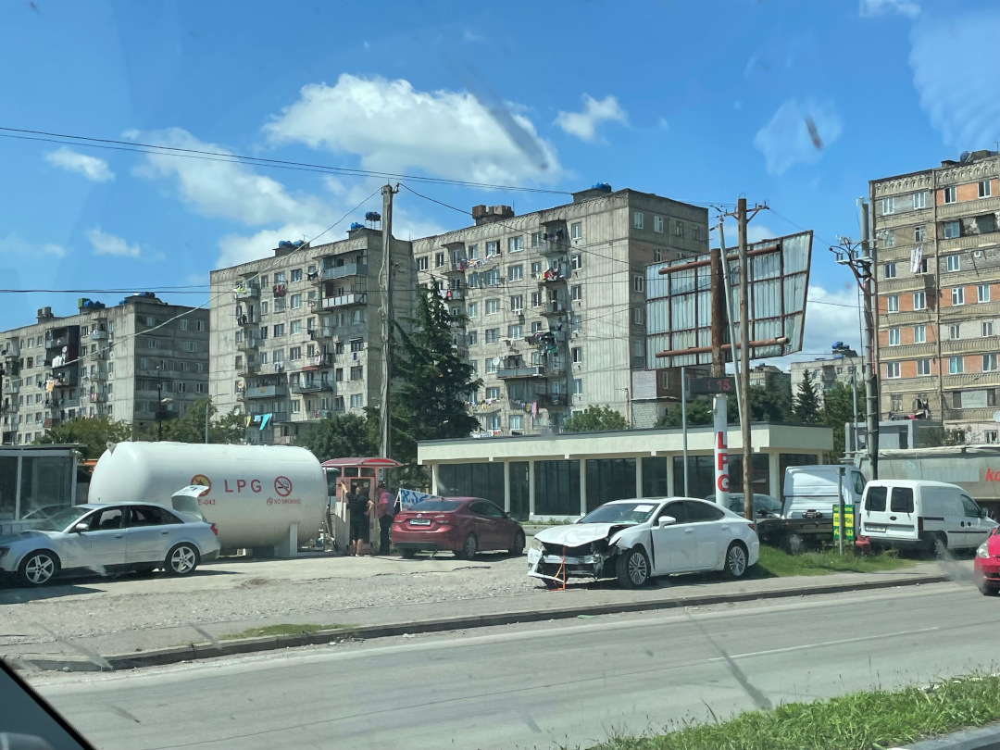
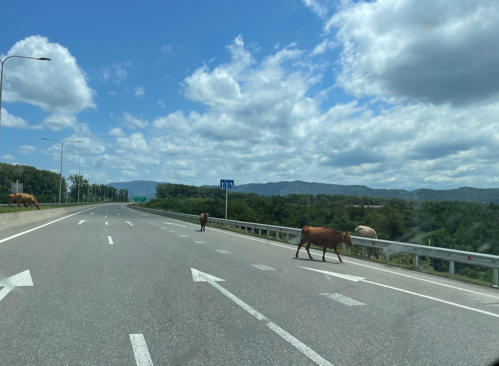
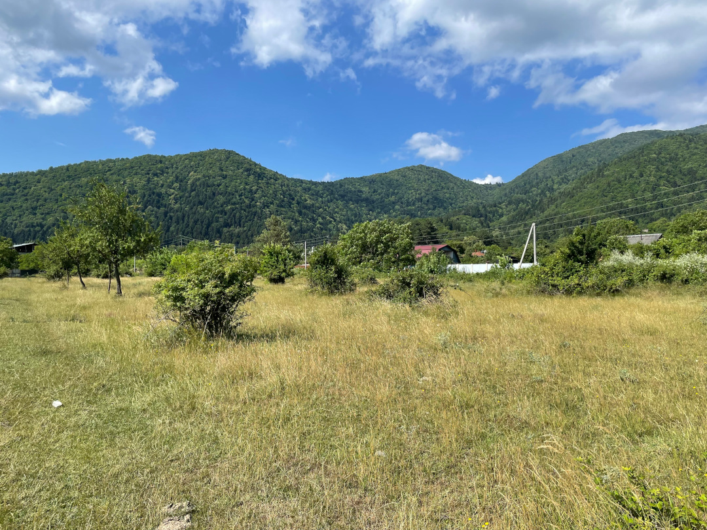
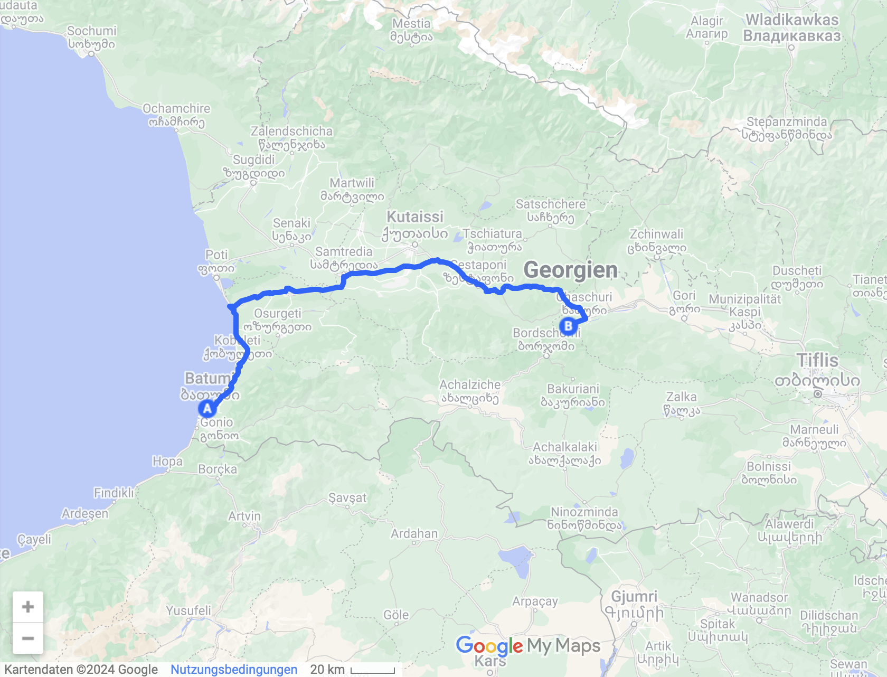
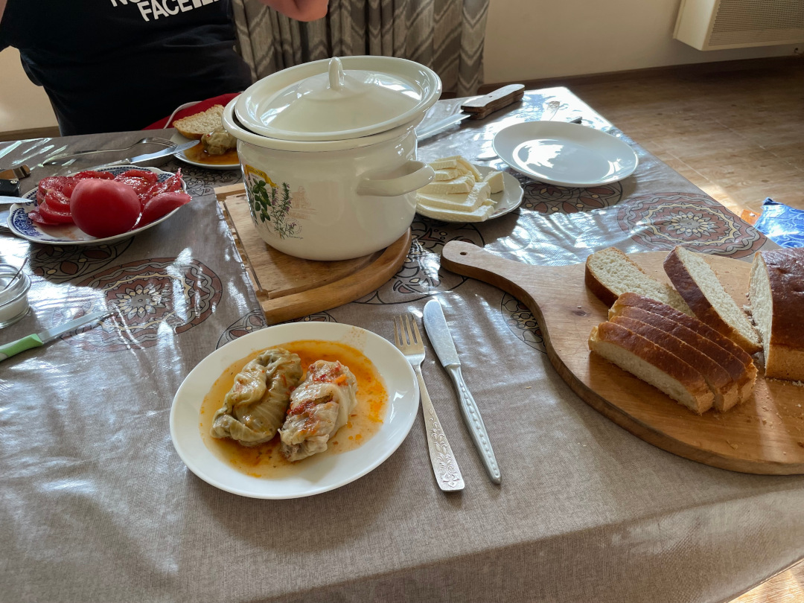
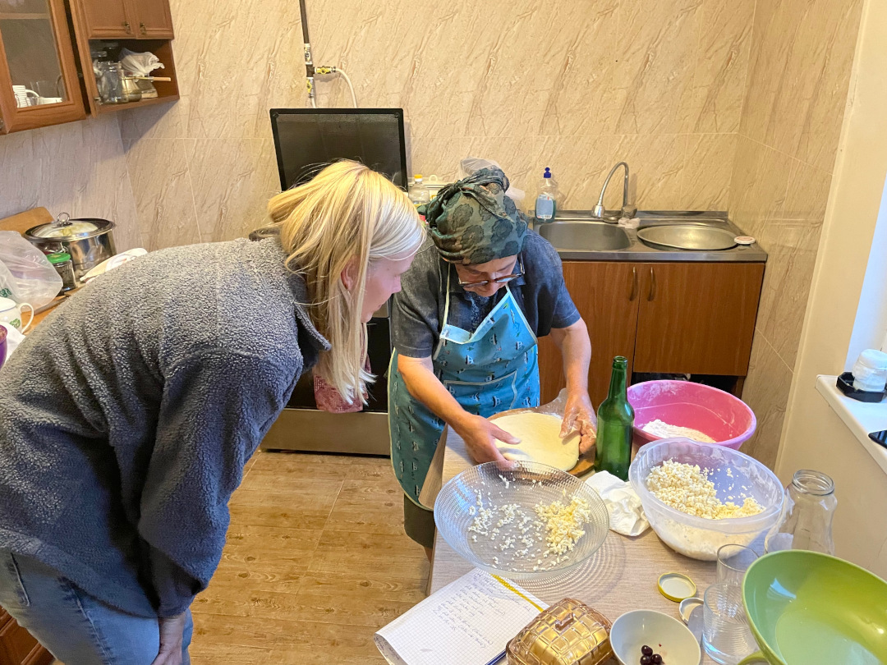
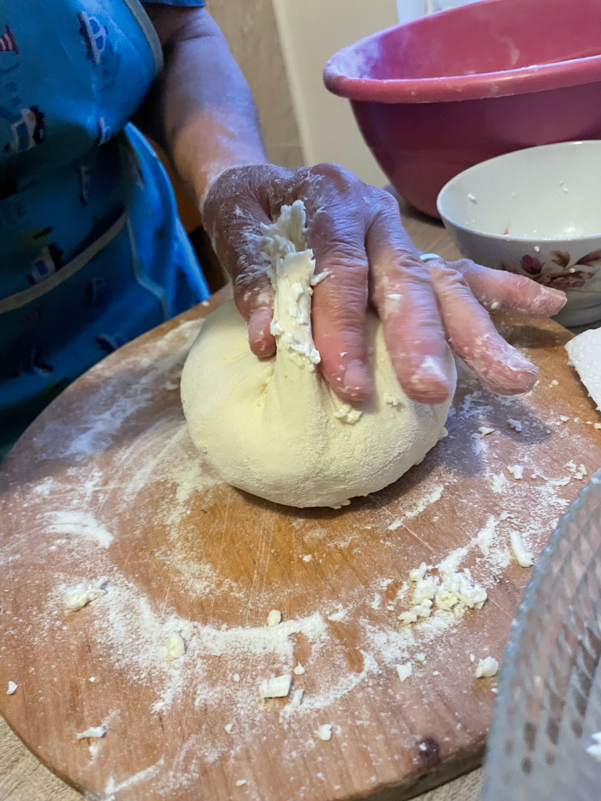
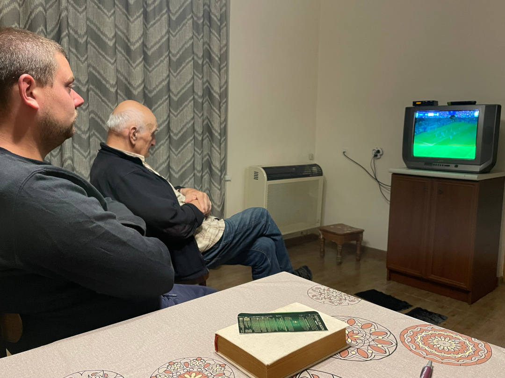

Wir erleben den Inbegriff georgischer Gastfreundschaft und werden für zwei Tage zu großen Enkelkindern eines älteren georgischen Paares. So werden aus einem geplanten Tag Georgien auf der Durchreise nach Armenien schon mal vier Tage.

<!--more-->

🗓️ 29. Juni: Ein letztes Mal laufen wir durch die Straßen von Batumi und fahren dann los in Richtung Kutaissi. Der Verkehr in Georgien bleibt weiterhin bisher der wildeste auf unserer Reise und dementsprechend sehen die meisten Autos hier auch aus. Auch auf den gut ausgebauten Teilstücken laufen Tiere überall umher. Kühe und Pferde sind in Georgien nämlich anders als in den anderen Ländern einfach frei und ohne zugehörigen Menschen unterwegs. Umso konzentrierter und aufmerksamer fahren wir. Wie immer im neuen Land müssen wir uns erstmal etwas an den Fahrstil und unausgesprochene Regeln gewöhnen. Wie sich in der Türkei alle trotz Vorfahrtachten-Schild auf die Straßen drücken, gibt es hier zum Beispiel Ampeln, die grün sind, aber an denen trotzdem gehalten wird, wenn man links abbiegen will. So lange bis daneben ein grüner Abbiegerpfeil erscheint. Das muss man erstmal wissen. Außerdem wird immer wenn man anhält der Warnblinker angemacht, auch wenn der Grund nur ein Zebrastreifen ist. Wir nutzen in Kutaissi nochmal die Gelegenheit im Carrefour einzukaufen und düsen dann weiter zu einem der wenigen kleinen Campingplätze in Georgien. Der liegt mitten im Land, am Rande des kleinen Ortes Kvishkheti. Wir werden sehr herzlich empfangen. Die Gastgeber sind 82 und 75 Jahre alt und machen hier alles allein, weil ihre Tochter in Deutschland lebt. Die Frau spricht sogar etwas Deutsch. Als erstes kriegen wir Mirabellen geschenkt, die sehr saftig und lecker sind. Mit unseren Eroberungen aus dem Carrefour machen wir uns mal ein richtiges Abendbrot und gucken abends noch das Deutschland-Spiel. Allerdings schaffen wir nur eine Halbzeit bevor die Augen zufallen. Mittlerweile haben wir nämlich zwei Stunden Zeitverschiebung und so beginnt das Spiel erst um 23 Uhr.

🗓️ 30. Juni: Wir gehen mit Henry durch die Felder um die Ecke, machen den Bulli und uns abfahrbereit und wollen nur noch eben bezahlen. Wir wollen heute eigentlich weiter nach Armenien fahren, aber dann werden wir eingeladen im Haus Familienfotos anzugucken, Tee zu trinken und gekaufte Khachapuri zu essen, ein georgisches Brot mit Käse gefüllt. Dabei erfahren wir, dass eigentlich ein paar Anschaffungen anstehen für ein kleines Ferienhaus auf dem Gelände. Wir bieten unsere Hilfe an, um mit dem Bulli und der Gastgeberin die Möbel und Besorgungen zu erledigen und sehen strahlende Gesichter. Die beiden älteren Gastgeber haben nämlich kein Auto und wahrscheinlich auch keinen Führerschein. Bis wir losfahren werden aber noch ein paar Stunden des Überlegens was, wie, wohin und mit gefühlt einer Millionen Videoanrufen mit der Tochter in Deutschland vergehen. Vor der Abfahrt werden wir natürlich nochmal zum Essen eingeladen (dieses Mal gibt es georgischen Joghurt, Brot, Käse und Tomaten). Dann ist es tatsächlich soweit. Wir hieven die ältere Dame vorne in unseren Bulli und fahren zwanzig Minuten nach Chachuri. Unser erster Halt ist bei einer Straßenhändlerin. Dann geht es in sowas wie einen Baumarkt. Dann auf den Basar. Dann in ein Gartengeschäft. Unsere Ausbeute umfasst Gartenstühle und einen kleinen  Tisch, einen Ventilator, Klopapier im Angebot und viel zu essen (Früchte, Brot, süße Teilchen). Als wir wieder ins kleine Dorf zurückkommen, wartet an der Straße noch eine Nachbarin, von der wir noch Käse kaufen wollen (laut unsere Gastgeberin „beste“). Sie ist richtig glücklich und zufrieden und das schwappt auf uns über. Wir bleiben also noch eine Nacht und das nächste Essen lässt nicht lange auf sich warten. Jetzt gibt es mit Hackfleisch und Reis gefüllte Kohlblätter. Abends dürfen wir dann sogar von ihr lernen, wie man Kachapuri selber backt. Unser Ergebnis ist noch viel leckerer als das gekaufte und wir hoffen, dass wir das später in Deutschland auch so hinkriegen. Auch ihre Rezepte für zwei Arten süße Teilchen übersetzen wir noch zusammen, genau wie ein paar Gedichte, die ihr Mann viel schreibt, wenn ihm langweilig ist und die sehr philosophisch sind. Mittlerweile bezeichnet sie uns schon als ihre großen Enkelkinder. Um 23 Uhr gucken wir noch zusammen Georgien gegen Spanien auf dem kleinen Röhrenfernseher. Beide sind sehr aufgeregt und als Georgien dann noch in Führung geht, ist der Jubel im Wohnzimmer groß. Um das Tor nochmal genauer zu sehen, stehen alle auf und rücken näher an den kleinen Fernseher. Sonst erkennt man nämlich nicht allzu viel. Wieder sind wir nach einer Halbzeit einfach müde von Tag, verabschieden uns und bekommen schon das nächste Kachapuri für den Weg in die Hand gedrückt. Mit gemeiner Fangfrage: Schmeckt? Ja. Wenn schmeckt, dann mitnehmen.

