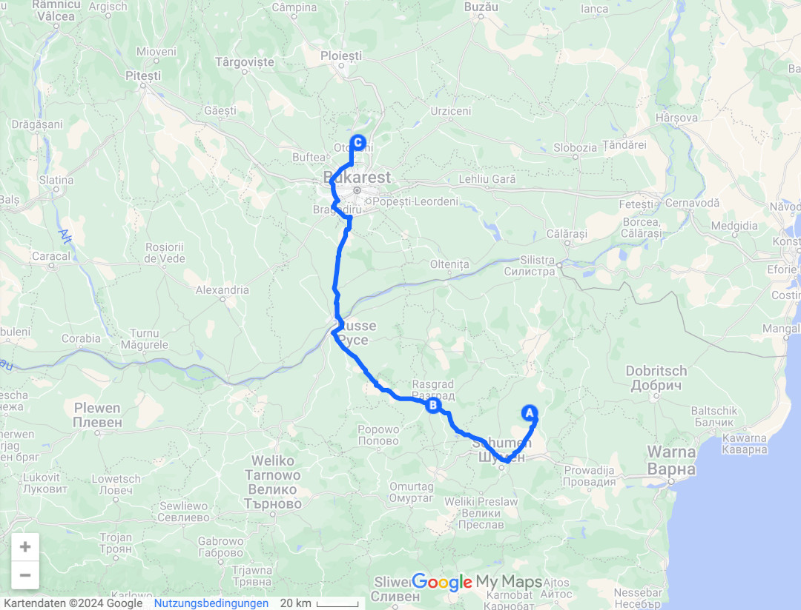
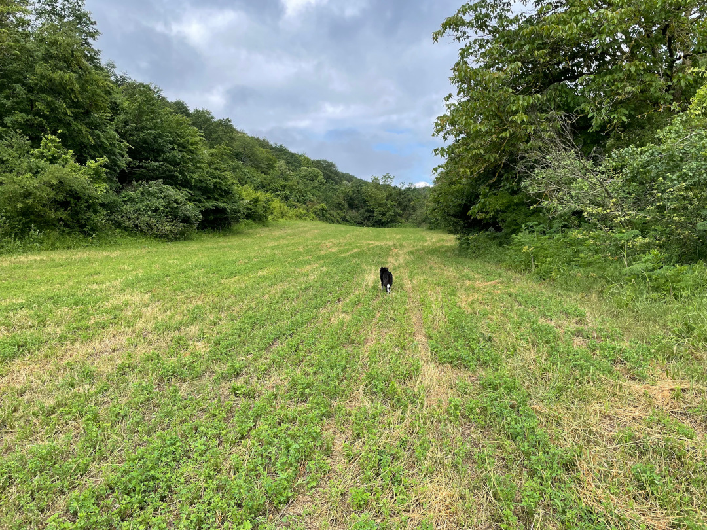
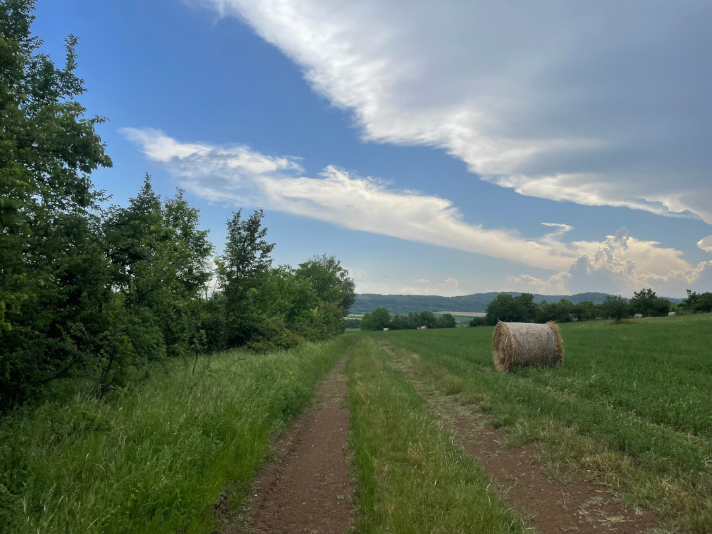
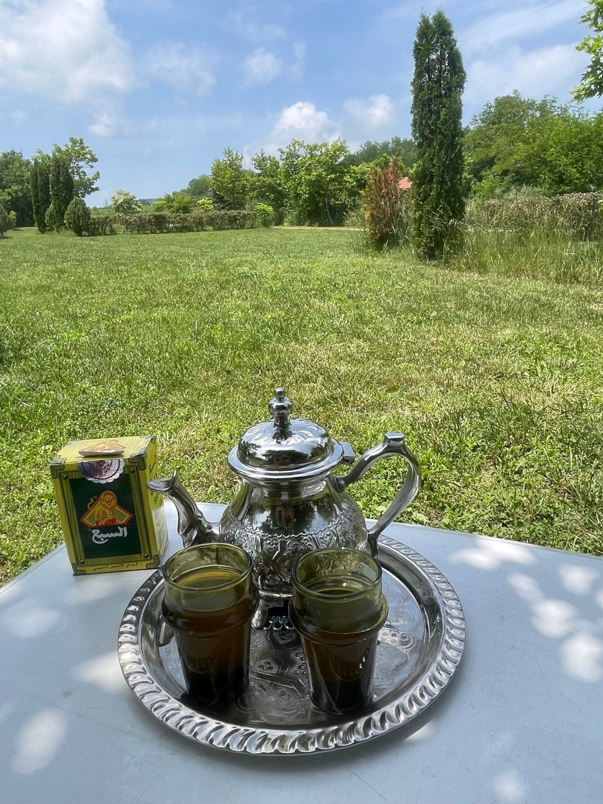
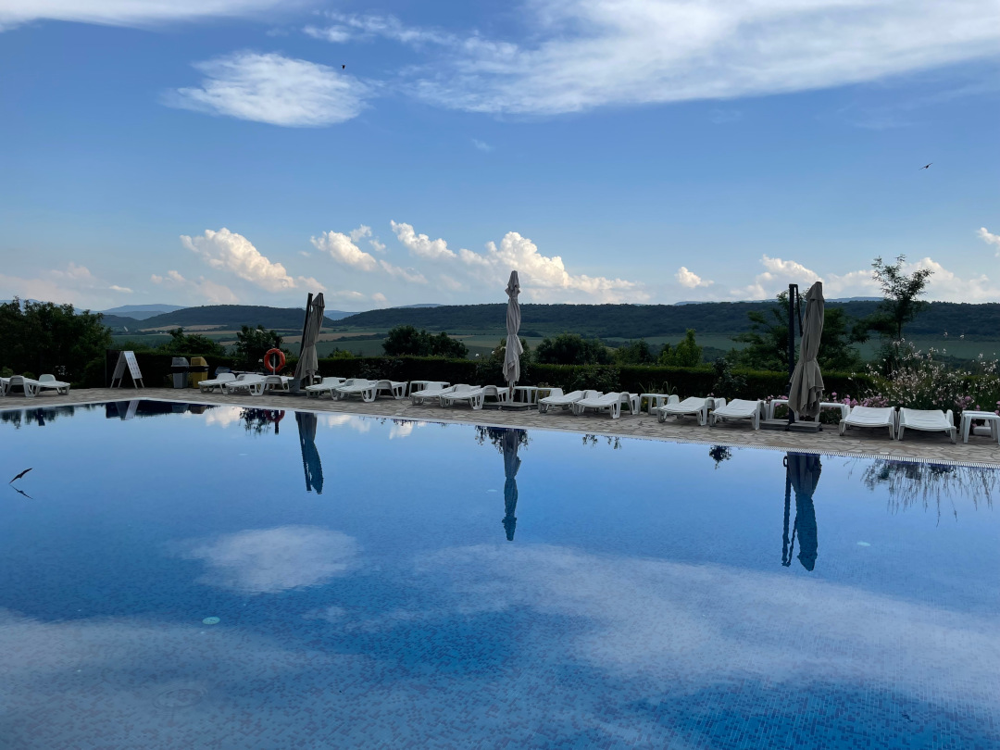
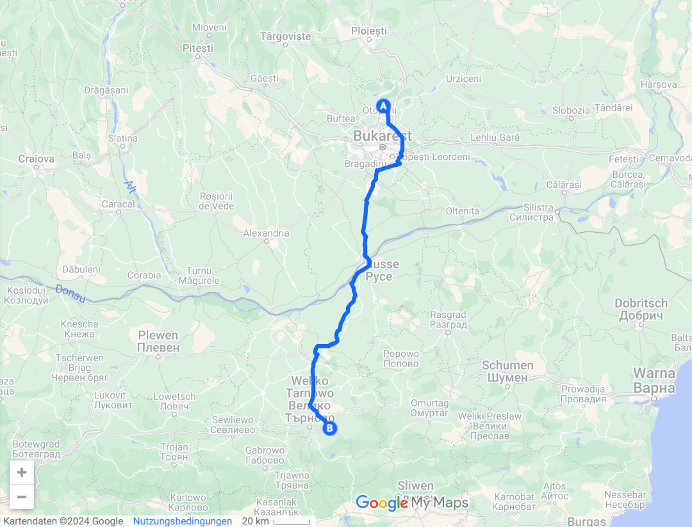

Für einen kleinen Abstecher geht es zurück nach Rumänien, vor allem um einen Flughafen nahe Bukarest zu nutzen, damit Tobi dem BVB nach London folgen kann. Danach kehren wir direkt wieder nach Bulgarien zurück. 

<!--more-->

🗓️ 30. Mai: Nach einer Henry-Runde durch die umliegenden Felder machen wir uns relativ früh auf den Weg, weil heute einige Kilometer anstehen. Wie vor zwei Wochen noch andersherum, überqueren wir bei Russe wieder die Donau und reisen so noch einmal in Rumänien ein. An der Grenze ist heute nicht viel Verkehr und so kommen wir zügig voran. Naja, zumindest bis wir wieder auf dem Ring um Bukarest ankommen. Hier herrscht immer viel Verkehr und ständiges Stop and Go, aber das kennen wir ja schon. Inzwischen sind wir nämlich eigentlich fast jede Stelle dieses Rings schon gefahren. Bei einem Einkaufszentrum halten wir noch, um unsere Vorräte aufzufüllen, bevor es weitergeht nach Balotesti. Der kleine Vorort von Bukarest ist in den letzten Jahren stark gewachsen und so herrscht auch hier relativ viel und schneller Verkehr. Unser Ziel ist der private Garten einer Familie, die darin Platz für genau einen Camper zur Verfügung stellt. Weil die Lage zum Flughafen in Otopeni mit nur 15 Minuten Fahrt perfekt ist, haben wir ausnahmsweise schon frühzeitig für die nächsten Tage reserviert. Von Anfang an werden wir hier fürsorglich umsorgt und haben alles, was wir brauchen. Der Wachhund der Familie (ein ziemlich großer Schäferhund) bleibt, wenn wir da sind, im Zwinger. Und so wie er uns beim Vorbeilaufen anbellt, ist das wohl auch besser so. Mit über 30 Grad ist der Sommer jetzt so richtig angekommen und deshalb bleibt nicht allzu viel Kraft für viel Bewegung. Wir drehen eine kleine Runde mit Henry durch den Ort und besorgen uns (wie könnte es anders sein nach einem langen Tag) mal wieder eine Pizza. Dann packt Tobi noch seine Sachen, weil ich ihn morgen früh direkt zum Flughafen bringe.

🗓️ 31. Mai bis 2. Juni: Wir düsen zum Flughafen und sind dann für eine kurze Reiseunterbrechung aufgeteilt: Tobi ist in London, Henry und ich bleiben mit dem Bulli in dem Garten in Balotesti, wo wir weiterhin mit lauter frischen Sachen wie Eiern, Salat, Kräutern und vielen Früchten versorgt werden. Außerdem werden wir immer wieder zum Essen und auch zu den Nachbarn eingeladen. Wir sind also bestens versorgt, fast schon etwas zu gut.

🗓️ 3. bis 4. Mai: Nachdem ich Tobi gestern Abend wieder vom Flughafen abgeholt habe, packen wir heute Morgen alles wieder zusammen. Zum Abschied gibt uns die Familie noch frische Minze für Tee und Lavendelblüten für guten Duft im Bulli mit. Dann geht es für uns ein letztes Mal über den Ring an Bukarest vorbei und wieder Richtung Bulgarien. Das dritte (und ich denke auch letzte) Mal überqueren wir die Brücke über die Donau und damit den Grenzübergang zwischen Giurgiu und Russe. Interessanterweise wurde unser Auto bei unserer ersten Einreise nach Bulgarien und auch jetzt nicht kontrolliert, aber bei der Rückreise nach Rumänien schon. Deshalb sind wir jetzt aber wieder sehr zügig durch die Grenzposten durch. Bei über 35 Grad ist es auch gut, nicht noch lange in der Schlange in der prallen Sonne zu stehen. Uns steht der Sinn erstmal nach einer Pause und etwas Erholung. Deshalb steuern wir das erste Mal auf unserer Reise einen Campingplatz an, auf dem wir schon waren. In der Nähe von Veliko Tarnovo, besser gesagt am Rande des kleinen Dorfes Dragizhevo, hatte uns die ruhige Atmosphäre, der viele Platz und das viele Grün so gut gefallen, dass wir zurückkommen. Zur Erinnerung: Der mit den Glühwürmchen. Vor zweieinhalb Wochen bei unserem ersten Besuch wurde der Pool gerade noch vorbereitet. Jetzt ist er zum Glück bereit, so dass die Abkühlungen nur so auf uns warten. Wir machen uns also einen gemütlichen Tag mit Spaziergängen, Tee und Zeit im Pool. Abends hören wir dann plötzlich keine Hunde bellen, sondern Wölfe heulen, aber gefühlt sehr weit weg.

