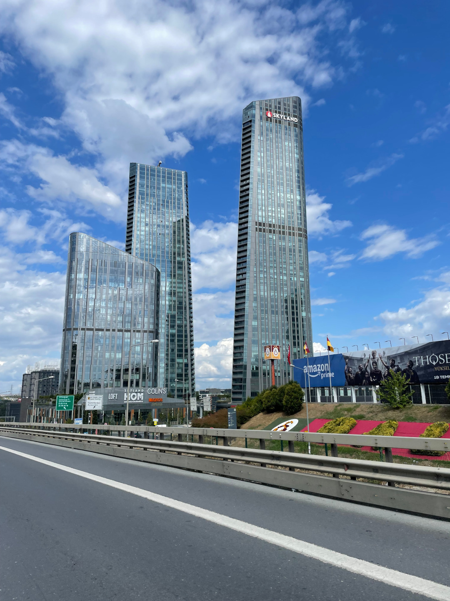
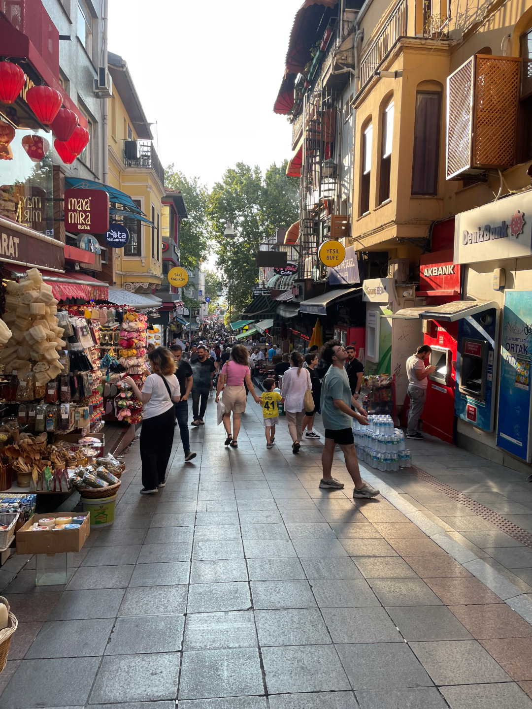
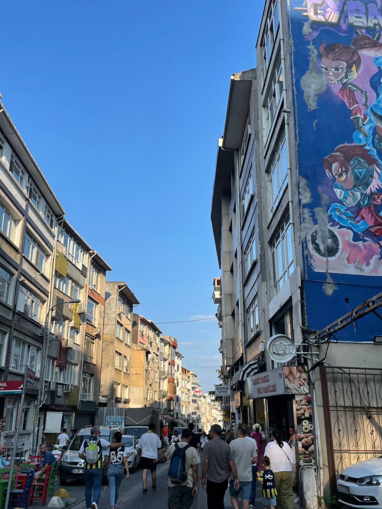
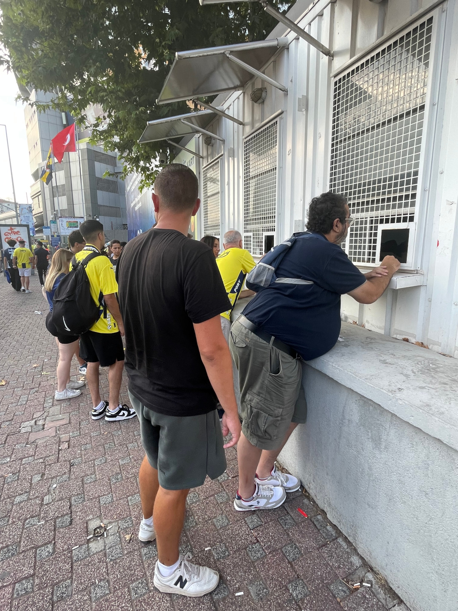
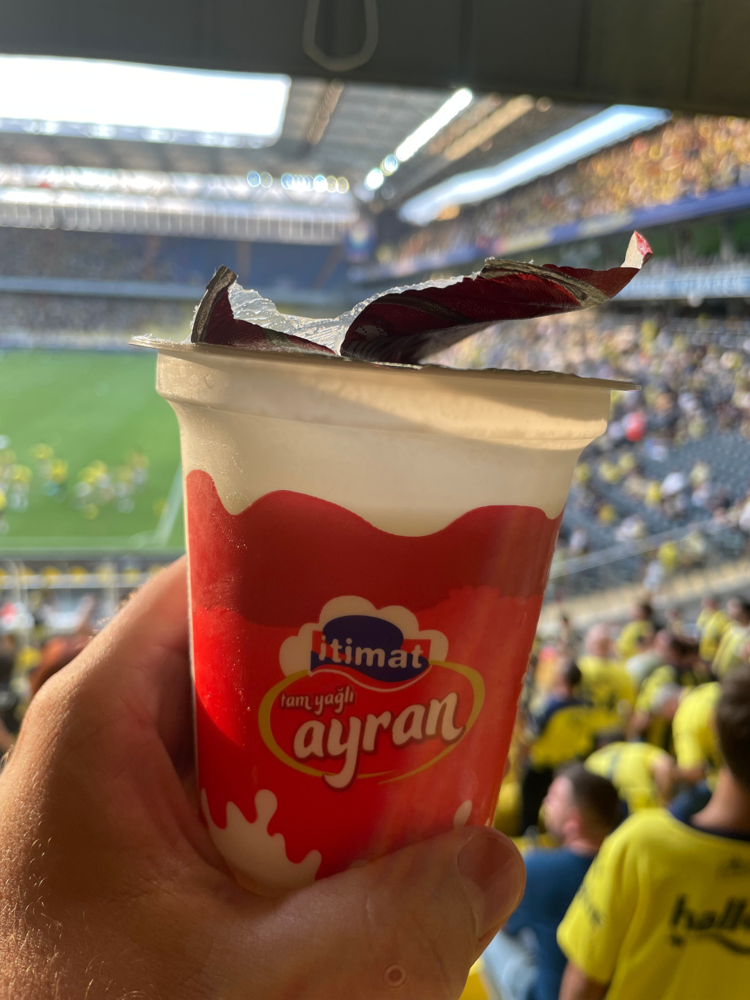
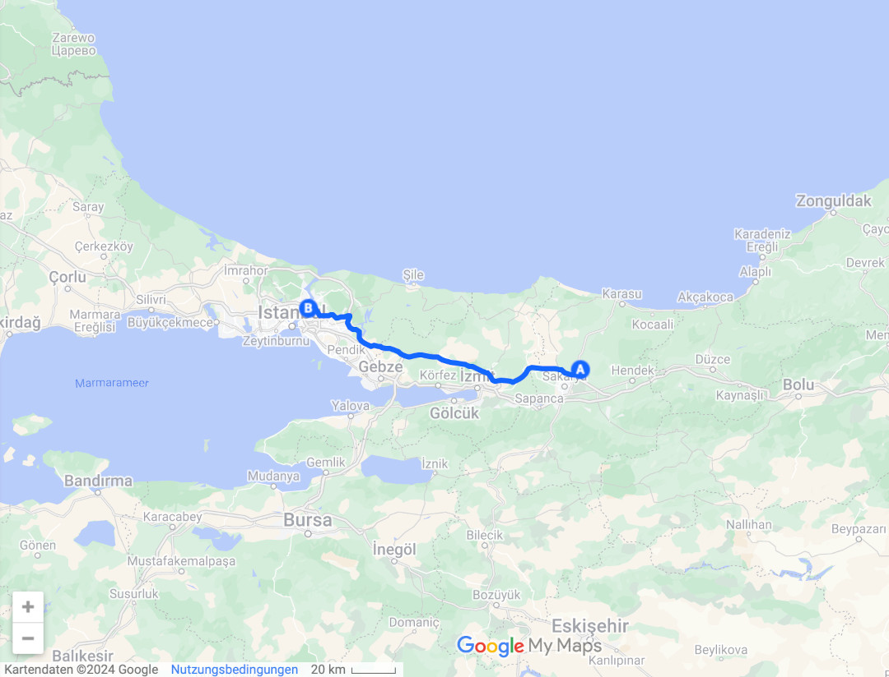

Unsere letzte Station in der Türkei ist die größte Stadt des Landes.

<!--more-->

🗓️ 30. Juli: Die Nacht war wieder sehr warm, aber irgendwie gewöhnt man sich schon dran. Auf Campingplätzen kann man die Türen und Kofferraumklappe offenlassen, so geht wenigstens der Wind durch. Weil wir nicht mehr viele Kilometer bis Istanbul vor uns haben, können wir den Tag entspannt starten und wir gehen wieder die Henry-Runde direkt am See. Danach machen wir uns abfahrbereit, bezahlen und fahren los. Unterwegs halten wir noch ein letztes Mal, um Köfte zu essen. Istanbul ist mit über 15 Millionen Einwohnern die größte Stadt, in der wir bisher waren. Daher haben wir anfangs doch etwas Respekt vor dem Verkehr und hatten den Besuch hier gar nicht eingeplant. Weil aber noch der Länderpunkt fehlt und es nur hier in Istanbul zeitlich sinnvoll ist, müssen wir wohl oder übel in die Stadt reinfahren. Über Park4night haben wir einen Parkplatz gefunden, bei dem man für 10 € über Nacht stehen darf und auch dort übernachten darf. Zum Glück ist der Parkplatz nicht ganz so mitten in der Stadt und der Verkehr geht bis hierhin echt gut. Wir fahren fast nur auf Autobahnen und großen Straßen - kein Stau und kein Drängeln. Die unzähligen Hochhäuser begrüßen uns schon. Am Parkplatz begrüßt uns dann aber auch der freundliche Besitzer. Hier ist kaum was los und wir können uns ideal in den Schatten stellen. Dann kommt der Besitzer und gibt uns einen Schlüssel. Wir können hier sogar eine Toilette und Dusche benutzen. Einen besseren Schlafplatz hätte es in Istanbul für uns gar nicht geben können. Als wir erzählen, dass wir heute noch zu Fenerbahce Istanbul zum Fußball wollen, gibt er uns auch direkt seine Istanbulkart, mit der wir die öffentlichen Verkehrsmittel nutzen können. Der Parkplatz und unser Schlafplatz liegt auf der asiatischen Seite Istanbuls direkt am Bosporus in einer eher teureren Gegend. Bei der ersten Runde mit Henry denkt man nicht, dass man in einer so großen Stadt ist. Leider können wir aber unseren Plan nicht umsetzen mit der Fähre über den Bosporus zum europäischen Teil zu fahren und dann weiter in Richtung Stadion (was wieder auf der asiatischen Seite ist). Die Fähre kommt erst wieder in anderthalb Stunden, so dass es zu knapp mit dem Fußballspiel wird. Daher sagt uns der Besitzer welchen Bus wir nehmen sollen und wir machen uns auf den Weg. Laut Plan dauert die Busfahrt 40 Minuten zur Endstation und dann nochmal 30 Minuten laufen. Dann lernen wir aber den richtigen Stadtverkehr in Istanbul kennen und die Busfahrt dauert 1:15 Stunden. In Summe sind wir also knapp zwei Stunden unterwegs zum Stadion und das, obwohl wir ja schon auf der asiatischen Seite sind. Das gibt es auch wohl nur in so großen Städten. Wir sind aber trotzdem pünktlich am Stadion. Um das Stadion ist schon super viel los und der Weg vom Bus zum Stadion ist schon ein Erlebnis. Wir laufen auch noch durch kleine Gassen und lernen so wenigstens etwas die Stadt kennen.  Die letzten Spiele in Georgien und Armenien waren sehr einsam. Daher ist es gut, dass heute mal wieder einiges los ist. Unsere Tickets für heute haben wir ja noch nicht in der Hand. Wir mussten ja gestern leidvoll erfahren, wie kompliziert es in der Türkei ist, ein Ticket für ein Fußballspiel zu kaufen. Um auf den Stadionvorplatz zu gelangen, werden wir das erste Mal durchsucht und eigentlich auch die Tickets kontrolliert. Weil wir unsere noch abholen müssen, kommen wir aber ohne Probleme durch. Am Passolig-Schalter zeigen wir dann unseren Reisepass und bekommen ein Papierticket, auf dem das Ticket gespeichert ist. Der Mann versichert uns, dass das die Eintrittskarte für uns ist. Wir suchen unseren Eingang und werden ein zweites Mal kontrolliert, damit wir uns in die Schlange für den Eingang stellen dürfen. Alle um uns herum haben QR-Codes auf ihrem Handy, nur wir haben diese Papierkarte. Zwischendurch werden die Tickets noch einmal kontrolliert und wir kommen mit unserem Ticket durch. Dann folgt der endgültige Einlass ins Stadion. Das Ticket wird ein drittes Mal kontrolliert und tatsächlich öffnet sich bei uns das Drehkreuz. Drinnen werden wir dann natürlich auch ein drittes Mal durchsucht und endlich steht fest, dass wir heute den 33. und 16. Länderpunkt machen können. Wie man merkt, wird den Fußballfans in der Türkei von den Organisatoren und der Polizei nicht viel Vertrauen entgegengebracht. Jeder Fußballfan ist erstmal kriminell, nur so kann man diese Tortour beim Ticketkauf und dem Stadioneinlass erklären. Drinnen angekommen gibt es statt Bier Ayran und Köfte Ekmek. Eigentlich ein Traum, aber der Ayran war echt nicht lecker im Vergleich zu den letzten selbstgemachten. Wir suchen uns einen Platz sehr weit außen. Weil die günstigsten und somit unsere Tickets in der Heimkurve von Fenerbahce liegen, wollen wir lieber etwas abseits stehen. Fenerbahce spielt heute gegen den FC Lugano um die Qualifikation für die Champions League. Istanbul hat das Hinspiel 4:3 in der Schweiz gewonnen, also sollte es eine klare Nummer werden. Die Stimmung war schon vor dem Anpfiff sehr gut. Dann schießt aber Lugano sehr früh das 1:0. Bis kurz vor Ende sieht alles nach Verlängerung aus, doch dann schießt Fenerbahce noch zwei Tore und gewinnt auch das Rückspiel. Die Stimmung ist natürlich traumhaft, auch wenn ich mir von einem türkischen Fußballspiel noch etwas mehr versprochen habe. Nach dem Spiel finden wir nach etlichen Anläufen zum Glück noch ein Taxi, das uns durch den Istanbuler Stau zurück zum Bulli bringt. Zufrieden und müde geht es direkt ins Bett.

