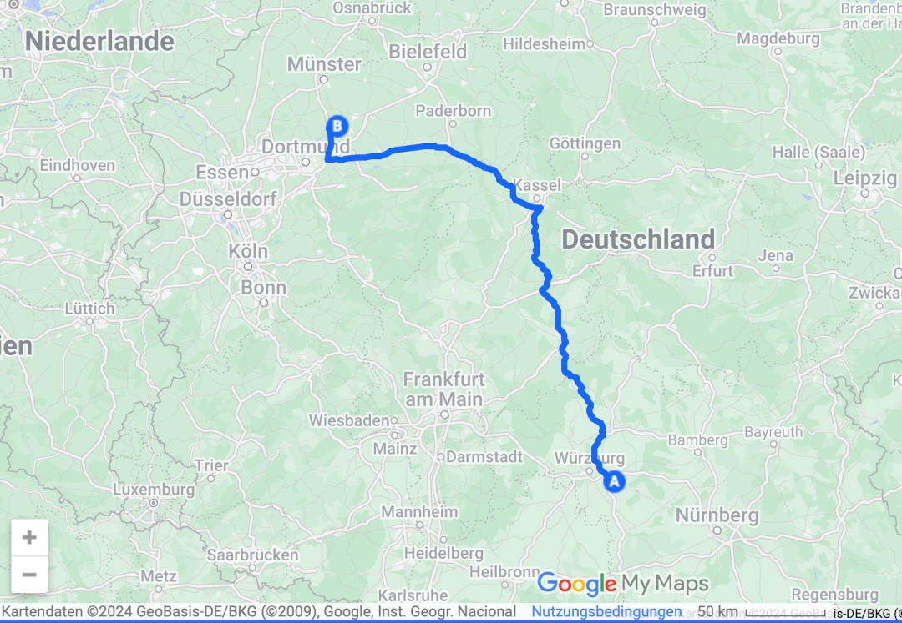

Wir können diesen allerletzten Bericht unserer Reise am besten so beginnen wie den allerersten: In unseren Köpfen haben wir uns diesen Tag schon lange ausgemalt und jetzt fahren wir einfach los kommen wir einfach zurück. Etwas unwirklich, aber auch verdammt schön. Die letzte Etappe führt uns von Kitzingen nach Hamm.

<!--more-->

🗓️ 30. August: Wir lassen es ein letztes Mal ruhig angehen im Bulli und spazieren dann mit Henry am Main entlang. Dann machen wir uns abfahrbereit, halten noch schnell bei Edeka um die Ecke und düsen los. Es geht ganz unspektakulär immer die A7 hoch. Mittags gönnen wir uns noch ein letztes Raststätten-Essen und nach weiteren zwei Stunden kommen wir endlich an. Insgesamt waren wir jetzt 32 Wochen und 2 Tage mit dem Bulli unterwegs. In dieser Zeit haben wir viel gesehen, vor allem auch viele freundliche und offene Menschen in allen Ländern getroffen und sind 33.000 Kilometer gefahren. Und das unfallfrei und ohne größere Pannen. Was für ein Glück! Im Gepäck haben wir neben einer Riesenladung Erinnerungen vor allem das Gefühl alles richtig gemacht zu haben. Es lohnt sich zu träumen, es lohnt sich mutig zu sein und es lohnt sich die Dinge mal anders zu machen. Und das Beste: Jetzt freuen wir uns auf das vermeintlich Alte, das für uns jetzt wieder neu ist!

