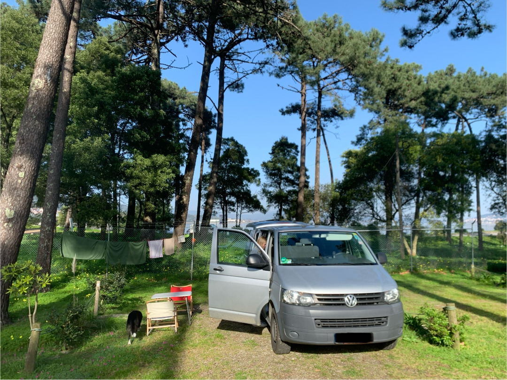
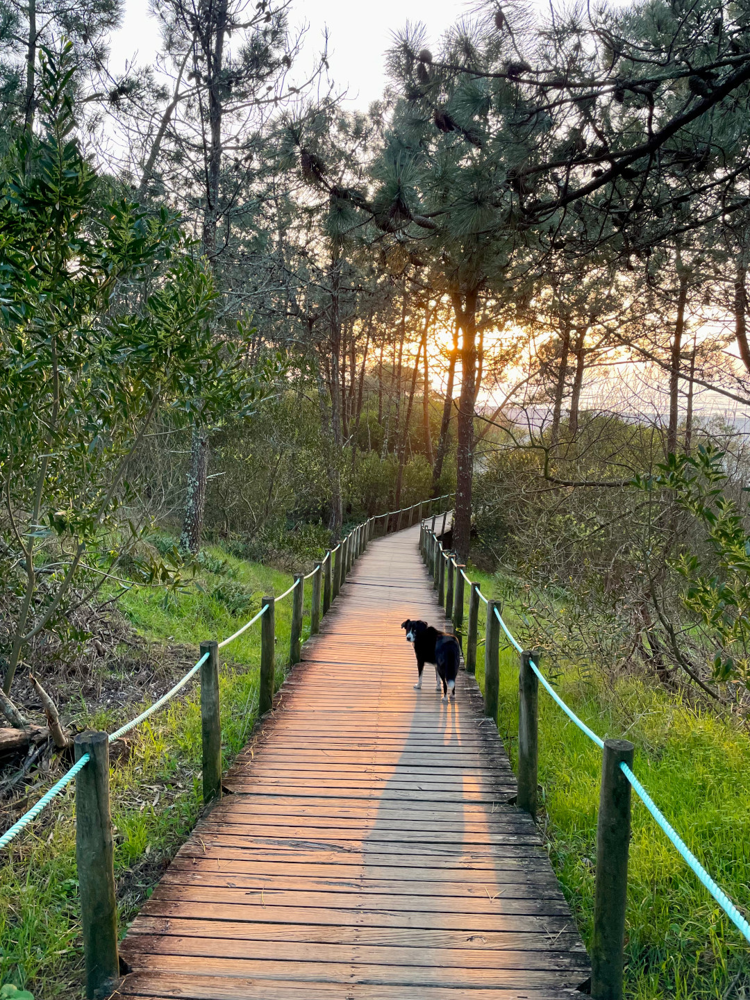
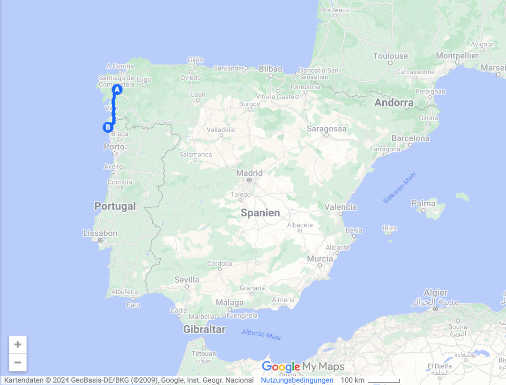
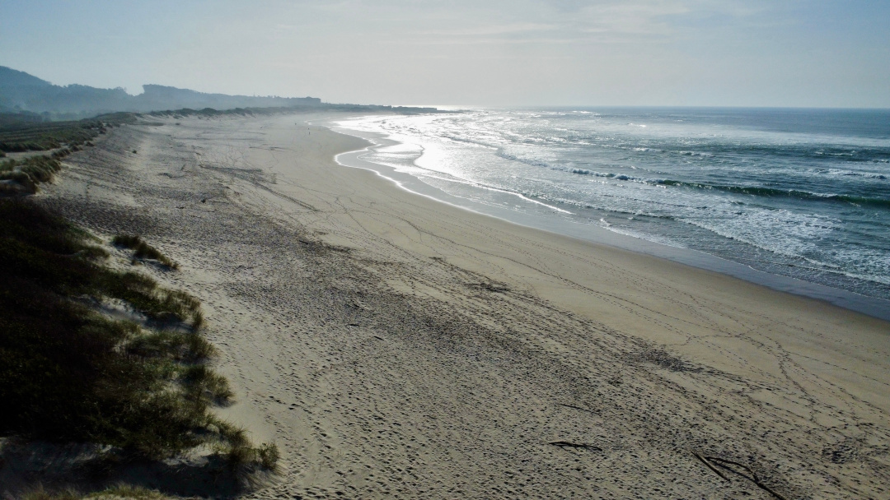
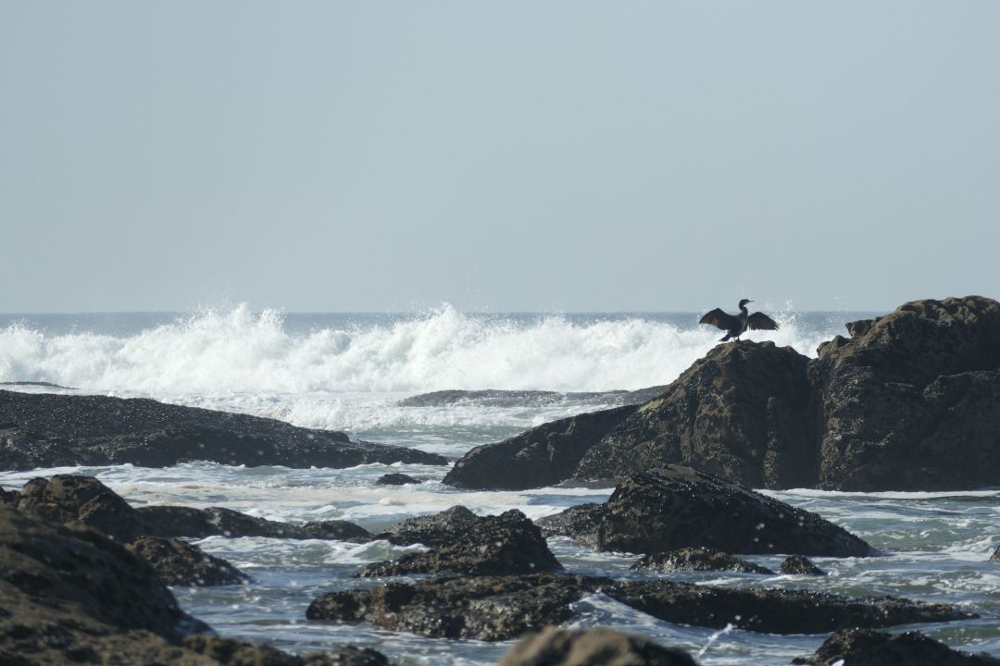
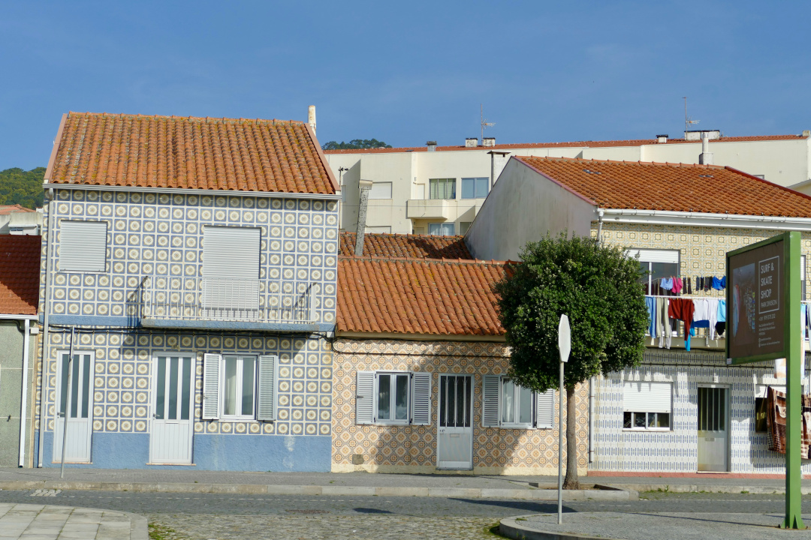

Von Spanien aus überqueren wir die nördliche Grenze Portugals und werden von schönen Stränden, Pinienwäldern und viel Sonne empfangen. Fantástico!

<!--more-->

🗓️ 31. Januar: Heute sind wir genau eine Woche unterwegs. Spätestens in 43 Wochen müssen wir zurück sein. Es bleibt also mehr als genug Zeit, um immer neue Gegenden zu erkunden. Unser Morgen in Santiago de Compostela beginnt mal wieder mit vielen Schritten, aber vor allem mit vielen Höhenmetern. Als erstes geht es mit Henry auf einer Anhöhe in den Parque de Carlomagno, von dem man Aussicht über die ganze Stadt hat. Dann landen wir wieder in dem Einkaufszentrum gegenüber vom Campingplatz, um im riesigen Carrefour alles Nötige für den Tag einzukaufen. Dieses Mal düsen wir nicht mehr in Richtung Westen, sondern in Richtung Süden los. Nach einiger Zeit überqueren wir den Rio Miño und damit die spanisch-portugiesische Grenze. Ab jetzt ist es bei uns also eine Stunde früher als in Deutschland. Unser Ziel für heute ist der Ort Caminha, der direkt hinter dem Fluss liegt. Unsere Handys bleiben also erstmal im spanischen Netz mit falscher Uhrzeit. Als wir durch Caminha fahren, sehen wir, dass gerade Markt ist, und so machen wir einen Stopp, schlendern über den Markt, essen ein Eis von einer kleinen Kneipe und sitzen etwas auf dem Dorfplatz. Die portugiesische Gemütlichkeit schwappt direkt auf uns über. Schließlich kommen wir an unserem Campingplatz an, der zwischen dem Fluss mit Fischerbooten, dem Pinienwald und dem Atlantik liegt, und lassen es uns gut gehen. Die Preise für die Übernachtung sind in Portugal auch direkt viel günstiger als in Spanien. Pünktlich zum Sonnenuntergang laufen wir zum Strand, aber wir müssen uns erstmal daran gewöhnen, dass es jetzt eine Stunde eher dunkel wird. 

🗓️ 1. Februar: Wir starten entspannt in den Tag und entscheiden uns dazu noch eine Nacht in Caminha zu bleiben, weil die Lage des Campingplatzes perfekt ist. Wir machen uns langsam fertig, um zu den nähst gelegenen Orten und Stränden zu wandern. Henry dauert das zu lang und er macht sich kurzerhand schon mal allein auf den Weg in den Pinienwald. Ein netter Franzose erklärt uns zum Glück, welchen Weg er genommen hat und als wir ihn rufen, kommt er im Affenzahn zurück und muss erstmal an die Leine. Nachdem wir noch eine Maschine Wäsche gewaschen haben, gehen wir dann alle zusammen los. Das erste Stück laufen wir durch den Wald, bevor es immer an einem schönen Küstenweg für Radfahrer und Fußgänger entlang geht, dem Ecovia Litoral Norte, der Teil des europäischen Radrouten-Netzes Eurovelo ist. Die Aussicht auf den Oceano Atlântico ist top und die Wellen super hoch. Wir kommen durch Moledo und Âncora und sehen viele Häuser mit den typisch portugiesischen Fliesen. Unser eigentliches Ziel (eine kleine Festung: Forte do Cão) erreichen wir nicht mehr, weil wir am wunderschönen Strand hinter Âncora versacken. Nach einer Stärkung machen wir uns dann auf den Rückweg und kommen nach ungefähr 6 Stunden wieder am Campingplatz an. Während wir weg waren, hat unser Solarpanel für neuen Strom gesorgt und der Wind die Trocknung der Wäsche übernommen – sehr praktisch. Den Rest des Tages genießen wir einfach die Ruhe hier.

