Nach knapp zwei Monaten in der Türkei, Georgien und Armenien fahren wir zurück in die EU.

<!--more-->

🗓️ 31. Juli: Kurz hatten wir überlegt heute morgen noch die verpasste Fährenfahrt über den Bosporus nachzuholen, doch wir schlafen zu lange, als dass es noch gut möglich wäre. Daher packen wir alles zusammen, testen die Dusche und gehen eine letzte Runde mit Henry durch Istanbul. Unsere Fahrt führt uns ins vier Stunden entfernte Alexandropouli in Griechenland kurz hinter der türkischen Grenze. Wenn schon nicht per Fähre überqueren wir den Bosporus aber über die Brücke. Jetzt stehen wir auch das erste Mal selber im Istanbuler Stau. Ansonsten verläuft die Fahrt aber bis zur Grenze ohne Probleme. Kurz vor der Grenze gibt es den letzten traditionellen Essenstop in der Türkei bei Burger King. Einen letzten günstigen Tankstopp legen wir auch noch ein. In Griechenland wird der Diesel nämlich wieder so teuer wie in Deutschland. Die Ausreise aus der Türkei an der Grenze geht relativ schnell. Hanna darf auch seit Ewigkeiten mal wieder im Auto sitzen bleiben. Die Einreise nach Griechenland dauert aber sehr lange. Wir warten insgesamt anderthalb Stunden, bis wir am Häuschen unsere Pässe vorlegen können. Wir erhalten sie sofort zurück und auch der Frontex Beamte winkt uns ohne Kontrolle durch. Bis Alexandropouli fahren wir noch eine halbe Stunde. Hier wollen wir auf einem städtischen Campingplatz schlafen. Als wir dort aber ankommen wird uns direkt gesagt, dass alles voll ist. Wir suchen fix eine Alternative und fahren noch mal knapp 50 Minuten weiter die Küste nach Westen. Der Campingplatz hat noch ein Platz für uns und liegt 800 Meter vom Mittelmeer entfernt. Wir machen den Bulli bereit für die Nacht und laufen mit Henry zum Strand. Der Weg zum Strand ist sehr cool und auch mit Henry entspannt zu laufen. Auch wenn es hier auch Straßenhunde gibt, haben die eher Angst vor Henry als andersrum. Nach den vielen Stunden im Auto gibt es dann die verdiente Abkühlung im Meer. Oberhalb des Strandes gibt es noch eine kleine Strandbar, wo wir unser erstes griechisches Abendessen (Tsatsiki, Schafskäse, Brot, Salat, gegrillte Pilze) und einen Sonnenuntergang bekommen. Zurück am Bulli geht es dann auch schnell ins Bett.

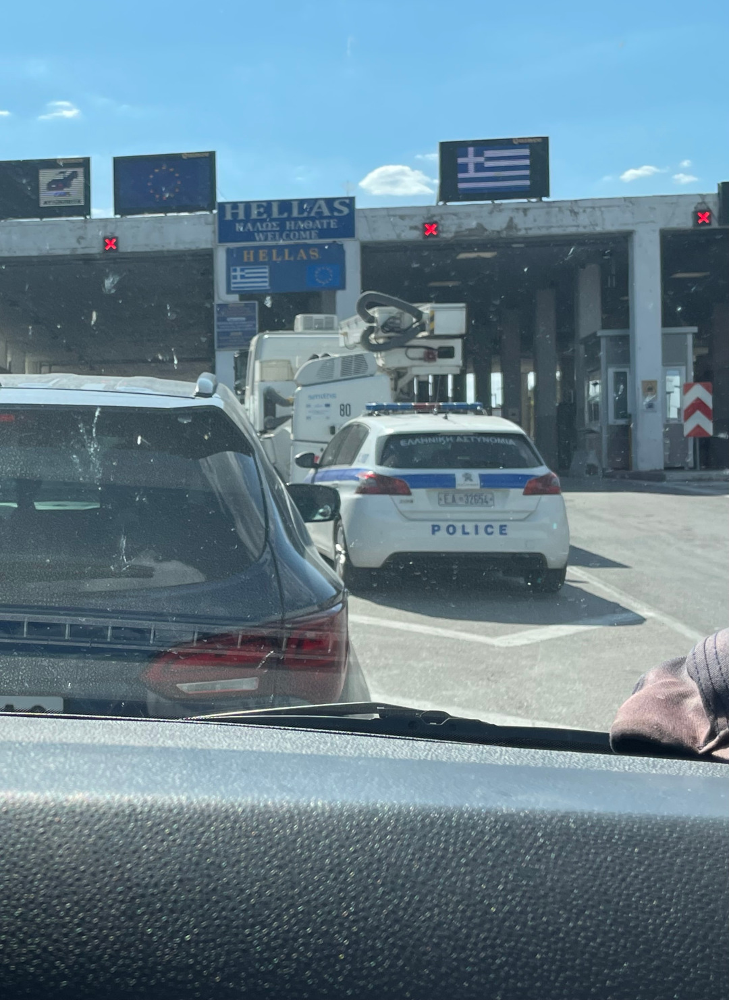

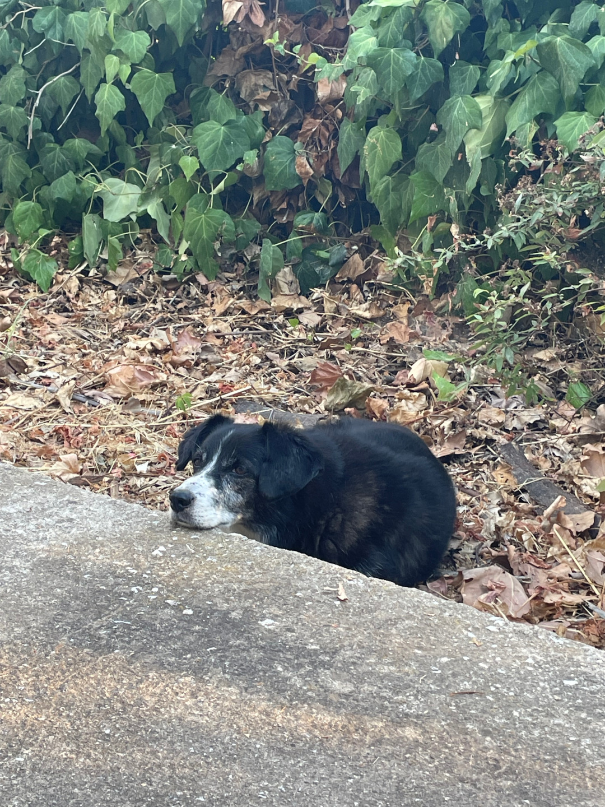

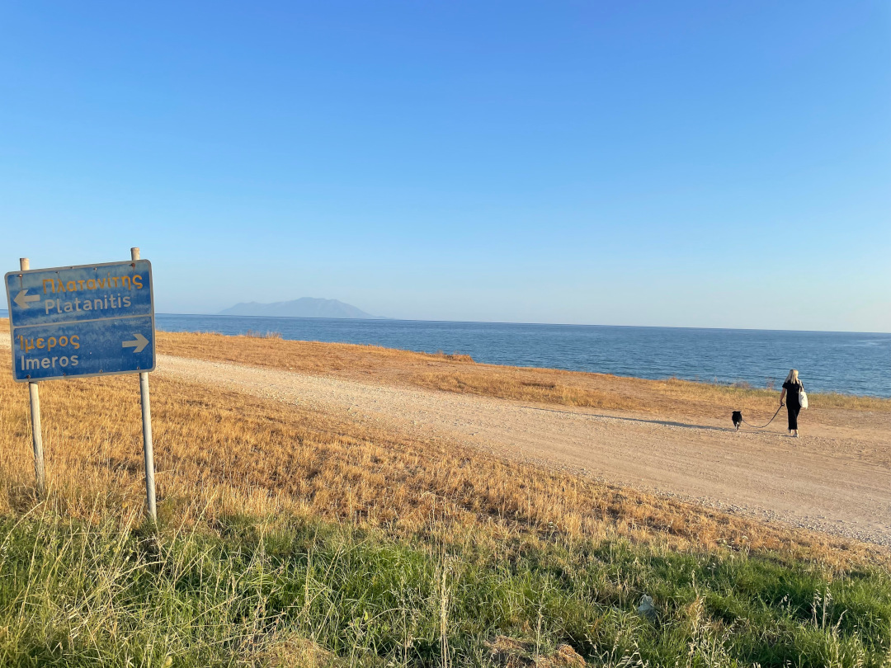

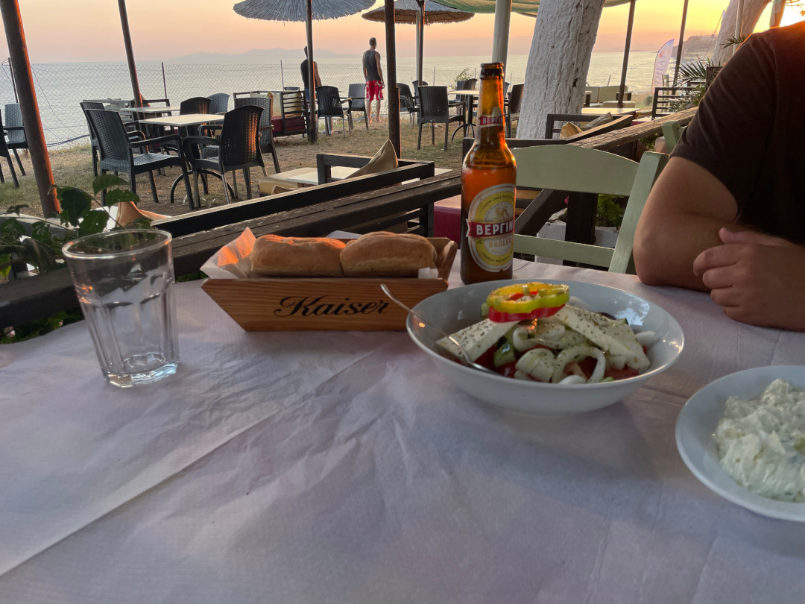

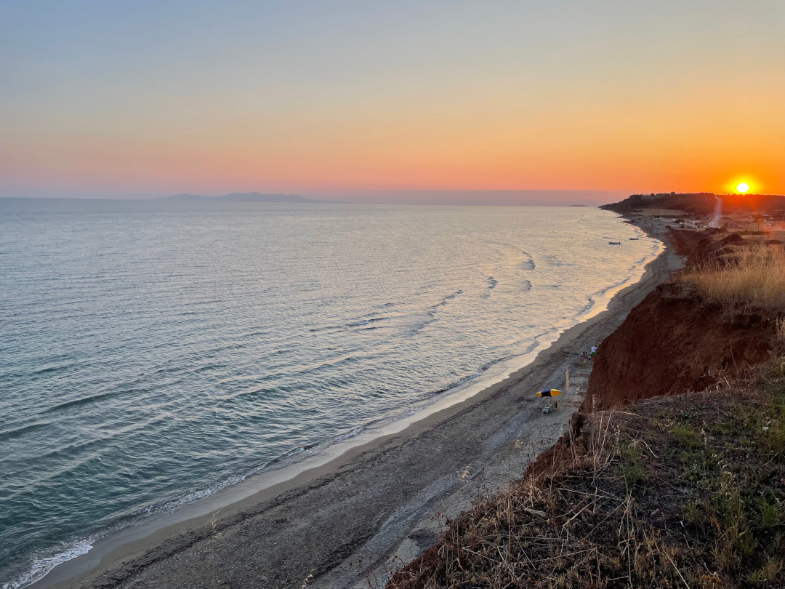

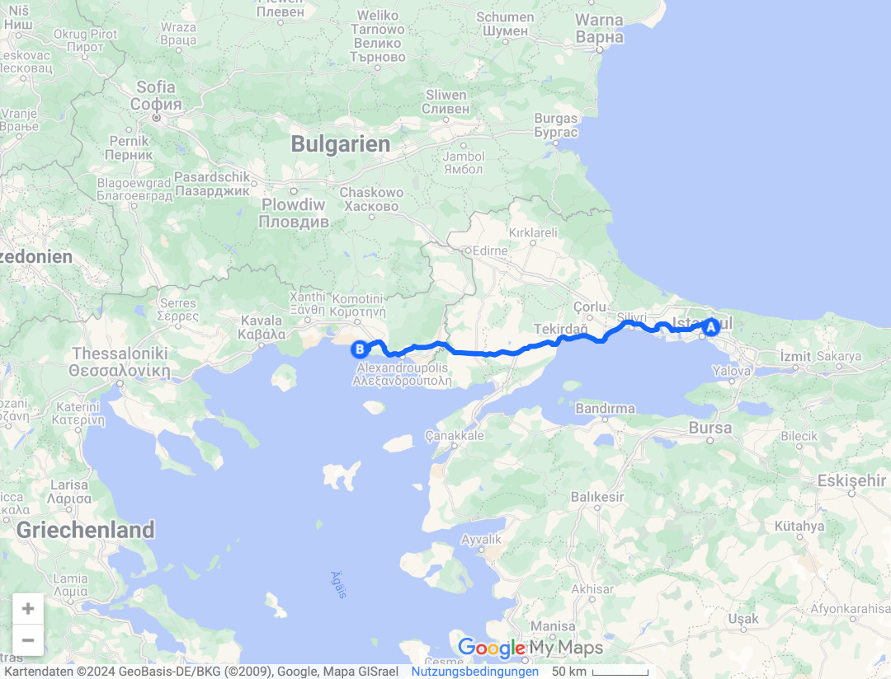

🗓️ 1. August: Die erste Runde des Morgens führt uns mit Henry wieder zum Strand von gestern Abend. Morgens ist es hier auch sehr leer. Nach der Abkühlung machen wir uns abfahrbereit und steuern als erstes einen Lidl an. Die Verbreitung von großen Supermärkten ist in Griechenland auf jeden Fall besser als in den letzten zwei Monaten. Das Beste ist aber der Backshop. Endlich gibt es wieder mehr als nur Weizenbrot. Wir besorgen uns also Frühstück und machen uns auf den Weg ins fünfeinhalb Stunden entfernte Meteora. Hier gibt es viele Klöster auf hohen Sandsteinfelsen gebaut. Von 24 Klöstern sind sogar noch sechs bewohnt. Einen Abstecher nach Meteora haben uns während der Reise schon ein paar Leute empfohlen. Die Fahrt verläuft dank Autobahn relativ ruhig, auch wenn die vielen Mautstationen nerven und man teilweise nur 80 Cent bezahlen muss. Da sind Vignetten oder das türkische System ohne ständiges Anhalten schon entspannter. Am frühen Abend erreichen wir Kastraki, einen kleinen Ort am Fuße der Meteora. Der Campingplatz ist riesig und hat auch noch genug freie Plätze. Freistehen ist für uns weiterhin bei den heißen Temperaturen nicht möglich, weil man quasi alle Türen und die Kofferraumklappe nachts offenlassen muss. Als wir den Bulli schon bereit für die Nacht gemacht haben, finden wir einen guten Aussichtspunkt über die Sandsteinfelsen zum Sonnenuntergang. Eine Wanderung dahin ist zu weit, um es rechtzeitig zu schaffen und die haben wir uns sowieso für morgen vorgenommen. Also drehen wir die Vordersitzbank wieder um und fahren zu dem Aussichtspunkt. Dort angekommen sehen wir schon sehr viele Menschen, die auf den Felsen den Sonnenuntergang angucken. Es lohnt sich auf jeden Fall, trotz der vielen Menschen. Die Klöster sehen in dem Licht noch cooler aus. Einige Klöster sind wirklich auf einzelnen Felsen gebaut, wo man sich fragt, wie man dort hinkommt. Auf dem Rückweg zum Campingplatz holen wir noch Gyros Pita und beenden den langen Tag.

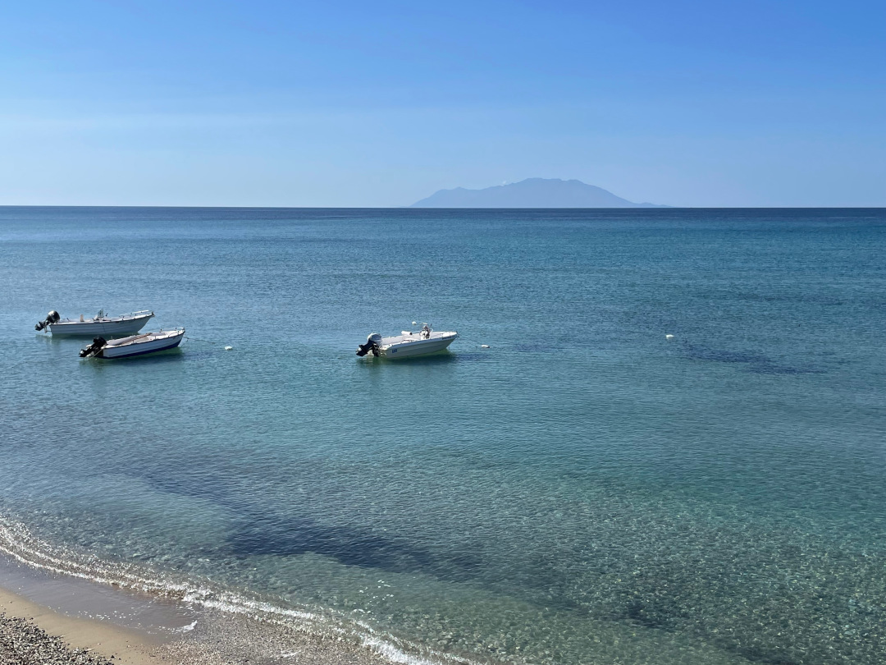

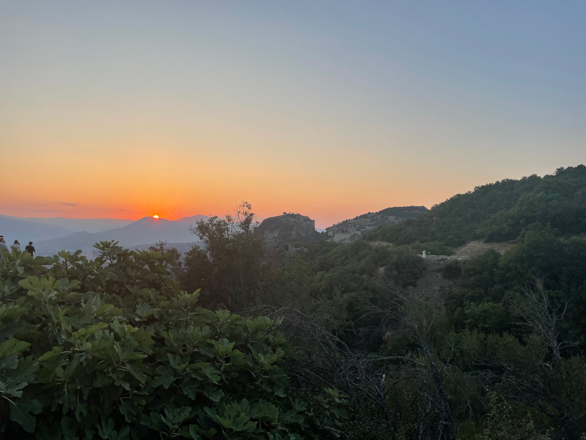

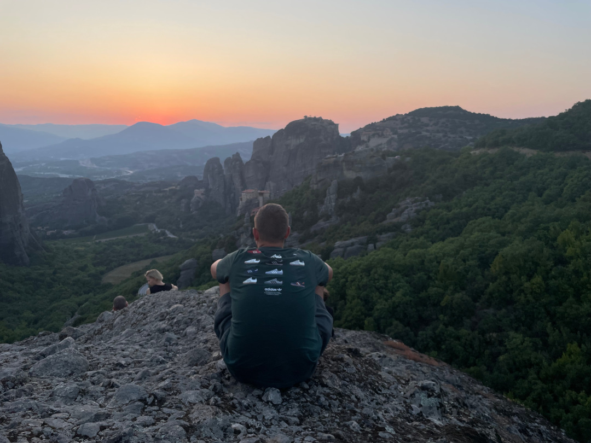

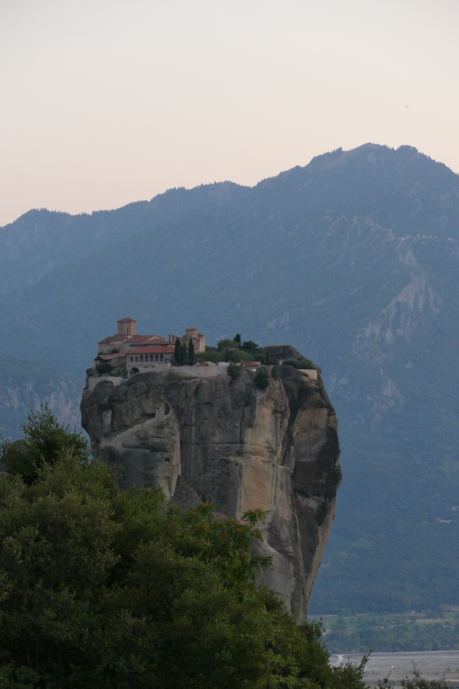

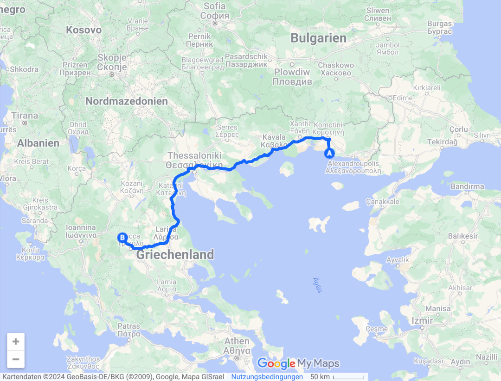

🗓️ 2. August: So langsam werden die Nächte wieder sehr heiß, aber irgendwie schafft man es dennoch immer halbwegs gut zu schlafen. Heute steht unsere Wanderung zu den Klöstern an. Daher laufen wir quasi direkt nach dem Aufstehen los, um noch bei erträglichen Temperaturen zu wandern. Auch heute sollen es wieder 38 Grad werden. Das Problem ist aber, dass wir die Höhenmeter, die wir gestern mit dem Bulli gefahren sind, heute laufen müssen. Die Klöster sind ja auf den Felsen und da ist jedes Grad weniger entscheidend. Wir laufen erst etwas durch den Ort Kastraki, vorbei an der Kirche und dann auf Schotterwegen die knapp 400 Höhenmeter hoch. Die Tour ist ungefähr acht Kilometer lang und völlig ausreichend. Zum Glück geht es bergauf durch den Wald und somit durch den Schatten. Oben am ersten Kloster sind wir die einzigen, die komplett verschwitzt ankommen. Es führt nämlich überall auch die ausgebaute Straße hin. Auf einen Besuch der Klöster verzichten wir, weil es mit kurzen Hosen sowieso nicht gestattet ist. Außerdem sieht es von außen viel spektakulärer aus. Dafür lohnt sich die Wanderung, weil man viele gute Perspektiven auf die Felsen und die Klöster hat. Es ist unsere erste richtige Wanderung seit langem. In vielen Ländern war es durch die anderen Tiere nicht möglich mit Henry zu wandern. In Griechenland ist es bisher aber anders und Henry kann alles wie immer mit machen. Also genießen wir die Wanderung trotz der Temperaturen. An einem Kloster wird Henry dann doch noch angefaucht. Eine kleine Katze guckt aus einer Regenrinne in einer Felswand und macht einen auf dicke Hose. Beim Abstieg treffen wir dann unsere erste Schildkröte. Auch hier ist Henry erst etwas überfordert, aber merkt dann das keine Gefahr von einem sich bewegenden Stein ausgeht. Am frühen Nachmittag sind wir dann zurück am Bulli und sorgen schnell für die passende Abkühlung im Pool. Danach kochen wir etwas und lassen den restlichen Tag ruhig angehen. Zum Abschluss geht es auf ein Eis nochmal in den Ort. Mit schweren Beinen geht es früh ins Bett.

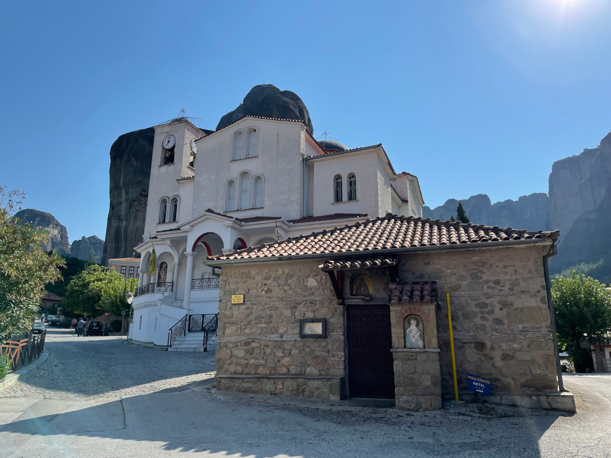

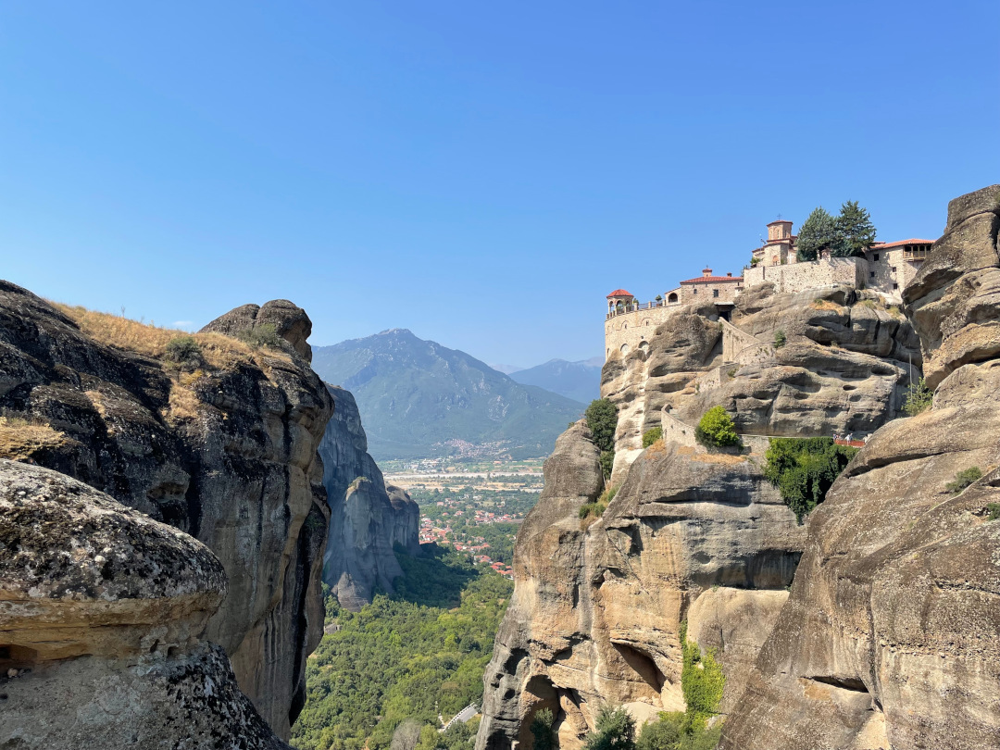

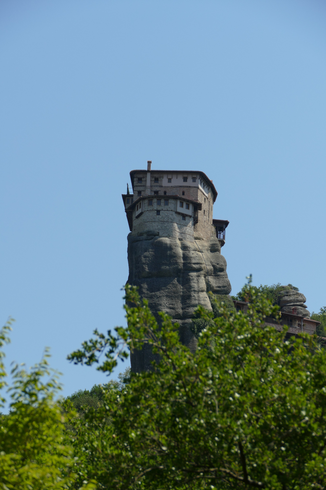

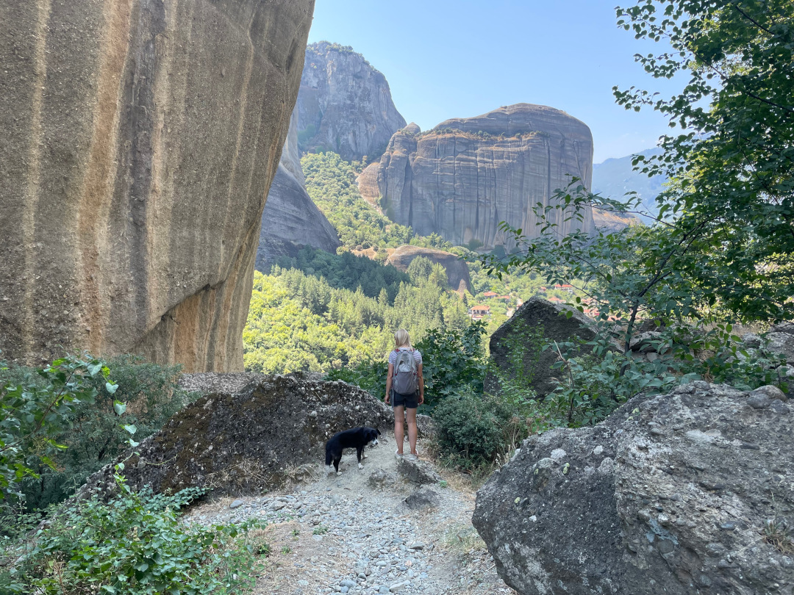

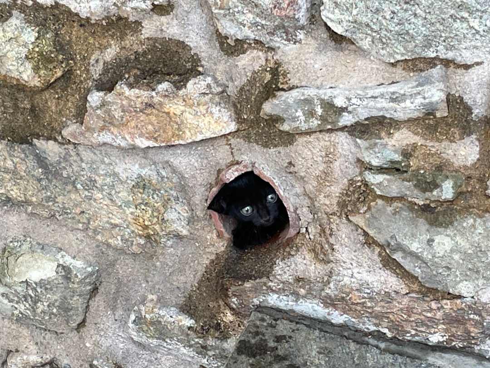

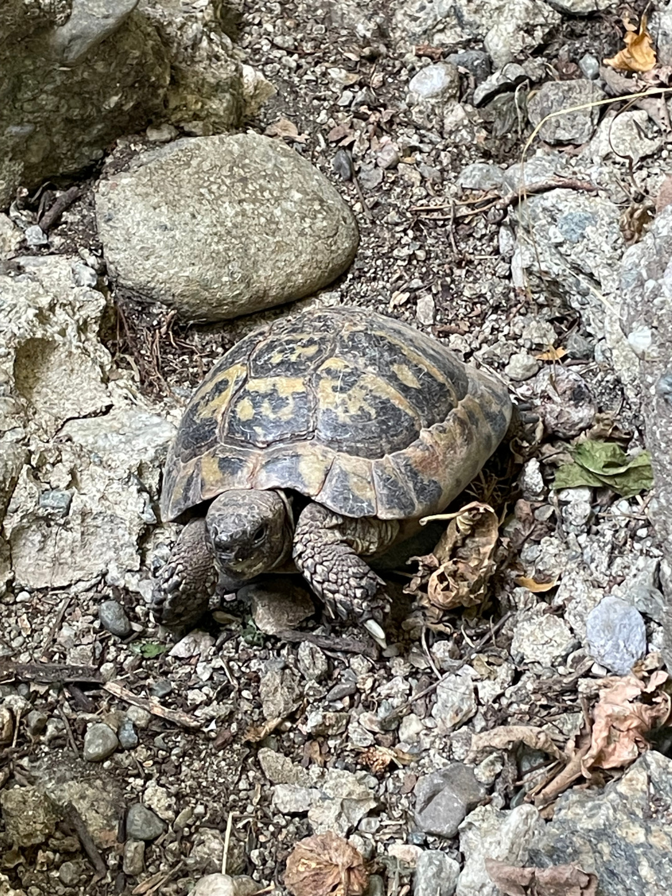