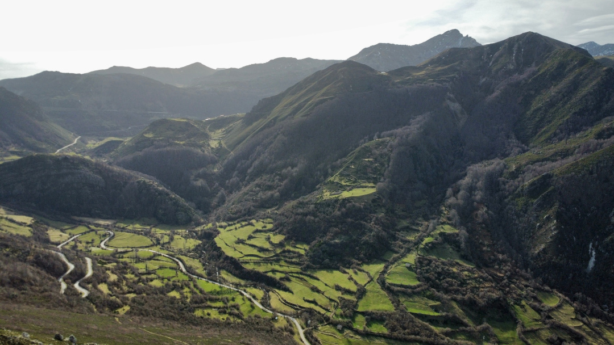

---
title: sehen & staunen
date: 2023-20-05

type: landing

sections:
  - block: markdown
    content:
      title:
      subtitle:
      text: |-
        <section>
        
        
        
        
        
        
        
        
        
        
        
        
        
         </section> 
 

 

 

 

 

 <link rel="stylesheet" href="css/style.css"> 

    design:
      columns: '1'
 # - block: markdown
 #   content:
 #     title:
 #     subtitle:
 #     text: <html lang="en"> <head> <meta charset="UTF-8"> <meta http-equiv="X-UA-Compatible" content="IE=edge"> <meta name="viewport" content="width=device-width, initial-scale=1.0"> <!-- custom css file link  --> <link rel="stylesheet" href="css/style.css"> </head> <body> 
 <h1 class="title"> sehen & staunen </h1> 

 #       
 #       
 #       
 #       
 #       
 #       
 #       
 #       
 #        
 
 </body> </html>

 #   design:
 #     # See Page Builder docs for all section customization options.
 #     # Choose how many columns the section has. Valid values: '1' or '2'.
 #     columns: '1'
---